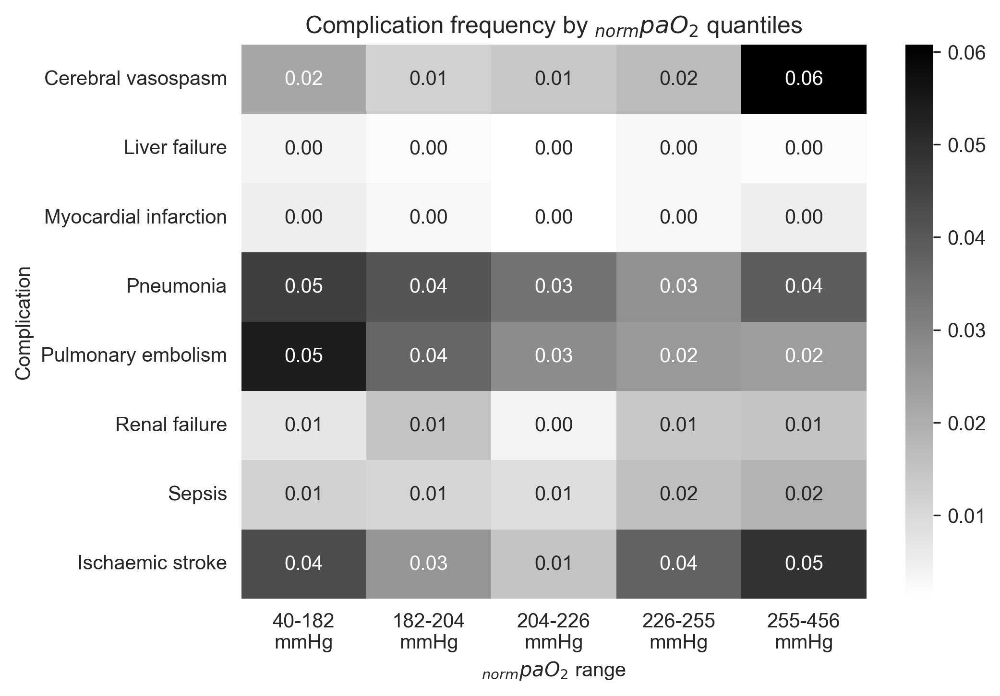
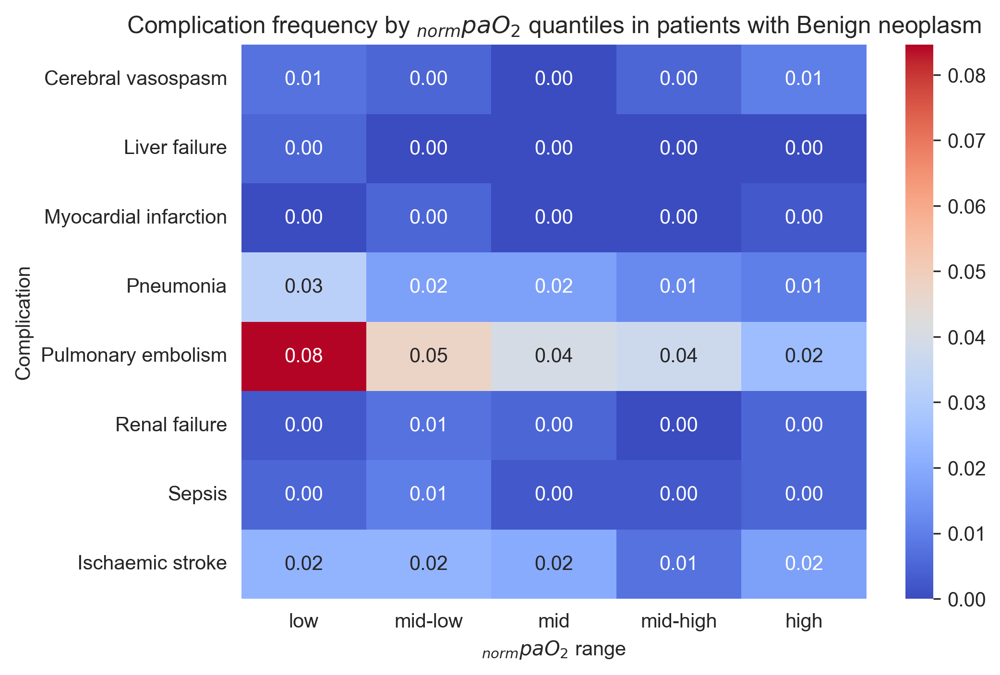
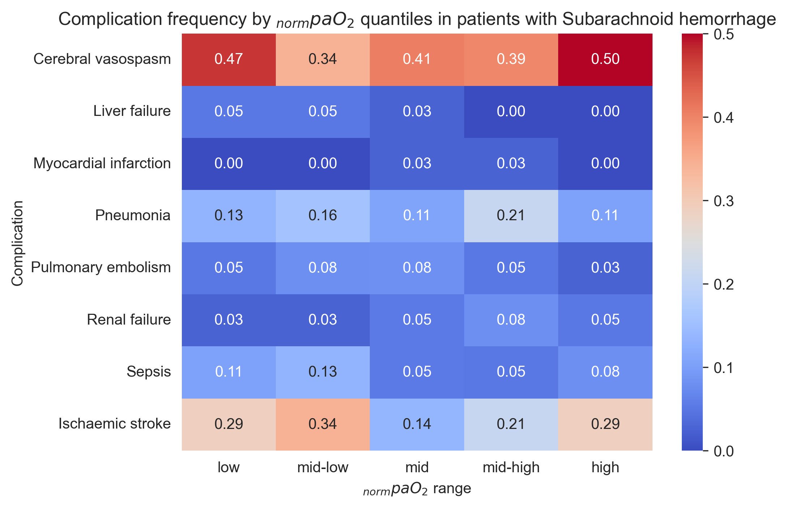
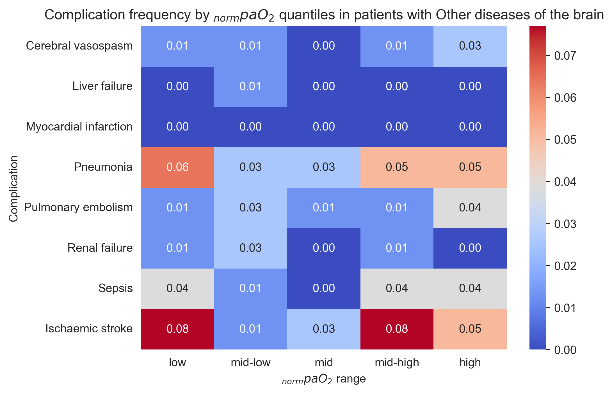

# Continuous $paO_2$ Prediction and Postoperative Complications in
Neurosurgical Patients
Andrea S. Gutmann
2026-01-27

# Preprocessing

``` python
# ======================
# Standard library
# ======================
import pickle
import pprint
import warnings
from collections import Counter
from pathlib import Path

# ======================
# Third-party libraries
# ======================
import matplotlib
import matplotlib.pyplot as plt
import numpy as np
import pandas as pd
import seaborn as sns
import yaml
from scipy import stats
from statsmodels.discrete.discrete_model import Logit

# ======================
# Local / application
# ======================
from statistical_functions import *

from statsmodels.tools.sm_exceptions import PerfectSeparationWarning

warnings.simplefilter("error", PerfectSeparationWarning)
warnings.simplefilter("error", RuntimeWarning)

pp = pprint.PrettyPrinter(indent=4)
np.random.seed(42)

matplotlib.rcParams["figure.dpi"] = 300

sns.set_style('whitegrid')

with open("config.yaml", "r") as file:
    config = yaml.safe_load(file)

with open(Path(config.get('pickle').get('analysis')), 'rb') as f:
    analysis_df = pickle.load(f)

complications = config.get("complications_dict").keys()
diagnoses = config.get("diagnoses") + ["other"]
```

# Postoperative Complications

``` python
table2_data = []
table2_data_logreg = []
```

## Differences in intervention counts

``` python
analysis_df['revision'] = analysis_df["intervention_count"] > 1

pvalue, ph_dunn, effect_sizes = compare_median("norm_auc_paO2", analysis_df, "revision")

pvalue_log, odds_ratio = logistic_regression(analysis_df.loc[:,'revision'], analysis_df.loc[:,'norm_auc_paO2'], odds_ratio = True)
```

             norm_auc_paO2                  
                    median        mean count
    revision                                
    False       214.168185  220.184589  4794
    True        210.389477  221.450389   226
    p-value: 0.8336
    No significance found.

    1, 2: Effect size: Hedges' g: 0.03 (very small)
    [(0, 1, np.float64(0.02733016975552083))]

    1, 2: Effect size: Hedges' g: 0.03 (very small)
    WARNING: PSEUDO R-SQUARED IS NEGATIVE, INDICATING A POOR MODEL FIT.
    WARNING: LOG-LIKELIHOOD OF THE NULL MODEL IS NEGATIVE, INDICATING A POOR MODEL FIT.
                               Logit Regression Results                           
    ==============================================================================
    Dep. Variable:               revision   No. Observations:                 5020
    Model:                          Logit   Df Residuals:                     5019
    Method:                           MLE   Df Model:                            0
    Date:                Tue, 27 Jan 2026   Pseudo R-squ.:               -0.001828
    Time:                        13:50:14   Log-Likelihood:                -923.27
    converged:                       True   LL-Null:                       -921.58
    Covariance Type:            nonrobust   LLR p-value:                       nan
    =================================================================================
                        coef    std err          z      P>|z|      [0.025      0.975]
    ---------------------------------------------------------------------------------
    norm_auc_paO2    -0.5688      0.013    -44.829      0.000      -0.594      -0.544
    =================================================================================
    The estimated OR change by 0.9472 [0.9450, 0.9495] for each 10% increase of the independent variable (p-value: 0.0000)

Summary:

``` python
if pvalue > 0.05:
    print(f"No differences in ranks of normpaO2 between patients with revision and no revision, g={effect_sizes[0][-1]:.2f}.")
else:
    print(f"Signifikant differences between ranks of normpaO2 in patients with revision and no revision, g={effect_sizes[0][-1]:.2f}.")

if pvalue_log > 0.05:
    print("No significant influence of normpaO2 on revisions.")
else:
    if odds_ratio < 1:
        print(f"Each 10% increase of normpaO2 decreased the chances of revision by {(1-odds_ratio)*100:.2f} %.")
    else:
        print(f"Each 10% increase of normpaO2 increased the chances of revision by {(odds_ratio-1)*100:.2f} %.")
```

    No differences in ranks of normpaO2 between patients with revision and no revision, g=0.03.
    Each 10% increase of normpaO2 decreased the chances of revision by 5.28 %.

## Differences in $paO_2$ between deceased and non-deceased patients

``` python
analysis_df["survival"] = analysis_df["deceased"].apply(lambda x: {True: False, False: True}.get(x))
analysis_df.drop("deceased", axis=1)

pvalue, ph_dunn, effect_sizes = compare_median("norm_auc_paO2", analysis_df, "survival")

pvalue_log, odds_ratio = logistic_regression(analysis_df.loc[:,'survival'], analysis_df.loc[:,'norm_auc_paO2'], odds_ratio = True)
```

             norm_auc_paO2                  
                    median        mean count
    survival                                
    False       212.276213  227.392474    89
    True        214.064921  220.112508  4931
    p-value: 0.584
    No significance found.

    1, 2: Effect size: Hedges' g: 0.16 (very small)
    [(0, 1, np.float64(0.15722301130138316))]

    1, 2: Effect size: Hedges' g: 0.16 (very small)
    WARNING: PSEUDO R-SQUARED IS NEGATIVE, INDICATING A POOR MODEL FIT.
    WARNING: LOG-LIKELIHOOD OF THE NULL MODEL IS NEGATIVE, INDICATING A POOR MODEL FIT.
                               Logit Regression Results                           
    ==============================================================================
    Dep. Variable:               survival   No. Observations:                 5020
    Model:                          Logit   Df Residuals:                     5019
    Method:                           MLE   Df Model:                            0
    Date:                Tue, 27 Jan 2026   Pseudo R-squ.:               -0.005021
    Time:                        13:50:14   Log-Likelihood:                -449.35
    converged:                       True   LL-Null:                       -447.10
    Covariance Type:            nonrobust   LLR p-value:                       nan
    =================================================================================
                        coef    std err          z      P>|z|      [0.025      0.975]
    ---------------------------------------------------------------------------------
    norm_auc_paO2     0.7476      0.020     37.530      0.000       0.709       0.787
    =================================================================================
    The estimated OR change by 1.0739 [1.0699, 1.0779] for each 10% increase of the independent variable (p-value: 0.0000)

Summary:

``` python
if pvalue > 0.05:
    print(f"No differences in ranks of normpaO2 between deceased and non-deceased patients, g={effect_sizes[0][-1]:.2f}.")
else:
    print(f"Significant differences between ranks of normpaO2 deceased and non-deceased patients, g={effect_sizes[0][-1]:.2f}.")

if pvalue_log > 0.05:
    print("No significant influence of normpaO2 on survival status.")
else:
    if odds_ratio < 1: # decreased odds
        print(f"Each 10% increase of normpaO2 decreased the chances of survival by {(1-odds_ratio)*100:.2f} %.")
    else: # increased odds
        print(f"Each 10% increase of normpaO2 increased the chances of survival by {(odds_ratio-1)*100:.2f} %.")
```

    No differences in ranks of normpaO2 between deceased and non-deceased patients, g=0.16.
    Each 10% increase of normpaO2 increased the chances of survival by 7.39 %.

Survival status by single postoperative complication

``` python
for c in complications:
    print(c)
    res = return_table(analysis_df[analysis_df[c]==True], ['survival'])
    print(f"{res[0][0]} out of {sum(res)[0]} patients with postop {config.get('long_names').get(c)} did not survive.\n")
```

    cerebral_vasospasm
    survival
    False      7
    True     119
    dtype: int64
    7 out of 126 patients with postop Cerebral vasospasm did not survive.

    liver_failure
    survival
    False    5
    True     7
    dtype: int64
    5 out of 12 patients with postop Liver failure did not survive.

    myocardial_infarction
    survival
    False     3
    True     14
    dtype: int64
    3 out of 17 patients with postop Myocardial infarction did not survive.

    pneumonia
    survival
    False     16
    True     171
    dtype: int64
    16 out of 187 patients with postop Pneumonia did not survive.

    pulmonary_embolism
    survival
    False      7
    True     161
    dtype: int64
    7 out of 168 patients with postop Pulmonary embolism did not survive.

    renal_failure
    survival
    False    18
    True     37
    dtype: int64
    18 out of 55 patients with postop Renal failure did not survive.

    sepsis
    survival
    False    14
    True     53
    dtype: int64
    14 out of 67 patients with postop Sepsis did not survive.

    stroke
    survival
    False     20
    True     151
    dtype: int64
    20 out of 171 patients with postop Ischaemic stroke did not survive.

Survival status by underlying diagnosis

``` python
for d in diagnoses:
    print(d)
    pvalue, ph_dunn, effect_sizes = compare_median(
        "norm_auc_paO2", analysis_df.loc[analysis_df[d] == True, :], "survival", False
    )
    if len(effect_sizes) == 0:
        effect_sizes = [[0]]

    try:
        pvalue_log, odds_ratio = logistic_regression(
            analysis_df.loc[analysis_df[d] == True, "survival"],
            analysis_df.loc[analysis_df[d] == True, "norm_auc_paO2"],
            odds_ratio=True,
        )
    except PerfectSeparationWarning:
        print("❌ Model not identifiable due to perfect separation")
        pvalue_log = 1
    except RuntimeWarning:
        print("❌ Divide by zero.")
        pvalue_log = 1

    # summary
    if pvalue > 0.05:
        print(
            f"No differences in ranks of normpaO2 between survival status in patients with {config.get('long_names').get(d)}, g={effect_sizes[0][-1]:.2f}."
        )
    else:
        print(
            f"Significant differences between ranks of normpaO2 between survival status in patients with {config.get('long_names').get(d)}, g={effect_sizes[0][-1]:.2f}."
        )

    if pvalue_log > 0.05:
        print(
            f"No significant influence of normpaO2 on survival status of patients with {config.get('long_names').get(d)}."
        )
    else:
        if odds_ratio < 1:  # decreased odds
            print(
                f"Each 10% increase of normpaO2 decreased the chances of survival in patients with {config.get('long_names').get(d)} by {(1-odds_ratio)*100:.2f} %."
            )
        else:  # increased odds
            print(
                f"Each 10% increase of normpaO2 increased the chances of survival in patients with {config.get('long_names').get(d)} by {(odds_ratio-1)*100:.2f} %."
            )

    # add to table data
    if pvalue < 0.05:
        medians = (
            analysis_df.loc[analysis_df[d] == True, :]
            .groupby("deceased")["norm_auc_paO2"]
            .median()
        )
        table2_data.append(
            [
                config.get("long_names").get(d), # Group/Condition
                "Deceased vs. Survivors", # Comparison
                f"{int(medians.loc[True])} vs. {int(medians.loc[False])}", # pao2 values
                "<0.0001" if pvalue < 0.0001 else f"{pvalue:.4f}", # p-value
                f"{effect_sizes[0][-1]:.2f}", # effect size
                {True: "↑ in deceased", False: "↑ in survivors"}[
                    medians.loc[True] > medians.loc[False]
                ], # Direction
            ]
        )
    if pvalue_log > 0.05:
        table2_data_logreg.append([
            config.get('long_names').get(d),# Group/Condition
            'Survival Status', # outcome/dependent variable
            odds_ratio, # Odds Ratio
            f"{pvalue_log:.4f}", # p-value
            None, # Direction
        ])    
```

    benign_neoplasm
    No significance found.

    1, 2: Effect size: Hedges' g: 0.07 (very small)
    [(0, 1, np.float64(0.07226659992706248))]

    1, 2: Effect size: Hedges' g: 0.07 (very small)
    WARNING: LOG-LIKELIHOOD OF THE NULL MODEL IS NEGATIVE, INDICATING A POOR MODEL FIT.
                               Logit Regression Results                           
    ==============================================================================
    Dep. Variable:               survival   No. Observations:                 2009
    Model:                          Logit   Df Residuals:                     2008
    Method:                           MLE   Df Model:                            0
    Date:                Tue, 27 Jan 2026   Pseudo R-squ.:                0.001073
    Time:                        13:50:15   Log-Likelihood:                -62.936
    converged:                       True   LL-Null:                       -63.003
    Covariance Type:            nonrobust   LLR p-value:                       nan
    =================================================================================
                        coef    std err          z      P>|z|      [0.025      0.975]
    ---------------------------------------------------------------------------------
    norm_auc_paO2     0.9995      0.060     16.675      0.000       0.882       1.117
    =================================================================================
    The estimated OR change by 1.0999 [1.0877, 1.1123] for each 10% increase of the independent variable (p-value: 0.0000)
    No differences in ranks of normpaO2 between survival status in patients with Benign neoplasm, g=0.07.
    Each 10% increase of normpaO2 increased the chances of survival in patients with Benign neoplasm by 9.99 %.
    cerebral_aneurysm
    No significance found.

    1, 2: Effect size: Hedges' g: 1.2 (very large)
    [(0, 1, np.float64(1.2002849509109528))]

    1, 2: Effect size: Hedges' g: 1.2 (very large)
    WARNING: LOG-LIKELIHOOD OF THE NULL MODEL IS NEGATIVE, INDICATING A POOR MODEL FIT.
                               Logit Regression Results                           
    ==============================================================================
    Dep. Variable:               survival   No. Observations:                  422
    Model:                          Logit   Df Residuals:                      421
    Method:                           MLE   Df Model:                            0
    Date:                Tue, 27 Jan 2026   Pseudo R-squ.:                 0.02598
    Time:                        13:50:15   Log-Likelihood:                -6.8608
    converged:                       True   LL-Null:                       -7.0438
    Covariance Type:            nonrobust   LLR p-value:                       nan
    =================================================================================
                        coef    std err          z      P>|z|      [0.025      0.975]
    ---------------------------------------------------------------------------------
    norm_auc_paO2     1.0847      0.182      5.967      0.000       0.728       1.441
    =================================================================================
    The estimated OR change by 1.1089 [1.0719, 1.1472] for each 10% increase of the independent variable (p-value: 0.0000)
    No differences in ranks of normpaO2 between survival status in patients with Cerebral aneurysm, g=1.20.
    Each 10% increase of normpaO2 increased the chances of survival in patients with Cerebral aneurysm by 10.89 %.
    epilepsy
    No significance found.
    []
    ❌ Model not identifiable due to perfect separation
    No differences in ranks of normpaO2 between survival status in patients with Epilepsy, g=0.00.
    No significant influence of normpaO2 on survival status of patients with Epilepsy.
    intracranial_hemorrhage
    No significance found.

    1, 2: Effect size: Hedges' g: 0.02 (very small)
    [(0, 1, np.float64(0.01766156720889192))]

    1, 2: Effect size: Hedges' g: 0.02 (very small)
    WARNING: PSEUDO R-SQUARED IS NEGATIVE, INDICATING A POOR MODEL FIT.
    WARNING: LOG-LIKELIHOOD OF THE NULL MODEL IS NEGATIVE, INDICATING A POOR MODEL FIT.
                               Logit Regression Results                           
    ==============================================================================
    Dep. Variable:               survival   No. Observations:                  471
    Model:                          Logit   Df Residuals:                      470
    Method:                           MLE   Df Model:                            0
    Date:                Tue, 27 Jan 2026   Pseudo R-squ.:              -0.0003344
    Time:                        13:50:15   Log-Likelihood:                -116.98
    converged:                       True   LL-Null:                       -116.94
    Covariance Type:            nonrobust   LLR p-value:                       nan
    =================================================================================
                        coef    std err          z      P>|z|      [0.025      0.975]
    ---------------------------------------------------------------------------------
    norm_auc_paO2     0.4868      0.034     14.285      0.000       0.420       0.554
    =================================================================================
    The estimated OR change by 1.0475 [1.0408, 1.0542] for each 10% increase of the independent variable (p-value: 0.0000)
    No differences in ranks of normpaO2 between survival status in patients with Intracranial hemorrhage, g=0.02.
    Each 10% increase of normpaO2 increased the chances of survival in patients with Intracranial hemorrhage by 4.75 %.
    malignant_neoplasm
             norm_auc_paO2                  
                    median        mean count
    survival                                
    False       245.059474  253.145220    14
    True        209.492174  211.682242   949

    ... Post hoc test...
        1   2
    1   -  **
    2  **   -
           1      2
    1 1.0000 0.0011
    2 0.0011 1.0000

    1, 2: Effect size: Hedges' g: 1.11 (large)
    [(np.int64(0), np.int64(1), np.float64(1.1084271266770187))]

    1, 2: Effect size: Hedges' g: 1.11 (large)
    WARNING: PSEUDO R-SQUARED IS NEGATIVE, INDICATING A POOR MODEL FIT.
    WARNING: LOG-LIKELIHOOD OF THE NULL MODEL IS NEGATIVE, INDICATING A POOR MODEL FIT.
                               Logit Regression Results                           
    ==============================================================================
    Dep. Variable:               survival   No. Observations:                  963
    Model:                          Logit   Df Residuals:                      962
    Method:                           MLE   Df Model:                            0
    Date:                Tue, 27 Jan 2026   Pseudo R-squ.:                -0.02709
    Time:                        13:50:15   Log-Likelihood:                -75.113
    converged:                       True   LL-Null:                       -73.132
    Covariance Type:            nonrobust   LLR p-value:                       nan
    =================================================================================
                        coef    std err          z      P>|z|      [0.025      0.975]
    ---------------------------------------------------------------------------------
    norm_auc_paO2     0.7843      0.050     15.772      0.000       0.687       0.882
    =================================================================================
    The estimated OR change by 1.0776 [1.0677, 1.0877] for each 10% increase of the independent variable (p-value: 0.0000)
    Significant differences between ranks of normpaO2 between survival status in patients with Malignant neoplasm, g=1.11.
    Each 10% increase of normpaO2 increased the chances of survival in patients with Malignant neoplasm by 7.76 %.
    neoplasm
    No significance found.

    1, 2: Effect size: Hedges' g: 0.05 (very small)
    [(0, 1, np.float64(0.04517226889907929))]

    1, 2: Effect size: Hedges' g: 0.05 (very small)
    WARNING: PSEUDO R-SQUARED IS NEGATIVE, INDICATING A POOR MODEL FIT.
    WARNING: LOG-LIKELIHOOD OF THE NULL MODEL IS NEGATIVE, INDICATING A POOR MODEL FIT.
                               Logit Regression Results                           
    ==============================================================================
    Dep. Variable:               survival   No. Observations:                  101
    Model:                          Logit   Df Residuals:                      100
    Method:                           MLE   Df Model:                            0
    Date:                Tue, 27 Jan 2026   Pseudo R-squ.:               -0.003286
    Time:                        13:50:15   Log-Likelihood:                -5.6286
    converged:                       True   LL-Null:                       -5.6102
    Covariance Type:            nonrobust   LLR p-value:                       nan
    =================================================================================
                        coef    std err          z      P>|z|      [0.025      0.975]
    ---------------------------------------------------------------------------------
    norm_auc_paO2     0.8563      0.187      4.581      0.000       0.490       1.223
    =================================================================================
    The estimated OR change by 1.0850 [1.0478, 1.1236] for each 10% increase of the independent variable (p-value: 0.0000)
    No differences in ranks of normpaO2 between survival status in patients with Neoplasm of uncertain or unknown behavior, g=0.05.
    Each 10% increase of normpaO2 increased the chances of survival in patients with Neoplasm of uncertain or unknown behavior by 8.50 %.
    SAH
    No significance found.

    1, 2: Effect size: Hedges' g: 0.13 (very small)
    [(0, 1, np.float64(0.13315928594079016))]

    1, 2: Effect size: Hedges' g: 0.13 (very small)
    WARNING: LOG-LIKELIHOOD OF THE NULL MODEL IS NEGATIVE, INDICATING A POOR MODEL FIT.
                               Logit Regression Results                           
    ==============================================================================
    Dep. Variable:               survival   No. Observations:                  189
    Model:                          Logit   Df Residuals:                      188
    Method:                           MLE   Df Model:                            0
    Date:                Tue, 27 Jan 2026   Pseudo R-squ.:               0.0002872
    Time:                        13:50:15   Log-Likelihood:                -41.944
    converged:                       True   LL-Null:                       -41.956
    Covariance Type:            nonrobust   LLR p-value:                       nan
    =================================================================================
                        coef    std err          z      P>|z|      [0.025      0.975]
    ---------------------------------------------------------------------------------
    norm_auc_paO2     0.5009      0.056      8.939      0.000       0.391       0.611
    =================================================================================
    The estimated OR change by 1.0489 [1.0380, 1.0599] for each 10% increase of the independent variable (p-value: 0.0000)
    No differences in ranks of normpaO2 between survival status in patients with Subarachnoid hemorrhage, g=0.13.
    Each 10% increase of normpaO2 increased the chances of survival in patients with Subarachnoid hemorrhage by 4.89 %.
    TBI
    No significance found.

    1, 2: Effect size: Hedges' g: 0.2 (very small)
    [(0, 1, np.float64(0.1989023582813061))]

    1, 2: Effect size: Hedges' g: 0.2 (very small)
    WARNING: LOG-LIKELIHOOD OF THE NULL MODEL IS NEGATIVE, INDICATING A POOR MODEL FIT.
                               Logit Regression Results                           
    ==============================================================================
    Dep. Variable:               survival   No. Observations:                  217
    Model:                          Logit   Df Residuals:                      216
    Method:                           MLE   Df Model:                            0
    Date:                Tue, 27 Jan 2026   Pseudo R-squ.:                0.005282
    Time:                        13:50:15   Log-Likelihood:                -75.067
    converged:                       True   LL-Null:                       -75.465
    Covariance Type:            nonrobust   LLR p-value:                       nan
    =================================================================================
                        coef    std err          z      P>|z|      [0.025      0.975]
    ---------------------------------------------------------------------------------
    norm_auc_paO2     0.3907      0.041      9.628      0.000       0.311       0.470
    =================================================================================
    The estimated OR change by 1.0379 [1.0301, 1.0458] for each 10% increase of the independent variable (p-value: 0.0000)
    No differences in ranks of normpaO2 between survival status in patients with Traumatic brain injury, g=0.20.
    Each 10% increase of normpaO2 increased the chances of survival in patients with Traumatic brain injury by 3.79 %.
    trigeminus
    No significance found.
    []
    ❌ Model not identifiable due to perfect separation
    No differences in ranks of normpaO2 between survival status in patients with Facial nerve disorders and disorders of trigeminal nerve, g=0.00.
    No significant influence of normpaO2 on survival status of patients with Facial nerve disorders and disorders of trigeminal nerve.
    other_aneurysm_dissection
    No significance found.

    1, 2: Effect size: Hedges' g: 0.07 (very small)
    [(0, 1, np.float64(0.0722911250769847))]

    1, 2: Effect size: Hedges' g: 0.07 (very small)
    WARNING: PSEUDO R-SQUARED IS NEGATIVE, INDICATING A POOR MODEL FIT.
    WARNING: LOG-LIKELIHOOD OF THE NULL MODEL IS NEGATIVE, INDICATING A POOR MODEL FIT.
                               Logit Regression Results                           
    ==============================================================================
    Dep. Variable:               survival   No. Observations:                   27
    Model:                          Logit   Df Residuals:                       26
    Method:                           MLE   Df Model:                            0
    Date:                Tue, 27 Jan 2026   Pseudo R-squ.:               -0.003674
    Time:                        13:50:15   Log-Likelihood:                -4.2928
    converged:                       True   LL-Null:                       -4.2771
    Covariance Type:            nonrobust   LLR p-value:                       nan
    =================================================================================
                        coef    std err          z      P>|z|      [0.025      0.975]
    ---------------------------------------------------------------------------------
    norm_auc_paO2     0.5786      0.181      3.197      0.001       0.224       0.933
    =================================================================================
    The estimated OR change by 1.0567 [1.0216, 1.0930] for each 10% increase of the independent variable (p-value: 0.0014)
    No differences in ranks of normpaO2 between survival status in patients with Other aneurysms and dissections, g=0.07.
    Each 10% increase of normpaO2 increased the chances of survival in patients with Other aneurysms and dissections by 5.67 %.
    other
    No significance found.

    1, 2: Effect size: Hedges' g: 0.29 (small)
    [(0, 1, np.float64(0.29178382569890354))]

    1, 2: Effect size: Hedges' g: 0.29 (small)
    WARNING: LOG-LIKELIHOOD OF THE NULL MODEL IS NEGATIVE, INDICATING A POOR MODEL FIT.
                               Logit Regression Results                           
    ==============================================================================
    Dep. Variable:               survival   No. Observations:                  390
    Model:                          Logit   Df Residuals:                      389
    Method:                           MLE   Df Model:                            0
    Date:                Tue, 27 Jan 2026   Pseudo R-squ.:                0.007423
    Time:                        13:50:15   Log-Likelihood:                -42.498
    converged:                       True   LL-Null:                       -42.816
    Covariance Type:            nonrobust   LLR p-value:                       nan
    =================================================================================
                        coef    std err          z      P>|z|      [0.025      0.975]
    ---------------------------------------------------------------------------------
    norm_auc_paO2     0.6976      0.063     11.067      0.000       0.574       0.821
    =================================================================================
    The estimated OR change by 1.0688 [1.0562, 1.0814] for each 10% increase of the independent variable (p-value: 0.0000)
    No differences in ranks of normpaO2 between survival status in patients with Other diseases of the brain, g=0.29.
    Each 10% increase of normpaO2 increased the chances of survival in patients with Other diseases of the brain by 6.88 %.

## Length of stay

``` python
print(
    f"Median LOS: {np.mean(analysis_df['los'])} -> {int(np.ceil(np.mean(analysis_df['los'])))}"
)
analysis_df["los_prolonged"] = False
analysis_df.loc[analysis_df["los"] > np.mean(analysis_df["los"]), "los_prolonged"] = (
    True
)

pvalue, ph_dunn, effect_sizes = compare_median(
    "norm_auc_paO2", analysis_df, "los_prolonged", False
)
pvalue_log, odds_ratio = logistic_regression(
    analysis_df.loc[:, "los_prolonged"],
    analysis_df.loc[:, "norm_auc_paO2"],
    odds_ratio=True,
)


if pvalue < 0.05:
    medians = analysis_df.groupby("los_prolonged")["norm_auc_paO2"].median()
    table2_data.append(
        [
            f"Prolonged in-hospital stay (≥{int(np.ceil(np.mean(analysis_df['los'])))} days)",
            "Normal vs. prolonged stay",
            f"{int(medians.loc[False])} vs. {int(medians.loc[True])}",
            "<0.0001" if pvalue < 0.0001 else f"{pvalue:.4f}",
            f"{effect_sizes[0][-1]:.2f}",
            {True: "↑ with normal stay", False: "↑ with prolonged stay"}[
                medians.loc[False] > medians.loc[True]
            ],
        ]
    )
if pvalue_log > 0.05:
    table2_data_logreg.append([
        "All patients",# Group/Condition
        f"Prolonged in-hospital stay (≥{int(np.ceil(np.mean(analysis_df['los'])))} days)", # outcome/dependent variable
        odds_ratio, # Odds Ratio
        f"{pvalue_log:.4f}", # p-value
        None, # Direction
    ])    
```

    Median LOS: 10.94601593625498 -> 11
                  norm_auc_paO2               
                         median     mean count
    los_prolonged                             
    False              213.0671 218.2980  3584
    True               217.0908 225.0924  1436

    ... Post hoc test...
        1   2
    1   -  **
    2  **   -
           1      2
    1 1.0000 0.0028
    2 0.0028 1.0000

    1, 2: Effect size: Hedges' g: 0.15 (very small)
    [(np.int64(0), np.int64(1), np.float64(0.1470205837880129))]

    1, 2: Effect size: Hedges' g: 0.15 (very small)
    WARNING: PSEUDO R-SQUARED IS NEGATIVE, INDICATING A POOR MODEL FIT.
    WARNING: LOG-LIKELIHOOD OF THE NULL MODEL IS NEGATIVE, INDICATING A POOR MODEL FIT.
                               Logit Regression Results                           
    ==============================================================================
    Dep. Variable:          los_prolonged   No. Observations:                 5020
    Model:                          Logit   Df Residuals:                     5019
    Method:                           MLE   Df Model:                            0
    Date:                Tue, 27 Jan 2026   Pseudo R-squ.:               -0.001588
    Time:                        13:50:15   Log-Likelihood:                -3009.7
    converged:                       True   LL-Null:                       -3004.9
    Covariance Type:            nonrobust   LLR p-value:                       nan
    =================================================================================
                        coef    std err          z      P>|z|      [0.025      0.975]
    ---------------------------------------------------------------------------------
    norm_auc_paO2    -0.1692      0.006    -29.146      0.000      -0.181      -0.158
    =================================================================================
    The estimated OR change by 0.9840 [0.9829, 0.9851] for each 10% increase of the independent variable (p-value: 0.0000)

Summary:

``` python
if pvalue > 0.05:
    print(f"No differences in ranks of normpaO2 between patients with normal or prolonged LOS, g={effect_sizes[0][-1]:.2f}.")
else:
    print(f"Significant differences between ranks of normpaO2 between patients with normal or prolonged LOS, g={effect_sizes[0][-1]:.2f}.")

if pvalue_log > 0.05:
    print("No significant influence of normpaO2 on prolonged LOS.")
else:
    if odds_ratio < 1: # decreased odds
        print(f"Each 10% increase of normpaO2 decreased the chances of prolonged LOS by {(1-odds_ratio)*100:.2f} %.")
    else: # increased odds
        print(f"Each 10% increase of normpaO2 increased the chances of prolonged LOS by {(odds_ratio-1)*100:.2f} %.")
```

    Significant differences between ranks of normpaO2 between patients with normal or prolonged LOS, g=0.15.
    Each 10% increase of normpaO2 decreased the chances of prolonged LOS by 1.60 %.

Prolonged LOS by postop complication

``` python
for c in complications:
    cont_table = pd.crosstab(analysis_df["los_prolonged"], analysis_df[c])
    oddsratio, pvalue = stats.fisher_exact(cont_table)

    print(f"{c}: Odds ratio: {round(oddsratio,2)}, p-value: {round(pvalue,4)} (Fisher's Exact Test)")

    statitic, pvalue, dof, expected_freq = stats.chi2_contingency(cont_table.values)
    print(f"{c}: p-value: {round(pvalue,4)} (Chi-square test)\n")
```

    cerebral_vasospasm: Odds ratio: 8.12, p-value: 0.0 (Fisher's Exact Test)
    cerebral_vasospasm: p-value: 0.0 (Chi-square test)

    liver_failure: Odds ratio: 12.56, p-value: 0.0001 (Fisher's Exact Test)
    liver_failure: p-value: 0.0001 (Chi-square test)

    myocardial_infarction: Odds ratio: 8.18, p-value: 0.0001 (Fisher's Exact Test)
    myocardial_infarction: p-value: 0.0 (Chi-square test)

    pneumonia: Odds ratio: 8.63, p-value: 0.0 (Fisher's Exact Test)
    pneumonia: p-value: 0.0 (Chi-square test)

    pulmonary_embolism: Odds ratio: 6.52, p-value: 0.0 (Fisher's Exact Test)
    pulmonary_embolism: p-value: 0.0 (Chi-square test)

    renal_failure: Odds ratio: 7.49, p-value: 0.0 (Fisher's Exact Test)
    renal_failure: p-value: 0.0 (Chi-square test)

    sepsis: Odds ratio: 14.77, p-value: 0.0 (Fisher's Exact Test)
    sepsis: p-value: 0.0 (Chi-square test)

    stroke: Odds ratio: 7.33, p-value: 0.0 (Fisher's Exact Test)
    stroke: p-value: 0.0 (Chi-square test)

### LOS per ASA

``` python
print("\nPer ASA")
for asa in range(1, 6):
    print(f"ASA {asa}")
    pvalue, ph_dunn, effect_sizes = compare_median(
        "norm_auc_paO2",
        analysis_df.loc[analysis_df.asa == asa, :],
        "los_prolonged",
        False,
    )

    pvalue_log, odds_ratio = logistic_regression(
        analysis_df.loc[analysis_df.asa == asa, "los_prolonged"],
        analysis_df.loc[analysis_df.asa == asa, "norm_auc_paO2"],
        odds_ratio=True,
    )

    if pvalue < 0.05:
        medians = (
            analysis_df.loc[analysis_df.asa == asa, :]
            .groupby("los_prolonged")["norm_auc_paO2"]
            .median()
        )
        table2_data.append(
            [
                f"Prolonged in-hospital stay, ASA {asa}",
                "Normal vs. prolonged stay",
                f"{int(medians.loc[False])} vs. {int(medians.loc[True])}",
                "<0.0001" if pvalue < 0.0001 else f"{pvalue:.4f}",
                f"{effect_sizes[0][-1]:.2f}",
                {True: "↑ with normal stay", False: "↑ with prolonged stay"}[
                    medians.loc[False] > medians.loc[True]
                ],
            ]
        )
    
    if pvalue_log > 0.05:
        table2_data_logreg.append([
            f"Patients with ASA {asa}",# Group/Condition
            f"Prolonged in-hospital stay (≥{int(np.ceil(np.mean(analysis_df['los'])))} days)", # outcome/dependent variable
            odds_ratio, # Odds Ratio
            f"{pvalue_log:.4f}", # p-value
            None, # Direction
        ])   
    
    # summary
    if pvalue > 0.05:
        print(f"No differences in ranks of normpaO2 between patients with ASA {asa} with normal or prolonged LOS, g={effect_sizes[0][-1]:.2f}.")
    else:
        print(f"Significant differences between ranks of normpaO2 between patients with ASA {asa} with normal or prolonged LOS, g={effect_sizes[0][-1]:.2f}.")

    if pvalue_log > 0.05:
        print("No significant influence of normpaO2 on prolonged LOS in ASA {asa} patients.")
    else:
        if odds_ratio < 1: # decreased odds
            print(f"Each 10% increase of normpaO2 decreased the chances of prolonged LOS in ASA {asa} patients by {(1-odds_ratio)*100:.2f} %.")
        else: # increased odds
            print(f"Each 10% increase of normpaO2 increased the chances of prolonged LOS in ASA {asa} patients by {(odds_ratio-1)*100:.2f} %.")
```


    Per ASA
    ASA 1
    No significance found.

    1, 2: Effect size: Hedges' g: 0.24 (small)
    [(0, 1, np.float64(0.23894543799200413))]

    1, 2: Effect size: Hedges' g: 0.24 (small)
    WARNING: LOG-LIKELIHOOD OF THE NULL MODEL IS NEGATIVE, INDICATING A POOR MODEL FIT.
                               Logit Regression Results                           
    ==============================================================================
    Dep. Variable:          los_prolonged   No. Observations:                  255
    Model:                          Logit   Df Residuals:                      254
    Method:                           MLE   Df Model:                            0
    Date:                Tue, 27 Jan 2026   Pseudo R-squ.:                0.003224
    Time:                        13:50:15   Log-Likelihood:                -115.32
    converged:                       True   LL-Null:                       -115.69
    Covariance Type:            nonrobust   LLR p-value:                       nan
    =================================================================================
                        coef    std err          z      P>|z|      [0.025      0.975]
    ---------------------------------------------------------------------------------
    norm_auc_paO2    -0.2946      0.031     -9.552      0.000      -0.355      -0.234
    =================================================================================
    The estimated OR change by 0.9723 [0.9667, 0.9779] for each 10% increase of the independent variable (p-value: 0.0000)
    No differences in ranks of normpaO2 between patients with ASA 1 with normal or prolonged LOS, g=0.24.
    Each 10% increase of normpaO2 decreased the chances of prolonged LOS in ASA 1 patients by 2.77 %.
    ASA 2
    No significance found.

    1, 2: Effect size: Hedges' g: 0.03 (very small)
    [(0, 1, np.float64(0.02822746943438506))]

    1, 2: Effect size: Hedges' g: 0.03 (very small)
    WARNING: PSEUDO R-SQUARED IS NEGATIVE, INDICATING A POOR MODEL FIT.
    WARNING: LOG-LIKELIHOOD OF THE NULL MODEL IS NEGATIVE, INDICATING A POOR MODEL FIT.
                               Logit Regression Results                           
    ==============================================================================
    Dep. Variable:          los_prolonged   No. Observations:                 2143
    Model:                          Logit   Df Residuals:                     2142
    Method:                           MLE   Df Model:                            0
    Date:                Tue, 27 Jan 2026   Pseudo R-squ.:              -0.0006219
    Time:                        13:50:15   Log-Likelihood:                -1014.2
    converged:                       True   LL-Null:                       -1013.6
    Covariance Type:            nonrobust   LLR p-value:                       nan
    =================================================================================
                        coef    std err          z      P>|z|      [0.025      0.975]
    ---------------------------------------------------------------------------------
    norm_auc_paO2    -0.2798      0.010    -26.877      0.000      -0.300      -0.259
    =================================================================================
    The estimated OR change by 0.9737 [0.9718, 0.9756] for each 10% increase of the independent variable (p-value: 0.0000)
    No differences in ranks of normpaO2 between patients with ASA 2 with normal or prolonged LOS, g=0.03.
    Each 10% increase of normpaO2 decreased the chances of prolonged LOS in ASA 2 patients by 2.63 %.
    ASA 3
                  norm_auc_paO2               
                         median     mean count
    los_prolonged                             
    False              204.3847 210.5713  1496
    True               214.3431 220.6217   679

    ... Post hoc test...
         1    2
    1    -  ***
    2  ***    -
           1      2
    1 1.0000 0.0000
    2 0.0000 1.0000

    1, 2: Effect size: Hedges' g: 0.22 (small)
    [(np.int64(0), np.int64(1), np.float64(0.22349945013922357))]

    1, 2: Effect size: Hedges' g: 0.22 (small)
    WARNING: PSEUDO R-SQUARED IS NEGATIVE, INDICATING A POOR MODEL FIT.
    WARNING: LOG-LIKELIHOOD OF THE NULL MODEL IS NEGATIVE, INDICATING A POOR MODEL FIT.
                               Logit Regression Results                           
    ==============================================================================
    Dep. Variable:          los_prolonged   No. Observations:                 2175
    Model:                          Logit   Df Residuals:                     2174
    Method:                           MLE   Df Model:                            0
    Date:                Tue, 27 Jan 2026   Pseudo R-squ.:               -0.002443
    Time:                        13:50:15   Log-Likelihood:                -1353.6
    converged:                       True   LL-Null:                       -1350.3
    Covariance Type:            nonrobust   LLR p-value:                       nan
    =================================================================================
                        coef    std err          z      P>|z|      [0.025      0.975]
    ---------------------------------------------------------------------------------
    norm_auc_paO2    -0.1461      0.009    -16.902      0.000      -0.163      -0.129
    =================================================================================
    The estimated OR change by 0.9862 [0.9846, 0.9878] for each 10% increase of the independent variable (p-value: 0.0000)
    Significant differences between ranks of normpaO2 between patients with ASA 3 with normal or prolonged LOS, g=0.22.
    Each 10% increase of normpaO2 decreased the chances of prolonged LOS in ASA 3 patients by 1.38 %.
    ASA 4
    No significance found.

    1, 2: Effect size: Hedges' g: 0.21 (small)
    [(0, 1, np.float64(0.21291755867274734))]

    1, 2: Effect size: Hedges' g: 0.21 (small)
    WARNING: LOG-LIKELIHOOD OF THE NULL MODEL IS NEGATIVE, INDICATING A POOR MODEL FIT.
                               Logit Regression Results                           
    ==============================================================================
    Dep. Variable:          los_prolonged   No. Observations:                  414
    Model:                          Logit   Df Residuals:                      413
    Method:                           MLE   Df Model:                            0
    Date:                Tue, 27 Jan 2026   Pseudo R-squ.:                0.002186
    Time:                        13:50:15   Log-Likelihood:                -245.96
    converged:                       True   LL-Null:                       -246.50
    Covariance Type:            nonrobust   LLR p-value:                       nan
    =================================================================================
                        coef    std err          z      P>|z|      [0.025      0.975]
    ---------------------------------------------------------------------------------
    norm_auc_paO2     0.1735      0.020      8.580      0.000       0.134       0.213
    =================================================================================
    The estimated OR change by 1.0167 [1.0128, 1.0205] for each 10% increase of the independent variable (p-value: 0.0000)
    No differences in ranks of normpaO2 between patients with ASA 4 with normal or prolonged LOS, g=0.21.
    Each 10% increase of normpaO2 increased the chances of prolonged LOS in ASA 4 patients by 1.67 %.
    ASA 5
    No significance found.

    1, 2: Effect size: Hedges' g: 0.15 (very small)
    [(0, 1, np.float64(0.1494967493281445))]

    1, 2: Effect size: Hedges' g: 0.15 (very small)
    WARNING: PSEUDO R-SQUARED IS NEGATIVE, INDICATING A POOR MODEL FIT.
    WARNING: LOG-LIKELIHOOD OF THE NULL MODEL IS NEGATIVE, INDICATING A POOR MODEL FIT.
                               Logit Regression Results                           
    ==============================================================================
    Dep. Variable:          los_prolonged   No. Observations:                   33
    Model:                          Logit   Df Residuals:                       32
    Method:                           MLE   Df Model:                            0
    Date:                Tue, 27 Jan 2026   Pseudo R-squ.:               -0.008045
    Time:                        13:50:15   Log-Likelihood:                -12.286
    converged:                       True   LL-Null:                       -12.188
    Covariance Type:            nonrobust   LLR p-value:                       nan
    =================================================================================
                        coef    std err          z      P>|z|      [0.025      0.975]
    ---------------------------------------------------------------------------------
    norm_auc_paO2     0.3588      0.097      3.701      0.000       0.169       0.549
    =================================================================================
    The estimated OR change by 1.0348 [1.0162, 1.0537] for each 10% increase of the independent variable (p-value: 0.0002)
    No differences in ranks of normpaO2 between patients with ASA 5 with normal or prolonged LOS, g=0.15.
    Each 10% increase of normpaO2 increased the chances of prolonged LOS in ASA 5 patients by 3.48 %.

### LOS per sex

``` python
for sex in [True, False]:
    print(f"{ {True: 'Male', False: 'Female'}[sex]} patients:")
    pvalue, ph_dunn, effect_sizes = compare_median(
        "norm_auc_paO2",
        analysis_df.loc[analysis_df.sex_male == sex, :],
        "los_prolonged",
        False,
    )
    pvalue_log, odds_ratio = logistic_regression(
        analysis_df.loc[analysis_df.sex_male == sex, "los_prolonged"],
        analysis_df.loc[analysis_df.sex_male == sex, "norm_auc_paO2"],
        odds_ratio=True,
    )

    if pvalue < 0.05:
        print(
            f"\nDifferences between normal and prolonged LOS in normalized perioperative auc values for { {True: 'male', False: 'female'}[sex] } patients: {round(pvalue,4)}.\n__________________________________________\n\n"
        )

        medians = (
            analysis_df.loc[analysis_df.sex_male == sex, :]
            .groupby("los_prolonged")["norm_auc_paO2"]
            .median()
        )
        table2_data.append(
            [
                f"Prolonged in-hospital stay, { {True: 'males', False: 'females'}[sex] }",
                "Normal vs. prolonged stay",
                f"{int(medians.loc[False])} vs. {int(medians.loc[True])}",
                "<0.0001" if pvalue < 0.0001 else f"{pvalue:.4f}",
                f"{effect_sizes[0][-1]:.2f}",
                {True: "↑ with normal stay", False: "↑ with prolonged stay"}[
                    medians.loc[False] > medians.loc[True]
                ],
            ]
        )
        print(f"Significant differences between ranks of normpaO2 in { {True: 'male', False: 'female'}[sex]} patients with normal or prolonged LOS, g={effect_sizes[0][-1]:.2f}.")
    else:
        print(f"No differences in ranks of normpaO2 in { {True: 'male', False: 'female'}[sex]} patients with normal or prolonged LOS, g={effect_sizes[0][-1]:.2f}.")

    if pvalue_log < 0.05:
        if odds_ratio < 1: # decreased odds
            print(f"Each 10% increase of normpaO2 decreased the chances of prolonged LOS among { {True: 'male', False: 'female'}[sex]} patients by {(1-odds_ratio)*100:.2f} %.")
        else: # increased odds
            print(f"Each 10% increase of normpaO2 increased the chances of prolonged LOS among { {True: 'male', False: 'female'}[sex]} patients by {(odds_ratio-1)*100:.2f} %.")
        
        table2_data_logreg.append([
            f"{ {True: 'Male', False: 'Female'}[sex]} patients",# Group/Condition
            f"Prolonged in-hospital stay (≥{int(np.ceil(np.mean(analysis_df['los'])))} days)", # outcome/dependent variable
            odds_ratio, # Odds Ratio
            f"{pvalue_log:.4f}", # p-value
            None, # Direction
        ])   
    else:
        print(f"No significant influence of normpaO2 on prolonged LOS among { {True: 'male', False: 'female'}[sex]} patients.")
```

    Male patients:
    No significance found.

    1, 2: Effect size: Hedges' g: 0.13 (very small)
    [(0, 1, np.float64(0.12872642117805333))]

    1, 2: Effect size: Hedges' g: 0.13 (very small)
    WARNING: PSEUDO R-SQUARED IS NEGATIVE, INDICATING A POOR MODEL FIT.
    WARNING: LOG-LIKELIHOOD OF THE NULL MODEL IS NEGATIVE, INDICATING A POOR MODEL FIT.
                               Logit Regression Results                           
    ==============================================================================
    Dep. Variable:          los_prolonged   No. Observations:                 2166
    Model:                          Logit   Df Residuals:                     2165
    Method:                           MLE   Df Model:                            0
    Date:                Tue, 27 Jan 2026   Pseudo R-squ.:               -0.001207
    Time:                        13:50:15   Log-Likelihood:                -1358.6
    converged:                       True   LL-Null:                       -1357.0
    Covariance Type:            nonrobust   LLR p-value:                       nan
    =================================================================================
                        coef    std err          z      P>|z|      [0.025      0.975]
    ---------------------------------------------------------------------------------
    norm_auc_paO2    -0.1409      0.009    -16.319      0.000      -0.158      -0.124
    =================================================================================
    The estimated OR change by 0.9867 [0.9851, 0.9883] for each 10% increase of the independent variable (p-value: 0.0000)
    No differences in ranks of normpaO2 in male patients with normal or prolonged LOS, g=0.13.
    Each 10% increase of normpaO2 decreased the chances of prolonged LOS among male patients by 1.33 %.
    Female patients:
                  norm_auc_paO2               
                         median     mean count
    los_prolonged                             
    False              219.5967 224.4667  2110
    True               226.5587 234.3682   744

    ... Post hoc test...
         1    2
    1    -  ***
    2  ***    -
           1      2
    1 1.0000 0.0002
    2 0.0002 1.0000

    1, 2: Effect size: Hedges' g: 0.21 (small)
    [(np.int64(0), np.int64(1), np.float64(0.21214180249960626))]

    1, 2: Effect size: Hedges' g: 0.21 (small)
    WARNING: PSEUDO R-SQUARED IS NEGATIVE, INDICATING A POOR MODEL FIT.
    WARNING: LOG-LIKELIHOOD OF THE NULL MODEL IS NEGATIVE, INDICATING A POOR MODEL FIT.
                               Logit Regression Results                           
    ==============================================================================
    Dep. Variable:          los_prolonged   No. Observations:                 2854
    Model:                          Logit   Df Residuals:                     2853
    Method:                           MLE   Df Model:                            0
    Date:                Tue, 27 Jan 2026   Pseudo R-squ.:               -0.002534
    Time:                        13:50:15   Log-Likelihood:                -1641.7
    converged:                       True   LL-Null:                       -1637.6
    Covariance Type:            nonrobust   LLR p-value:                       nan
    =================================================================================
                        coef    std err          z      P>|z|      [0.025      0.975]
    ---------------------------------------------------------------------------------
    norm_auc_paO2    -0.1915      0.008    -24.312      0.000      -0.207      -0.176
    =================================================================================
    The estimated OR change by 0.9819 [0.9805, 0.9834] for each 10% increase of the independent variable (p-value: 0.0000)

    Differences between normal and prolonged LOS in normalized perioperative auc values for female patients: 0.0002.
    __________________________________________


    Significant differences between ranks of normpaO2 in female patients with normal or prolonged LOS, g=0.21.
    Each 10% increase of normpaO2 decreased the chances of prolonged LOS among female patients by 1.81 %.

### LOS per diagonsis

``` python
for d in diagnoses:
    tmp_df = analysis_df.loc[analysis_df[d] == True, :]
    print(f"{d.upper()}")
    print(
        f"Median LOS: {np.mean(tmp_df['los'])} -> {int(np.ceil(np.mean(tmp_df['los'])))}"
    )
    tmp_df.loc[:, "los_prolonged"] = False
    tmp_df.loc[tmp_df["los"] > np.mean(tmp_df["los"]), "los_prolonged"] = True

    pvalue, ph_dunn, effect_sizes = compare_median(
        "norm_auc_paO2", tmp_df, "los_prolonged", False
    )

    pvalue_log, odds_ratio = logistic_regression(
        tmp_df.loc[:, "los_prolonged"],
        tmp_df.loc[:, "norm_auc_paO2"],
        odds_ratio=True,
    )

    if pvalue < 0.05:
        medians = tmp_df.groupby("los_prolonged")["norm_auc_paO2"].median()
        table2_data.append(
            [
                f"{config.get('long_names').get(d)}, prolonged in-hospital stay (≥{int(np.ceil(np.mean(tmp_df['los'])))} days)",
                "Normal vs. prolonged stay",
                f"{int(medians.loc[False])} vs. {int(medians.loc[True])}",
                "<0.0001" if pvalue < 0.0001 else f"{pvalue:.4f}",
                f"{effect_sizes[0][-1]:.2f}",
                {True: "↑ with normal stay", False: "↑ with prolonged stay"}[
                    medians.loc[False] > medians.loc[True]
                ],
            ]
        )
        print(f"Significant differences in ranks of normpaO2 in patients with {config.get('long_names').get(d)} with normal or prolonged LOS, g={effect_sizes[0][-1]:.2f}.") 
    else:
        print(f"No differences in ranks of normpaO2 in patients with {config.get('long_names').get(d)} with normal or prolonged LOS, g={effect_sizes[0][-1]:.2f}.") 

    if pvalue_log < 0.05:
        if odds_ratio < 1: # decreased odds
            print(f"Each 10% increase of normpaO2 decreased the chances of prolonged LOS among patients with {config.get('long_names').get(d)} by {(1-odds_ratio)*100:.2f} %.")
        else: # increased odds
            print(f"Each 10% increase of normpaO2 increased the chances of prolonged LOS among patients with {config.get('long_names').get(d)} by {(odds_ratio-1)*100:.2f} %.")
        
        table2_data_logreg.append([
            f"Patients with {config.get('long_names').get(d)}",# Group/Condition
            f"Prolonged in-hospital stay (≥{int(np.ceil(np.mean(tmp_df['los'])))} days)", # outcome/dependent variable
            odds_ratio, # Odds Ratio
            f"{pvalue_log:.4f}", # p-value
            None, # Direction
        ])   
    else:
        print(f"No significant influence of normpaO2 on prolonged LOS among patients with {config.get('long_names').get(d)}.")
```

    BENIGN_NEOPLASM
    Median LOS: 9.196117471378795 -> 10
    No significance found.

    1, 2: Hedges' g <0.01
    [(0, 1, np.float64(0.008713740272868614))]

    1, 2: Hedges' g <0.01
    WARNING: LOG-LIKELIHOOD OF THE NULL MODEL IS NEGATIVE, INDICATING A POOR MODEL FIT.
                               Logit Regression Results                           
    ==============================================================================
    Dep. Variable:          los_prolonged   No. Observations:                 2009
    Model:                          Logit   Df Residuals:                     2008
    Method:                           MLE   Df Model:                            0
    Date:                Tue, 27 Jan 2026   Pseudo R-squ.:               1.009e-05
    Time:                        13:50:15   Log-Likelihood:                -1127.2
    converged:                       True   LL-Null:                       -1127.3
    Covariance Type:            nonrobust   LLR p-value:                       nan
    =================================================================================
                        coef    std err          z      P>|z|      [0.025      0.975]
    ---------------------------------------------------------------------------------
    norm_auc_paO2    -0.2077      0.010    -21.400      0.000      -0.227      -0.189
    =================================================================================
    The estimated OR change by 0.9804 [0.9786, 0.9822] for each 10% increase of the independent variable (p-value: 0.0000)
    No differences in ranks of normpaO2 in patients with Benign neoplasm with normal or prolonged LOS, g=0.01.
    Each 10% increase of normpaO2 decreased the chances of prolonged LOS among patients with Benign neoplasm by 1.96 %.
    CEREBRAL_ANEURYSM
    Median LOS: 10.772511848341232 -> 11
                  norm_auc_paO2               
                         median     mean count
    los_prolonged                             
    False              271.5658 273.3996   304
    True               279.8774 283.4552   118

    ... Post hoc test...
       1  2
    1  -  *
    2  *  -
           1      2
    1 1.0000 0.0250
    2 0.0250 1.0000

    1, 2: Effect size: Hedges' g: 0.25 (small)
    [(np.int64(0), np.int64(1), np.float64(0.2496866383131466))]

    1, 2: Effect size: Hedges' g: 0.25 (small)
    WARNING: PSEUDO R-SQUARED IS NEGATIVE, INDICATING A POOR MODEL FIT.
    WARNING: LOG-LIKELIHOOD OF THE NULL MODEL IS NEGATIVE, INDICATING A POOR MODEL FIT.
                               Logit Regression Results                           
    ==============================================================================
    Dep. Variable:          los_prolonged   No. Observations:                  422
    Model:                          Logit   Df Residuals:                      421
    Method:                           MLE   Df Model:                            0
    Date:                Tue, 27 Jan 2026   Pseudo R-squ.:               -0.002077
    Time:                        13:50:15   Log-Likelihood:                -250.59
    converged:                       True   LL-Null:                       -250.08
    Covariance Type:            nonrobust   LLR p-value:                       nan
    =================================================================================
                        coef    std err          z      P>|z|      [0.025      0.975]
    ---------------------------------------------------------------------------------
    norm_auc_paO2    -0.1675      0.019     -8.677      0.000      -0.205      -0.130
    =================================================================================
    The estimated OR change by 0.9842 [0.9806, 0.9877] for each 10% increase of the independent variable (p-value: 0.0000)
    Significant differences in ranks of normpaO2 in patients with Cerebral aneurysm with normal or prolonged LOS, g=0.25.
    Each 10% increase of normpaO2 decreased the chances of prolonged LOS among patients with Cerebral aneurysm by 1.58 %.
    EPILEPSY
    Median LOS: 9.200980392156863 -> 10
    No significance found.

    1, 2: Effect size: Hedges' g: 0.15 (very small)
    [(0, 1, np.float64(0.14926246136362742))]

    1, 2: Effect size: Hedges' g: 0.15 (very small)
    WARNING: PSEUDO R-SQUARED IS NEGATIVE, INDICATING A POOR MODEL FIT.
    WARNING: LOG-LIKELIHOOD OF THE NULL MODEL IS NEGATIVE, INDICATING A POOR MODEL FIT.
                               Logit Regression Results                           
    ==============================================================================
    Dep. Variable:          los_prolonged   No. Observations:                  204
    Model:                          Logit   Df Residuals:                      203
    Method:                           MLE   Df Model:                            0
    Date:                Tue, 27 Jan 2026   Pseudo R-squ.:               -0.001962
    Time:                        13:50:15   Log-Likelihood:                -114.94
    converged:                       True   LL-Null:                       -114.72
    Covariance Type:            nonrobust   LLR p-value:                       nan
    =================================================================================
                        coef    std err          z      P>|z|      [0.025      0.975]
    ---------------------------------------------------------------------------------
    norm_auc_paO2    -0.2032      0.030     -6.769      0.000      -0.262      -0.144
    =================================================================================
    The estimated OR change by 0.9808 [0.9753, 0.9863] for each 10% increase of the independent variable (p-value: 0.0000)
    No differences in ranks of normpaO2 in patients with Epilepsy with normal or prolonged LOS, g=0.15.
    Each 10% increase of normpaO2 decreased the chances of prolonged LOS among patients with Epilepsy by 1.92 %.
    INTRACRANIAL_HEMORRHAGE
    Median LOS: 14.762208067940552 -> 15
    No significance found.

    1, 2: Effect size: Hedges' g: 0.21 (small)
    [(0, 1, np.float64(0.21483809406618243))]

    1, 2: Effect size: Hedges' g: 0.21 (small)
    WARNING: PSEUDO R-SQUARED IS NEGATIVE, INDICATING A POOR MODEL FIT.
    WARNING: LOG-LIKELIHOOD OF THE NULL MODEL IS NEGATIVE, INDICATING A POOR MODEL FIT.
                               Logit Regression Results                           
    ==============================================================================
    Dep. Variable:          los_prolonged   No. Observations:                  471
    Model:                          Logit   Df Residuals:                      470
    Method:                           MLE   Df Model:                            0
    Date:                Tue, 27 Jan 2026   Pseudo R-squ.:               -0.001846
    Time:                        13:50:15   Log-Likelihood:                -301.04
    converged:                       True   LL-Null:                       -300.49
    Covariance Type:            nonrobust   LLR p-value:                       nan
    =================================================================================
                        coef    std err          z      P>|z|      [0.025      0.975]
    ---------------------------------------------------------------------------------
    norm_auc_paO2    -0.1255      0.018     -6.933      0.000      -0.161      -0.090
    =================================================================================
    The estimated OR change by 0.9881 [0.9848, 0.9915] for each 10% increase of the independent variable (p-value: 0.0000)
    No differences in ranks of normpaO2 in patients with Intracranial hemorrhage with normal or prolonged LOS, g=0.21.
    Each 10% increase of normpaO2 decreased the chances of prolonged LOS among patients with Intracranial hemorrhage by 1.19 %.
    MALIGNANT_NEOPLASM
    Median LOS: 11.496365524402908 -> 12
    No significance found.

    1, 2: Effect size: Hedges' g: 0.09 (very small)
    [(0, 1, np.float64(0.09053068700297089))]

    1, 2: Effect size: Hedges' g: 0.09 (very small)
    WARNING: PSEUDO R-SQUARED IS NEGATIVE, INDICATING A POOR MODEL FIT.
    WARNING: LOG-LIKELIHOOD OF THE NULL MODEL IS NEGATIVE, INDICATING A POOR MODEL FIT.
                               Logit Regression Results                           
    ==============================================================================
    Dep. Variable:          los_prolonged   No. Observations:                  963
    Model:                          Logit   Df Residuals:                      962
    Method:                           MLE   Df Model:                            0
    Date:                Tue, 27 Jan 2026   Pseudo R-squ.:               -0.001459
    Time:                        13:50:15   Log-Likelihood:                -531.33
    converged:                       True   LL-Null:                       -530.55
    Covariance Type:            nonrobust   LLR p-value:                       nan
    =================================================================================
                        coef    std err          z      P>|z|      [0.025      0.975]
    ---------------------------------------------------------------------------------
    norm_auc_paO2    -0.2151      0.014    -15.243      0.000      -0.243      -0.187
    =================================================================================
    The estimated OR change by 0.9797 [0.9771, 0.9823] for each 10% increase of the independent variable (p-value: 0.0000)
    No differences in ranks of normpaO2 in patients with Malignant neoplasm with normal or prolonged LOS, g=0.09.
    Each 10% increase of normpaO2 decreased the chances of prolonged LOS among patients with Malignant neoplasm by 2.03 %.
    NEOPLASM
    Median LOS: 12.603960396039604 -> 13
    No significance found.

    1, 2: Effect size: Hedges' g: 0.05 (very small)
    [(0, 1, np.float64(0.04519850990736682))]

    1, 2: Effect size: Hedges' g: 0.05 (very small)
    WARNING: PSEUDO R-SQUARED IS NEGATIVE, INDICATING A POOR MODEL FIT.
    WARNING: LOG-LIKELIHOOD OF THE NULL MODEL IS NEGATIVE, INDICATING A POOR MODEL FIT.
                               Logit Regression Results                           
    ==============================================================================
    Dep. Variable:          los_prolonged   No. Observations:                  101
    Model:                          Logit   Df Residuals:                      100
    Method:                           MLE   Df Model:                            0
    Date:                Tue, 27 Jan 2026   Pseudo R-squ.:              -0.0001279
    Time:                        13:50:15   Log-Likelihood:                -56.527
    converged:                       True   LL-Null:                       -56.520
    Covariance Type:            nonrobust   LLR p-value:                       nan
    =================================================================================
                        coef    std err          z      P>|z|      [0.025      0.975]
    ---------------------------------------------------------------------------------
    norm_auc_paO2    -0.2064      0.043     -4.820      0.000      -0.290      -0.122
    =================================================================================
    The estimated OR change by 0.9805 [0.9727, 0.9884] for each 10% increase of the independent variable (p-value: 0.0000)
    No differences in ranks of normpaO2 in patients with Neoplasm of uncertain or unknown behavior with normal or prolonged LOS, g=0.05.
    Each 10% increase of normpaO2 decreased the chances of prolonged LOS among patients with Neoplasm of uncertain or unknown behavior by 1.95 %.
    SAH
    Median LOS: 23.16931216931217 -> 24
                  norm_auc_paO2               
                         median     mean count
    los_prolonged                             
    False              255.8486 255.6934   101
    True               287.2657 289.7811    88

    ... Post hoc test...
         1    2
    1    -  ***
    2  ***    -
           1      2
    1 1.0000 0.0003
    2 0.0003 1.0000

    1, 2: Effect size: Hedges' g: 0.53 (moderate)
    [(np.int64(0), np.int64(1), np.float64(0.5308802039989239))]

    1, 2: Effect size: Hedges' g: 0.53 (moderate)
    WARNING: PSEUDO R-SQUARED IS NEGATIVE, INDICATING A POOR MODEL FIT.
    WARNING: LOG-LIKELIHOOD OF THE NULL MODEL IS NEGATIVE, INDICATING A POOR MODEL FIT.
                               Logit Regression Results                           
    ==============================================================================
    Dep. Variable:          los_prolonged   No. Observations:                  189
    Model:                          Logit   Df Residuals:                      188
    Method:                           MLE   Df Model:                            0
    Date:                Tue, 27 Jan 2026   Pseudo R-squ.:               -0.001014
    Time:                        13:50:15   Log-Likelihood:                -130.69
    converged:                       True   LL-Null:                       -130.56
    Covariance Type:            nonrobust   LLR p-value:                       nan
    =================================================================================
                        coef    std err          z      P>|z|      [0.025      0.975]
    ---------------------------------------------------------------------------------
    norm_auc_paO2    -0.0207      0.026     -0.793      0.428      -0.072       0.030
    =================================================================================
    The estimated OR change by 0.9980 [0.9932, 1.0029] for each 10% increase of the independent variable (p-value: 0.4277)
    Significant differences in ranks of normpaO2 in patients with Subarachnoid hemorrhage with normal or prolonged LOS, g=0.53.
    No significant influence of normpaO2 on prolonged LOS among patients with Subarachnoid hemorrhage.
    TBI
    Median LOS: 16.516129032258064 -> 17
                  norm_auc_paO2               
                         median     mean count
    los_prolonged                             
    False              219.1425 221.5560   131
    True               200.2665 214.9708    86

    ... Post hoc test...
       1  2
    1  -  *
    2  *  -
           1      2
    1 1.0000 0.0415
    2 0.0415 1.0000

    1, 2: Effect size: Hedges' g: 0.12 (very small)
    [(np.int64(0), np.int64(1), np.float64(0.1233518927950702))]

    1, 2: Effect size: Hedges' g: 0.12 (very small)
    WARNING: LOG-LIKELIHOOD OF THE NULL MODEL IS NEGATIVE, INDICATING A POOR MODEL FIT.
                               Logit Regression Results                           
    ==============================================================================
    Dep. Variable:          los_prolonged   No. Observations:                  217
    Model:                          Logit   Df Residuals:                      216
    Method:                           MLE   Df Model:                            0
    Date:                Tue, 27 Jan 2026   Pseudo R-squ.:                0.001242
    Time:                        13:50:15   Log-Likelihood:                -145.53
    converged:                       True   LL-Null:                       -145.71
    Covariance Type:            nonrobust   LLR p-value:                       nan
    =================================================================================
                        coef    std err          z      P>|z|      [0.025      0.975]
    ---------------------------------------------------------------------------------
    norm_auc_paO2    -0.0800      0.026     -3.089      0.002      -0.131      -0.029
    =================================================================================
    The estimated OR change by 0.9924 [0.9876, 0.9972] for each 10% increase of the independent variable (p-value: 0.0020)
    Significant differences in ranks of normpaO2 in patients with Traumatic brain injury with normal or prolonged LOS, g=0.12.
    Each 10% increase of normpaO2 decreased the chances of prolonged LOS among patients with Traumatic brain injury by 0.76 %.
    TRIGEMINUS
    Median LOS: 7.383419689119171 -> 8
    No significance found.

    1, 2: Effect size: Hedges' g: 0.19 (very small)
    [(0, 1, np.float64(0.1881766256296038))]

    1, 2: Effect size: Hedges' g: 0.19 (very small)
    WARNING: PSEUDO R-SQUARED IS NEGATIVE, INDICATING A POOR MODEL FIT.
    WARNING: LOG-LIKELIHOOD OF THE NULL MODEL IS NEGATIVE, INDICATING A POOR MODEL FIT.
                               Logit Regression Results                           
    ==============================================================================
    Dep. Variable:          los_prolonged   No. Observations:                  193
    Model:                          Logit   Df Residuals:                      192
    Method:                           MLE   Df Model:                            0
    Date:                Tue, 27 Jan 2026   Pseudo R-squ.:               -0.004009
    Time:                        13:50:15   Log-Likelihood:                -85.396
    converged:                       True   LL-Null:                       -85.055
    Covariance Type:            nonrobust   LLR p-value:                       nan
    =================================================================================
                        coef    std err          z      P>|z|      [0.025      0.975]
    ---------------------------------------------------------------------------------
    norm_auc_paO2    -0.3052      0.036     -8.412      0.000      -0.376      -0.234
    =================================================================================
    The estimated OR change by 0.9713 [0.9648, 0.9779] for each 10% increase of the independent variable (p-value: 0.0000)
    No differences in ranks of normpaO2 in patients with Facial nerve disorders and disorders of trigeminal nerve with normal or prolonged LOS, g=0.19.
    Each 10% increase of normpaO2 decreased the chances of prolonged LOS among patients with Facial nerve disorders and disorders of trigeminal nerve by 2.87 %.
    OTHER_ANEURYSM_DISSECTION
    Median LOS: 10.703703703703704 -> 11
                  norm_auc_paO2               
                         median     mean count
    los_prolonged                             
    False              294.2467 291.0988    20
    True               264.4081 251.1057     7

    ... Post hoc test...
       1  2
    1  -  *
    2  *  -
           1      2
    1 1.0000 0.0406
    2 0.0406 1.0000

    1, 2: Effect size: Hedges' g: 1.2 (large)
    [(np.int64(0), np.int64(1), np.float64(1.1997673553167945))]

    1, 2: Effect size: Hedges' g: 1.2 (large)
    WARNING: LOG-LIKELIHOOD OF THE NULL MODEL IS NEGATIVE, INDICATING A POOR MODEL FIT.
                               Logit Regression Results                           
    ==============================================================================
    Dep. Variable:          los_prolonged   No. Observations:                   27
    Model:                          Logit   Df Residuals:                       26
    Method:                           MLE   Df Model:                            0
    Date:                Tue, 27 Jan 2026   Pseudo R-squ.:                 0.01021
    Time:                        13:50:15   Log-Likelihood:                -15.294
    converged:                       True   LL-Null:                       -15.452
    Covariance Type:            nonrobust   LLR p-value:                       nan
    =================================================================================
                        coef    std err          z      P>|z|      [0.025      0.975]
    ---------------------------------------------------------------------------------
    norm_auc_paO2    -0.1917      0.079     -2.439      0.015      -0.346      -0.038
    =================================================================================
    The estimated OR change by 0.9819 [0.9676, 0.9964] for each 10% increase of the independent variable (p-value: 0.0147)
    Significant differences in ranks of normpaO2 in patients with Other aneurysms and dissections with normal or prolonged LOS, g=1.20.
    Each 10% increase of normpaO2 decreased the chances of prolonged LOS among patients with Other aneurysms and dissections by 1.81 %.
    OTHER
    Median LOS: 12.62051282051282 -> 13
    No significance found.

    1, 2: Effect size: Hedges' g: 0.04 (very small)
    [(0, 1, np.float64(0.04495196079291265))]

    1, 2: Effect size: Hedges' g: 0.04 (very small)
    WARNING: PSEUDO R-SQUARED IS NEGATIVE, INDICATING A POOR MODEL FIT.
    WARNING: LOG-LIKELIHOOD OF THE NULL MODEL IS NEGATIVE, INDICATING A POOR MODEL FIT.
                               Logit Regression Results                           
    ==============================================================================
    Dep. Variable:          los_prolonged   No. Observations:                  390
    Model:                          Logit   Df Residuals:                      389
    Method:                           MLE   Df Model:                            0
    Date:                Tue, 27 Jan 2026   Pseudo R-squ.:              -0.0003922
    Time:                        13:50:15   Log-Likelihood:                -234.84
    converged:                       True   LL-Null:                       -234.75
    Covariance Type:            nonrobust   LLR p-value:                       nan
    =================================================================================
                        coef    std err          z      P>|z|      [0.025      0.975]
    ---------------------------------------------------------------------------------
    norm_auc_paO2    -0.1660      0.021     -8.021      0.000      -0.207      -0.125
    =================================================================================
    The estimated OR change by 0.9843 [0.9805, 0.9881] for each 10% increase of the independent variable (p-value: 0.0000)
    No differences in ranks of normpaO2 in patients with Other diseases of the brain with normal or prolonged LOS, g=0.04.
    Each 10% increase of normpaO2 decreased the chances of prolonged LOS among patients with Other diseases of the brain by 1.57 %.

## Differences in $paO_2$ between post-op complications (and per sex)

``` python
sign_complications = []
```

``` python
for c in complications:
    print(f"\n{c.upper()}")
    print(
        f"Prevalence: {round(100/analysis_df.shape[0]*analysis_df[analysis_df[c]==True].shape[0],1)} %"
    )
    pvalue, ph_dunn, effect_sizes = compare_median(
        "norm_auc_paO2", analysis_df, c, False
    )

    pvalue_log, odds_ratio = logistic_regression(
        analysis_df.loc[:, c],
        analysis_df.loc[:, "norm_auc_paO2"],
        odds_ratio=True,
    )

    if pvalue < 0.05:
        sign_complications.append(c)

        medians = analysis_df.groupby(c)["norm_auc_paO2"].median()
        table2_data.append(
            [
                config.get("long_names").get(c),
                "With vs. without",
                f"{int(medians.loc[True])} vs. {int(medians.loc[False])}",
                "<0.0001" if pvalue < 0.0001 else f"{pvalue:.4f}",
                f"{effect_sizes[0][-1]:.2f}",
                {
                    True: f"↑ with {config.get('long_names').get(c)}",
                    False: f"↓ with {config.get('long_names').get(c)}",
                }[medians.loc[True] > medians.loc[False]],
            ]
        )
        print(f"Significant differences in ranks of normpaO2 between patients with or without postop {config.get('long_names').get(c)}, g={effect_sizes[0][-1]:.2f}.") 
    else:
        print(f"No differences in ranks of normpaO2 between patients with or without postop {config.get('long_names').get(c)}, g={effect_sizes[0][-1]:.2f}.") 
    
    if pvalue_log < 0.05:
        if odds_ratio < 1: # decreased odds
            print(f"Each 10% increase of normpaO2 decreased the chances of postop {config.get('long_names').get(c)} by {(1-odds_ratio)*100:.2f} %.")
        else: # increased odds
            print(f"Each 10% increase of normpaO2 increased the chances of postop {config.get('long_names').get(c)} by {(odds_ratio-1)*100:.2f} %.")
        
        table2_data_logreg.append([
            f"All patients",# Group/Condition
            f"{config.get('long_names').get(c)}", # outcome/dependent variable
            odds_ratio, # Odds Ratio
            f"{pvalue_log:.4f}", # p-value
            None, # Direction
        ])   
    else:
        print(f"No significant influence of normpaO2 on the chances of postop {config.get('long_names').get(c)}.")
```


    CEREBRAL_VASOSPASM
    Prevalence: 2.5 %
                       norm_auc_paO2               
                              median     mean count
    cerebral_vasospasm                             
    False                   213.5144 219.3478  4894
    True                    251.0453 254.9567   126

    ... Post hoc test...
         1    2
    1    -  ***
    2  ***    -
           1      2
    1 1.0000 0.0000
    2 0.0000 1.0000

    1, 2: Effect size: Hedges' g: 0.77 (moderate)
    [(np.int64(0), np.int64(1), np.float64(0.7745511298876815))]

    1, 2: Effect size: Hedges' g: 0.77 (moderate)
    WARNING: PSEUDO R-SQUARED IS NEGATIVE, INDICATING A POOR MODEL FIT.
    WARNING: LOG-LIKELIHOOD OF THE NULL MODEL IS NEGATIVE, INDICATING A POOR MODEL FIT.
                               Logit Regression Results                           
    ==============================================================================
    Dep. Variable:     cerebral_vasospasm   No. Observations:                 5020
    Model:                          Logit   Df Residuals:                     5019
    Method:                           MLE   Df Model:                            0
    Date:                Tue, 27 Jan 2026   Pseudo R-squ.:                -0.01927
    Time:                        13:50:15   Log-Likelihood:                -600.05
    converged:                       True   LL-Null:                       -588.70
    Covariance Type:            nonrobust   LLR p-value:                       nan
    =================================================================================
                        coef    std err          z      P>|z|      [0.025      0.975]
    ---------------------------------------------------------------------------------
    norm_auc_paO2    -0.6776      0.017    -40.700      0.000      -0.710      -0.645
    =================================================================================
    The estimated OR change by 0.9375 [0.9345, 0.9404] for each 10% increase of the independent variable (p-value: 0.0000)
    Significant differences in ranks of normpaO2 between patients with or without postop Cerebral vasospasm, g=0.77.
    Each 10% increase of normpaO2 decreased the chances of postop Cerebral vasospasm by 6.25 %.

    LIVER_FAILURE
    Prevalence: 0.2 %
    No significance found.

    1, 2: Effect size: Hedges' g: 0.24 (small)
    [(0, 1, np.float64(0.2433610042982814))]

    1, 2: Effect size: Hedges' g: 0.24 (small)
    WARNING: LOG-LIKELIHOOD OF THE NULL MODEL IS NEGATIVE, INDICATING A POOR MODEL FIT.
                               Logit Regression Results                           
    ==============================================================================
    Dep. Variable:          liver_failure   No. Observations:                 5020
    Model:                          Logit   Df Residuals:                     5019
    Method:                           MLE   Df Model:                            0
    Date:                Tue, 27 Jan 2026   Pseudo R-squ.:                0.004532
    Time:                        13:50:15   Log-Likelihood:                -84.038
    converged:                       True   LL-Null:                       -84.421
    Covariance Type:            nonrobust   LLR p-value:                       nan
    =================================================================================
                        coef    std err          z      P>|z|      [0.025      0.975]
    ---------------------------------------------------------------------------------
    norm_auc_paO2    -1.1282      0.054    -20.791      0.000      -1.235      -1.022
    =================================================================================
    The estimated OR change by 0.8981 [0.8890, 0.9072] for each 10% increase of the independent variable (p-value: 0.0000)
    No differences in ranks of normpaO2 between patients with or without postop Liver failure, g=0.24.
    Each 10% increase of normpaO2 decreased the chances of postop Liver failure by 10.19 %.

    MYOCARDIAL_INFARCTION
    Prevalence: 0.3 %
    No significance found.

    1, 2: Effect size: Hedges' g: 0.03 (very small)
    [(0, 1, np.float64(0.02522087406718799))]

    1, 2: Effect size: Hedges' g: 0.03 (very small)
    WARNING: PSEUDO R-SQUARED IS NEGATIVE, INDICATING A POOR MODEL FIT.
    WARNING: LOG-LIKELIHOOD OF THE NULL MODEL IS NEGATIVE, INDICATING A POOR MODEL FIT.
                                 Logit Regression Results                            
    =================================================================================
    Dep. Variable:     myocardial_infarction   No. Observations:                 5020
    Model:                             Logit   Df Residuals:                     5019
    Method:                              MLE   Df Model:                            0
    Date:                   Tue, 27 Jan 2026   Pseudo R-squ.:              -0.0005100
    Time:                           13:50:15   Log-Likelihood:                -113.72
    converged:                          True   LL-Null:                       -113.67
    Covariance Type:               nonrobust   LLR p-value:                       nan
    =================================================================================
                        coef    std err          z      P>|z|      [0.025      0.975]
    ---------------------------------------------------------------------------------
    norm_auc_paO2    -1.0615      0.045    -23.351      0.000      -1.151      -0.972
    =================================================================================
    The estimated OR change by 0.9038 [0.8961, 0.9115] for each 10% increase of the independent variable (p-value: 0.0000)
    No differences in ranks of normpaO2 between patients with or without postop Myocardial infarction, g=0.03.
    Each 10% increase of normpaO2 decreased the chances of postop Myocardial infarction by 9.62 %.

    PNEUMONIA
    Prevalence: 3.7 %
    No significance found.

    1, 2: Effect size: Hedges' g: 0.08 (very small)
    [(0, 1, np.float64(0.07619049286103652))]

    1, 2: Effect size: Hedges' g: 0.08 (very small)
    WARNING: LOG-LIKELIHOOD OF THE NULL MODEL IS NEGATIVE, INDICATING A POOR MODEL FIT.
                               Logit Regression Results                           
    ==============================================================================
    Dep. Variable:              pneumonia   No. Observations:                 5020
    Model:                          Logit   Df Residuals:                     5019
    Method:                           MLE   Df Model:                            0
    Date:                Tue, 27 Jan 2026   Pseudo R-squ.:                0.001086
    Time:                        13:50:15   Log-Likelihood:                -797.85
    converged:                       True   LL-Null:                       -798.72
    Covariance Type:            nonrobust   LLR p-value:                       nan
    =================================================================================
                        coef    std err          z      P>|z|      [0.025      0.975]
    ---------------------------------------------------------------------------------
    norm_auc_paO2    -0.6064      0.014    -43.564      0.000      -0.634      -0.579
    =================================================================================
    The estimated OR change by 0.9438 [0.9414, 0.9463] for each 10% increase of the independent variable (p-value: 0.0000)
    No differences in ranks of normpaO2 between patients with or without postop Pneumonia, g=0.08.
    Each 10% increase of normpaO2 decreased the chances of postop Pneumonia by 5.62 %.

    PULMONARY_EMBOLISM
    Prevalence: 3.3 %
                       norm_auc_paO2               
                              median     mean count
    pulmonary_embolism                             
    False                   214.5396 220.7026  4852
    True                    198.7635 206.9270   168

    ... Post hoc test...
         1    2
    1    -  ***
    2  ***    -
           1      2
    1 1.0000 0.0000
    2 0.0000 1.0000

    1, 2: Effect size: Hedges' g: 0.3 (small)
    [(np.int64(0), np.int64(1), np.float64(0.2978482872685297))]

    1, 2: Effect size: Hedges' g: 0.3 (small)
    WARNING: LOG-LIKELIHOOD OF THE NULL MODEL IS NEGATIVE, INDICATING A POOR MODEL FIT.
                               Logit Regression Results                           
    ==============================================================================
    Dep. Variable:     pulmonary_embolism   No. Observations:                 5020
    Model:                          Logit   Df Residuals:                     5019
    Method:                           MLE   Df Model:                            0
    Date:                Tue, 27 Jan 2026   Pseudo R-squ.:                0.007539
    Time:                        13:50:15   Log-Likelihood:                -730.34
    converged:                       True   LL-Null:                       -735.89
    Covariance Type:            nonrobust   LLR p-value:                       nan
    =================================================================================
                        coef    std err          z      P>|z|      [0.025      0.975]
    ---------------------------------------------------------------------------------
    norm_auc_paO2    -0.6288      0.015    -42.720      0.000      -0.658      -0.600
    =================================================================================
    The estimated OR change by 0.9418 [0.9392, 0.9444] for each 10% increase of the independent variable (p-value: 0.0000)
    Significant differences in ranks of normpaO2 between patients with or without postop Pulmonary embolism, g=0.30.
    Each 10% increase of normpaO2 decreased the chances of postop Pulmonary embolism by 5.82 %.

    RENAL_FAILURE
    Prevalence: 1.1 %
    No significance found.

    1, 2: Effect size: Hedges' g: 0.3 (small)
    [(0, 1, np.float64(0.3013087755156416))]

    1, 2: Effect size: Hedges' g: 0.3 (small)
    WARNING: PSEUDO R-SQUARED IS NEGATIVE, INDICATING A POOR MODEL FIT.
    WARNING: LOG-LIKELIHOOD OF THE NULL MODEL IS NEGATIVE, INDICATING A POOR MODEL FIT.
                               Logit Regression Results                           
    ==============================================================================
    Dep. Variable:          renal_failure   No. Observations:                 5020
    Model:                          Logit   Df Residuals:                     5019
    Method:                           MLE   Df Model:                            0
    Date:                Tue, 27 Jan 2026   Pseudo R-squ.:                -0.01121
    Time:                        13:50:15   Log-Likelihood:                -306.36
    converged:                       True   LL-Null:                       -302.96
    Covariance Type:            nonrobust   LLR p-value:                       nan
    =================================================================================
                        coef    std err          z      P>|z|      [0.025      0.975]
    ---------------------------------------------------------------------------------
    norm_auc_paO2    -0.8376      0.025    -33.272      0.000      -0.887      -0.788
    =================================================================================
    The estimated OR change by 0.9233 [0.9189, 0.9276] for each 10% increase of the independent variable (p-value: 0.0000)
    No differences in ranks of normpaO2 between patients with or without postop Renal failure, g=0.30.
    Each 10% increase of normpaO2 decreased the chances of postop Renal failure by 7.67 %.

    SEPSIS
    Prevalence: 1.3 %
    No significance found.

    1, 2: Effect size: Hedges' g: 0.23 (small)
    [(0, 1, np.float64(0.23172397914313647))]

    1, 2: Effect size: Hedges' g: 0.23 (small)
    WARNING: PSEUDO R-SQUARED IS NEGATIVE, INDICATING A POOR MODEL FIT.
    WARNING: LOG-LIKELIHOOD OF THE NULL MODEL IS NEGATIVE, INDICATING A POOR MODEL FIT.
                               Logit Regression Results                           
    ==============================================================================
    Dep. Variable:                 sepsis   No. Observations:                 5020
    Model:                          Logit   Df Residuals:                     5019
    Method:                           MLE   Df Model:                            0
    Date:                Tue, 27 Jan 2026   Pseudo R-squ.:               -0.008562
    Time:                        13:50:15   Log-Likelihood:                -358.80
    converged:                       True   LL-Null:                       -355.76
    Covariance Type:            nonrobust   LLR p-value:                       nan
    =================================================================================
                        coef    std err          z      P>|z|      [0.025      0.975]
    ---------------------------------------------------------------------------------
    norm_auc_paO2    -0.8008      0.023    -35.019      0.000      -0.846      -0.756
    =================================================================================
    The estimated OR change by 0.9265 [0.9226, 0.9305] for each 10% increase of the independent variable (p-value: 0.0000)
    No differences in ranks of normpaO2 between patients with or without postop Sepsis, g=0.23.
    Each 10% increase of normpaO2 decreased the chances of postop Sepsis by 7.35 %.

    STROKE
    Prevalence: 3.4 %
    No significance found.

    1, 2: Effect size: Hedges' g: 0.25 (small)
    [(0, 1, np.float64(0.24663270431218506))]

    1, 2: Effect size: Hedges' g: 0.25 (small)
    WARNING: PSEUDO R-SQUARED IS NEGATIVE, INDICATING A POOR MODEL FIT.
    WARNING: LOG-LIKELIHOOD OF THE NULL MODEL IS NEGATIVE, INDICATING A POOR MODEL FIT.
                               Logit Regression Results                           
    ==============================================================================
    Dep. Variable:                 stroke   No. Observations:                 5020
    Model:                          Logit   Df Residuals:                     5019
    Method:                           MLE   Df Model:                            0
    Date:                Tue, 27 Jan 2026   Pseudo R-squ.:               -0.006942
    Time:                        13:50:15   Log-Likelihood:                -751.13
    converged:                       True   LL-Null:                       -745.95
    Covariance Type:            nonrobust   LLR p-value:                       nan
    =================================================================================
                        coef    std err          z      P>|z|      [0.025      0.975]
    ---------------------------------------------------------------------------------
    norm_auc_paO2    -0.6217      0.014    -42.993      0.000      -0.650      -0.593
    =================================================================================
    The estimated OR change by 0.9425 [0.9399, 0.9450] for each 10% increase of the independent variable (p-value: 0.0000)
    No differences in ranks of normpaO2 between patients with or without postop Ischaemic stroke, g=0.25.
    Each 10% increase of normpaO2 decreased the chances of postop Ischaemic stroke by 5.75 %.

## Differences in $paO_2$ between post-op complications per sex

``` python
for c in complications:
    for v in [True, False]:
        sex = {True: "male", False: "female"}
        print(
            f"Prevalence: {round(100/analysis_df.loc[analysis_df['sex_male']==v,:].shape[0]*analysis_df[(analysis_df[c]==True)&(analysis_df['sex_male']==v)].shape[0],1)} %"
        )

        pvalue, ph_dunn, effect_sizes = compare_median(
            "norm_auc_paO2", analysis_df.loc[analysis_df["sex_male"] == v, :], c, True
        )

        pvalue_log, odds_ratio = logistic_regression(
            analysis_df.loc[analysis_df["sex_male"] == v, c],
            analysis_df.loc[analysis_df["sex_male"] == v, "norm_auc_paO2"],
            odds_ratio=True,
        )

        if pvalue < 0.05:
            medians = (
                analysis_df.loc[analysis_df["sex_male"] == v, :]
                .groupby(c)["norm_auc_paO2"]
                .median()
            )
            table2_data.append(
                [
                    f"{config.get('long_names').get(c)}, { {True: 'males', False: 'females'}[v] }",
                    "With vs. without",
                    f"{int(medians.loc[True])} vs. {int(medians.loc[False])}",
                    "<0.0001" if pvalue < 0.0001 else f"{pvalue:.4f}",
                    f"{effect_sizes[0][-1]:.2f}",
                    {
                        True: f"↑ with {config.get('long_names').get(c)}",
                        False: f"↓ with {config.get('long_names').get(c)}",
                    }[medians.loc[True] > medians.loc[False]],
                ]
            )
            print(f"Significant differences in ranks of normpaO2 in { {True: 'male', False: 'female'}[v] } patients with or without postop {config.get('long_names').get(c)}, g={effect_sizes[0][-1]:.2f}.") 
        else:
            print(f"No differences in ranks of normpaO2 { {True: 'male', False: 'female'}[v] } patients with or without postop {config.get('long_names').get(c)}, g={effect_sizes[0][-1]:.2f}.") 

        if pvalue_log < 0.05:
            if odds_ratio < 1: # decreased odds
                print(f"Each 10% increase of normpaO2 decreased the chances of postop {config.get('long_names').get(c)} in { {True: 'male', False: 'female'}[v] } patients by {(1-odds_ratio)*100:.2f} %.")
            else: # increased odds
                print(f"Each 10% increase of normpaO2 increased the chances of postop {config.get('long_names').get(c)} in { {True: 'male', False: 'female'}[v] } patients by {(odds_ratio-1)*100:.2f} %.")
            
            table2_data_logreg.append([
                f"{ {True: 'Male', False: 'Female'}[v] } patients",# Group/Condition
                f"{config.get('long_names').get(c)}", # outcome/dependent variable
                odds_ratio, # Odds Ratio
                f"{pvalue_log:.4f}", # p-value
                None, # Direction
            ])   
        else:
            print(f"No significant influence of normpaO2 on the chances of postop {config.get('long_names').get(c)} in { {True: 'male', False: 'female'}[v] } patients.")
```

    Prevalence: 2.5 %
                       norm_auc_paO2               
                              median     mean count
    cerebral_vasospasm                             
    False                   205.8863 210.8583  2112
    True                    219.5177 227.5034    54
    p-value: 0.1318
    No significance found.

    1, 2: Effect size: Hedges' g: 0.38 (small)
    [(0, 1, np.float64(0.379178877557791))]

    1, 2: Effect size: Hedges' g: 0.38 (small)
    WARNING: PSEUDO R-SQUARED IS NEGATIVE, INDICATING A POOR MODEL FIT.
    WARNING: LOG-LIKELIHOOD OF THE NULL MODEL IS NEGATIVE, INDICATING A POOR MODEL FIT.
                               Logit Regression Results                           
    ==============================================================================
    Dep. Variable:     cerebral_vasospasm   No. Observations:                 2166
    Model:                          Logit   Df Residuals:                     2165
    Method:                           MLE   Df Model:                            0
    Date:                Tue, 27 Jan 2026   Pseudo R-squ.:               -0.009553
    Time:                        13:50:15   Log-Likelihood:                -255.08
    converged:                       True   LL-Null:                       -252.67
    Covariance Type:            nonrobust   LLR p-value:                       nan
    =================================================================================
                        coef    std err          z      P>|z|      [0.025      0.975]
    ---------------------------------------------------------------------------------
    norm_auc_paO2    -0.6865      0.026    -26.631      0.000      -0.737      -0.636
    =================================================================================
    The estimated OR change by 0.9367 [0.9322, 0.9412] for each 10% increase of the independent variable (p-value: 0.0000)
    No differences in ranks of normpaO2 male patients with or without postop Cerebral vasospasm, g=0.38.
    Each 10% increase of normpaO2 decreased the chances of postop Cerebral vasospasm in male patients by 6.33 %.
    Prevalence: 2.5 %
                       norm_auc_paO2               
                              median     mean count
    cerebral_vasospasm                             
    False                   220.7688 225.7927  2782
    True                    276.8031 275.5466    72
    p-value: 0.0

    ... Post hoc test...
         1    2
    1    -  ***
    2  ***    -
           1      2
    1 1.0000 0.0000
    2 0.0000 1.0000

    1, 2: Effect size: Hedges' g: 1.08 (large)
    [(np.int64(0), np.int64(1), np.float64(1.0766381318562264))]

    1, 2: Effect size: Hedges' g: 1.08 (large)
    WARNING: PSEUDO R-SQUARED IS NEGATIVE, INDICATING A POOR MODEL FIT.
    WARNING: LOG-LIKELIHOOD OF THE NULL MODEL IS NEGATIVE, INDICATING A POOR MODEL FIT.
                               Logit Regression Results                           
    ==============================================================================
    Dep. Variable:     cerebral_vasospasm   No. Observations:                 2854
    Model:                          Logit   Df Residuals:                     2853
    Method:                           MLE   Df Model:                            0
    Date:                Tue, 27 Jan 2026   Pseudo R-squ.:                -0.02628
    Time:                        13:50:15   Log-Likelihood:                -344.86
    converged:                       True   LL-Null:                       -336.03
    Covariance Type:            nonrobust   LLR p-value:                       nan
    =================================================================================
                        coef    std err          z      P>|z|      [0.025      0.975]
    ---------------------------------------------------------------------------------
    norm_auc_paO2    -0.6711      0.022    -30.776      0.000      -0.714      -0.628
    =================================================================================
    The estimated OR change by 0.9380 [0.9342, 0.9419] for each 10% increase of the independent variable (p-value: 0.0000)
    Significant differences in ranks of normpaO2 in female patients with or without postop Cerebral vasospasm, g=1.08.
    Each 10% increase of normpaO2 decreased the chances of postop Cerebral vasospasm in female patients by 6.20 %.
    Prevalence: 0.2 %
                  norm_auc_paO2               
                         median     mean count
    liver_failure                             
    False              206.2769 211.2934  2161
    True               184.7341 202.6086     5
    p-value: 0.5618
    No significance found.

    1, 2: Effect size: Hedges' g: 0.2 (very small)
    [(0, 1, np.float64(0.19745415754172232))]

    1, 2: Effect size: Hedges' g: 0.2 (very small)
    WARNING: LOG-LIKELIHOOD OF THE NULL MODEL IS NEGATIVE, INDICATING A POOR MODEL FIT.
                               Logit Regression Results                           
    ==============================================================================
    Dep. Variable:          liver_failure   No. Observations:                 2166
    Model:                          Logit   Df Residuals:                     2165
    Method:                           MLE   Df Model:                            0
    Date:                Tue, 27 Jan 2026   Pseudo R-squ.:                0.003963
    Time:                        13:50:15   Log-Likelihood:                -35.210
    converged:                       True   LL-Null:                       -35.350
    Covariance Type:            nonrobust   LLR p-value:                       nan
    =================================================================================
                        coef    std err          z      P>|z|      [0.025      0.975]
    ---------------------------------------------------------------------------------
    norm_auc_paO2    -1.1432      0.085    -13.503      0.000      -1.309      -0.977
    =================================================================================
    The estimated OR change by 0.8968 [0.8827, 0.9111] for each 10% increase of the independent variable (p-value: 0.0000)
    No differences in ranks of normpaO2 male patients with or without postop Liver failure, g=0.20.
    Each 10% increase of normpaO2 decreased the chances of postop Liver failure in male patients by 10.32 %.
    Prevalence: 0.2 %
                  norm_auc_paO2               
                         median     mean count
    liver_failure                             
    False              221.4484 227.0811  2847
    True               224.9450 213.5609     7
    p-value: 0.5366
    No significance found.

    1, 2: Effect size: Hedges' g: 0.29 (small)
    [(0, 1, np.float64(0.28842706905735327))]

    1, 2: Effect size: Hedges' g: 0.29 (small)
    WARNING: LOG-LIKELIHOOD OF THE NULL MODEL IS NEGATIVE, INDICATING A POOR MODEL FIT.
                               Logit Regression Results                           
    ==============================================================================
    Dep. Variable:          liver_failure   No. Observations:                 2854
    Model:                          Logit   Df Residuals:                     2853
    Method:                           MLE   Df Model:                            0
    Date:                Tue, 27 Jan 2026   Pseudo R-squ.:                0.005416
    Time:                        13:50:15   Log-Likelihood:                -48.800
    converged:                       True   LL-Null:                       -49.065
    Covariance Type:            nonrobust   LLR p-value:                       nan
    =================================================================================
                        coef    std err          z      P>|z|      [0.025      0.975]
    ---------------------------------------------------------------------------------
    norm_auc_paO2    -1.1170      0.071    -15.807      0.000      -1.255      -0.978
    =================================================================================
    The estimated OR change by 0.8990 [0.8872, 0.9110] for each 10% increase of the independent variable (p-value: 0.0000)
    No differences in ranks of normpaO2 female patients with or without postop Liver failure, g=0.29.
    Each 10% increase of normpaO2 decreased the chances of postop Liver failure in female patients by 10.10 %.
    Prevalence: 0.4 %
                          norm_auc_paO2               
                                 median     mean count
    myocardial_infarction                             
    False                      206.2944 211.3666  2158
    True                       181.7104 186.1020     8
    p-value: 0.1344
    No significance found.

    1, 2: Effect size: Hedges' g: 0.57 (moderate)
    [(0, 1, np.float64(0.5746882074640031))]

    1, 2: Effect size: Hedges' g: 0.57 (moderate)
    WARNING: LOG-LIKELIHOOD OF THE NULL MODEL IS NEGATIVE, INDICATING A POOR MODEL FIT.
                                 Logit Regression Results                            
    =================================================================================
    Dep. Variable:     myocardial_infarction   No. Observations:                 2166
    Model:                             Logit   Df Residuals:                     2165
    Method:                              MLE   Df Model:                            0
    Date:                   Tue, 27 Jan 2026   Pseudo R-squ.:                 0.01769
    Time:                           13:50:15   Log-Likelihood:                -51.861
    converged:                          True   LL-Null:                       -52.795
    Covariance Type:               nonrobust   LLR p-value:                       nan
    =================================================================================
                        coef    std err          z      P>|z|      [0.025      0.975]
    ---------------------------------------------------------------------------------
    norm_auc_paO2    -1.0572      0.067    -15.664      0.000      -1.190      -0.925
    =================================================================================
    The estimated OR change by 0.9041 [0.8928, 0.9156] for each 10% increase of the independent variable (p-value: 0.0000)
    No differences in ranks of normpaO2 male patients with or without postop Myocardial infarction, g=0.57.
    Each 10% increase of normpaO2 decreased the chances of postop Myocardial infarction in male patients by 9.59 %.
    Prevalence: 0.3 %
                          norm_auc_paO2               
                                 median     mean count
    myocardial_infarction                             
    False                      221.4113 226.9804  2845
    True                       262.3896 248.3889     9
    p-value: 0.1341
    No significance found.

    1, 2: Effect size: Hedges' g: 0.46 (small)
    [(0, 1, np.float64(0.45685695325813636))]

    1, 2: Effect size: Hedges' g: 0.46 (small)
    WARNING: PSEUDO R-SQUARED IS NEGATIVE, INDICATING A POOR MODEL FIT.
    WARNING: LOG-LIKELIHOOD OF THE NULL MODEL IS NEGATIVE, INDICATING A POOR MODEL FIT.
                                 Logit Regression Results                            
    =================================================================================
    Dep. Variable:     myocardial_infarction   No. Observations:                 2854
    Model:                             Logit   Df Residuals:                     2853
    Method:                              MLE   Df Model:                            0
    Date:                   Tue, 27 Jan 2026   Pseudo R-squ.:                -0.01712
    Time:                           13:50:15   Log-Likelihood:                -61.860
    converged:                          True   LL-Null:                       -60.819
    Covariance Type:               nonrobust   LLR p-value:                       nan
    =================================================================================
                        coef    std err          z      P>|z|      [0.025      0.975]
    ---------------------------------------------------------------------------------
    norm_auc_paO2    -1.0650      0.062    -17.314      0.000      -1.186      -0.944
    =================================================================================
    The estimated OR change by 0.9035 [0.8932, 0.9139] for each 10% increase of the independent variable (p-value: 0.0000)
    No differences in ranks of normpaO2 female patients with or without postop Myocardial infarction, g=0.46.
    Each 10% increase of normpaO2 decreased the chances of postop Myocardial infarction in female patients by 9.65 %.
    Prevalence: 5.3 %
              norm_auc_paO2               
                     median     mean count
    pneumonia                             
    False          206.3048 211.2851  2052
    True           201.6963 211.0611   114
    p-value: 0.7187
    No significance found.

    1, 2: Hedges' g <0.01
    [(0, 1, np.float64(0.005092416098701512))]

    1, 2: Hedges' g <0.01
    WARNING: PSEUDO R-SQUARED IS NEGATIVE, INDICATING A POOR MODEL FIT.
    WARNING: LOG-LIKELIHOOD OF THE NULL MODEL IS NEGATIVE, INDICATING A POOR MODEL FIT.
                               Logit Regression Results                           
    ==============================================================================
    Dep. Variable:              pneumonia   No. Observations:                 2166
    Model:                          Logit   Df Residuals:                     2165
    Method:                           MLE   Df Model:                            0
    Date:                Tue, 27 Jan 2026   Pseudo R-squ.:              -0.0008860
    Time:                        13:50:15   Log-Likelihood:                -447.01
    converged:                       True   LL-Null:                       -446.61
    Covariance Type:            nonrobust   LLR p-value:                       nan
    =================================================================================
                        coef    std err          z      P>|z|      [0.025      0.975]
    ---------------------------------------------------------------------------------
    norm_auc_paO2    -0.5424      0.018    -30.004      0.000      -0.578      -0.507
    =================================================================================
    The estimated OR change by 0.9496 [0.9464, 0.9528] for each 10% increase of the independent variable (p-value: 0.0000)
    No differences in ranks of normpaO2 male patients with or without postop Pneumonia, g=0.01.
    Each 10% increase of normpaO2 decreased the chances of postop Pneumonia in male patients by 5.04 %.
    Prevalence: 2.6 %
              norm_auc_paO2               
                     median     mean count
    pneumonia                             
    False          221.4569 227.0787  2781
    True           216.2673 225.8762    73
    p-value: 0.6043
    No significance found.

    1, 2: Effect size: Hedges' g: 0.03 (very small)
    [(0, 1, np.float64(0.02565289054287574))]

    1, 2: Effect size: Hedges' g: 0.03 (very small)
    WARNING: PSEUDO R-SQUARED IS NEGATIVE, INDICATING A POOR MODEL FIT.
    WARNING: LOG-LIKELIHOOD OF THE NULL MODEL IS NEGATIVE, INDICATING A POOR MODEL FIT.
                               Logit Regression Results                           
    ==============================================================================
    Dep. Variable:              pneumonia   No. Observations:                 2854
    Model:                          Logit   Df Residuals:                     2853
    Method:                           MLE   Df Model:                            0
    Date:                Tue, 27 Jan 2026   Pseudo R-squ.:              -0.0002314
    Time:                        13:50:15   Log-Likelihood:                -339.76
    converged:                       True   LL-Null:                       -339.68
    Covariance Type:            nonrobust   LLR p-value:                       nan
    =================================================================================
                        coef    std err          z      P>|z|      [0.025      0.975]
    ---------------------------------------------------------------------------------
    norm_auc_paO2    -0.6747      0.022    -30.657      0.000      -0.718      -0.632
    =================================================================================
    The estimated OR change by 0.9377 [0.9339, 0.9416] for each 10% increase of the independent variable (p-value: 0.0000)
    No differences in ranks of normpaO2 female patients with or without postop Pneumonia, g=0.03.
    Each 10% increase of normpaO2 decreased the chances of postop Pneumonia in female patients by 6.23 %.
    Prevalence: 3.5 %
                       norm_auc_paO2               
                              median     mean count
    pulmonary_embolism                             
    False                   206.6396 211.5467  2091
    True                    196.3313 203.6509    75
    p-value: 0.0368

    ... Post hoc test...
       1  2
    1  -  *
    2  *  -
           1      2
    1 1.0000 0.0368
    2 0.0368 1.0000

    1, 2: Effect size: Hedges' g: 0.18 (very small)
    [(np.int64(0), np.int64(1), np.float64(0.1796114652577719))]

    1, 2: Effect size: Hedges' g: 0.18 (very small)
    WARNING: LOG-LIKELIHOOD OF THE NULL MODEL IS NEGATIVE, INDICATING A POOR MODEL FIT.
                               Logit Regression Results                           
    ==============================================================================
    Dep. Variable:     pulmonary_embolism   No. Observations:                 2166
    Model:                          Logit   Df Residuals:                     2165
    Method:                           MLE   Df Model:                            0
    Date:                Tue, 27 Jan 2026   Pseudo R-squ.:                0.004815
    Time:                        13:50:15   Log-Likelihood:                -324.35
    converged:                       True   LL-Null:                       -325.92
    Covariance Type:            nonrobust   LLR p-value:                       nan
    =================================================================================
                        coef    std err          z      P>|z|      [0.025      0.975]
    ---------------------------------------------------------------------------------
    norm_auc_paO2    -0.6263      0.022    -28.247      0.000      -0.670      -0.583
    =================================================================================
    The estimated OR change by 0.9421 [0.9382, 0.9460] for each 10% increase of the independent variable (p-value: 0.0000)
    Significant differences in ranks of normpaO2 in male patients with or without postop Pulmonary embolism, g=0.18.
    Each 10% increase of normpaO2 decreased the chances of postop Pulmonary embolism in male patients by 5.79 %.
    Prevalence: 3.3 %
                       norm_auc_paO2               
                              median     mean count
    pulmonary_embolism                             
    False                   221.9584 227.6366  2761
    True                    208.0490 209.5689    93
    p-value: 0.0001

    ... Post hoc test...
         1    2
    1    -  ***
    2  ***    -
           1      2
    1 1.0000 0.0001
    2 0.0001 1.0000

    1, 2: Effect size: Hedges' g: 0.39 (small)
    [(np.int64(0), np.int64(1), np.float64(0.38631787469014894))]

    1, 2: Effect size: Hedges' g: 0.39 (small)
    WARNING: LOG-LIKELIHOOD OF THE NULL MODEL IS NEGATIVE, INDICATING A POOR MODEL FIT.
                               Logit Regression Results                           
    ==============================================================================
    Dep. Variable:     pulmonary_embolism   No. Observations:                 2854
    Model:                          Logit   Df Residuals:                     2853
    Method:                           MLE   Df Model:                            0
    Date:                Tue, 27 Jan 2026   Pseudo R-squ.:                0.009542
    Time:                        13:50:15   Log-Likelihood:                -405.98
    converged:                       True   LL-Null:                       -409.89
    Covariance Type:            nonrobust   LLR p-value:                       nan
    =================================================================================
                        coef    std err          z      P>|z|      [0.025      0.975]
    ---------------------------------------------------------------------------------
    norm_auc_paO2    -0.6308      0.020    -32.045      0.000      -0.669      -0.592
    =================================================================================
    The estimated OR change by 0.9417 [0.9382, 0.9451] for each 10% increase of the independent variable (p-value: 0.0000)
    Significant differences in ranks of normpaO2 in female patients with or without postop Pulmonary embolism, g=0.39.
    Each 10% increase of normpaO2 decreased the chances of postop Pulmonary embolism in female patients by 5.83 %.
    Prevalence: 1.5 %
                  norm_auc_paO2               
                         median     mean count
    renal_failure                             
    False              206.1111 211.0436  2134
    True               212.8965 226.5931    32
    p-value: 0.1331
    No significance found.

    1, 2: Effect size: Hedges' g: 0.35 (small)
    [(0, 1, np.float64(0.3538591972824959))]

    1, 2: Effect size: Hedges' g: 0.35 (small)
    WARNING: PSEUDO R-SQUARED IS NEGATIVE, INDICATING A POOR MODEL FIT.
    WARNING: LOG-LIKELIHOOD OF THE NULL MODEL IS NEGATIVE, INDICATING A POOR MODEL FIT.
                               Logit Regression Results                           
    ==============================================================================
    Dep. Variable:          renal_failure   No. Observations:                 2166
    Model:                          Logit   Df Residuals:                     2165
    Method:                           MLE   Df Model:                            0
    Date:                Tue, 27 Jan 2026   Pseudo R-squ.:                -0.01220
    Time:                        13:50:15   Log-Likelihood:                -168.67
    converged:                       True   LL-Null:                       -166.64
    Covariance Type:            nonrobust   LLR p-value:                       nan
    =================================================================================
                        coef    std err          z      P>|z|      [0.025      0.975]
    ---------------------------------------------------------------------------------
    norm_auc_paO2    -0.7866      0.033    -23.632      0.000      -0.852      -0.721
    =================================================================================
    The estimated OR change by 0.9278 [0.9220, 0.9336] for each 10% increase of the independent variable (p-value: 0.0000)
    No differences in ranks of normpaO2 male patients with or without postop Renal failure, g=0.35.
    Each 10% increase of normpaO2 decreased the chances of postop Renal failure in male patients by 7.22 %.
    Prevalence: 0.8 %
                  norm_auc_paO2               
                         median     mean count
    renal_failure                             
    False              221.2932 226.9070  2831
    True               243.9170 244.3938    23
    p-value: 0.0979
    No significance found.

    1, 2: Effect size: Hedges' g: 0.37 (small)
    [(0, 1, np.float64(0.37325916143195365))]

    1, 2: Effect size: Hedges' g: 0.37 (small)
    WARNING: PSEUDO R-SQUARED IS NEGATIVE, INDICATING A POOR MODEL FIT.
    WARNING: LOG-LIKELIHOOD OF THE NULL MODEL IS NEGATIVE, INDICATING A POOR MODEL FIT.
                               Logit Regression Results                           
    ==============================================================================
    Dep. Variable:          renal_failure   No. Observations:                 2854
    Model:                          Logit   Df Residuals:                     2853
    Method:                           MLE   Df Model:                            0
    Date:                Tue, 27 Jan 2026   Pseudo R-squ.:                -0.01349
    Time:                        13:50:15   Log-Likelihood:                -135.59
    converged:                       True   LL-Null:                       -133.79
    Covariance Type:            nonrobust   LLR p-value:                       nan
    =================================================================================
                        coef    std err          z      P>|z|      [0.025      0.975]
    ---------------------------------------------------------------------------------
    norm_auc_paO2    -0.8899      0.039    -23.052      0.000      -0.966      -0.814
    =================================================================================
    The estimated OR change by 0.9187 [0.9121, 0.9253] for each 10% increase of the independent variable (p-value: 0.0000)
    No differences in ranks of normpaO2 female patients with or without postop Renal failure, g=0.37.
    Each 10% increase of normpaO2 decreased the chances of postop Renal failure in female patients by 8.13 %.
    Prevalence: 1.9 %
           norm_auc_paO2               
                  median     mean count
    sepsis                             
    False       205.7486 210.9546  2124
    True        223.2469 227.3929    42
    p-value: 0.0456

    ... Post hoc test...
       1  2
    1  -  *
    2  *  -
           1      2
    1 1.0000 0.0456
    2 0.0456 1.0000

    1, 2: Effect size: Hedges' g: 0.37 (small)
    [(np.int64(0), np.int64(1), np.float64(0.3742498230007579))]

    1, 2: Effect size: Hedges' g: 0.37 (small)
    WARNING: PSEUDO R-SQUARED IS NEGATIVE, INDICATING A POOR MODEL FIT.
    WARNING: LOG-LIKELIHOOD OF THE NULL MODEL IS NEGATIVE, INDICATING A POOR MODEL FIT.
                               Logit Regression Results                           
    ==============================================================================
    Dep. Variable:                 sepsis   No. Observations:                 2166
    Model:                          Logit   Df Residuals:                     2165
    Method:                           MLE   Df Model:                            0
    Date:                Tue, 27 Jan 2026   Pseudo R-squ.:                -0.01180
    Time:                        13:50:15   Log-Likelihood:                -209.64
    converged:                       True   LL-Null:                       -207.19
    Covariance Type:            nonrobust   LLR p-value:                       nan
    =================================================================================
                        coef    std err          z      P>|z|      [0.025      0.975]
    ---------------------------------------------------------------------------------
    norm_auc_paO2    -0.7344      0.029    -25.224      0.000      -0.792      -0.677
    =================================================================================
    The estimated OR change by 0.9324 [0.9273, 0.9375] for each 10% increase of the independent variable (p-value: 0.0000)
    Significant differences in ranks of normpaO2 in male patients with or without postop Sepsis, g=0.37.
    Each 10% increase of normpaO2 decreased the chances of postop Sepsis in male patients by 6.76 %.
    Prevalence: 0.9 %
           norm_auc_paO2               
                  median     mean count
    sepsis                             
    False       221.2847 226.9635  2829
    True        237.1087 236.5961    25
    p-value: 0.2157
    No significance found.

    1, 2: Effect size: Hedges' g: 0.21 (small)
    [(0, 1, np.float64(0.2055295321490838))]

    1, 2: Effect size: Hedges' g: 0.21 (small)
    WARNING: PSEUDO R-SQUARED IS NEGATIVE, INDICATING A POOR MODEL FIT.
    WARNING: LOG-LIKELIHOOD OF THE NULL MODEL IS NEGATIVE, INDICATING A POOR MODEL FIT.
                               Logit Regression Results                           
    ==============================================================================
    Dep. Variable:                 sepsis   No. Observations:                 2854
    Model:                          Logit   Df Residuals:                     2853
    Method:                           MLE   Df Model:                            0
    Date:                Tue, 27 Jan 2026   Pseudo R-squ.:               -0.008334
    Time:                        13:50:15   Log-Likelihood:                -144.52
    converged:                       True   LL-Null:                       -143.33
    Covariance Type:            nonrobust   LLR p-value:                       nan
    =================================================================================
                        coef    std err          z      P>|z|      [0.025      0.975]
    ---------------------------------------------------------------------------------
    norm_auc_paO2    -0.8754      0.037    -23.563      0.000      -0.948      -0.803
    =================================================================================
    The estimated OR change by 0.9199 [0.9136, 0.9264] for each 10% increase of the independent variable (p-value: 0.0000)
    No differences in ranks of normpaO2 female patients with or without postop Sepsis, g=0.21.
    Each 10% increase of normpaO2 decreased the chances of postop Sepsis in female patients by 8.01 %.
    Prevalence: 3.0 %
           norm_auc_paO2               
                  median     mean count
    stroke                             
    False       206.2769 211.1628  2101
    True        205.1090 214.8464    65
    p-value: 0.8462
    No significance found.

    1, 2: Effect size: Hedges' g: 0.08 (very small)
    [(0, 1, np.float64(0.08375933506372667))]

    1, 2: Effect size: Hedges' g: 0.08 (very small)
    WARNING: PSEUDO R-SQUARED IS NEGATIVE, INDICATING A POOR MODEL FIT.
    WARNING: LOG-LIKELIHOOD OF THE NULL MODEL IS NEGATIVE, INDICATING A POOR MODEL FIT.
                               Logit Regression Results                           
    ==============================================================================
    Dep. Variable:                 stroke   No. Observations:                 2166
    Model:                          Logit   Df Residuals:                     2165
    Method:                           MLE   Df Model:                            0
    Date:                Tue, 27 Jan 2026   Pseudo R-squ.:               -0.003134
    Time:                        13:50:15   Log-Likelihood:                -292.84
    converged:                       True   LL-Null:                       -291.92
    Covariance Type:            nonrobust   LLR p-value:                       nan
    =================================================================================
                        coef    std err          z      P>|z|      [0.025      0.975]
    ---------------------------------------------------------------------------------
    norm_auc_paO2    -0.6521      0.024    -27.580      0.000      -0.698      -0.606
    =================================================================================
    The estimated OR change by 0.9397 [0.9356, 0.9439] for each 10% increase of the independent variable (p-value: 0.0000)
    No differences in ranks of normpaO2 male patients with or without postop Ischaemic stroke, g=0.08.
    Each 10% increase of normpaO2 decreased the chances of postop Ischaemic stroke in male patients by 6.03 %.
    Prevalence: 3.7 %
           norm_auc_paO2               
                  median     mean count
    stroke                             
    False       221.0561 226.4969  2748
    True        238.5334 241.3312   106
    p-value: 0.0452

    ... Post hoc test...
       1  2
    1  -  *
    2  *  -
           1      2
    1 1.0000 0.0452
    2 0.0452 1.0000

    1, 2: Effect size: Hedges' g: 0.32 (small)
    [(np.int64(0), np.int64(1), np.float64(0.3170611198474269))]

    1, 2: Effect size: Hedges' g: 0.32 (small)
    WARNING: PSEUDO R-SQUARED IS NEGATIVE, INDICATING A POOR MODEL FIT.
    WARNING: LOG-LIKELIHOOD OF THE NULL MODEL IS NEGATIVE, INDICATING A POOR MODEL FIT.
                               Logit Regression Results                           
    ==============================================================================
    Dep. Variable:                 stroke   No. Observations:                 2854
    Model:                          Logit   Df Residuals:                     2853
    Method:                           MLE   Df Model:                            0
    Date:                Tue, 27 Jan 2026   Pseudo R-squ.:               -0.008257
    Time:                        13:50:15   Log-Likelihood:                -456.81
    converged:                       True   LL-Null:                       -453.07
    Covariance Type:            nonrobust   LLR p-value:                       nan
    =================================================================================
                        coef    std err          z      P>|z|      [0.025      0.975]
    ---------------------------------------------------------------------------------
    norm_auc_paO2    -0.6011      0.018    -32.898      0.000      -0.637      -0.565
    =================================================================================
    The estimated OR change by 0.9443 [0.9411, 0.9475] for each 10% increase of the independent variable (p-value: 0.0000)
    Significant differences in ranks of normpaO2 in female patients with or without postop Ischaemic stroke, g=0.32.
    Each 10% increase of normpaO2 decreased the chances of postop Ischaemic stroke in female patients by 5.57 %.

``` python
print(f"Significant results were observed in {', '.join(sign_complications)}.")
```

    Significant results were observed in cerebral_vasospasm, pulmonary_embolism.

Figure 3

``` python
analysis_df["paO2_bin"], edges = pd.qcut(
    analysis_df["norm_auc_paO2"],
    q=5,
    labels=["low", "mid-low", "mid", "mid-high", "high"],
    retbins=True,
)
new_labels = []
for i, label in enumerate(["low", "mid-low", "mid", "mid-high", "high"]):
    new_labels.append(f"""{round(edges[i])}-{round(edges[i+1])}\nmmHg""")

analysis_df["paO2_bin"] = analysis_df["paO2_bin"].replace(
    {k: v for k, v in zip(["low", "mid-low", "mid", "mid-high", "high"], new_labels)}
)

comp_rate = analysis_df.groupby("paO2_bin")[list(complications)].mean()

ax = sns.heatmap(comp_rate.T, cmap="gray_r", annot=True, fmt=".2f")
ax.set_yticklabels([config.get("long_names")[i] for i in complications])
plt.xlabel("$_{norm}paO_2$ range")
plt.ylabel("Complication")
plt.savefig("./plots/complication_frequency.png", dpi=300, bbox_inches="tight")
plt.title("Complication frequency by $_{norm}paO_2$ quantiles")

plt.show()
```

    /var/folders/ff/zlqg1pks12q23nf7rf3m7j3r0000gn/T/ipykernel_19293/2918216649.py:11: FutureWarning: The behavior of Series.replace (and DataFrame.replace) with CategoricalDtype is deprecated. In a future version, replace will only be used for cases that preserve the categories. To change the categories, use ser.cat.rename_categories instead.
      analysis_df["paO2_bin"] = analysis_df["paO2_bin"].replace(
    /var/folders/ff/zlqg1pks12q23nf7rf3m7j3r0000gn/T/ipykernel_19293/2918216649.py:15: FutureWarning: The default of observed=False is deprecated and will be changed to True in a future version of pandas. Pass observed=False to retain current behavior or observed=True to adopt the future default and silence this warning.
      comp_rate = analysis_df.groupby("paO2_bin")[list(complications)].mean()



## Differences in $paO_2$ between post-op complications per diagnosis

``` python
for d in diagnoses:
    tmp_df = analysis_df[analysis_df[d] == True].copy()
    tmp_df["paO2_bin"], edges = pd.qcut(
        tmp_df["norm_auc_paO2"],
        q=5,
        labels=["low", "mid-low", "mid", "mid-high", "high"],
        retbins=True,
    )
    print([round(x) for x in edges])
    comp_rate = tmp_df.groupby("paO2_bin")[list(complications)].mean()
    ax = sns.heatmap(comp_rate.T, cmap="coolwarm", annot=True, fmt=".2f")
    ax.set_yticklabels([config.get("long_names")[i] for i in complications])
    plt.title(
        "Complication frequency by $_{norm}paO_2$ quantiles in patients with "
        + config.get("long_names").get(d)
    )
    plt.xlabel("$_{norm}paO_2$ range")
    plt.ylabel("Complication")
    plt.show()
    plt.close()

    for c in complications:
        print(f"\n{d.upper()} -- {c.upper()}")
        print(
            f"Prevalence: {round(100/analysis_df[analysis_df[d]==True].shape[0]*analysis_df[(analysis_df[d]==True)&(analysis_df[c]==True)].shape[0],1)} %"
        )
        pvalue, ph_dunn, effect_sizes = compare_median(
            "norm_auc_paO2", analysis_df.loc[analysis_df[d] == True, :], c, False
        )
        if len(effect_sizes) == 0:
            effect_sizes = [[0]]

        try:
            pvalue_log, odds_ratio = logistic_regression(
                analysis_df.loc[analysis_df[d] == True, c],
                analysis_df.loc[analysis_df[d] == True, "norm_auc_paO2"],
                odds_ratio=True,
            )
        except PerfectSeparationWarning:
            print("❌ Model not identifiable due to perfect separation")
            pvalue_log = 1
        except RuntimeWarning:
            print("❌ Divide by zero.")
            pvalue_log = 1

        if pvalue < 0.05:
            
            medians = (
                analysis_df.loc[analysis_df[d] == True, :]
                .groupby(c)["norm_auc_paO2"]
                .median()
            )
            table2_data.append(
                [
                    f"{config.get('long_names').get(d)}, {config.get('long_names').get(c)}",
                    "With vs. without",
                    f"{int(medians.loc[True])} vs. {int(medians.loc[False])}",
                    "<0.0001" if pvalue < 0.0001 else f"{pvalue:.4f}",
                    f"{effect_sizes[0][-1]:.2f}",
                    {
                        True: f"↑ with {config.get('long_names').get(c)}",
                        False: f"↓ with {config.get('long_names').get(c)}",
                    }[medians.loc[True] > medians.loc[False]],
                ]
            )
            print(f"Significant differences in ranks of normpaO2 in patients with {config.get('long_names').get(d)} and with or without postop {config.get('long_names').get(c)}, g={effect_sizes[0][-1]:.2f}.") 
        else:
            print(f"No differences in ranks of normpaO2 in patients with {config.get('long_names').get(d)} and with or without postop {config.get('long_names').get(c)}, g={effect_sizes[0][-1]:.2f}.") 

        if pvalue_log < 0.05:
            if odds_ratio < 1: # decreased odds
                print(f"Each 10% increase of normpaO2 decreased the chances of postop {config.get('long_names').get(c)} in patients with {config.get('long_names').get(d)} by {(1-odds_ratio)*100:.2f} %.")
            else: # increased odds
                print(f"Each 10% increase of normpaO2 increased the chances of postop {config.get('long_names').get(c)} in patients with {config.get('long_names').get(d)} by {(odds_ratio-1)*100:.2f} %.")
            
            table2_data_logreg.append([
                f"Patients with {config.get('long_names').get(d)}",# Group/Condition
                f"{config.get('long_names').get(c)}", # outcome/dependent variable
                odds_ratio, # Odds Ratio
                f"{pvalue_log:.4f}", # p-value
                None, # Direction
            ])   
        else:
            print(f"No significant influence of normpaO2 on the chances of postop {config.get('long_names').get(c)} in patients with {config.get('long_names').get(d)}.")
```

    [40, 176, 196, 213, 237, 385]

    /var/folders/ff/zlqg1pks12q23nf7rf3m7j3r0000gn/T/ipykernel_19293/1472299127.py:10: FutureWarning: The default of observed=False is deprecated and will be changed to True in a future version of pandas. Pass observed=False to retain current behavior or observed=True to adopt the future default and silence this warning.
      comp_rate = tmp_df.groupby("paO2_bin")[list(complications)].mean()




    BENIGN_NEOPLASM -- CEREBRAL_VASOSPASM
    Prevalence: 0.5 %
    No significance found.

    1, 2: Effect size: Hedges' g: 0.32 (small)
    [(0, 1, np.float64(0.3191135666520716))]

    1, 2: Effect size: Hedges' g: 0.32 (small)
    WARNING: LOG-LIKELIHOOD OF THE NULL MODEL IS NEGATIVE, INDICATING A POOR MODEL FIT.
                               Logit Regression Results                           
    ==============================================================================
    Dep. Variable:     cerebral_vasospasm   No. Observations:                 2009
    Model:                          Logit   Df Residuals:                     2008
    Method:                           MLE   Df Model:                            0
    Date:                Tue, 27 Jan 2026   Pseudo R-squ.:                 0.01978
    Time:                        13:50:16   Log-Likelihood:                -66.902
    converged:                       True   LL-Null:                       -68.252
    Covariance Type:            nonrobust   LLR p-value:                       nan
    =================================================================================
                        coef    std err          z      P>|z|      [0.025      0.975]
    ---------------------------------------------------------------------------------
    norm_auc_paO2    -0.9856      0.058    -17.051      0.000      -1.099      -0.872
    =================================================================================
    The estimated OR change by 0.9103 [0.9006, 0.9202] for each 10% increase of the independent variable (p-value: 0.0000)
    No differences in ranks of normpaO2 in patients with Benign neoplasm and with or without postop Cerebral vasospasm, g=0.32.
    Each 10% increase of normpaO2 decreased the chances of postop Cerebral vasospasm in patients with Benign neoplasm by 8.97 %.

    BENIGN_NEOPLASM -- LIVER_FAILURE
    Prevalence: 0.1 %
    No significance found.

    1, 2: Effect size: Hedges' g: 1.21 (very large)
    [(0, 1, np.float64(1.2136415400335094))]

    1, 2: Effect size: Hedges' g: 1.21 (very large)
    WARNING: LOG-LIKELIHOOD OF THE NULL MODEL IS NEGATIVE, INDICATING A POOR MODEL FIT.
                               Logit Regression Results                           
    ==============================================================================
    Dep. Variable:          liver_failure   No. Observations:                 2009
    Model:                          Logit   Df Residuals:                     2008
    Method:                           MLE   Df Model:                            0
    Date:                Tue, 27 Jan 2026   Pseudo R-squ.:                 0.03457
    Time:                        13:50:16   Log-Likelihood:                -15.276
    converged:                       True   LL-Null:                       -15.823
    Covariance Type:            nonrobust   LLR p-value:                       nan
    =================================================================================
                        coef    std err          z      P>|z|      [0.025      0.975]
    ---------------------------------------------------------------------------------
    norm_auc_paO2    -1.3126      0.137     -9.608      0.000      -1.580      -1.045
    =================================================================================
    The estimated OR change by 0.8824 [0.8602, 0.9052] for each 10% increase of the independent variable (p-value: 0.0000)
    No differences in ranks of normpaO2 in patients with Benign neoplasm and with or without postop Liver failure, g=1.21.
    Each 10% increase of normpaO2 decreased the chances of postop Liver failure in patients with Benign neoplasm by 11.76 %.

    BENIGN_NEOPLASM -- MYOCARDIAL_INFARCTION
    Prevalence: 0.1 %
    No significance found.

    1, 2: Effect size: Hedges' g: 0.09 (very small)
    [(0, 1, np.float64(0.09484219904797594))]

    1, 2: Effect size: Hedges' g: 0.09 (very small)
    WARNING: PSEUDO R-SQUARED IS NEGATIVE, INDICATING A POOR MODEL FIT.
    WARNING: LOG-LIKELIHOOD OF THE NULL MODEL IS NEGATIVE, INDICATING A POOR MODEL FIT.
                                 Logit Regression Results                            
    =================================================================================
    Dep. Variable:     myocardial_infarction   No. Observations:                 2009
    Model:                             Logit   Df Residuals:                     2008
    Method:                              MLE   Df Model:                            0
    Date:                   Tue, 27 Jan 2026   Pseudo R-squ.:               -0.006240
    Time:                           13:50:16   Log-Likelihood:                -22.659
    converged:                          True   LL-Null:                       -22.518
    Covariance Type:               nonrobust   LLR p-value:                       nan
    =================================================================================
                        coef    std err          z      P>|z|      [0.025      0.975]
    ---------------------------------------------------------------------------------
    norm_auc_paO2    -1.2266      0.109    -11.262      0.000      -1.440      -1.013
    =================================================================================
    The estimated OR change by 0.8897 [0.8717, 0.9080] for each 10% increase of the independent variable (p-value: 0.0000)
    No differences in ranks of normpaO2 in patients with Benign neoplasm and with or without postop Myocardial infarction, g=0.09.
    Each 10% increase of normpaO2 decreased the chances of postop Myocardial infarction in patients with Benign neoplasm by 11.03 %.

    BENIGN_NEOPLASM -- PNEUMONIA
    Prevalence: 1.8 %
              norm_auc_paO2               
                     median     mean count
    pneumonia                             
    False          204.9210 207.1998  1973
    True           184.3670 192.5915    36

    ... Post hoc test...
        1   2
    1   -  **
    2  **   -
           1      2
    1 1.0000 0.0099
    2 0.0099 1.0000

    1, 2: Effect size: Hedges' g: 0.39 (small)
    [(np.int64(0), np.int64(1), np.float64(0.38844776850683765))]

    1, 2: Effect size: Hedges' g: 0.39 (small)
    WARNING: LOG-LIKELIHOOD OF THE NULL MODEL IS NEGATIVE, INDICATING A POOR MODEL FIT.
                               Logit Regression Results                           
    ==============================================================================
    Dep. Variable:              pneumonia   No. Observations:                 2009
    Model:                          Logit   Df Residuals:                     2008
    Method:                           MLE   Df Model:                            0
    Date:                Tue, 27 Jan 2026   Pseudo R-squ.:                0.008869
    Time:                        13:50:16   Log-Likelihood:                -178.86
    converged:                       True   LL-Null:                       -180.46
    Covariance Type:            nonrobust   LLR p-value:                       nan
    =================================================================================
                        coef    std err          z      P>|z|      [0.025      0.975]
    ---------------------------------------------------------------------------------
    norm_auc_paO2    -0.7567      0.032    -23.711      0.000      -0.819      -0.694
    =================================================================================
    The estimated OR change by 0.9304 [0.9249, 0.9360] for each 10% increase of the independent variable (p-value: 0.0000)
    Significant differences in ranks of normpaO2 in patients with Benign neoplasm and with or without postop Pneumonia, g=0.39.
    Each 10% increase of normpaO2 decreased the chances of postop Pneumonia in patients with Benign neoplasm by 6.96 %.

    BENIGN_NEOPLASM -- PULMONARY_EMBOLISM
    Prevalence: 4.7 %
                       norm_auc_paO2               
                              median     mean count
    pulmonary_embolism                             
    False                   205.3546 207.7231  1915
    True                    189.8744 190.9439    94

    ... Post hoc test...
         1    2
    1    -  ***
    2  ***    -
           1      2
    1 1.0000 0.0000
    2 0.0000 1.0000

    1, 2: Effect size: Hedges' g: 0.45 (small)
    [(np.int64(0), np.int64(1), np.float64(0.44756653304267174))]

    1, 2: Effect size: Hedges' g: 0.45 (small)
    WARNING: LOG-LIKELIHOOD OF THE NULL MODEL IS NEGATIVE, INDICATING A POOR MODEL FIT.
                               Logit Regression Results                           
    ==============================================================================
    Dep. Variable:     pulmonary_embolism   No. Observations:                 2009
    Model:                          Logit   Df Residuals:                     2008
    Method:                           MLE   Df Model:                            0
    Date:                Tue, 27 Jan 2026   Pseudo R-squ.:                 0.01010
    Time:                        13:50:16   Log-Likelihood:                -375.77
    converged:                       True   LL-Null:                       -379.60
    Covariance Type:            nonrobust   LLR p-value:                       nan
    =================================================================================
                        coef    std err          z      P>|z|      [0.025      0.975]
    ---------------------------------------------------------------------------------
    norm_auc_paO2    -0.5703      0.020    -28.451      0.000      -0.610      -0.531
    =================================================================================
    The estimated OR change by 0.9471 [0.9436, 0.9506] for each 10% increase of the independent variable (p-value: 0.0000)
    Significant differences in ranks of normpaO2 in patients with Benign neoplasm and with or without postop Pulmonary embolism, g=0.45.
    Each 10% increase of normpaO2 decreased the chances of postop Pulmonary embolism in patients with Benign neoplasm by 5.29 %.

    BENIGN_NEOPLASM -- RENAL_FAILURE
    Prevalence: 0.4 %
    No significance found.

    1, 2: Effect size: Hedges' g: 0.09 (very small)
    [(0, 1, np.float64(0.08877971565656673))]

    1, 2: Effect size: Hedges' g: 0.09 (very small)
    WARNING: PSEUDO R-SQUARED IS NEGATIVE, INDICATING A POOR MODEL FIT.
    WARNING: LOG-LIKELIHOOD OF THE NULL MODEL IS NEGATIVE, INDICATING A POOR MODEL FIT.
                               Logit Regression Results                           
    ==============================================================================
    Dep. Variable:          renal_failure   No. Observations:                 2009
    Model:                          Logit   Df Residuals:                     2008
    Method:                           MLE   Df Model:                            0
    Date:                Tue, 27 Jan 2026   Pseudo R-squ.:               -0.005096
    Time:                        13:50:16   Log-Likelihood:                -52.458
    converged:                       True   LL-Null:                       -52.192
    Covariance Type:            nonrobust   LLR p-value:                       nan
    =================================================================================
                        coef    std err          z      P>|z|      [0.025      0.975]
    ---------------------------------------------------------------------------------
    norm_auc_paO2    -1.0405      0.067    -15.588      0.000      -1.171      -0.910
    =================================================================================
    The estimated OR change by 0.9056 [0.8944, 0.9169] for each 10% increase of the independent variable (p-value: 0.0000)
    No differences in ranks of normpaO2 in patients with Benign neoplasm and with or without postop Renal failure, g=0.09.
    Each 10% increase of normpaO2 decreased the chances of postop Renal failure in patients with Benign neoplasm by 9.44 %.

    BENIGN_NEOPLASM -- SEPSIS
    Prevalence: 0.5 %
    No significance found.

    1, 2: Effect size: Hedges' g: 0.09 (very small)
    [(0, 1, np.float64(0.09428411702163045))]

    1, 2: Effect size: Hedges' g: 0.09 (very small)
    WARNING: PSEUDO R-SQUARED IS NEGATIVE, INDICATING A POOR MODEL FIT.
    WARNING: LOG-LIKELIHOOD OF THE NULL MODEL IS NEGATIVE, INDICATING A POOR MODEL FIT.
                               Logit Regression Results                           
    ==============================================================================
    Dep. Variable:                 sepsis   No. Observations:                 2009
    Model:                          Logit   Df Residuals:                     2008
    Method:                           MLE   Df Model:                            0
    Date:                Tue, 27 Jan 2026   Pseudo R-squ.:              -0.0002135
    Time:                        13:50:16   Log-Likelihood:                -63.017
    converged:                       True   LL-Null:                       -63.003
    Covariance Type:            nonrobust   LLR p-value:                       nan
    =================================================================================
                        coef    std err          z      P>|z|      [0.025      0.975]
    ---------------------------------------------------------------------------------
    norm_auc_paO2    -0.9992      0.060    -16.683      0.000      -1.117      -0.882
    =================================================================================
    The estimated OR change by 0.9092 [0.8990, 0.9194] for each 10% increase of the independent variable (p-value: 0.0000)
    No differences in ranks of normpaO2 in patients with Benign neoplasm and with or without postop Sepsis, g=0.09.
    Each 10% increase of normpaO2 decreased the chances of postop Sepsis in patients with Benign neoplasm by 9.08 %.

    BENIGN_NEOPLASM -- STROKE
    Prevalence: 1.8 %
    No significance found.

    1, 2: Effect size: Hedges' g: 0.21 (small)
    [(0, 1, np.float64(0.20609846909996526))]

    1, 2: Effect size: Hedges' g: 0.21 (small)
    WARNING: LOG-LIKELIHOOD OF THE NULL MODEL IS NEGATIVE, INDICATING A POOR MODEL FIT.
                               Logit Regression Results                           
    ==============================================================================
    Dep. Variable:                 stroke   No. Observations:                 2009
    Model:                          Logit   Df Residuals:                     2008
    Method:                           MLE   Df Model:                            0
    Date:                Tue, 27 Jan 2026   Pseudo R-squ.:                0.004007
    Time:                        13:50:16   Log-Likelihood:                -179.74
    converged:                       True   LL-Null:                       -180.46
    Covariance Type:            nonrobust   LLR p-value:                       nan
    =================================================================================
                        coef    std err          z      P>|z|      [0.025      0.975]
    ---------------------------------------------------------------------------------
    norm_auc_paO2    -0.7555      0.032    -23.745      0.000      -0.818      -0.693
    =================================================================================
    The estimated OR change by 0.9305 [0.9250, 0.9361] for each 10% increase of the independent variable (p-value: 0.0000)
    No differences in ranks of normpaO2 in patients with Benign neoplasm and with or without postop Ischaemic stroke, g=0.21.
    Each 10% increase of normpaO2 decreased the chances of postop Ischaemic stroke in patients with Benign neoplasm by 6.95 %.
    [148, 244, 265, 284, 312, 394]

    /var/folders/ff/zlqg1pks12q23nf7rf3m7j3r0000gn/T/ipykernel_19293/1472299127.py:10: FutureWarning: The default of observed=False is deprecated and will be changed to True in a future version of pandas. Pass observed=False to retain current behavior or observed=True to adopt the future default and silence this warning.
      comp_rate = tmp_df.groupby("paO2_bin")[list(complications)].mean()


    CEREBRAL_ANEURYSM -- CEREBRAL_VASOSPASM
    Prevalence: 5.0 %
                       norm_auc_paO2               
                              median     mean count
    cerebral_vasospasm                             
    False                   273.0480 274.7388   401
    True                    285.7723 304.3298    21

    ... Post hoc test...
        1   2
    1   -  **
    2  **   -
           1      2
    1 1.0000 0.0100
    2 0.0100 1.0000

    1, 2: Effect size: Hedges' g: 0.74 (moderate)
    [(np.int64(0), np.int64(1), np.float64(0.7399706984091916))]

    1, 2: Effect size: Hedges' g: 0.74 (moderate)
    WARNING: PSEUDO R-SQUARED IS NEGATIVE, INDICATING A POOR MODEL FIT.
    WARNING: LOG-LIKELIHOOD OF THE NULL MODEL IS NEGATIVE, INDICATING A POOR MODEL FIT.
                               Logit Regression Results                           
    ==============================================================================
    Dep. Variable:     cerebral_vasospasm   No. Observations:                  422
    Model:                          Logit   Df Residuals:                      421
    Method:                           MLE   Df Model:                            0
    Date:                Tue, 27 Jan 2026   Pseudo R-squ.:                -0.01316
    Time:                        13:50:16   Log-Likelihood:                -84.577
    converged:                       True   LL-Null:                       -83.479
    Covariance Type:            nonrobust   LLR p-value:                       nan
    =================================================================================
                        coef    std err          z      P>|z|      [0.025      0.975]
    ---------------------------------------------------------------------------------
    norm_auc_paO2    -0.5228      0.040    -13.194      0.000      -0.600      -0.445
    =================================================================================
    The estimated OR change by 0.9514 [0.9444, 0.9585] for each 10% increase of the independent variable (p-value: 0.0000)
    Significant differences in ranks of normpaO2 in patients with Cerebral aneurysm and with or without postop Cerebral vasospasm, g=0.74.
    Each 10% increase of normpaO2 decreased the chances of postop Cerebral vasospasm in patients with Cerebral aneurysm by 4.86 %.

    CEREBRAL_ANEURYSM -- LIVER_FAILURE
    Prevalence: 0.2 %
    No significance found.

    1, 2: Effect size: Hedges' g: 1.2 (very large)
    [(0, 1, np.float64(1.2002849509109528))]

    1, 2: Effect size: Hedges' g: 1.2 (very large)
    WARNING: LOG-LIKELIHOOD OF THE NULL MODEL IS NEGATIVE, INDICATING A POOR MODEL FIT.
                               Logit Regression Results                           
    ==============================================================================
    Dep. Variable:          liver_failure   No. Observations:                  422
    Model:                          Logit   Df Residuals:                      421
    Method:                           MLE   Df Model:                            0
    Date:                Tue, 27 Jan 2026   Pseudo R-squ.:                 0.02598
    Time:                        13:50:16   Log-Likelihood:                -6.8608
    converged:                       True   LL-Null:                       -7.0438
    Covariance Type:            nonrobust   LLR p-value:                       nan
    =================================================================================
                        coef    std err          z      P>|z|      [0.025      0.975]
    ---------------------------------------------------------------------------------
    norm_auc_paO2    -1.0847      0.182     -5.967      0.000      -1.441      -0.728
    =================================================================================
    The estimated OR change by 0.9018 [0.8717, 0.9329] for each 10% increase of the independent variable (p-value: 0.0000)
    No differences in ranks of normpaO2 in patients with Cerebral aneurysm and with or without postop Liver failure, g=1.20.
    Each 10% increase of normpaO2 decreased the chances of postop Liver failure in patients with Cerebral aneurysm by 9.82 %.

    CEREBRAL_ANEURYSM -- MYOCARDIAL_INFARCTION
    Prevalence: 0.7 %
    No significance found.

    1, 2: Effect size: Hedges' g: 0.98 (large)
    [(0, 1, np.float64(0.9787736427859667))]

    1, 2: Effect size: Hedges' g: 0.98 (large)
    WARNING: LOG-LIKELIHOOD OF THE NULL MODEL IS NEGATIVE, INDICATING A POOR MODEL FIT.
                                 Logit Regression Results                            
    =================================================================================
    Dep. Variable:     myocardial_infarction   No. Observations:                  422
    Model:                             Logit   Df Residuals:                      421
    Method:                              MLE   Df Model:                            0
    Date:                   Tue, 27 Jan 2026   Pseudo R-squ.:                 0.02056
    Time:                           13:50:16   Log-Likelihood:                -17.462
    converged:                          True   LL-Null:                       -17.828
    Covariance Type:               nonrobust   LLR p-value:                       nan
    =================================================================================
                        coef    std err          z      P>|z|      [0.025      0.975]
    ---------------------------------------------------------------------------------
    norm_auc_paO2    -0.8862      0.105     -8.454      0.000      -1.092      -0.681
    =================================================================================
    The estimated OR change by 0.9190 [0.9012, 0.9372] for each 10% increase of the independent variable (p-value: 0.0000)
    No differences in ranks of normpaO2 in patients with Cerebral aneurysm and with or without postop Myocardial infarction, g=0.98.
    Each 10% increase of normpaO2 decreased the chances of postop Myocardial infarction in patients with Cerebral aneurysm by 8.10 %.

    CEREBRAL_ANEURYSM -- PNEUMONIA
    Prevalence: 1.9 %
    No significance found.

    1, 2: Effect size: Hedges' g: 0.33 (small)
    [(0, 1, np.float64(0.32780143668208866))]

    1, 2: Effect size: Hedges' g: 0.33 (small)
    WARNING: LOG-LIKELIHOOD OF THE NULL MODEL IS NEGATIVE, INDICATING A POOR MODEL FIT.
                               Logit Regression Results                           
    ==============================================================================
    Dep. Variable:              pneumonia   No. Observations:                  422
    Model:                          Logit   Df Residuals:                      421
    Method:                           MLE   Df Model:                            0
    Date:                Tue, 27 Jan 2026   Pseudo R-squ.:                0.005133
    Time:                        13:50:16   Log-Likelihood:                -39.445
    converged:                       True   LL-Null:                       -39.648
    Covariance Type:            nonrobust   LLR p-value:                       nan
    =================================================================================
                        coef    std err          z      P>|z|      [0.025      0.975]
    ---------------------------------------------------------------------------------
    norm_auc_paO2    -0.7054      0.064    -11.030      0.000      -0.831      -0.580
    =================================================================================
    The estimated OR change by 0.9350 [0.9239, 0.9462] for each 10% increase of the independent variable (p-value: 0.0000)
    No differences in ranks of normpaO2 in patients with Cerebral aneurysm and with or without postop Pneumonia, g=0.33.
    Each 10% increase of normpaO2 decreased the chances of postop Pneumonia in patients with Cerebral aneurysm by 6.50 %.

    CEREBRAL_ANEURYSM -- PULMONARY_EMBOLISM
    Prevalence: 3.6 %
                       norm_auc_paO2               
                              median     mean count
    pulmonary_embolism                             
    False                   274.4554 277.4146   407
    True                    253.2242 243.5630    15

    ... Post hoc test...
        1   2
    1   -  **
    2  **   -
           1      2
    1 1.0000 0.0091
    2 0.0091 1.0000

    1, 2: Effect size: Hedges' g: 0.85 (large)
    [(np.int64(0), np.int64(1), np.float64(0.8456764977970558))]

    1, 2: Effect size: Hedges' g: 0.85 (large)
    WARNING: LOG-LIKELIHOOD OF THE NULL MODEL IS NEGATIVE, INDICATING A POOR MODEL FIT.
                               Logit Regression Results                           
    ==============================================================================
    Dep. Variable:     pulmonary_embolism   No. Observations:                  422
    Model:                          Logit   Df Residuals:                      421
    Method:                           MLE   Df Model:                            0
    Date:                Tue, 27 Jan 2026   Pseudo R-squ.:                 0.01720
    Time:                        13:50:16   Log-Likelihood:                -63.670
    converged:                       True   LL-Null:                       -64.785
    Covariance Type:            nonrobust   LLR p-value:                       nan
    =================================================================================
                        coef    std err          z      P>|z|      [0.025      0.975]
    ---------------------------------------------------------------------------------
    norm_auc_paO2    -0.5930      0.047    -12.498      0.000      -0.686      -0.500
    =================================================================================
    The estimated OR change by 0.9450 [0.9367, 0.9535] for each 10% increase of the independent variable (p-value: 0.0000)
    Significant differences in ranks of normpaO2 in patients with Cerebral aneurysm and with or without postop Pulmonary embolism, g=0.85.
    Each 10% increase of normpaO2 decreased the chances of postop Pulmonary embolism in patients with Cerebral aneurysm by 5.50 %.

    CEREBRAL_ANEURYSM -- RENAL_FAILURE
    Prevalence: 0.2 %
    No significance found.

    1, 2: Effect size: Hedges' g: 1.2 (very large)
    [(0, 1, np.float64(1.2002849509109528))]

    1, 2: Effect size: Hedges' g: 1.2 (very large)
    WARNING: LOG-LIKELIHOOD OF THE NULL MODEL IS NEGATIVE, INDICATING A POOR MODEL FIT.
                               Logit Regression Results                           
    ==============================================================================
    Dep. Variable:          renal_failure   No. Observations:                  422
    Model:                          Logit   Df Residuals:                      421
    Method:                           MLE   Df Model:                            0
    Date:                Tue, 27 Jan 2026   Pseudo R-squ.:                 0.02598
    Time:                        13:50:16   Log-Likelihood:                -6.8608
    converged:                       True   LL-Null:                       -7.0438
    Covariance Type:            nonrobust   LLR p-value:                       nan
    =================================================================================
                        coef    std err          z      P>|z|      [0.025      0.975]
    ---------------------------------------------------------------------------------
    norm_auc_paO2    -1.0847      0.182     -5.967      0.000      -1.441      -0.728
    =================================================================================
    The estimated OR change by 0.9018 [0.8717, 0.9329] for each 10% increase of the independent variable (p-value: 0.0000)
    No differences in ranks of normpaO2 in patients with Cerebral aneurysm and with or without postop Renal failure, g=1.20.
    Each 10% increase of normpaO2 decreased the chances of postop Renal failure in patients with Cerebral aneurysm by 9.82 %.

    CEREBRAL_ANEURYSM -- SEPSIS
    Prevalence: 1.4 %
    No significance found.

    1, 2: Effect size: Hedges' g: 0.1 (very small)
    [(0, 1, np.float64(0.09520902582909928))]

    1, 2: Effect size: Hedges' g: 0.1 (very small)
    WARNING: PSEUDO R-SQUARED IS NEGATIVE, INDICATING A POOR MODEL FIT.
    WARNING: LOG-LIKELIHOOD OF THE NULL MODEL IS NEGATIVE, INDICATING A POOR MODEL FIT.
                               Logit Regression Results                           
    ==============================================================================
    Dep. Variable:                 sepsis   No. Observations:                  422
    Model:                          Logit   Df Residuals:                      421
    Method:                           MLE   Df Model:                            0
    Date:                Tue, 27 Jan 2026   Pseudo R-squ.:               -0.003259
    Time:                        13:50:16   Log-Likelihood:                -31.579
    converged:                       True   LL-Null:                       -31.477
    Covariance Type:            nonrobust   LLR p-value:                       nan
    =================================================================================
                        coef    std err          z      P>|z|      [0.025      0.975]
    ---------------------------------------------------------------------------------
    norm_auc_paO2    -0.7557      0.073    -10.311      0.000      -0.899      -0.612
    =================================================================================
    The estimated OR change by 0.9305 [0.9178, 0.9433] for each 10% increase of the independent variable (p-value: 0.0000)
    No differences in ranks of normpaO2 in patients with Cerebral aneurysm and with or without postop Sepsis, g=0.10.
    Each 10% increase of normpaO2 decreased the chances of postop Sepsis in patients with Cerebral aneurysm by 6.95 %.

    CEREBRAL_ANEURYSM -- STROKE
    Prevalence: 5.9 %
    No significance found.

    1, 2: Effect size: Hedges' g: 0.06 (very small)
    [(0, 1, np.float64(0.05860967613426489))]

    1, 2: Effect size: Hedges' g: 0.06 (very small)
    WARNING: PSEUDO R-SQUARED IS NEGATIVE, INDICATING A POOR MODEL FIT.
    WARNING: LOG-LIKELIHOOD OF THE NULL MODEL IS NEGATIVE, INDICATING A POOR MODEL FIT.
                               Logit Regression Results                           
    ==============================================================================
    Dep. Variable:                 stroke   No. Observations:                  422
    Model:                          Logit   Df Residuals:                      421
    Method:                           MLE   Df Model:                            0
    Date:                Tue, 27 Jan 2026   Pseudo R-squ.:               -0.001630
    Time:                        13:50:16   Log-Likelihood:                -95.052
    converged:                       True   LL-Null:                       -94.898
    Covariance Type:            nonrobust   LLR p-value:                       nan
    =================================================================================
                        coef    std err          z      P>|z|      [0.025      0.975]
    ---------------------------------------------------------------------------------
    norm_auc_paO2    -0.4927      0.037    -13.404      0.000      -0.565      -0.421
    =================================================================================
    The estimated OR change by 0.9541 [0.9476, 0.9607] for each 10% increase of the independent variable (p-value: 0.0000)
    No differences in ranks of normpaO2 in patients with Cerebral aneurysm and with or without postop Ischaemic stroke, g=0.06.
    Each 10% increase of normpaO2 decreased the chances of postop Ischaemic stroke in patients with Cerebral aneurysm by 4.59 %.
    [142, 186, 207, 230, 251, 339]

    /var/folders/ff/zlqg1pks12q23nf7rf3m7j3r0000gn/T/ipykernel_19293/1472299127.py:10: FutureWarning: The default of observed=False is deprecated and will be changed to True in a future version of pandas. Pass observed=False to retain current behavior or observed=True to adopt the future default and silence this warning.
      comp_rate = tmp_df.groupby("paO2_bin")[list(complications)].mean()


    EPILEPSY -- CEREBRAL_VASOSPASM
    Prevalence: 0.0 %
    No significance found.
    []
    ❌ Model not identifiable due to perfect separation
    No differences in ranks of normpaO2 in patients with Epilepsy and with or without postop Cerebral vasospasm, g=0.00.
    No significant influence of normpaO2 on the chances of postop Cerebral vasospasm in patients with Epilepsy.

    EPILEPSY -- LIVER_FAILURE
    Prevalence: 0.0 %
    No significance found.
    []
    ❌ Model not identifiable due to perfect separation
    No differences in ranks of normpaO2 in patients with Epilepsy and with or without postop Liver failure, g=0.00.
    No significant influence of normpaO2 on the chances of postop Liver failure in patients with Epilepsy.

    EPILEPSY -- MYOCARDIAL_INFARCTION
    Prevalence: 0.0 %
    No significance found.
    []
    ❌ Model not identifiable due to perfect separation
    No differences in ranks of normpaO2 in patients with Epilepsy and with or without postop Myocardial infarction, g=0.00.
    No significant influence of normpaO2 on the chances of postop Myocardial infarction in patients with Epilepsy.

    EPILEPSY -- PNEUMONIA
    Prevalence: 0.5 %
    No significance found.

    1, 2: Effect size: Hedges' g: 2.8 (huge)
    [(0, 1, np.float64(2.7989915380541137))]

    1, 2: Effect size: Hedges' g: 2.8 (huge)
    WARNING: PSEUDO R-SQUARED IS NEGATIVE, INDICATING A POOR MODEL FIT.
    WARNING: LOG-LIKELIHOOD OF THE NULL MODEL IS NEGATIVE, INDICATING A POOR MODEL FIT.
                               Logit Regression Results                           
    ==============================================================================
    Dep. Variable:              pneumonia   No. Observations:                  204
    Model:                          Logit   Df Residuals:                      203
    Method:                           MLE   Df Model:                            0
    Date:                Tue, 27 Jan 2026   Pseudo R-squ.:                -0.06462
    Time:                        13:50:17   Log-Likelihood:                -6.7238
    converged:                       True   LL-Null:                       -6.3157
    Covariance Type:            nonrobust   LLR p-value:                       nan
    =================================================================================
                        coef    std err          z      P>|z|      [0.025      0.975]
    ---------------------------------------------------------------------------------
    norm_auc_paO2    -0.9760      0.180     -5.415      0.000      -1.329      -0.623
    =================================================================================
    The estimated OR change by 0.9112 [0.8810, 0.9424] for each 10% increase of the independent variable (p-value: 0.0000)
    No differences in ranks of normpaO2 in patients with Epilepsy and with or without postop Pneumonia, g=2.80.
    Each 10% increase of normpaO2 decreased the chances of postop Pneumonia in patients with Epilepsy by 8.88 %.

    EPILEPSY -- PULMONARY_EMBOLISM
    Prevalence: 0.5 %
    No significance found.

    1, 2: Effect size: Hedges' g: 1.6 (very large)
    [(0, 1, np.float64(1.6018221576420335))]

    1, 2: Effect size: Hedges' g: 1.6 (very large)
    WARNING: LOG-LIKELIHOOD OF THE NULL MODEL IS NEGATIVE, INDICATING A POOR MODEL FIT.
                               Logit Regression Results                           
    ==============================================================================
    Dep. Variable:     pulmonary_embolism   No. Observations:                  204
    Model:                          Logit   Df Residuals:                      203
    Method:                           MLE   Df Model:                            0
    Date:                Tue, 27 Jan 2026   Pseudo R-squ.:                 0.04556
    Time:                        13:50:17   Log-Likelihood:                -6.0279
    converged:                       True   LL-Null:                       -6.3157
    Covariance Type:            nonrobust   LLR p-value:                       nan
    =================================================================================
                        coef    std err          z      P>|z|      [0.025      0.975]
    ---------------------------------------------------------------------------------
    norm_auc_paO2    -1.0004      0.192     -5.203      0.000      -1.377      -0.624
    =================================================================================
    The estimated OR change by 0.9091 [0.8770, 0.9423] for each 10% increase of the independent variable (p-value: 0.0000)
    No differences in ranks of normpaO2 in patients with Epilepsy and with or without postop Pulmonary embolism, g=1.60.
    Each 10% increase of normpaO2 decreased the chances of postop Pulmonary embolism in patients with Epilepsy by 9.09 %.

    EPILEPSY -- RENAL_FAILURE
    Prevalence: 0.0 %
    No significance found.
    []
    ❌ Model not identifiable due to perfect separation
    No differences in ranks of normpaO2 in patients with Epilepsy and with or without postop Renal failure, g=0.00.
    No significant influence of normpaO2 on the chances of postop Renal failure in patients with Epilepsy.

    EPILEPSY -- SEPSIS
    Prevalence: 0.0 %
    No significance found.
    []
    ❌ Model not identifiable due to perfect separation
    No differences in ranks of normpaO2 in patients with Epilepsy and with or without postop Sepsis, g=0.00.
    No significant influence of normpaO2 on the chances of postop Sepsis in patients with Epilepsy.

    EPILEPSY -- STROKE
    Prevalence: 2.0 %
    No significance found.

    1, 2: Effect size: Hedges' g: 0.52 (moderate)
    [(0, 1, np.float64(0.5239230525059982))]

    1, 2: Effect size: Hedges' g: 0.52 (moderate)
    WARNING: LOG-LIKELIHOOD OF THE NULL MODEL IS NEGATIVE, INDICATING A POOR MODEL FIT.
                               Logit Regression Results                           
    ==============================================================================
    Dep. Variable:                 stroke   No. Observations:                  204
    Model:                          Logit   Df Residuals:                      203
    Method:                           MLE   Df Model:                            0
    Date:                Tue, 27 Jan 2026   Pseudo R-squ.:                 0.01003
    Time:                        13:50:17   Log-Likelihood:                -19.490
    converged:                       True   LL-Null:                       -19.688
    Covariance Type:            nonrobust   LLR p-value:                       nan
    =================================================================================
                        coef    std err          z      P>|z|      [0.025      0.975]
    ---------------------------------------------------------------------------------
    norm_auc_paO2    -0.7308      0.095     -7.716      0.000      -0.916      -0.545
    =================================================================================
    The estimated OR change by 0.9327 [0.9164, 0.9494] for each 10% increase of the independent variable (p-value: 0.0000)
    No differences in ranks of normpaO2 in patients with Epilepsy and with or without postop Ischaemic stroke, g=0.52.
    Each 10% increase of normpaO2 decreased the chances of postop Ischaemic stroke in patients with Epilepsy by 6.73 %.
    [112, 184, 206, 229, 255, 438]

    /var/folders/ff/zlqg1pks12q23nf7rf3m7j3r0000gn/T/ipykernel_19293/1472299127.py:10: FutureWarning: The default of observed=False is deprecated and will be changed to True in a future version of pandas. Pass observed=False to retain current behavior or observed=True to adopt the future default and silence this warning.
      comp_rate = tmp_df.groupby("paO2_bin")[list(complications)].mean()


    INTRACRANIAL_HEMORRHAGE -- CEREBRAL_VASOSPASM
    Prevalence: 3.8 %
    No significance found.

    1, 2: Effect size: Hedges' g: 0.52 (moderate)
    [(0, 1, np.float64(0.5201862780851912))]

    1, 2: Effect size: Hedges' g: 0.52 (moderate)
    WARNING: PSEUDO R-SQUARED IS NEGATIVE, INDICATING A POOR MODEL FIT.
    WARNING: LOG-LIKELIHOOD OF THE NULL MODEL IS NEGATIVE, INDICATING A POOR MODEL FIT.
                               Logit Regression Results                           
    ==============================================================================
    Dep. Variable:     cerebral_vasospasm   No. Observations:                  471
    Model:                          Logit   Df Residuals:                      470
    Method:                           MLE   Df Model:                            0
    Date:                Tue, 27 Jan 2026   Pseudo R-squ.:               -0.009964
    Time:                        13:50:17   Log-Likelihood:                -77.174
    converged:                       True   LL-Null:                       -76.412
    Covariance Type:            nonrobust   LLR p-value:                       nan
    =================================================================================
                        coef    std err          z      P>|z|      [0.025      0.975]
    ---------------------------------------------------------------------------------
    norm_auc_paO2    -0.5976      0.044    -13.429      0.000      -0.685      -0.510
    =================================================================================
    The estimated OR change by 0.9446 [0.9368, 0.9525] for each 10% increase of the independent variable (p-value: 0.0000)
    No differences in ranks of normpaO2 in patients with Intracranial hemorrhage and with or without postop Cerebral vasospasm, g=0.52.
    Each 10% increase of normpaO2 decreased the chances of postop Cerebral vasospasm in patients with Intracranial hemorrhage by 5.54 %.

    INTRACRANIAL_HEMORRHAGE -- LIVER_FAILURE
    Prevalence: 0.2 %
    No significance found.

    1, 2: Effect size: Hedges' g: 0.46 (small)
    [(0, 1, np.float64(0.4552538068587843))]

    1, 2: Effect size: Hedges' g: 0.46 (small)
    WARNING: PSEUDO R-SQUARED IS NEGATIVE, INDICATING A POOR MODEL FIT.
    WARNING: LOG-LIKELIHOOD OF THE NULL MODEL IS NEGATIVE, INDICATING A POOR MODEL FIT.
                               Logit Regression Results                           
    ==============================================================================
    Dep. Variable:          liver_failure   No. Observations:                  471
    Model:                          Logit   Df Residuals:                      470
    Method:                           MLE   Df Model:                            0
    Date:                Tue, 27 Jan 2026   Pseudo R-squ.:                -0.02314
    Time:                        13:50:17   Log-Likelihood:                -7.3193
    converged:                       True   LL-Null:                       -7.1538
    Covariance Type:            nonrobust   LLR p-value:                       nan
    =================================================================================
                        coef    std err          z      P>|z|      [0.025      0.975]
    ---------------------------------------------------------------------------------
    norm_auc_paO2    -1.1425      0.185     -6.186      0.000      -1.505      -0.781
    =================================================================================
    The estimated OR change by 0.8968 [0.8664, 0.9283] for each 10% increase of the independent variable (p-value: 0.0000)
    No differences in ranks of normpaO2 in patients with Intracranial hemorrhage and with or without postop Liver failure, g=0.46.
    Each 10% increase of normpaO2 decreased the chances of postop Liver failure in patients with Intracranial hemorrhage by 10.32 %.

    INTRACRANIAL_HEMORRHAGE -- MYOCARDIAL_INFARCTION

    /var/folders/ff/zlqg1pks12q23nf7rf3m7j3r0000gn/T/ipykernel_19293/1472299127.py:10: FutureWarning: The default of observed=False is deprecated and will be changed to True in a future version of pandas. Pass observed=False to retain current behavior or observed=True to adopt the future default and silence this warning.
      comp_rate = tmp_df.groupby("paO2_bin")[list(complications)].mean()

    Prevalence: 1.3 %
    No significance found.

    1, 2: Effect size: Hedges' g: 0.21 (small)
    [(0, 1, np.float64(0.21373846088066162))]

    1, 2: Effect size: Hedges' g: 0.21 (small)
    WARNING: LOG-LIKELIHOOD OF THE NULL MODEL IS NEGATIVE, INDICATING A POOR MODEL FIT.
                                 Logit Regression Results                            
    =================================================================================
    Dep. Variable:     myocardial_infarction   No. Observations:                  471
    Model:                             Logit   Df Residuals:                      470
    Method:                              MLE   Df Model:                            0
    Date:                   Tue, 27 Jan 2026   Pseudo R-squ.:                0.009888
    Time:                           13:50:17   Log-Likelihood:                -31.822
    converged:                          True   LL-Null:                       -32.140
    Covariance Type:               nonrobust   LLR p-value:                       nan
    =================================================================================
                        coef    std err          z      P>|z|      [0.025      0.975]
    ---------------------------------------------------------------------------------
    norm_auc_paO2    -0.8125      0.077    -10.535      0.000      -0.964      -0.661
    =================================================================================
    The estimated OR change by 0.9255 [0.9122, 0.9389] for each 10% increase of the independent variable (p-value: 0.0000)
    No differences in ranks of normpaO2 in patients with Intracranial hemorrhage and with or without postop Myocardial infarction, g=0.21.
    Each 10% increase of normpaO2 decreased the chances of postop Myocardial infarction in patients with Intracranial hemorrhage by 7.45 %.

    INTRACRANIAL_HEMORRHAGE -- PNEUMONIA
    Prevalence: 9.3 %
    No significance found.

    1, 2: Effect size: Hedges' g: 0.25 (small)
    [(0, 1, np.float64(0.24614548037428421))]

    1, 2: Effect size: Hedges' g: 0.25 (small)
    WARNING: LOG-LIKELIHOOD OF THE NULL MODEL IS NEGATIVE, INDICATING A POOR MODEL FIT.
                               Logit Regression Results                           
    ==============================================================================
    Dep. Variable:              pneumonia   No. Observations:                  471
    Model:                          Logit   Df Residuals:                      470
    Method:                           MLE   Df Model:                            0
    Date:                Tue, 27 Jan 2026   Pseudo R-squ.:                0.005186
    Time:                        13:50:17   Log-Likelihood:                -145.43
    converged:                       True   LL-Null:                       -146.19
    Covariance Type:            nonrobust   LLR p-value:                       nan
    =================================================================================
                        coef    std err          z      P>|z|      [0.025      0.975]
    ---------------------------------------------------------------------------------
    norm_auc_paO2    -0.4240      0.030    -14.342      0.000      -0.482      -0.366
    =================================================================================
    The estimated OR change by 0.9604 [0.9551, 0.9657] for each 10% increase of the independent variable (p-value: 0.0000)
    No differences in ranks of normpaO2 in patients with Intracranial hemorrhage and with or without postop Pneumonia, g=0.25.
    Each 10% increase of normpaO2 decreased the chances of postop Pneumonia in patients with Intracranial hemorrhage by 3.96 %.

    INTRACRANIAL_HEMORRHAGE -- PULMONARY_EMBOLISM
    Prevalence: 2.8 %
    No significance found.

    1, 2: Effect size: Hedges' g: 0.19 (very small)
    [(0, 1, np.float64(0.18713715917121831))]

    1, 2: Effect size: Hedges' g: 0.19 (very small)
    WARNING: PSEUDO R-SQUARED IS NEGATIVE, INDICATING A POOR MODEL FIT.
    WARNING: LOG-LIKELIHOOD OF THE NULL MODEL IS NEGATIVE, INDICATING A POOR MODEL FIT.
                               Logit Regression Results                           
    ==============================================================================
    Dep. Variable:     pulmonary_embolism   No. Observations:                  471
    Model:                          Logit   Df Residuals:                      470
    Method:                           MLE   Df Model:                            0
    Date:                Tue, 27 Jan 2026   Pseudo R-squ.:               -0.008517
    Time:                        13:50:17   Log-Likelihood:                -59.994
    converged:                       True   LL-Null:                       -59.488
    Covariance Type:            nonrobust   LLR p-value:                       nan
    =================================================================================
                        coef    std err          z      P>|z|      [0.025      0.975]
    ---------------------------------------------------------------------------------
    norm_auc_paO2    -0.6608      0.052    -12.671      0.000      -0.763      -0.559
    =================================================================================
    The estimated OR change by 0.9390 [0.9299, 0.9482] for each 10% increase of the independent variable (p-value: 0.0000)
    No differences in ranks of normpaO2 in patients with Intracranial hemorrhage and with or without postop Pulmonary embolism, g=0.19.
    Each 10% increase of normpaO2 decreased the chances of postop Pulmonary embolism in patients with Intracranial hemorrhage by 6.10 %.

    INTRACRANIAL_HEMORRHAGE -- RENAL_FAILURE
    Prevalence: 4.7 %
    No significance found.

    1, 2: Effect size: Hedges' g: 0.23 (small)
    [(0, 1, np.float64(0.22787368790784793))]

    1, 2: Effect size: Hedges' g: 0.23 (small)
    WARNING: PSEUDO R-SQUARED IS NEGATIVE, INDICATING A POOR MODEL FIT.
    WARNING: LOG-LIKELIHOOD OF THE NULL MODEL IS NEGATIVE, INDICATING A POOR MODEL FIT.
                               Logit Regression Results                           
    ==============================================================================
    Dep. Variable:          renal_failure   No. Observations:                  471
    Model:                          Logit   Df Residuals:                      470
    Method:                           MLE   Df Model:                            0
    Date:                Tue, 27 Jan 2026   Pseudo R-squ.:               -0.008908
    Time:                        13:50:17   Log-Likelihood:                -89.674
    converged:                       True   LL-Null:                       -88.882
    Covariance Type:            nonrobust   LLR p-value:                       nan
    =================================================================================
                        coef    std err          z      P>|z|      [0.025      0.975]
    ---------------------------------------------------------------------------------
    norm_auc_paO2    -0.5587      0.040    -13.814      0.000      -0.638      -0.479
    =================================================================================
    The estimated OR change by 0.9481 [0.9410, 0.9553] for each 10% increase of the independent variable (p-value: 0.0000)
    No differences in ranks of normpaO2 in patients with Intracranial hemorrhage and with or without postop Renal failure, g=0.23.
    Each 10% increase of normpaO2 decreased the chances of postop Renal failure in patients with Intracranial hemorrhage by 5.19 %.

    INTRACRANIAL_HEMORRHAGE -- SEPSIS
    Prevalence: 3.8 %
    No significance found.

    1, 2: Effect size: Hedges' g: 0.11 (very small)
    [(0, 1, np.float64(0.11104706179299197))]

    1, 2: Effect size: Hedges' g: 0.11 (very small)
    WARNING: PSEUDO R-SQUARED IS NEGATIVE, INDICATING A POOR MODEL FIT.
    WARNING: LOG-LIKELIHOOD OF THE NULL MODEL IS NEGATIVE, INDICATING A POOR MODEL FIT.
                               Logit Regression Results                           
    ==============================================================================
    Dep. Variable:                 sepsis   No. Observations:                  471
    Model:                          Logit   Df Residuals:                      470
    Method:                           MLE   Df Model:                            0
    Date:                Tue, 27 Jan 2026   Pseudo R-squ.:               -0.006582
    Time:                        13:50:17   Log-Likelihood:                -76.915
    converged:                       True   LL-Null:                       -76.412
    Covariance Type:            nonrobust   LLR p-value:                       nan
    =================================================================================
                        coef    std err          z      P>|z|      [0.025      0.975]
    ---------------------------------------------------------------------------------
    norm_auc_paO2    -0.5984      0.045    -13.419      0.000      -0.686      -0.511
    =================================================================================
    The estimated OR change by 0.9446 [0.9367, 0.9525] for each 10% increase of the independent variable (p-value: 0.0000)
    No differences in ranks of normpaO2 in patients with Intracranial hemorrhage and with or without postop Sepsis, g=0.11.
    Each 10% increase of normpaO2 decreased the chances of postop Sepsis in patients with Intracranial hemorrhage by 5.54 %.

    INTRACRANIAL_HEMORRHAGE -- STROKE
    Prevalence: 6.4 %
    No significance found.

    1, 2: Effect size: Hedges' g: 0.07 (very small)
    [(0, 1, np.float64(0.07081994379522959))]

    1, 2: Effect size: Hedges' g: 0.07 (very small)
    WARNING: PSEUDO R-SQUARED IS NEGATIVE, INDICATING A POOR MODEL FIT.
    WARNING: LOG-LIKELIHOOD OF THE NULL MODEL IS NEGATIVE, INDICATING A POOR MODEL FIT.
                               Logit Regression Results                           
    ==============================================================================
    Dep. Variable:                 stroke   No. Observations:                  471
    Model:                          Logit   Df Residuals:                      470
    Method:                           MLE   Df Model:                            0
    Date:                Tue, 27 Jan 2026   Pseudo R-squ.:               -0.001059
    Time:                        13:50:17   Log-Likelihood:                -111.75
    converged:                       True   LL-Null:                       -111.63
    Covariance Type:            nonrobust   LLR p-value:                       nan
    =================================================================================
                        coef    std err          z      P>|z|      [0.025      0.975]
    ---------------------------------------------------------------------------------
    norm_auc_paO2    -0.4995      0.035    -14.229      0.000      -0.568      -0.431
    =================================================================================
    The estimated OR change by 0.9535 [0.9473, 0.9598] for each 10% increase of the independent variable (p-value: 0.0000)
    No differences in ranks of normpaO2 in patients with Intracranial hemorrhage and with or without postop Ischaemic stroke, g=0.07.
    Each 10% increase of normpaO2 decreased the chances of postop Ischaemic stroke in patients with Intracranial hemorrhage by 4.65 %.
    [106, 182, 201, 218, 242, 398]


    MALIGNANT_NEOPLASM -- CEREBRAL_VASOSPASM
    Prevalence: 1.0 %
    No significance found.

    1, 2: Effect size: Hedges' g: 0.53 (moderate)
    [(0, 1, np.float64(0.5312753874661832))]

    1, 2: Effect size: Hedges' g: 0.53 (moderate)
    WARNING: LOG-LIKELIHOOD OF THE NULL MODEL IS NEGATIVE, INDICATING A POOR MODEL FIT.
                               Logit Regression Results                           
    ==============================================================================
    Dep. Variable:     cerebral_vasospasm   No. Observations:                  963
    Model:                          Logit   Df Residuals:                      962
    Method:                           MLE   Df Model:                            0
    Date:                Tue, 27 Jan 2026   Pseudo R-squ.:                 0.01328
    Time:                        13:50:17   Log-Likelihood:                -54.884
    converged:                       True   LL-Null:                       -55.623
    Covariance Type:            nonrobust   LLR p-value:                       nan
    =================================================================================
                        coef    std err          z      P>|z|      [0.025      0.975]
    ---------------------------------------------------------------------------------
    norm_auc_paO2    -0.8578      0.060    -14.252      0.000      -0.976      -0.740
    =================================================================================
    The estimated OR change by 0.9215 [0.9112, 0.9319] for each 10% increase of the independent variable (p-value: 0.0000)
    No differences in ranks of normpaO2 in patients with Malignant neoplasm and with or without postop Cerebral vasospasm, g=0.53.
    Each 10% increase of normpaO2 decreased the chances of postop Cerebral vasospasm in patients with Malignant neoplasm by 7.85 %.

    MALIGNANT_NEOPLASM -- LIVER_FAILURE
    Prevalence: 0.0 %
    No significance found.
    []
    ❌ Model not identifiable due to perfect separation
    No differences in ranks of normpaO2 in patients with Malignant neoplasm and with or without postop Liver failure, g=0.00.
    No significant influence of normpaO2 on the chances of postop Liver failure in patients with Malignant neoplasm.

    MALIGNANT_NEOPLASM -- MYOCARDIAL_INFARCTION
    Prevalence: 0.1 %

    /var/folders/ff/zlqg1pks12q23nf7rf3m7j3r0000gn/T/ipykernel_19293/1472299127.py:10: FutureWarning: The default of observed=False is deprecated and will be changed to True in a future version of pandas. Pass observed=False to retain current behavior or observed=True to adopt the future default and silence this warning.
      comp_rate = tmp_df.groupby("paO2_bin")[list(complications)].mean()

    No significance found.

    1, 2: Effect size: Hedges' g: 0.9 (large)
    [(0, 1, np.float64(0.896279002743954))]

    1, 2: Effect size: Hedges' g: 0.9 (large)
    WARNING: PSEUDO R-SQUARED IS NEGATIVE, INDICATING A POOR MODEL FIT.
    WARNING: LOG-LIKELIHOOD OF THE NULL MODEL IS NEGATIVE, INDICATING A POOR MODEL FIT.
                                 Logit Regression Results                            
    =================================================================================
    Dep. Variable:     myocardial_infarction   No. Observations:                  963
    Model:                             Logit   Df Residuals:                      962
    Method:                              MLE   Df Model:                            0
    Date:                   Tue, 27 Jan 2026   Pseudo R-squ.:                -0.03011
    Time:                           13:50:17   Log-Likelihood:                -8.1064
    converged:                          True   LL-Null:                       -7.8695
    Covariance Type:               nonrobust   LLR p-value:                       nan
    =================================================================================
                        coef    std err          z      P>|z|      [0.025      0.975]
    ---------------------------------------------------------------------------------
    norm_auc_paO2    -1.2836      0.185     -6.935      0.000      -1.646      -0.921
    =================================================================================
    The estimated OR change by 0.8848 [0.8548, 0.9160] for each 10% increase of the independent variable (p-value: 0.0000)
    No differences in ranks of normpaO2 in patients with Malignant neoplasm and with or without postop Myocardial infarction, g=0.90.
    Each 10% increase of normpaO2 decreased the chances of postop Myocardial infarction in patients with Malignant neoplasm by 11.52 %.

    MALIGNANT_NEOPLASM -- PNEUMONIA
    Prevalence: 3.8 %
    No significance found.

    1, 2: Effect size: Hedges' g: 0.09 (very small)
    [(0, 1, np.float64(0.08634083257866107))]

    1, 2: Effect size: Hedges' g: 0.09 (very small)
    WARNING: LOG-LIKELIHOOD OF THE NULL MODEL IS NEGATIVE, INDICATING A POOR MODEL FIT.
                               Logit Regression Results                           
    ==============================================================================
    Dep. Variable:              pneumonia   No. Observations:                  963
    Model:                          Logit   Df Residuals:                      962
    Method:                           MLE   Df Model:                            0
    Date:                Tue, 27 Jan 2026   Pseudo R-squ.:               0.0003705
    Time:                        13:50:17   Log-Likelihood:                -156.81
    converged:                       True   LL-Null:                       -156.87
    Covariance Type:            nonrobust   LLR p-value:                       nan
    =================================================================================
                        coef    std err          z      P>|z|      [0.025      0.975]
    ---------------------------------------------------------------------------------
    norm_auc_paO2    -0.6035      0.031    -19.185      0.000      -0.665      -0.542
    =================================================================================
    The estimated OR change by 0.9441 [0.9386, 0.9497] for each 10% increase of the independent variable (p-value: 0.0000)
    No differences in ranks of normpaO2 in patients with Malignant neoplasm and with or without postop Pneumonia, g=0.09.
    Each 10% increase of normpaO2 decreased the chances of postop Pneumonia in patients with Malignant neoplasm by 5.59 %.

    MALIGNANT_NEOPLASM -- PULMONARY_EMBOLISM
    Prevalence: 2.6 %
    No significance found.

    1, 2: Effect size: Hedges' g: 0.34 (small)
    [(0, 1, np.float64(0.33816069545257516))]

    1, 2: Effect size: Hedges' g: 0.34 (small)
    WARNING: LOG-LIKELIHOOD OF THE NULL MODEL IS NEGATIVE, INDICATING A POOR MODEL FIT.
                               Logit Regression Results                           
    ==============================================================================
    Dep. Variable:     pulmonary_embolism   No. Observations:                  963
    Model:                          Logit   Df Residuals:                      962
    Method:                           MLE   Df Model:                            0
    Date:                Tue, 27 Jan 2026   Pseudo R-squ.:                0.007497
    Time:                        13:50:17   Log-Likelihood:                -115.08
    converged:                       True   LL-Null:                       -115.95
    Covariance Type:            nonrobust   LLR p-value:                       nan
    =================================================================================
                        coef    std err          z      P>|z|      [0.025      0.975]
    ---------------------------------------------------------------------------------
    norm_auc_paO2    -0.6813      0.038    -17.832      0.000      -0.756      -0.606
    =================================================================================
    The estimated OR change by 0.9371 [0.9305, 0.9438] for each 10% increase of the independent variable (p-value: 0.0000)
    No differences in ranks of normpaO2 in patients with Malignant neoplasm and with or without postop Pulmonary embolism, g=0.34.
    Each 10% increase of normpaO2 decreased the chances of postop Pulmonary embolism in patients with Malignant neoplasm by 6.29 %.

    MALIGNANT_NEOPLASM -- RENAL_FAILURE
    Prevalence: 0.7 %
    No significance found.

    1, 2: Effect size: Hedges' g: 0.06 (very small)
    [(0, 1, np.float64(0.06060056772250117))]

    1, 2: Effect size: Hedges' g: 0.06 (very small)
    WARNING: PSEUDO R-SQUARED IS NEGATIVE, INDICATING A POOR MODEL FIT.
    WARNING: LOG-LIKELIHOOD OF THE NULL MODEL IS NEGATIVE, INDICATING A POOR MODEL FIT.
                               Logit Regression Results                           
    ==============================================================================
    Dep. Variable:          renal_failure   No. Observations:                  963
    Model:                          Logit   Df Residuals:                      962
    Method:                           MLE   Df Model:                            0
    Date:                Tue, 27 Jan 2026   Pseudo R-squ.:               -0.005442
    Time:                        13:50:17   Log-Likelihood:                -41.669
    converged:                       True   LL-Null:                       -41.443
    Covariance Type:            nonrobust   LLR p-value:                       nan
    =================================================================================
                        coef    std err          z      P>|z|      [0.025      0.975]
    ---------------------------------------------------------------------------------
    norm_auc_paO2    -0.9211      0.071    -12.967      0.000      -1.060      -0.782
    =================================================================================
    The estimated OR change by 0.9160 [0.9039, 0.9282] for each 10% increase of the independent variable (p-value: 0.0000)
    No differences in ranks of normpaO2 in patients with Malignant neoplasm and with or without postop Renal failure, g=0.06.
    Each 10% increase of normpaO2 decreased the chances of postop Renal failure in patients with Malignant neoplasm by 8.40 %.

    MALIGNANT_NEOPLASM -- SEPSIS
    Prevalence: 0.9 %
    No significance found.

    1, 2: Effect size: Hedges' g: 0.4 (small)
    [(0, 1, np.float64(0.40221889965522883))]

    1, 2: Effect size: Hedges' g: 0.4 (small)
    WARNING: PSEUDO R-SQUARED IS NEGATIVE, INDICATING A POOR MODEL FIT.
    WARNING: LOG-LIKELIHOOD OF THE NULL MODEL IS NEGATIVE, INDICATING A POOR MODEL FIT.
                               Logit Regression Results                           
    ==============================================================================
    Dep. Variable:                 sepsis   No. Observations:                  963
    Model:                          Logit   Df Residuals:                      962
    Method:                           MLE   Df Model:                            0
    Date:                Tue, 27 Jan 2026   Pseudo R-squ.:                -0.01432
    Time:                        13:50:17   Log-Likelihood:                -51.744
    converged:                       True   LL-Null:                       -51.013
    Covariance Type:            nonrobust   LLR p-value:                       nan
    =================================================================================
                        coef    std err          z      P>|z|      [0.025      0.975]
    ---------------------------------------------------------------------------------
    norm_auc_paO2    -0.8714      0.062    -13.972      0.000      -0.994      -0.749
    =================================================================================
    The estimated OR change by 0.9203 [0.9096, 0.9311] for each 10% increase of the independent variable (p-value: 0.0000)
    No differences in ranks of normpaO2 in patients with Malignant neoplasm and with or without postop Sepsis, g=0.40.
    Each 10% increase of normpaO2 decreased the chances of postop Sepsis in patients with Malignant neoplasm by 7.97 %.

    MALIGNANT_NEOPLASM -- STROKE
    Prevalence: 1.6 %
    No significance found.

    1, 2: Effect size: Hedges' g: 0.35 (small)
    [(0, 1, np.float64(0.3512770434155358))]

    1, 2: Effect size: Hedges' g: 0.35 (small)
    WARNING: LOG-LIKELIHOOD OF THE NULL MODEL IS NEGATIVE, INDICATING A POOR MODEL FIT.
                               Logit Regression Results                           
    ==============================================================================
    Dep. Variable:                 stroke   No. Observations:                  963
    Model:                          Logit   Df Residuals:                      962
    Method:                           MLE   Df Model:                            0
    Date:                Tue, 27 Jan 2026   Pseudo R-squ.:                0.007135
    Time:                        13:50:17   Log-Likelihood:                -76.761
    converged:                       True   LL-Null:                       -77.313
    Covariance Type:            nonrobust   LLR p-value:                       nan
    =================================================================================
                        coef    std err          z      P>|z|      [0.025      0.975]
    ---------------------------------------------------------------------------------
    norm_auc_paO2    -0.7791      0.049    -15.878      0.000      -0.875      -0.683
    =================================================================================
    The estimated OR change by 0.9284 [0.9200, 0.9370] for each 10% increase of the independent variable (p-value: 0.0000)
    No differences in ranks of normpaO2 in patients with Malignant neoplasm and with or without postop Ischaemic stroke, g=0.35.
    Each 10% increase of normpaO2 decreased the chances of postop Ischaemic stroke in patients with Malignant neoplasm by 7.16 %.
    [131, 185, 210, 224, 249, 365]


    /var/folders/ff/zlqg1pks12q23nf7rf3m7j3r0000gn/T/ipykernel_19293/1472299127.py:10: FutureWarning: The default of observed=False is deprecated and will be changed to True in a future version of pandas. Pass observed=False to retain current behavior or observed=True to adopt the future default and silence this warning.
      comp_rate = tmp_df.groupby("paO2_bin")[list(complications)].mean()


    NEOPLASM -- CEREBRAL_VASOSPASM
    Prevalence: 3.0 %
    No significance found.

    1, 2: Effect size: Hedges' g: 0.33 (small)
    [(0, 1, np.float64(0.32553058948749153))]

    1, 2: Effect size: Hedges' g: 0.33 (small)
    WARNING: LOG-LIKELIHOOD OF THE NULL MODEL IS NEGATIVE, INDICATING A POOR MODEL FIT.
                               Logit Regression Results                           
    ==============================================================================
    Dep. Variable:     cerebral_vasospasm   No. Observations:                  101
    Model:                          Logit   Df Residuals:                      100
    Method:                           MLE   Df Model:                            0
    Date:                Tue, 27 Jan 2026   Pseudo R-squ.:                0.006095
    Time:                        13:50:17   Log-Likelihood:                -13.422
    converged:                       True   LL-Null:                       -13.505
    Covariance Type:            nonrobust   LLR p-value:                       nan
    =================================================================================
                        coef    std err          z      P>|z|      [0.025      0.975]
    ---------------------------------------------------------------------------------
    norm_auc_paO2    -0.6499      0.110     -5.933      0.000      -0.865      -0.435
    =================================================================================
    The estimated OR change by 0.9399 [0.9209, 0.9594] for each 10% increase of the independent variable (p-value: 0.0000)
    No differences in ranks of normpaO2 in patients with Neoplasm of uncertain or unknown behavior and with or without postop Cerebral vasospasm, g=0.33.
    Each 10% increase of normpaO2 decreased the chances of postop Cerebral vasospasm in patients with Neoplasm of uncertain or unknown behavior by 6.01 %.

    NEOPLASM -- LIVER_FAILURE
    Prevalence: 0.0 %
    No significance found.
    []
    ❌ Model not identifiable due to perfect separation
    No differences in ranks of normpaO2 in patients with Neoplasm of uncertain or unknown behavior and with or without postop Liver failure, g=0.00.
    No significant influence of normpaO2 on the chances of postop Liver failure in patients with Neoplasm of uncertain or unknown behavior.

    NEOPLASM -- MYOCARDIAL_INFARCTION
    Prevalence: 1.0 %
    No significance found.

    1, 2: Effect size: Hedges' g: 0.69 (moderate)
    [(0, 1, np.float64(0.6909775553250591))]

    1, 2: Effect size: Hedges' g: 0.69 (moderate)
    WARNING: PSEUDO R-SQUARED IS NEGATIVE, INDICATING A POOR MODEL FIT.
    WARNING: LOG-LIKELIHOOD OF THE NULL MODEL IS NEGATIVE, INDICATING A POOR MODEL FIT.
                                 Logit Regression Results                            
    =================================================================================
    Dep. Variable:     myocardial_infarction   No. Observations:                  101
    Model:                             Logit   Df Residuals:                      100
    Method:                              MLE   Df Model:                            0
    Date:                   Tue, 27 Jan 2026   Pseudo R-squ.:                -0.02261
    Time:                           13:50:17   Log-Likelihood:                -5.7370
    converged:                          True   LL-Null:                       -5.6102
    Covariance Type:               nonrobust   LLR p-value:                       nan
    =================================================================================
                        coef    std err          z      P>|z|      [0.025      0.975]
    ---------------------------------------------------------------------------------
    norm_auc_paO2    -0.8520      0.185     -4.611      0.000      -1.214      -0.490
    =================================================================================
    The estimated OR change by 0.9220 [0.8907, 0.9544] for each 10% increase of the independent variable (p-value: 0.0000)
    No differences in ranks of normpaO2 in patients with Neoplasm of uncertain or unknown behavior and with or without postop Myocardial infarction, g=0.69.
    Each 10% increase of normpaO2 decreased the chances of postop Myocardial infarction in patients with Neoplasm of uncertain or unknown behavior by 7.80 %.

    NEOPLASM -- PNEUMONIA
    Prevalence: 5.9 %
    No significance found.

    1, 2: Effect size: Hedges' g: 0.08 (very small)
    [(0, 1, np.float64(0.08039603702161437))]

    1, 2: Effect size: Hedges' g: 0.08 (very small)
    WARNING: LOG-LIKELIHOOD OF THE NULL MODEL IS NEGATIVE, INDICATING A POOR MODEL FIT.
                               Logit Regression Results                           
    ==============================================================================
    Dep. Variable:              pneumonia   No. Observations:                  101
    Model:                          Logit   Df Residuals:                      100
    Method:                           MLE   Df Model:                            0
    Date:                Tue, 27 Jan 2026   Pseudo R-squ.:                0.002232
    Time:                        13:50:17   Log-Likelihood:                -22.708
    converged:                       True   LL-Null:                       -22.758
    Covariance Type:            nonrobust   LLR p-value:                       nan
    =================================================================================
                        coef    std err          z      P>|z|      [0.025      0.975]
    ---------------------------------------------------------------------------------
    norm_auc_paO2    -0.5141      0.078     -6.554      0.000      -0.668      -0.360
    =================================================================================
    The estimated OR change by 0.9522 [0.9383, 0.9662] for each 10% increase of the independent variable (p-value: 0.0000)
    No differences in ranks of normpaO2 in patients with Neoplasm of uncertain or unknown behavior and with or without postop Pneumonia, g=0.08.
    Each 10% increase of normpaO2 decreased the chances of postop Pneumonia in patients with Neoplasm of uncertain or unknown behavior by 4.78 %.

    NEOPLASM -- PULMONARY_EMBOLISM
    Prevalence: 3.0 %
    No significance found.

    1, 2: Effect size: Hedges' g: 0.64 (moderate)
    [(0, 1, np.float64(0.6438081214287573))]

    1, 2: Effect size: Hedges' g: 0.64 (moderate)
    WARNING: LOG-LIKELIHOOD OF THE NULL MODEL IS NEGATIVE, INDICATING A POOR MODEL FIT.
                               Logit Regression Results                           
    ==============================================================================
    Dep. Variable:     pulmonary_embolism   No. Observations:                  101
    Model:                          Logit   Df Residuals:                      100
    Method:                           MLE   Df Model:                            0
    Date:                Tue, 27 Jan 2026   Pseudo R-squ.:                 0.01586
    Time:                        13:50:17   Log-Likelihood:                -13.290
    converged:                       True   LL-Null:                       -13.505
    Covariance Type:            nonrobust   LLR p-value:                       nan
    =================================================================================
                        coef    std err          z      P>|z|      [0.025      0.975]
    ---------------------------------------------------------------------------------
    norm_auc_paO2    -0.6524      0.110     -5.918      0.000      -0.868      -0.436
    =================================================================================
    The estimated OR change by 0.9397 [0.9206, 0.9593] for each 10% increase of the independent variable (p-value: 0.0000)
    No differences in ranks of normpaO2 in patients with Neoplasm of uncertain or unknown behavior and with or without postop Pulmonary embolism, g=0.64.
    Each 10% increase of normpaO2 decreased the chances of postop Pulmonary embolism in patients with Neoplasm of uncertain or unknown behavior by 6.03 %.

    NEOPLASM -- RENAL_FAILURE
    Prevalence: 2.0 %
    No significance found.

    1, 2: Effect size: Hedges' g: 0.27 (small)
    [(0, 1, np.float64(0.2723105692248247))]

    1, 2: Effect size: Hedges' g: 0.27 (small)
    WARNING: PSEUDO R-SQUARED IS NEGATIVE, INDICATING A POOR MODEL FIT.
    WARNING: LOG-LIKELIHOOD OF THE NULL MODEL IS NEGATIVE, INDICATING A POOR MODEL FIT.
                               Logit Regression Results                           
    ==============================================================================
    Dep. Variable:          renal_failure   No. Observations:                  101
    Model:                          Logit   Df Residuals:                      100
    Method:                           MLE   Df Model:                            0
    Date:                Tue, 27 Jan 2026   Pseudo R-squ.:                -0.01094
    Time:                        13:50:17   Log-Likelihood:                -9.9315
    converged:                       True   LL-Null:                       -9.8240
    Covariance Type:            nonrobust   LLR p-value:                       nan
    =================================================================================
                        coef    std err          z      P>|z|      [0.025      0.975]
    ---------------------------------------------------------------------------------
    norm_auc_paO2    -0.7233      0.132     -5.474      0.000      -0.982      -0.464
    =================================================================================
    The estimated OR change by 0.9334 [0.9106, 0.9567] for each 10% increase of the independent variable (p-value: 0.0000)
    No differences in ranks of normpaO2 in patients with Neoplasm of uncertain or unknown behavior and with or without postop Renal failure, g=0.27.
    Each 10% increase of normpaO2 decreased the chances of postop Renal failure in patients with Neoplasm of uncertain or unknown behavior by 6.66 %.

    NEOPLASM -- SEPSIS
    Prevalence: 2.0 %
    No significance found.

    1, 2: Effect size: Hedges' g: 0.32 (small)
    [(0, 1, np.float64(0.3152474937757242))]

    1, 2: Effect size: Hedges' g: 0.32 (small)
    WARNING: PSEUDO R-SQUARED IS NEGATIVE, INDICATING A POOR MODEL FIT.
    WARNING: LOG-LIKELIHOOD OF THE NULL MODEL IS NEGATIVE, INDICATING A POOR MODEL FIT.
                               Logit Regression Results                           
    ==============================================================================
    Dep. Variable:                 sepsis   No. Observations:                  101
    Model:                          Logit   Df Residuals:                      100
    Method:                           MLE   Df Model:                            0
    Date:                Tue, 27 Jan 2026   Pseudo R-squ.:                -0.01196
    Time:                        13:50:17   Log-Likelihood:                -9.9415
    converged:                       True   LL-Null:                       -9.8240
    Covariance Type:            nonrobust   LLR p-value:                       nan
    =================================================================================
                        coef    std err          z      P>|z|      [0.025      0.975]
    ---------------------------------------------------------------------------------
    norm_auc_paO2    -0.7231      0.132     -5.475      0.000      -0.982      -0.464
    =================================================================================
    The estimated OR change by 0.9334 [0.9107, 0.9567] for each 10% increase of the independent variable (p-value: 0.0000)
    No differences in ranks of normpaO2 in patients with Neoplasm of uncertain or unknown behavior and with or without postop Sepsis, g=0.32.
    Each 10% increase of normpaO2 decreased the chances of postop Sepsis in patients with Neoplasm of uncertain or unknown behavior by 6.66 %.

    NEOPLASM -- STROKE
    Prevalence: 3.0 %
    No significance found.

    1, 2: Effect size: Hedges' g: 0.84 (large)
    [(0, 1, np.float64(0.8360860694069697))]

    1, 2: Effect size: Hedges' g: 0.84 (large)
    WARNING: PSEUDO R-SQUARED IS NEGATIVE, INDICATING A POOR MODEL FIT.
    WARNING: LOG-LIKELIHOOD OF THE NULL MODEL IS NEGATIVE, INDICATING A POOR MODEL FIT.
                               Logit Regression Results                           
    ==============================================================================
    Dep. Variable:                 stroke   No. Observations:                  101
    Model:                          Logit   Df Residuals:                      100
    Method:                           MLE   Df Model:                            0
    Date:                Tue, 27 Jan 2026   Pseudo R-squ.:                -0.02111
    Time:                        13:50:17   Log-Likelihood:                -13.790
    converged:                       True   LL-Null:                       -13.505
    Covariance Type:            nonrobust   LLR p-value:                       nan
    =================================================================================
                        coef    std err          z      P>|z|      [0.025      0.975]
    ---------------------------------------------------------------------------------
    norm_auc_paO2    -0.6432      0.108     -5.972      0.000      -0.854      -0.432
    =================================================================================
    The estimated OR change by 0.9405 [0.9218, 0.9597] for each 10% increase of the independent variable (p-value: 0.0000)
    No differences in ranks of normpaO2 in patients with Neoplasm of uncertain or unknown behavior and with or without postop Ischaemic stroke, g=0.84.
    Each 10% increase of normpaO2 decreased the chances of postop Ischaemic stroke in patients with Neoplasm of uncertain or unknown behavior by 5.95 %.
    [40, 221, 255, 287, 331, 456]




    SAH -- CEREBRAL_VASOSPASM
    Prevalence: 42.3 %
    No significance found.

    1, 2: Effect size: Hedges' g: 0.04 (very small)
    [(0, 1, np.float64(0.03680368920906017))]

    1, 2: Effect size: Hedges' g: 0.04 (very small)
    WARNING: LOG-LIKELIHOOD OF THE NULL MODEL IS NEGATIVE, INDICATING A POOR MODEL FIT.
                               Logit Regression Results                           
    ==============================================================================
    Dep. Variable:     cerebral_vasospasm   No. Observations:                  189
    Model:                          Logit   Df Residuals:                      188
    Method:                           MLE   Df Model:                            0
    Date:                Tue, 27 Jan 2026   Pseudo R-squ.:               0.0001374
    Time:                        13:50:17   Log-Likelihood:                -128.75
    converged:                       True   LL-Null:                       -128.77
    Covariance Type:            nonrobust   LLR p-value:                       nan
    =================================================================================
                        coef    std err          z      P>|z|      [0.025      0.975]
    ---------------------------------------------------------------------------------
    norm_auc_paO2    -0.0557      0.026     -2.109      0.035      -0.107      -0.004
    =================================================================================
    The estimated OR change by 0.9947 [0.9898, 0.9996] for each 10% increase of the independent variable (p-value: 0.0349)
    No differences in ranks of normpaO2 in patients with Subarachnoid hemorrhage and with or without postop Cerebral vasospasm, g=0.04.
    Each 10% increase of normpaO2 decreased the chances of postop Cerebral vasospasm in patients with Subarachnoid hemorrhage by 0.53 %.

    SAH -- LIVER_FAILURE

    /var/folders/ff/zlqg1pks12q23nf7rf3m7j3r0000gn/T/ipykernel_19293/1472299127.py:10: FutureWarning: The default of observed=False is deprecated and will be changed to True in a future version of pandas. Pass observed=False to retain current behavior or observed=True to adopt the future default and silence this warning.
      comp_rate = tmp_df.groupby("paO2_bin")[list(complications)].mean()

    Prevalence: 2.6 %
                  norm_auc_paO2               
                         median     mean count
    liver_failure                             
    False              275.1263 273.1118   184
    True               224.9450 214.6400     5

    ... Post hoc test...
       1  2
    1  -  *
    2  *  -
           1      2
    1 1.0000 0.0299
    2 0.0299 1.0000

    1, 2: Effect size: Hedges' g: 0.89 (large)
    [(np.int64(0), np.int64(1), np.float64(0.8877216324035982))]

    1, 2: Effect size: Hedges' g: 0.89 (large)
    WARNING: LOG-LIKELIHOOD OF THE NULL MODEL IS NEGATIVE, INDICATING A POOR MODEL FIT.
                               Logit Regression Results                           
    ==============================================================================
    Dep. Variable:          liver_failure   No. Observations:                  189
    Model:                          Logit   Df Residuals:                      188
    Method:                           MLE   Df Model:                            0
    Date:                Tue, 27 Jan 2026   Pseudo R-squ.:                 0.02650
    Time:                        13:50:17   Log-Likelihood:                -22.483
    converged:                       True   LL-Null:                       -23.095
    Covariance Type:            nonrobust   LLR p-value:                       nan
    =================================================================================
                        coef    std err          z      P>|z|      [0.025      0.975]
    ---------------------------------------------------------------------------------
    norm_auc_paO2    -0.6560      0.083     -7.874      0.000      -0.819      -0.493
    =================================================================================
    The estimated OR change by 0.9394 [0.9249, 0.9541] for each 10% increase of the independent variable (p-value: 0.0000)
    Significant differences in ranks of normpaO2 in patients with Subarachnoid hemorrhage and with or without postop Liver failure, g=0.89.
    Each 10% increase of normpaO2 decreased the chances of postop Liver failure in patients with Subarachnoid hemorrhage by 6.06 %.

    SAH -- MYOCARDIAL_INFARCTION
    Prevalence: 1.1 %
    No significance found.

    1, 2: Effect size: Hedges' g: 0.16 (very small)
    [(0, 1, np.float64(0.1605605389591874))]

    1, 2: Effect size: Hedges' g: 0.16 (very small)
    WARNING: PSEUDO R-SQUARED IS NEGATIVE, INDICATING A POOR MODEL FIT.
    WARNING: LOG-LIKELIHOOD OF THE NULL MODEL IS NEGATIVE, INDICATING A POOR MODEL FIT.
                                 Logit Regression Results                            
    =================================================================================
    Dep. Variable:     myocardial_infarction   No. Observations:                  189
    Model:                             Logit   Df Residuals:                      188
    Method:                              MLE   Df Model:                            0
    Date:                   Tue, 27 Jan 2026   Pseudo R-squ.:                -0.01630
    Time:                           13:50:17   Log-Likelihood:                -11.267
    converged:                          True   LL-Null:                       -11.087
    Covariance Type:               nonrobust   LLR p-value:                       nan
    =================================================================================
                        coef    std err          z      P>|z|      [0.025      0.975]
    ---------------------------------------------------------------------------------
    norm_auc_paO2    -0.8154      0.128     -6.391      0.000      -1.065      -0.565
    =================================================================================
    The estimated OR change by 0.9252 [0.9034, 0.9475] for each 10% increase of the independent variable (p-value: 0.0000)
    No differences in ranks of normpaO2 in patients with Subarachnoid hemorrhage and with or without postop Myocardial infarction, g=0.16.
    Each 10% increase of normpaO2 decreased the chances of postop Myocardial infarction in patients with Subarachnoid hemorrhage by 7.48 %.

    SAH -- PNEUMONIA
    Prevalence: 14.3 %
    No significance found.

    1, 2: Effect size: Hedges' g: 0.04 (very small)
    [(0, 1, np.float64(0.037729494919943006))]

    1, 2: Effect size: Hedges' g: 0.04 (very small)
    WARNING: PSEUDO R-SQUARED IS NEGATIVE, INDICATING A POOR MODEL FIT.
    WARNING: LOG-LIKELIHOOD OF THE NULL MODEL IS NEGATIVE, INDICATING A POOR MODEL FIT.
                               Logit Regression Results                           
    ==============================================================================
    Dep. Variable:              pneumonia   No. Observations:                  189
    Model:                          Logit   Df Residuals:                      188
    Method:                           MLE   Df Model:                            0
    Date:                Tue, 27 Jan 2026   Pseudo R-squ.:               -0.002110
    Time:                        13:50:17   Log-Likelihood:                -77.676
    converged:                       True   LL-Null:                       -77.512
    Covariance Type:            nonrobust   LLR p-value:                       nan
    =================================================================================
                        coef    std err          z      P>|z|      [0.025      0.975]
    ---------------------------------------------------------------------------------
    norm_auc_paO2    -0.3211      0.037     -8.601      0.000      -0.394      -0.248
    =================================================================================
    The estimated OR change by 0.9699 [0.9631, 0.9766] for each 10% increase of the independent variable (p-value: 0.0000)
    No differences in ranks of normpaO2 in patients with Subarachnoid hemorrhage and with or without postop Pneumonia, g=0.04.
    Each 10% increase of normpaO2 decreased the chances of postop Pneumonia in patients with Subarachnoid hemorrhage by 3.01 %.

    SAH -- PULMONARY_EMBOLISM
    Prevalence: 5.8 %
    No significance found.

    1, 2: Effect size: Hedges' g: 0.13 (very small)
    [(0, 1, np.float64(0.12737873835654187))]

    1, 2: Effect size: Hedges' g: 0.13 (very small)
    WARNING: PSEUDO R-SQUARED IS NEGATIVE, INDICATING A POOR MODEL FIT.
    WARNING: LOG-LIKELIHOOD OF THE NULL MODEL IS NEGATIVE, INDICATING A POOR MODEL FIT.
                               Logit Regression Results                           
    ==============================================================================
    Dep. Variable:     pulmonary_embolism   No. Observations:                  189
    Model:                          Logit   Df Residuals:                      188
    Method:                           MLE   Df Model:                            0
    Date:                Tue, 27 Jan 2026   Pseudo R-squ.:               -0.001256
    Time:                        13:50:17   Log-Likelihood:                -42.009
    converged:                       True   LL-Null:                       -41.956
    Covariance Type:            nonrobust   LLR p-value:                       nan
    =================================================================================
                        coef    std err          z      P>|z|      [0.025      0.975]
    ---------------------------------------------------------------------------------
    norm_auc_paO2    -0.5005      0.056     -8.940      0.000      -0.610      -0.391
    =================================================================================
    The estimated OR change by 0.9534 [0.9435, 0.9634] for each 10% increase of the independent variable (p-value: 0.0000)
    No differences in ranks of normpaO2 in patients with Subarachnoid hemorrhage and with or without postop Pulmonary embolism, g=0.13.
    Each 10% increase of normpaO2 decreased the chances of postop Pulmonary embolism in patients with Subarachnoid hemorrhage by 4.66 %.

    SAH -- RENAL_FAILURE
    Prevalence: 4.8 %
    No significance found.

    1, 2: Effect size: Hedges' g: 0.18 (very small)
    [(0, 1, np.float64(0.1770758462383969))]

    1, 2: Effect size: Hedges' g: 0.18 (very small)
    WARNING: PSEUDO R-SQUARED IS NEGATIVE, INDICATING A POOR MODEL FIT.
    WARNING: LOG-LIKELIHOOD OF THE NULL MODEL IS NEGATIVE, INDICATING A POOR MODEL FIT.
                               Logit Regression Results                           
    ==============================================================================
    Dep. Variable:          renal_failure   No. Observations:                  189
    Model:                          Logit   Df Residuals:                      188
    Method:                           MLE   Df Model:                            0
    Date:                Tue, 27 Jan 2026   Pseudo R-squ.:               -0.009791
    Time:                        13:50:17   Log-Likelihood:                -36.537
    converged:                       True   LL-Null:                       -36.183
    Covariance Type:            nonrobust   LLR p-value:                       nan
    =================================================================================
                        coef    std err          z      P>|z|      [0.025      0.975]
    ---------------------------------------------------------------------------------
    norm_auc_paO2    -0.5367      0.061     -8.762      0.000      -0.657      -0.417
    =================================================================================
    The estimated OR change by 0.9501 [0.9393, 0.9611] for each 10% increase of the independent variable (p-value: 0.0000)
    No differences in ranks of normpaO2 in patients with Subarachnoid hemorrhage and with or without postop Renal failure, g=0.18.
    Each 10% increase of normpaO2 decreased the chances of postop Renal failure in patients with Subarachnoid hemorrhage by 4.99 %.

    SAH -- SEPSIS
    Prevalence: 8.5 %
    No significance found.

    1, 2: Effect size: Hedges' g: 0.35 (small)
    [(0, 1, np.float64(0.34823241898450347))]

    1, 2: Effect size: Hedges' g: 0.35 (small)
    WARNING: LOG-LIKELIHOOD OF THE NULL MODEL IS NEGATIVE, INDICATING A POOR MODEL FIT.
                               Logit Regression Results                           
    ==============================================================================
    Dep. Variable:                 sepsis   No. Observations:                  189
    Model:                          Logit   Df Residuals:                      188
    Method:                           MLE   Df Model:                            0
    Date:                Tue, 27 Jan 2026   Pseudo R-squ.:                0.008348
    Time:                        13:50:17   Log-Likelihood:                -54.352
    converged:                       True   LL-Null:                       -54.809
    Covariance Type:            nonrobust   LLR p-value:                       nan
    =================================================================================
                        coef    std err          z      P>|z|      [0.025      0.975]
    ---------------------------------------------------------------------------------
    norm_auc_paO2    -0.4304      0.047     -9.093      0.000      -0.523      -0.338
    =================================================================================
    The estimated OR change by 0.9598 [0.9514, 0.9683] for each 10% increase of the independent variable (p-value: 0.0000)
    No differences in ranks of normpaO2 in patients with Subarachnoid hemorrhage and with or without postop Sepsis, g=0.35.
    Each 10% increase of normpaO2 decreased the chances of postop Sepsis in patients with Subarachnoid hemorrhage by 4.02 %.

    SAH -- STROKE
    Prevalence: 25.4 %
    No significance found.

    1, 2: Effect size: Hedges' g: 0.13 (very small)
    [(0, 1, np.float64(0.13236857356993245))]

    1, 2: Effect size: Hedges' g: 0.13 (very small)
    WARNING: LOG-LIKELIHOOD OF THE NULL MODEL IS NEGATIVE, INDICATING A POOR MODEL FIT.
                               Logit Regression Results                           
    ==============================================================================
    Dep. Variable:                 stroke   No. Observations:                  189
    Model:                          Logit   Df Residuals:                      188
    Method:                           MLE   Df Model:                            0
    Date:                Tue, 27 Jan 2026   Pseudo R-squ.:                0.001415
    Time:                        13:50:17   Log-Likelihood:                -106.95
    converged:                       True   LL-Null:                       -107.10
    Covariance Type:            nonrobust   LLR p-value:                       nan
    =================================================================================
                        coef    std err          z      P>|z|      [0.025      0.975]
    ---------------------------------------------------------------------------------
    norm_auc_paO2    -0.1941      0.030     -6.462      0.000      -0.253      -0.135
    =================================================================================
    The estimated OR change by 0.9817 [0.9762, 0.9872] for each 10% increase of the independent variable (p-value: 0.0000)
    No differences in ranks of normpaO2 in patients with Subarachnoid hemorrhage and with or without postop Ischaemic stroke, g=0.13.
    Each 10% increase of normpaO2 decreased the chances of postop Ischaemic stroke in patients with Subarachnoid hemorrhage by 1.83 %.
    [113, 175, 201, 222, 255, 456]


    TBI -- CEREBRAL_VASOSPASM
    Prevalence: 2.3 %
    No significance found.

    1, 2: Effect size: Hedges' g: 0.44 (small)
    [(0, 1, np.float64(0.44222246376992813))]

    1, 2: Effect size: Hedges' g: 0.44 (small)
    WARNING: PSEUDO R-SQUARED IS NEGATIVE, INDICATING A POOR MODEL FIT.
    WARNING: LOG-LIKELIHOOD OF THE NULL MODEL IS NEGATIVE, INDICATING A POOR MODEL FIT.
                               Logit Regression Results                           
    ==============================================================================
    Dep. Variable:     cerebral_vasospasm   No. Observations:                  217
    Model:                          Logit   Df Residuals:                      216
    Method:                           MLE   Df Model:                            0
    Date:                Tue, 27 Jan 2026   Pseudo R-squ.:               -0.007385
    Time:                        13:50:18   Log-Likelihood:                -23.970
    converged:                       True   LL-Null:                       -23.794
    Covariance Type:            nonrobust   LLR p-value:                       nan
    =================================================================================
                        coef    std err          z      P>|z|      [0.025      0.975]
    ---------------------------------------------------------------------------------
    norm_auc_paO2    -0.6988      0.084     -8.283      0.000      -0.864      -0.533
    =================================================================================
    The estimated OR change by 0.9356 [0.9209, 0.9504] for each 10% increase of the independent variable (p-value: 0.0000)
    No differences in ranks of normpaO2 in patients with Traumatic brain injury and with or without postop Cerebral vasospasm, g=0.44.
    Each 10% increase of normpaO2 decreased the chances of postop Cerebral vasospasm in patients with Traumatic brain injury by 6.44 %.

    TBI -- LIVER_FAILURE
    Prevalence: 1.4 %
    No significance found.

    1, 2: Effect size: Hedges' g: 0.07 (very small)
    [(0, 1, np.float64(0.07160063565559514))]

    1, 2: Effect size: Hedges' g: 0.07 (very small)
    WARNING: PSEUDO R-SQUARED IS NEGATIVE, INDICATING A POOR MODEL FIT.
    WARNING: LOG-LIKELIHOOD OF THE NULL MODEL IS NEGATIVE, INDICATING A POOR MODEL FIT.
                               Logit Regression Results                           
    ==============================================================================
    Dep. Variable:          liver_failure   No. Observations:                  217
    Model:                          Logit   Df Residuals:                      216
    Method:                           MLE   Df Model:                            0
    Date:                Tue, 27 Jan 2026   Pseudo R-squ.:               -0.005172
    Time:                        13:50:18   Log-Likelihood:                -15.905
    converged:                       True   LL-Null:                       -15.823
    Covariance Type:            nonrobust   LLR p-value:                       nan
    =================================================================================
                        coef    std err          z      P>|z|      [0.025      0.975]
    ---------------------------------------------------------------------------------
    norm_auc_paO2    -0.7970      0.109     -7.337      0.000      -1.010      -0.584
    =================================================================================
    The estimated OR change by 0.9268 [0.9082, 0.9459] for each 10% increase of the independent variable (p-value: 0.0000)
    No differences in ranks of normpaO2 in patients with Traumatic brain injury and with or without postop Liver failure, g=0.07.
    Each 10% increase of normpaO2 decreased the chances of postop Liver failure in patients with Traumatic brain injury by 7.32 %.

    TBI -- MYOCARDIAL_INFARCTION
    Prevalence: 0.9 %
    No significance found.

    1, 2: Effect size: Hedges' g: 1.16 (large)
    [(0, 1, np.float64(1.1590573726506952))]

    1, 2: Effect size: Hedges' g: 1.16 (large)
    WARNING: LOG-LIKELIHOOD OF THE NULL MODEL IS NEGATIVE, INDICATING A POOR MODEL FIT.
                                 Logit Regression Results                            
    =================================================================================
    Dep. Variable:     myocardial_infarction   No. Observations:                  217
    Model:                             Logit   Df Residuals:                      216
    Method:                              MLE   Df Model:                            0
    Date:                   Tue, 27 Jan 2026   Pseudo R-squ.:                 0.04350
    Time:                           13:50:18   Log-Likelihood:                -10.870
    converged:                          True   LL-Null:                       -11.364
    Covariance Type:               nonrobust   LLR p-value:                       nan
    =================================================================================
                        coef    std err          z      P>|z|      [0.025      0.975]
    ---------------------------------------------------------------------------------
    norm_auc_paO2    -0.8855      0.137     -6.471      0.000      -1.154      -0.617
    =================================================================================
    The estimated OR change by 0.9191 [0.8959, 0.9429] for each 10% increase of the independent variable (p-value: 0.0000)
    No differences in ranks of normpaO2 in patients with Traumatic brain injury and with or without postop Myocardial infarction, g=1.16.
    Each 10% increase of normpaO2 decreased the chances of postop Myocardial infarction in patients with Traumatic brain injury by 8.09 %.

    TBI -- PNEUMONIA
    Prevalence: 12.9 %
    No significance found.

    1, 2: Effect size: Hedges' g: 0.28 (small)
    [(0, 1, np.float64(0.2833701533138897))]

    1, 2: Effect size: Hedges' g: 0.28 (small)
    WARNING: LOG-LIKELIHOOD OF THE NULL MODEL IS NEGATIVE, INDICATING A POOR MODEL FIT.
                               Logit Regression Results                           
    ==============================================================================
    Dep. Variable:              pneumonia   No. Observations:                  217
    Model:                          Logit   Df Residuals:                      216
    Method:                           MLE   Df Model:                            0
    Date:                Tue, 27 Jan 2026   Pseudo R-squ.:                0.006964
    Time:                        13:50:18   Log-Likelihood:                -82.865
    converged:                       True   LL-Null:                       -83.446
    Covariance Type:            nonrobust   LLR p-value:                       nan
    =================================================================================
                        coef    std err          z      P>|z|      [0.025      0.975]
    ---------------------------------------------------------------------------------
    norm_auc_paO2    -0.3586      0.038     -9.438      0.000      -0.433      -0.284
    =================================================================================
    The estimated OR change by 0.9664 [0.9596, 0.9733] for each 10% increase of the independent variable (p-value: 0.0000)
    No differences in ranks of normpaO2 in patients with Traumatic brain injury and with or without postop Pneumonia, g=0.28.
    Each 10% increase of normpaO2 decreased the chances of postop Pneumonia in patients with Traumatic brain injury by 3.36 %.

    TBI -- PULMONARY_EMBOLISM
    Prevalence: 2.8 %
    No significance found.

    1, 2: Hedges' g <0.01
    [(0, 1, np.float64(0.0016356340974325128))]

    1, 2: Hedges' g <0.01
    WARNING: PSEUDO R-SQUARED IS NEGATIVE, INDICATING A POOR MODEL FIT.
    WARNING: LOG-LIKELIHOOD OF THE NULL MODEL IS NEGATIVE, INDICATING A POOR MODEL FIT.
                               Logit Regression Results                           
    ==============================================================================
    Dep. Variable:     pulmonary_embolism   No. Observations:                  217
    Model:                          Logit   Df Residuals:                      216
    Method:                           MLE   Df Model:                            0
    Date:                Tue, 27 Jan 2026   Pseudo R-squ.:               -0.003006
    Time:                        13:50:18   Log-Likelihood:                -27.528
    converged:                       True   LL-Null:                       -27.445
    Covariance Type:            nonrobust   LLR p-value:                       nan
    =================================================================================
                        coef    std err          z      P>|z|      [0.025      0.975]
    ---------------------------------------------------------------------------------
    norm_auc_paO2    -0.6647      0.077     -8.590      0.000      -0.816      -0.513
    =================================================================================
    The estimated OR change by 0.9386 [0.9251, 0.9523] for each 10% increase of the independent variable (p-value: 0.0000)
    No differences in ranks of normpaO2 in patients with Traumatic brain injury and with or without postop Pulmonary embolism, g=0.00.
    Each 10% increase of normpaO2 decreased the chances of postop Pulmonary embolism in patients with Traumatic brain injury by 6.14 %.

    TBI -- RENAL_FAILURE
    Prevalence: 3.7 %
    No significance found.

    1, 2: Effect size: Hedges' g: 0.26 (small)
    [(0, 1, np.float64(0.2646726447350566))]

    1, 2: Effect size: Hedges' g: 0.26 (small)
    WARNING: PSEUDO R-SQUARED IS NEGATIVE, INDICATING A POOR MODEL FIT.
    WARNING: LOG-LIKELIHOOD OF THE NULL MODEL IS NEGATIVE, INDICATING A POOR MODEL FIT.
                               Logit Regression Results                           
    ==============================================================================
    Dep. Variable:          renal_failure   No. Observations:                  217
    Model:                          Logit   Df Residuals:                      216
    Method:                           MLE   Df Model:                            0
    Date:                Tue, 27 Jan 2026   Pseudo R-squ.:               -0.009189
    Time:                        13:50:18   Log-Likelihood:                -34.569
    converged:                       True   LL-Null:                       -34.254
    Covariance Type:            nonrobust   LLR p-value:                       nan
    =================================================================================
                        coef    std err          z      P>|z|      [0.025      0.975]
    ---------------------------------------------------------------------------------
    norm_auc_paO2    -0.6074      0.067     -9.059      0.000      -0.739      -0.476
    =================================================================================
    The estimated OR change by 0.9438 [0.9320, 0.9556] for each 10% increase of the independent variable (p-value: 0.0000)
    No differences in ranks of normpaO2 in patients with Traumatic brain injury and with or without postop Renal failure, g=0.26.
    Each 10% increase of normpaO2 decreased the chances of postop Renal failure in patients with Traumatic brain injury by 5.62 %.

    TBI -- SEPSIS
    Prevalence: 3.7 %
    No significance found.

    1, 2: Effect size: Hedges' g: 0.1 (very small)
    [(0, 1, np.float64(0.09793256049480092))]

    1, 2: Effect size: Hedges' g: 0.1 (very small)
    WARNING: LOG-LIKELIHOOD OF THE NULL MODEL IS NEGATIVE, INDICATING A POOR MODEL FIT.
                               Logit Regression Results                           
    ==============================================================================
    Dep. Variable:                 sepsis   No. Observations:                  217
    Model:                          Logit   Df Residuals:                      216
    Method:                           MLE   Df Model:                            0
    Date:                Tue, 27 Jan 2026   Pseudo R-squ.:               0.0006737
    Time:                        13:50:18   Log-Likelihood:                -34.231
    converged:                       True   LL-Null:                       -34.254
    Covariance Type:            nonrobust   LLR p-value:                       nan
    =================================================================================
                        coef    std err          z      P>|z|      [0.025      0.975]
    ---------------------------------------------------------------------------------
    norm_auc_paO2    -0.6099      0.067     -9.040      0.000      -0.742      -0.478
    =================================================================================
    The estimated OR change by 0.9435 [0.9317, 0.9555] for each 10% increase of the independent variable (p-value: 0.0000)
    No differences in ranks of normpaO2 in patients with Traumatic brain injury and with or without postop Sepsis, g=0.10.
    Each 10% increase of normpaO2 decreased the chances of postop Sepsis in patients with Traumatic brain injury by 5.65 %.

    TBI -- STROKE
    Prevalence: 4.6 %
    No significance found.

    1, 2: Effect size: Hedges' g: 0.36 (small)
    [(0, 1, np.float64(0.3633208480300012))]

    1, 2: Effect size: Hedges' g: 0.36 (small)
    WARNING: LOG-LIKELIHOOD OF THE NULL MODEL IS NEGATIVE, INDICATING A POOR MODEL FIT.
                               Logit Regression Results                           
    ==============================================================================
    Dep. Variable:                 stroke   No. Observations:                  217
    Model:                          Logit   Df Residuals:                      216
    Method:                           MLE   Df Model:                            0
    Date:                Tue, 27 Jan 2026   Pseudo R-squ.:                 0.01296
    Time:                        13:50:18   Log-Likelihood:                -40.014
    converged:                       True   LL-Null:                       -40.539
    Covariance Type:            nonrobust   LLR p-value:                       nan
    =================================================================================
                        coef    std err          z      P>|z|      [0.025      0.975]
    ---------------------------------------------------------------------------------
    norm_auc_paO2    -0.5695      0.061     -9.322      0.000      -0.689      -0.450
    =================================================================================
    The estimated OR change by 0.9472 [0.9364, 0.9580] for each 10% increase of the independent variable (p-value: 0.0000)
    No differences in ranks of normpaO2 in patients with Traumatic brain injury and with or without postop Ischaemic stroke, g=0.36.
    Each 10% increase of normpaO2 decreased the chances of postop Ischaemic stroke in patients with Traumatic brain injury by 5.28 %.
    [132, 182, 212, 232, 264, 358]

    /var/folders/ff/zlqg1pks12q23nf7rf3m7j3r0000gn/T/ipykernel_19293/1472299127.py:10: FutureWarning: The default of observed=False is deprecated and will be changed to True in a future version of pandas. Pass observed=False to retain current behavior or observed=True to adopt the future default and silence this warning.
      comp_rate = tmp_df.groupby("paO2_bin")[list(complications)].mean()


    TRIGEMINUS -- CEREBRAL_VASOSPASM
    Prevalence: 0.0 %
    No significance found.
    []
    ❌ Model not identifiable due to perfect separation
    No differences in ranks of normpaO2 in patients with Facial nerve disorders and disorders of trigeminal nerve and with or without postop Cerebral vasospasm, g=0.00.
    No significant influence of normpaO2 on the chances of postop Cerebral vasospasm in patients with Facial nerve disorders and disorders of trigeminal nerve.

    TRIGEMINUS -- LIVER_FAILURE
    Prevalence: 0.0 %
    No significance found.
    []
    ❌ Model not identifiable due to perfect separation
    No differences in ranks of normpaO2 in patients with Facial nerve disorders and disorders of trigeminal nerve and with or without postop Liver failure, g=0.00.
    No significant influence of normpaO2 on the chances of postop Liver failure in patients with Facial nerve disorders and disorders of trigeminal nerve.

    TRIGEMINUS -- MYOCARDIAL_INFARCTION
    Prevalence: 0.0 %
    No significance found.
    []
    ❌ Model not identifiable due to perfect separation
    No differences in ranks of normpaO2 in patients with Facial nerve disorders and disorders of trigeminal nerve and with or without postop Myocardial infarction, g=0.00.
    No significant influence of normpaO2 on the chances of postop Myocardial infarction in patients with Facial nerve disorders and disorders of trigeminal nerve.

    TRIGEMINUS -- PNEUMONIA
    Prevalence: 0.0 %
    No significance found.
    []
    ❌ Model not identifiable due to perfect separation
    No differences in ranks of normpaO2 in patients with Facial nerve disorders and disorders of trigeminal nerve and with or without postop Pneumonia, g=0.00.
    No significant influence of normpaO2 on the chances of postop Pneumonia in patients with Facial nerve disorders and disorders of trigeminal nerve.

    TRIGEMINUS -- PULMONARY_EMBOLISM
    Prevalence: 0.0 %
    No significance found.
    []
    ❌ Model not identifiable due to perfect separation
    No differences in ranks of normpaO2 in patients with Facial nerve disorders and disorders of trigeminal nerve and with or without postop Pulmonary embolism, g=0.00.
    No significant influence of normpaO2 on the chances of postop Pulmonary embolism in patients with Facial nerve disorders and disorders of trigeminal nerve.

    TRIGEMINUS -- RENAL_FAILURE
    Prevalence: 0.0 %
    No significance found.
    []
    ❌ Model not identifiable due to perfect separation
    No differences in ranks of normpaO2 in patients with Facial nerve disorders and disorders of trigeminal nerve and with or without postop Renal failure, g=0.00.
    No significant influence of normpaO2 on the chances of postop Renal failure in patients with Facial nerve disorders and disorders of trigeminal nerve.

    TRIGEMINUS -- SEPSIS
    Prevalence: 0.0 %
    No significance found.
    []
    ❌ Model not identifiable due to perfect separation
    No differences in ranks of normpaO2 in patients with Facial nerve disorders and disorders of trigeminal nerve and with or without postop Sepsis, g=0.00.
    No significant influence of normpaO2 on the chances of postop Sepsis in patients with Facial nerve disorders and disorders of trigeminal nerve.

    TRIGEMINUS -- STROKE
    Prevalence: 1.0 %
    No significance found.

    1, 2: Effect size: Hedges' g: 0.25 (small)
    [(0, 1, np.float64(0.25014775884093576))]

    1, 2: Effect size: Hedges' g: 0.25 (small)
    WARNING: PSEUDO R-SQUARED IS NEGATIVE, INDICATING A POOR MODEL FIT.
    WARNING: LOG-LIKELIHOOD OF THE NULL MODEL IS NEGATIVE, INDICATING A POOR MODEL FIT.
                               Logit Regression Results                           
    ==============================================================================
    Dep. Variable:                 stroke   No. Observations:                  193
    Model:                          Logit   Df Residuals:                      192
    Method:                           MLE   Df Model:                            0
    Date:                Tue, 27 Jan 2026   Pseudo R-squ.:               -0.002132
    Time:                        13:50:18   Log-Likelihood:                -11.152
    converged:                       True   LL-Null:                       -11.129
    Covariance Type:            nonrobust   LLR p-value:                       nan
    =================================================================================
                        coef    std err          z      P>|z|      [0.025      0.975]
    ---------------------------------------------------------------------------------
    norm_auc_paO2    -0.8469      0.132     -6.409      0.000      -1.106      -0.588
    =================================================================================
    The estimated OR change by 0.9225 [0.9000, 0.9455] for each 10% increase of the independent variable (p-value: 0.0000)
    No differences in ranks of normpaO2 in patients with Facial nerve disorders and disorders of trigeminal nerve and with or without postop Ischaemic stroke, g=0.25.
    Each 10% increase of normpaO2 decreased the chances of postop Ischaemic stroke in patients with Facial nerve disorders and disorders of trigeminal nerve by 7.75 %.
    [161, 265, 276, 295, 315, 327]

    /var/folders/ff/zlqg1pks12q23nf7rf3m7j3r0000gn/T/ipykernel_19293/1472299127.py:10: FutureWarning: The default of observed=False is deprecated and will be changed to True in a future version of pandas. Pass observed=False to retain current behavior or observed=True to adopt the future default and silence this warning.
      comp_rate = tmp_df.groupby("paO2_bin")[list(complications)].mean()


    OTHER_ANEURYSM_DISSECTION -- CEREBRAL_VASOSPASM
    Prevalence: 0.0 %
    No significance found.
    []
    ❌ Model not identifiable due to perfect separation
    No differences in ranks of normpaO2 in patients with Other aneurysms and dissections and with or without postop Cerebral vasospasm, g=0.00.
    No significant influence of normpaO2 on the chances of postop Cerebral vasospasm in patients with Other aneurysms and dissections.

    OTHER_ANEURYSM_DISSECTION -- LIVER_FAILURE
    Prevalence: 0.0 %
    No significance found.
    []
    ❌ Model not identifiable due to perfect separation
    No differences in ranks of normpaO2 in patients with Other aneurysms and dissections and with or without postop Liver failure, g=0.00.
    No significant influence of normpaO2 on the chances of postop Liver failure in patients with Other aneurysms and dissections.

    OTHER_ANEURYSM_DISSECTION -- MYOCARDIAL_INFARCTION
    Prevalence: 0.0 %
    No significance found.
    []
    ❌ Model not identifiable due to perfect separation
    No differences in ranks of normpaO2 in patients with Other aneurysms and dissections and with or without postop Myocardial infarction, g=0.00.
    No significant influence of normpaO2 on the chances of postop Myocardial infarction in patients with Other aneurysms and dissections.

    OTHER_ANEURYSM_DISSECTION -- PNEUMONIA
    Prevalence: 3.7 %
    No significance found.

    1, 2: Effect size: Hedges' g: 1.33 (very large)
    [(0, 1, np.float64(1.3343859458826515))]

    1, 2: Effect size: Hedges' g: 1.33 (very large)
    WARNING: LOG-LIKELIHOOD OF THE NULL MODEL IS NEGATIVE, INDICATING A POOR MODEL FIT.
                               Logit Regression Results                           
    ==============================================================================
    Dep. Variable:              pneumonia   No. Observations:                   27
    Model:                          Logit   Df Residuals:                       26
    Method:                           MLE   Df Model:                            0
    Date:                Tue, 27 Jan 2026   Pseudo R-squ.:                 0.02327
    Time:                        13:50:18   Log-Likelihood:                -4.1775
    converged:                       True   LL-Null:                       -4.2771
    Covariance Type:            nonrobust   LLR p-value:                       nan
    =================================================================================
                        coef    std err          z      P>|z|      [0.025      0.975]
    ---------------------------------------------------------------------------------
    norm_auc_paO2    -0.5852      0.184     -3.179      0.001      -0.946      -0.224
    =================================================================================
    The estimated OR change by 0.9458 [0.9138, 0.9788] for each 10% increase of the independent variable (p-value: 0.0015)
    No differences in ranks of normpaO2 in patients with Other aneurysms and dissections and with or without postop Pneumonia, g=1.33.
    Each 10% increase of normpaO2 decreased the chances of postop Pneumonia in patients with Other aneurysms and dissections by 5.42 %.

    OTHER_ANEURYSM_DISSECTION -- PULMONARY_EMBOLISM
    Prevalence: 0.0 %
    No significance found.
    []
    ❌ Model not identifiable due to perfect separation
    No differences in ranks of normpaO2 in patients with Other aneurysms and dissections and with or without postop Pulmonary embolism, g=0.00.
    No significant influence of normpaO2 on the chances of postop Pulmonary embolism in patients with Other aneurysms and dissections.

    OTHER_ANEURYSM_DISSECTION -- RENAL_FAILURE
    Prevalence: 0.0 %
    No significance found.
    []

    /var/folders/ff/zlqg1pks12q23nf7rf3m7j3r0000gn/T/ipykernel_19293/1472299127.py:10: FutureWarning: The default of observed=False is deprecated and will be changed to True in a future version of pandas. Pass observed=False to retain current behavior or observed=True to adopt the future default and silence this warning.
      comp_rate = tmp_df.groupby("paO2_bin")[list(complications)].mean()

    ❌ Model not identifiable due to perfect separation
    No differences in ranks of normpaO2 in patients with Other aneurysms and dissections and with or without postop Renal failure, g=0.00.
    No significant influence of normpaO2 on the chances of postop Renal failure in patients with Other aneurysms and dissections.

    OTHER_ANEURYSM_DISSECTION -- SEPSIS
    Prevalence: 0.0 %
    No significance found.
    []
    ❌ Model not identifiable due to perfect separation
    No differences in ranks of normpaO2 in patients with Other aneurysms and dissections and with or without postop Sepsis, g=0.00.
    No significant influence of normpaO2 on the chances of postop Sepsis in patients with Other aneurysms and dissections.

    OTHER_ANEURYSM_DISSECTION -- STROKE
    Prevalence: 3.7 %
    No significance found.

    1, 2: Effect size: Hedges' g: 0.07 (very small)
    [(0, 1, np.float64(0.0722911250769847))]

    1, 2: Effect size: Hedges' g: 0.07 (very small)
    WARNING: PSEUDO R-SQUARED IS NEGATIVE, INDICATING A POOR MODEL FIT.
    WARNING: LOG-LIKELIHOOD OF THE NULL MODEL IS NEGATIVE, INDICATING A POOR MODEL FIT.
                               Logit Regression Results                           
    ==============================================================================
    Dep. Variable:                 stroke   No. Observations:                   27
    Model:                          Logit   Df Residuals:                       26
    Method:                           MLE   Df Model:                            0
    Date:                Tue, 27 Jan 2026   Pseudo R-squ.:               -0.003674
    Time:                        13:50:18   Log-Likelihood:                -4.2928
    converged:                       True   LL-Null:                       -4.2771
    Covariance Type:            nonrobust   LLR p-value:                       nan
    =================================================================================
                        coef    std err          z      P>|z|      [0.025      0.975]
    ---------------------------------------------------------------------------------
    norm_auc_paO2    -0.5786      0.181     -3.197      0.001      -0.933      -0.224
    =================================================================================
    The estimated OR change by 0.9463 [0.9149, 0.9789] for each 10% increase of the independent variable (p-value: 0.0014)
    No differences in ranks of normpaO2 in patients with Other aneurysms and dissections and with or without postop Ischaemic stroke, g=0.07.
    Each 10% increase of normpaO2 decreased the chances of postop Ischaemic stroke in patients with Other aneurysms and dissections by 5.37 %.
    [106, 190, 207, 228, 258, 424]




    OTHER -- CEREBRAL_VASOSPASM
    Prevalence: 1.3 %
    No significance found.

    1, 2: Effect size: Hedges' g: 0.32 (small)
    [(0, 1, np.float64(0.320604712491582))]

    1, 2: Effect size: Hedges' g: 0.32 (small)
    WARNING: PSEUDO R-SQUARED IS NEGATIVE, INDICATING A POOR MODEL FIT.
    WARNING: LOG-LIKELIHOOD OF THE NULL MODEL IS NEGATIVE, INDICATING A POOR MODEL FIT.
                               Logit Regression Results                           
    ==============================================================================
    Dep. Variable:     cerebral_vasospasm   No. Observations:                  390
    Model:                          Logit   Df Residuals:                      389
    Method:                           MLE   Df Model:                            0
    Date:                Tue, 27 Jan 2026   Pseudo R-squ.:                -0.01054
    Time:                        13:50:18   Log-Likelihood:                -27.033
    converged:                       True   LL-Null:                       -26.751
    Covariance Type:            nonrobust   LLR p-value:                       nan
    =================================================================================
                        coef    std err          z      P>|z|      [0.025      0.975]
    ---------------------------------------------------------------------------------
    norm_auc_paO2    -0.8049      0.083     -9.667      0.000      -0.968      -0.642
    =================================================================================
    The estimated OR change by 0.9262 [0.9119, 0.9407] for each 10% increase of the independent variable (p-value: 0.0000)
    No differences in ranks of normpaO2 in patients with Other diseases of the brain and with or without postop Cerebral vasospasm, g=0.32.
    Each 10% increase of normpaO2 decreased the chances of postop Cerebral vasospasm in patients with Other diseases of the brain by 7.38 %.

    OTHER -- LIVER_FAILURE
    Prevalence: 0.3 %
    No significance found.

    1, 2: Effect size: Hedges' g: 0.55 (moderate)
    [(0, 1, np.float64(0.5519367921834782))]

    1, 2: Effect size: Hedges' g: 0.55 (moderate)
    WARNING: LOG-LIKELIHOOD OF THE NULL MODEL IS NEGATIVE, INDICATING A POOR MODEL FIT.
                               Logit Regression Results                           
    ==============================================================================
    Dep. Variable:          liver_failure   No. Observations:                  390
    Model:                          Logit   Df Residuals:                      389
    Method:                           MLE   Df Model:                            0
    Date:                Tue, 27 Jan 2026   Pseudo R-squ.:                 0.01232
    Time:                        13:50:18   Log-Likelihood:                -6.8791
    converged:                       True   LL-Null:                       -6.9649
    Covariance Type:            nonrobust   LLR p-value:                       nan
    =================================================================================
                        coef    std err          z      P>|z|      [0.025      0.975]
    ---------------------------------------------------------------------------------
    norm_auc_paO2    -1.1125      0.188     -5.914      0.000      -1.481      -0.744
    =================================================================================
    The estimated OR change by 0.8994 [0.8683, 0.9316] for each 10% increase of the independent variable (p-value: 0.0000)
    No differences in ranks of normpaO2 in patients with Other diseases of the brain and with or without postop Liver failure, g=0.55.
    Each 10% increase of normpaO2 decreased the chances of postop Liver failure in patients with Other diseases of the brain by 10.06 %.

    OTHER -- MYOCARDIAL_INFARCTION
    Prevalence: 0.0 %
    No significance found.
    []
    ❌ Model not identifiable due to perfect separation
    No differences in ranks of normpaO2 in patients with Other diseases of the brain and with or without postop Myocardial infarction, g=0.00.
    No significant influence of normpaO2 on the chances of postop Myocardial infarction in patients with Other diseases of the brain.

    OTHER -- PNEUMONIA
    Prevalence: 4.4 %
    No significance found.

    1, 2: Effect size: Hedges' g: 0.01 (very small)
    [(0, 1, np.float64(0.013181861990290767))]

    1, 2: Effect size: Hedges' g: 0.01 (very small)
    WARNING: LOG-LIKELIHOOD OF THE NULL MODEL IS NEGATIVE, INDICATING A POOR MODEL FIT.
                               Logit Regression Results                           
    ==============================================================================
    Dep. Variable:              pneumonia   No. Observations:                  390
    Model:                          Logit   Df Residuals:                      389
    Method:                           MLE   Df Model:                            0
    Date:                Tue, 27 Jan 2026   Pseudo R-squ.:               0.0003061
    Time:                        13:50:18   Log-Likelihood:                -69.862
    converged:                       True   LL-Null:                       -69.884
    Covariance Type:            nonrobust   LLR p-value:                       nan
    =================================================================================
                        coef    std err          z      P>|z|      [0.025      0.975]
    ---------------------------------------------------------------------------------
    norm_auc_paO2    -0.5735      0.046    -12.436      0.000      -0.664      -0.483
    =================================================================================
    The estimated OR change by 0.9468 [0.9387, 0.9550] for each 10% increase of the independent variable (p-value: 0.0000)
    No differences in ranks of normpaO2 in patients with Other diseases of the brain and with or without postop Pneumonia, g=0.01.
    Each 10% increase of normpaO2 decreased the chances of postop Pneumonia in patients with Other diseases of the brain by 5.32 %.

    OTHER -- PULMONARY_EMBOLISM
    Prevalence: 2.1 %
    No significance found.

    1, 2: Effect size: Hedges' g: 0.42 (small)
    [(0, 1, np.float64(0.41907219619744773))]

    1, 2: Effect size: Hedges' g: 0.42 (small)
    WARNING: PSEUDO R-SQUARED IS NEGATIVE, INDICATING A POOR MODEL FIT.
    WARNING: LOG-LIKELIHOOD OF THE NULL MODEL IS NEGATIVE, INDICATING A POOR MODEL FIT.
                               Logit Regression Results                           
    ==============================================================================
    Dep. Variable:     pulmonary_embolism   No. Observations:                  390
    Model:                          Logit   Df Residuals:                      389
    Method:                           MLE   Df Model:                            0
    Date:                Tue, 27 Jan 2026   Pseudo R-squ.:                -0.01272
    Time:                        13:50:18   Log-Likelihood:                -39.507
    converged:                       True   LL-Null:                       -39.011
    Covariance Type:            nonrobust   LLR p-value:                       nan
    =================================================================================
                        coef    std err          z      P>|z|      [0.025      0.975]
    ---------------------------------------------------------------------------------
    norm_auc_paO2    -0.7152      0.066    -10.844      0.000      -0.845      -0.586
    =================================================================================
    The estimated OR change by 0.9341 [0.9227, 0.9457] for each 10% increase of the independent variable (p-value: 0.0000)
    No differences in ranks of normpaO2 in patients with Other diseases of the brain and with or without postop Pulmonary embolism, g=0.42.
    Each 10% increase of normpaO2 decreased the chances of postop Pulmonary embolism in patients with Other diseases of the brain by 6.59 %.

    OTHER -- RENAL_FAILURE
    Prevalence: 1.0 %
    No significance found.

    1, 2: Effect size: Hedges' g: 0.61 (moderate)
    [(0, 1, np.float64(0.6079824214822366))]

    1, 2: Effect size: Hedges' g: 0.61 (moderate)
    WARNING: LOG-LIKELIHOOD OF THE NULL MODEL IS NEGATIVE, INDICATING A POOR MODEL FIT.
                               Logit Regression Results                           
    ==============================================================================
    Dep. Variable:          renal_failure   No. Observations:                  390
    Model:                          Logit   Df Residuals:                      389
    Method:                           MLE   Df Model:                            0
    Date:                Tue, 27 Jan 2026   Pseudo R-squ.:                 0.01740
    Time:                        13:50:18   Log-Likelihood:                -21.911
    converged:                       True   LL-Null:                       -22.299
    Covariance Type:            nonrobust   LLR p-value:                       nan
    =================================================================================
                        coef    std err          z      P>|z|      [0.025      0.975]
    ---------------------------------------------------------------------------------
    norm_auc_paO2    -0.8535      0.095     -9.023      0.000      -1.039      -0.668
    =================================================================================
    The estimated OR change by 0.9219 [0.9057, 0.9383] for each 10% increase of the independent variable (p-value: 0.0000)
    No differences in ranks of normpaO2 in patients with Other diseases of the brain and with or without postop Renal failure, g=0.61.
    Each 10% increase of normpaO2 decreased the chances of postop Renal failure in patients with Other diseases of the brain by 7.81 %.

    OTHER -- SEPSIS
    Prevalence: 2.6 %
    No significance found.

    1, 2: Effect size: Hedges' g: 0.16 (very small)
    [(0, 1, np.float64(0.1591249613689117))]

    1, 2: Effect size: Hedges' g: 0.16 (very small)
    WARNING: PSEUDO R-SQUARED IS NEGATIVE, INDICATING A POOR MODEL FIT.
    WARNING: LOG-LIKELIHOOD OF THE NULL MODEL IS NEGATIVE, INDICATING A POOR MODEL FIT.
                               Logit Regression Results                           
    ==============================================================================
    Dep. Variable:                 sepsis   No. Observations:                  390
    Model:                          Logit   Df Residuals:                      389
    Method:                           MLE   Df Model:                            0
    Date:                Tue, 27 Jan 2026   Pseudo R-squ.:              -0.0008841
    Time:                        13:50:18   Log-Likelihood:                -46.547
    converged:                       True   LL-Null:                       -46.506
    Covariance Type:            nonrobust   LLR p-value:                       nan
    =================================================================================
                        coef    std err          z      P>|z|      [0.025      0.975]
    ---------------------------------------------------------------------------------
    norm_auc_paO2    -0.6755      0.060    -11.340      0.000      -0.792      -0.559
    =================================================================================
    The estimated OR change by 0.9376 [0.9273, 0.9481] for each 10% increase of the independent variable (p-value: 0.0000)
    No differences in ranks of normpaO2 in patients with Other diseases of the brain and with or without postop Sepsis, g=0.16.
    Each 10% increase of normpaO2 decreased the chances of postop Sepsis in patients with Other diseases of the brain by 6.24 %.

    OTHER -- STROKE
    Prevalence: 4.9 %
    No significance found.

    1, 2: Effect size: Hedges' g: 0.08 (very small)
    [(0, 1, np.float64(0.07902775768737492))]

    1, 2: Effect size: Hedges' g: 0.08 (very small)
    WARNING: LOG-LIKELIHOOD OF THE NULL MODEL IS NEGATIVE, INDICATING A POOR MODEL FIT.
                               Logit Regression Results                           
    ==============================================================================
    Dep. Variable:                 stroke   No. Observations:                  390
    Model:                          Logit   Df Residuals:                      389
    Method:                           MLE   Df Model:                            0
    Date:                Tue, 27 Jan 2026   Pseudo R-squ.:                0.002217
    Time:                        13:50:18   Log-Likelihood:                -75.774
    converged:                       True   LL-Null:                       -75.942
    Covariance Type:            nonrobust   LLR p-value:                       nan
    =================================================================================
                        coef    std err          z      P>|z|      [0.025      0.975]
    ---------------------------------------------------------------------------------
    norm_auc_paO2    -0.5523      0.044    -12.614      0.000      -0.638      -0.466
    =================================================================================
    The estimated OR change by 0.9487 [0.9410, 0.9565] for each 10% increase of the independent variable (p-value: 0.0000)
    No differences in ranks of normpaO2 in patients with Other diseases of the brain and with or without postop Ischaemic stroke, g=0.08.
    Each 10% increase of normpaO2 decreased the chances of postop Ischaemic stroke in patients with Other diseases of the brain by 5.13 %.

Table 2

``` python
table2 = pd.DataFrame(table2_data, columns = ["Group/Condition", "Comparison", "Median normpaO2 in mmHg", "p-value", "Effect size (g)", "Direction"])
display(table2)
table2.to_csv("./data/out/table2.csv")
```

<div>
<style scoped>
    .dataframe tbody tr th:only-of-type {
        vertical-align: middle;
    }
&#10;    .dataframe tbody tr th {
        vertical-align: top;
    }
&#10;    .dataframe thead th {
        text-align: right;
    }
</style>

|  | Group/Condition | Comparison | Median normpaO2 in mmHg | p-value | Effect size (g) | Direction |
|----|----|----|----|----|----|----|
| 0 | Malignant neoplasm | Deceased vs. Survivors | 245 vs. 209 | 0.0011 | 1.11 | ↑ in deceased |
| 1 | Prolonged in-hospital stay (≥11 days) | Normal vs. prolonged stay | 213 vs. 217 | 0.0028 | 0.15 | ↑ with prolonged stay |
| 2 | Prolonged in-hospital stay, ASA 3 | Normal vs. prolonged stay | 204 vs. 214 | \<0.0001 | 0.22 | ↑ with prolonged stay |
| 3 | Prolonged in-hospital stay, females | Normal vs. prolonged stay | 219 vs. 226 | 0.0002 | 0.21 | ↑ with prolonged stay |
| 4 | Cerebral aneurysm, prolonged in-hospital stay ... | Normal vs. prolonged stay | 271 vs. 279 | 0.0250 | 0.25 | ↑ with prolonged stay |
| 5 | Subarachnoid hemorrhage, prolonged in-hospital... | Normal vs. prolonged stay | 255 vs. 287 | 0.0003 | 0.53 | ↑ with prolonged stay |
| 6 | Traumatic brain injury, prolonged in-hospital ... | Normal vs. prolonged stay | 219 vs. 200 | 0.0415 | 0.12 | ↑ with normal stay |
| 7 | Other aneurysms and dissections, prolonged in-... | Normal vs. prolonged stay | 294 vs. 264 | 0.0406 | 1.20 | ↑ with normal stay |
| 8 | Cerebral vasospasm | With vs. without | 251 vs. 213 | \<0.0001 | 0.77 | ↑ with Cerebral vasospasm |
| 9 | Pulmonary embolism | With vs. without | 198 vs. 214 | \<0.0001 | 0.30 | ↓ with Pulmonary embolism |
| 10 | Cerebral vasospasm, females | With vs. without | 276 vs. 220 | \<0.0001 | 1.08 | ↑ with Cerebral vasospasm |
| 11 | Pulmonary embolism, males | With vs. without | 196 vs. 206 | 0.0368 | 0.18 | ↓ with Pulmonary embolism |
| 12 | Pulmonary embolism, females | With vs. without | 208 vs. 221 | 0.0001 | 0.39 | ↓ with Pulmonary embolism |
| 13 | Sepsis, males | With vs. without | 223 vs. 205 | 0.0456 | 0.37 | ↑ with Sepsis |
| 14 | Ischaemic stroke, females | With vs. without | 238 vs. 221 | 0.0452 | 0.32 | ↑ with Ischaemic stroke |
| 15 | Benign neoplasm, Pneumonia | With vs. without | 184 vs. 204 | 0.0099 | 0.39 | ↓ with Pneumonia |
| 16 | Benign neoplasm, Pulmonary embolism | With vs. without | 189 vs. 205 | \<0.0001 | 0.45 | ↓ with Pulmonary embolism |
| 17 | Cerebral aneurysm, Cerebral vasospasm | With vs. without | 285 vs. 273 | 0.0100 | 0.74 | ↑ with Cerebral vasospasm |
| 18 | Cerebral aneurysm, Pulmonary embolism | With vs. without | 253 vs. 274 | 0.0091 | 0.85 | ↓ with Pulmonary embolism |
| 19 | Subarachnoid hemorrhage, Liver failure | With vs. without | 224 vs. 275 | 0.0299 | 0.89 | ↓ with Liver failure |

</div>

Table 2 Logistic Regression

``` python
table2 = pd.DataFrame(table2_data_logreg, columns = ["Group/Condition", "Outcome", "Odds Ratio", "p-value", "Direction"])
display(table2)
table2.to_csv("./data/out/table2_logreg.csv")
```

<div>
<style scoped>
    .dataframe tbody tr th:only-of-type {
        vertical-align: middle;
    }
&#10;    .dataframe tbody tr th {
        vertical-align: top;
    }
&#10;    .dataframe thead th {
        text-align: right;
    }
</style>

|  | Group/Condition | Outcome | Odds Ratio | p-value | Direction |
|----|----|----|----|----|----|
| 0 | Epilepsy | Survival Status | 1.1089 | 1.0000 | None |
| 1 | Facial nerve disorders and disorders of trigem... | Survival Status | 1.0379 | 1.0000 | None |
| 2 | Male patients | Prolonged in-hospital stay (≥11 days) | 0.9867 | 0.0000 | None |
| 3 | Female patients | Prolonged in-hospital stay (≥11 days) | 0.9819 | 0.0000 | None |
| 4 | Patients with Benign neoplasm | Prolonged in-hospital stay (≥10 days) | 0.9804 | 0.0000 | None |
| ... | ... | ... | ... | ... | ... |
| 100 | Patients with Other diseases of the brain | Pneumonia | 0.9468 | 0.0000 | None |
| 101 | Patients with Other diseases of the brain | Pulmonary embolism | 0.9341 | 0.0000 | None |
| 102 | Patients with Other diseases of the brain | Renal failure | 0.9219 | 0.0000 | None |
| 103 | Patients with Other diseases of the brain | Sepsis | 0.9376 | 0.0000 | None |
| 104 | Patients with Other diseases of the brain | Ischaemic stroke | 0.9487 | 0.0000 | None |

<p>105 rows × 5 columns</p>
</div>

Dump final analysis_df

``` python
with open(Path(config.get('pickle').get('analysis')), 'wb') as f:
    pickle.dump(analysis_df, f)
```
