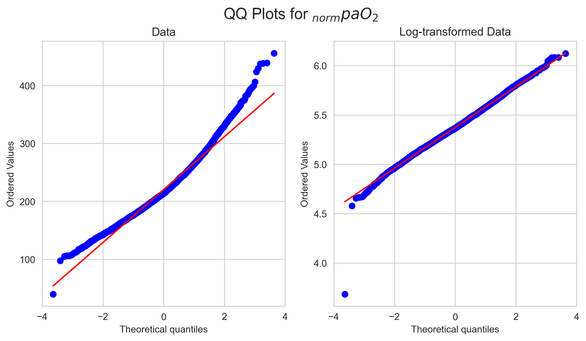
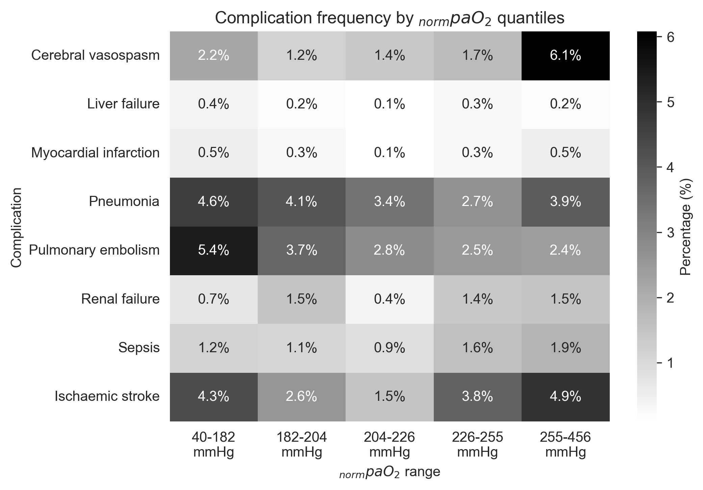
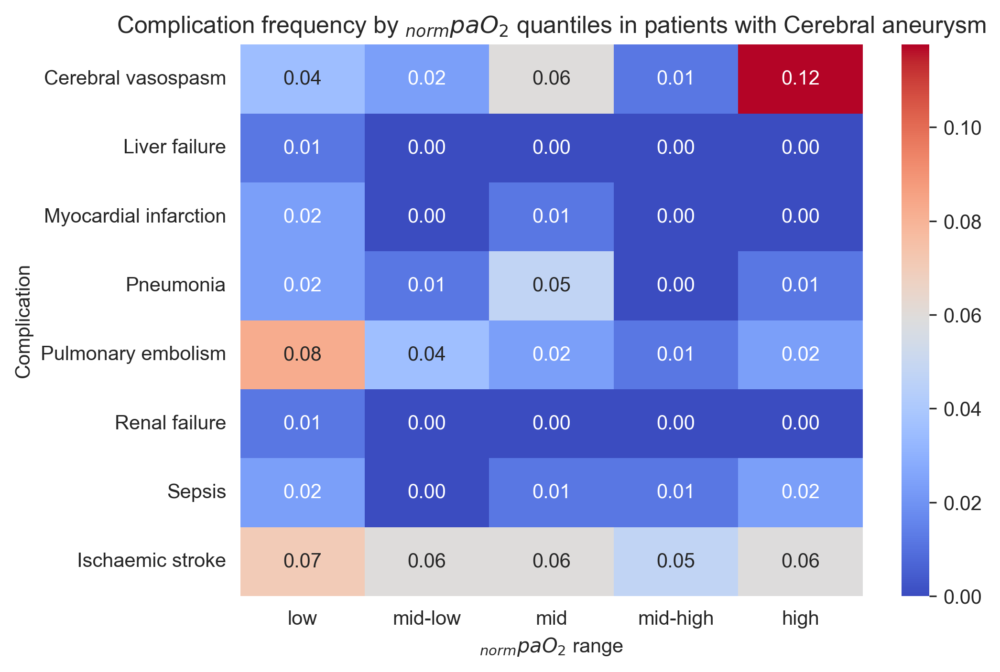
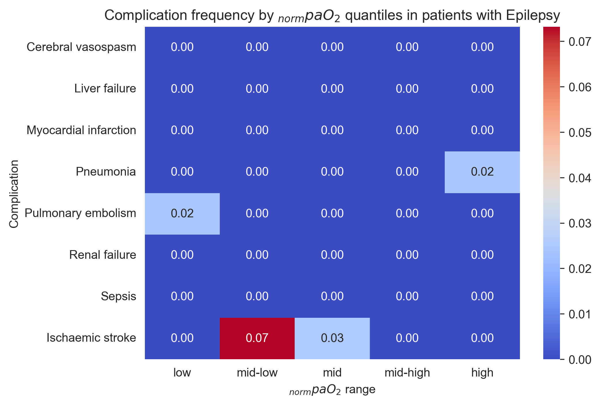
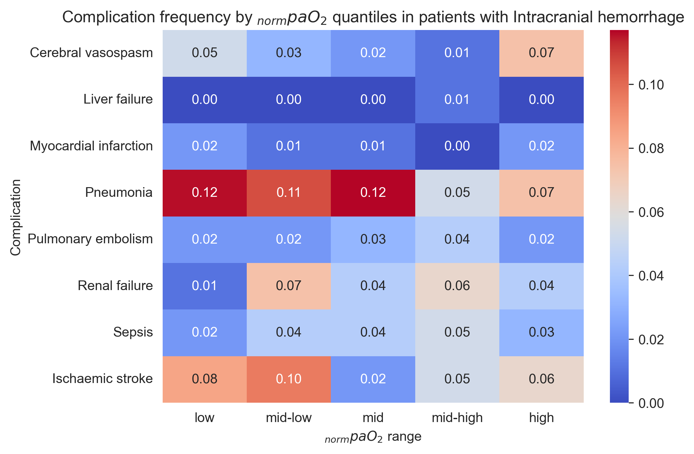

# Continuous $paO_2$ Prediction and Postoperative Complications in
Neurosurgical Patients
Andrea S. Gutmann
2026-02-09

# Preprocessing

``` python
# ======================
# Standard library
# ======================
import pickle
import pprint
import warnings
from collections import Counter
from pathlib import Path

# ======================
# Third-party libraries
# ======================
import matplotlib
import matplotlib.pyplot as plt
import numpy as np
import pandas as pd
import seaborn as sns
import yaml
from scipy import stats
from statsmodels.discrete.discrete_model import Logit

# ======================
# Local / application
# ======================
from statistical_functions import *

from statsmodels.tools.sm_exceptions import PerfectSeparationWarning

warnings.simplefilter("error", PerfectSeparationWarning)
warnings.simplefilter("error", RuntimeWarning)

pp = pprint.PrettyPrinter(indent=4)
np.random.seed(42)

matplotlib.rcParams["figure.dpi"] = 300

sns.set_style('whitegrid')

with open("config.yaml", "r") as file:
    config = yaml.safe_load(file)

with open(Path(config.get('pickle').get('analysis')), 'rb') as f:
    analysis_df = pickle.load(f)

complications = config.get("complications_dict").keys()
diagnoses = config.get("diagnoses") + ["other"]

qq_plot(analysis_df.loc[:,'norm_auc_paO2'], title="QQ Plots for $_{norm}paO_2$")
```



# Postoperative Complications

``` python
table2_data = []
table2_data_logreg = []
```

## Differences in intervention counts

``` python
analysis_df["revision"] = analysis_df["intervention_count"] > 1

pvalue, ph_dunn, effect_sizes = compare_median("norm_auc_paO2", analysis_df, "revision")

# pvalue_log, odds_ratio = logistic_regression(
#     analysis_df.loc[:, "revision"], analysis_df.loc[:, "norm_auc_paO2"], odds_ratio=True
# )

pval_lr, odds_ratio, or_ci, accuracy, or_const = logistic_regression(
    analysis_df.loc[:, "revision"],
    analysis_df.loc[:, "norm_auc_paO2"],
    log=True,
    intercept_fitting=True,
    odds_ratio=True,
)
```

             norm_auc_paO2                  
                    median        mean count
    revision                                
    False       214.168185  220.184589  4794
    True        210.389477  221.450389   226
    p-value: 0.8336
    No significance found.

    1, 2: Effect size: Hedges' g: 0.03 (very small)
    [(0, 1, np.float64(0.02733016975552083))]

    1, 2: Effect size: Hedges' g: 0.03 (very small)
    WARNING: MODEL ACCURACY IS BELOW 0.5 (0.0450), INDICATING A POOR MODEL FIT.
                      lower     upper
    const          0.935375  1.069089
    norm_auc_paO2  0.987658  1.012507
    The estimated odds for revision change by 1.0000 [0.9877, 1.0125] for each 10% increase of norm_auc_paO2 (accuracy: 0.0450, p-value: 0.9997).

Summary:

``` python
if pvalue > 0.05:
    print(f"No differences in ranks of normpaO2 between patients with revision and no revision, g={effect_sizes[0][-1]:.2f}.")
else:
    print(f"Signifikant differences between ranks of normpaO2 in patients with revision and no revision, g={effect_sizes[0][-1]:.2f}.")

if pval_lr >= 0.05:
    print("No significant influence of normpaO2 on revisions.")
else:
    if odds_ratio < 1:
        print(f"Each 10% increase of normpaO2 decreased the chances of revision by {(1-odds_ratio)*100:.2f} %.")
    else:
        print(f"Each 10% increase of normpaO2 increased the chances of revision by {(odds_ratio-1)*100:.2f} %.")
```

    No differences in ranks of normpaO2 between patients with revision and no revision, g=0.03.
    No significant influence of normpaO2 on revisions.

## Differences in $paO_2$ between deceased and non-deceased patients

``` python
analysis_df["survival"] = analysis_df["deceased"].apply(
    lambda x: {True: False, False: True}.get(x)
)
analysis_df.drop("deceased", axis=1)

pvalue, ph_dunn, effect_sizes = compare_median("norm_auc_paO2", analysis_df, "survival")

# pvalue_log, odds_ratio = logistic_regression(analysis_df.loc[:,'survival'], analysis_df.loc[:,'norm_auc_paO2'], odds_ratio = True)
pval_lr, odds_ratio, or_ci, accuracy, or_const = logistic_regression(
    analysis_df.loc[:, "survival"],
    analysis_df.loc[:, "norm_auc_paO2"],
    log=True,
    intercept_fitting=True,
    odds_ratio=True,
)
if pval_lr < 0.05:
    table2_data_logreg.append([
        "All patients",# Group/Condition
        'Survival Status', # outcome/dependent variable
        f"{odds_ratio:.4f} [{or_ci[0]:.4f}, {or_ci[1]:.4f}]", # Odds Ratio
        # or_const,
        f"{accuracy:.4f}",
        "<0.0001" if pval_lr < 0.0001 else f"{pval_lr:.4f}",
        "increased" if odds_ratio>1 else "reduced"
    ])   
```

             norm_auc_paO2                  
                    median        mean count
    survival                                
    False       212.276213  227.392474    89
    True        214.064921  220.112508  4931
    p-value: 0.584
    No significance found.

    1, 2: Effect size: Hedges' g: 0.16 (very small)
    [(0, 1, np.float64(0.15722301130138316))]

    1, 2: Effect size: Hedges' g: 0.16 (very small)
                      lower     upper
    const          1.122224  1.232494
    norm_auc_paO2  0.961895  0.978809
    The estimated odds for survival change by 0.9703 [0.9619, 0.9788] for each 10% increase of norm_auc_paO2 (accuracy: 0.5301, p-value: 0.0204).

Summary:

``` python
if pvalue > 0.05:
    print(f"No differences in ranks of normpaO2 between deceased and non-deceased patients, g={effect_sizes[0][-1]:.2f}.")
else:
    print(f"Significant differences between ranks of normpaO2 deceased and non-deceased patients, g={effect_sizes[0][-1]:.2f}.")

if pval_lr >= 0.05:
    print("No significant influence of normpaO2 on survival status.")
else:
    if odds_ratio < 1: # decreased odds
        print(f"Each 10% increase of normpaO2 decreased the chances of survival by {(1-odds_ratio)*100:.2f} %.")
    else: # increased odds
        print(f"Each 10% increase of normpaO2 increased the chances of survival by {(odds_ratio-1)*100:.2f} %.")
```

    No differences in ranks of normpaO2 between deceased and non-deceased patients, g=0.16.
    Each 10% increase of normpaO2 decreased the chances of survival by 2.97 %.

Survival status by single postoperative complication

``` python
for c in complications:
    print(c)
    res = return_table(analysis_df[analysis_df[c]==True], ['survival'])
    print(f"{res[0][0]} out of {sum(res)[0]} patients with postop {config.get('long_names').get(c)} did not survive.\n")
```

    cerebral_vasospasm
    survival
    False      7
    True     119
    dtype: int64
    7 out of 126 patients with postop Cerebral vasospasm did not survive.

    liver_failure
    survival
    False    5
    True     7
    dtype: int64
    5 out of 12 patients with postop Liver failure did not survive.

    myocardial_infarction
    survival
    False     3
    True     14
    dtype: int64
    3 out of 17 patients with postop Myocardial infarction did not survive.

    pneumonia
    survival
    False     16
    True     171
    dtype: int64
    16 out of 187 patients with postop Pneumonia did not survive.

    pulmonary_embolism
    survival
    False      7
    True     161
    dtype: int64
    7 out of 168 patients with postop Pulmonary embolism did not survive.

    renal_failure
    survival
    False    18
    True     37
    dtype: int64
    18 out of 55 patients with postop Renal failure did not survive.

    sepsis
    survival
    False    14
    True     53
    dtype: int64
    14 out of 67 patients with postop Sepsis did not survive.

    stroke
    survival
    False     20
    True     151
    dtype: int64
    20 out of 171 patients with postop Ischaemic stroke did not survive.

Survival status by underlying diagnosis

``` python
for d in diagnoses:
    print(f"\n{config.get('long_names').get(d).upper()}\n")
    pvalue, ph_dunn, effect_sizes = compare_median(
        "norm_auc_paO2", analysis_df.loc[analysis_df[d] == True, :], "survival", False
    )
    if len(effect_sizes) == 0:
        effect_sizes = [[0]]

    try:
        # pvalue_log, odds_ratio = logistic_regression(
        #     analysis_df.loc[analysis_df[d] == True, "survival"],
        #     analysis_df.loc[analysis_df[d] == True, "norm_auc_paO2"],
        #     odds_ratio=True,
        # )
        pval_lr, odds_ratio, or_ci, accuracy, or_const = logistic_regression(
            analysis_df.loc[analysis_df[d] == True, "survival"],
            analysis_df.loc[analysis_df[d] == True, "norm_auc_paO2"],
            log=True,
            intercept_fitting=True,
            odds_ratio=True,
        )

    except PerfectSeparationWarning:
        print("❌ Model not identifiable due to perfect separation")
        sign = False
    except RuntimeWarning:
        print("❌ Divide by zero.")
        sign = False
    except ValueError:
        print("❌ Only one class availabe.")
        sign = False

    # summary
    if pvalue > 0.05:
        print(
            f"No differences in ranks of normpaO2 between survival status in patients with {config.get('long_names').get(d)}, g={effect_sizes[0][-1]:.2f}."
        )
    else:
        print(
            f"Significant differences between ranks of normpaO2 between survival status in patients with {config.get('long_names').get(d)}, g={effect_sizes[0][-1]:.2f}."
        )

    if pval_lr >= 0.05:
        print(
            f"No significant influence of normpaO2 on survival status of patients with {config.get('long_names').get(d)}."
        )
    else:
        if odds_ratio < 1:  # decreased odds
            print(
                f"Each 10% increase of normpaO2 decreased the chances of survival in patients with {config.get('long_names').get(d)} by {(1-odds_ratio)*100:.2f} %."
            )
        else:  # increased odds
            print(
                f"Each 10% increase of normpaO2 increased the chances of survival in patients with {config.get('long_names').get(d)} by {(odds_ratio-1)*100:.2f} %."
            )

    # add to table data
    if pvalue < 0.05:
        medians = (
            analysis_df.loc[analysis_df[d] == True, :]
            .groupby("deceased", observed=False)["norm_auc_paO2"]
            .median()
        )
        table2_data.append(
            [
                config.get("long_names").get(d), # Group/Condition
                "Deceased vs. Survivors", # Comparison
                f"{int(medians.loc[True])} vs. {int(medians.loc[False])}", # pao2 values
                "<0.0001" if pvalue < 0.0001 else f"{pvalue:.4f}", # p-value
                f"{effect_sizes[0][-1]:.2f}", # effect size
                {True: "↑ in deceased", False: "↑ in survivors"}[
                    medians.loc[True] > medians.loc[False]
                ], # Direction
            ]
        )
    if pval_lr < 0.05:
        table2_data_logreg.append([
            config.get('long_names').get(d),# Group/Condition
            'Survival Status', # outcome/dependent variable
            f"{odds_ratio:.4f} [{or_ci[0]:.4f}, {or_ci[1]:.4f}]", # Odds Ratio
            # or_const,
            f"{accuracy:.4f}",
            "<0.0001" if pval_lr < 0.0001 else f"{pval_lr:.4f}",
            "increased" if odds_ratio>1 else "reduced"
        ])    
```


    BENIGN NEOPLASM

    No significance found.

    1, 2: Effect size: Hedges' g: 0.07 (very small)
    [(0, 1, np.float64(0.07226659992706248))]

    1, 2: Effect size: Hedges' g: 0.07 (very small)
                      lower     upper
    const          0.698414  0.822041
    norm_auc_paO2  1.037688  1.069976
    The estimated odds for survival change by 1.0537 [1.0377, 1.0700] for each 10% increase of norm_auc_paO2 (accuracy: 0.5411, p-value: 0.0243).
    No differences in ranks of normpaO2 between survival status in patients with Benign neoplasm, g=0.07.
    Each 10% increase of normpaO2 increased the chances of survival in patients with Benign neoplasm by 5.37 %.

    CEREBRAL ANEURYSM

    No significance found.

    1, 2: Effect size: Hedges' g: 1.2 (very large)
    [(0, 1, np.float64(1.2002849509109528))]

    1, 2: Effect size: Hedges' g: 1.2 (very large)
                      lower     upper
    const          0.020064  0.027473
    norm_auc_paO2  1.920722  2.031357
    The estimated odds for survival change by 1.9753 [1.9207, 2.0314] for each 10% increase of norm_auc_paO2 (accuracy: 0.7844, p-value: 0.0000).
    No differences in ranks of normpaO2 between survival status in patients with Cerebral aneurysm, g=1.20.
    Each 10% increase of normpaO2 increased the chances of survival in patients with Cerebral aneurysm by 97.53 %.

    EPILEPSY

    No significance found.
    []
    ❌ Only one class availabe.
    No differences in ranks of normpaO2 between survival status in patients with Epilepsy, g=0.00.
    Each 10% increase of normpaO2 increased the chances of survival in patients with Epilepsy by 97.53 %.

    INTRACRANIAL HEMORRHAGE

    No significance found.

    1, 2: Effect size: Hedges' g: 0.02 (very small)
    [(0, 1, np.float64(0.01766156720889192))]

    1, 2: Effect size: Hedges' g: 0.02 (very small)
                      lower     upper
    const          0.803720  1.087656
    norm_auc_paO2  0.984543  1.041409
    The estimated odds for survival change by 1.0126 [0.9845, 1.0414] for each 10% increase of norm_auc_paO2 (accuracy: 0.5180, p-value: 0.7610).
    No differences in ranks of normpaO2 between survival status in patients with Intracranial hemorrhage, g=0.02.
    No significant influence of normpaO2 on survival status of patients with Intracranial hemorrhage.

    MALIGNANT NEOPLASM

             norm_auc_paO2                  
                    median        mean count
    survival                                
    False       245.059474  253.145220    14
    True        209.492174  211.682242   949

    ... Post hoc test...
        1   2
    1   -  **
    2  **   -
           1      2
    1 1.0000 0.0011
    2 0.0011 1.0000

    1, 2: Effect size: Hedges' g: 1.11 (large)
    [(np.int64(0), np.int64(1), np.float64(1.1084271266770187))]

    1, 2: Effect size: Hedges' g: 1.11 (large)
                   lower  upper
    const         6.7515 8.2666
    norm_auc_paO2 0.6773 0.7034
    The estimated odds for survival change by 0.6902 [0.6773, 0.7034] for each 10% increase of norm_auc_paO2 (accuracy: 0.6885, p-value: 0.0000).
    Significant differences between ranks of normpaO2 between survival status in patients with Malignant neoplasm, g=1.11.
    Each 10% increase of normpaO2 decreased the chances of survival in patients with Malignant neoplasm by 30.98 %.

    NEOPLASM OF UNCERTAIN OR UNKNOWN BEHAVIOR

    No significance found.

    1, 2: Effect size: Hedges' g: 0.05 (very small)
    [(0, 1, np.float64(0.04517226889907929))]

    1, 2: Effect size: Hedges' g: 0.05 (very small)
                   lower  upper
    const         0.7236 1.6024
    norm_auc_paO2 0.9162 1.0619
    The estimated odds for survival change by 0.9864 [0.9162, 1.0619] for each 10% increase of norm_auc_paO2 (accuracy: 0.5149, p-value: 0.8967).
    No differences in ranks of normpaO2 between survival status in patients with Neoplasm of uncertain or unknown behavior, g=0.05.
    No significant influence of normpaO2 on survival status of patients with Neoplasm of uncertain or unknown behavior.

    SUBARACHNOID HEMORRHAGE

    No significance found.

    1, 2: Effect size: Hedges' g: 0.13 (very small)
    [(0, 1, np.float64(0.13315928594079016))]

    1, 2: Effect size: Hedges' g: 0.13 (very small)
                   lower  upper
    const         0.7279 1.0343
    norm_auc_paO2 0.9941 1.0587
    The estimated odds for survival change by 1.0259 [0.9941, 1.0587] for each 10% increase of norm_auc_paO2 (accuracy: 0.5714, p-value: 0.6017).
    No differences in ranks of normpaO2 between survival status in patients with Subarachnoid hemorrhage, g=0.13.
    No significant influence of normpaO2 on survival status of patients with Subarachnoid hemorrhage.

    TRAUMATIC BRAIN INJURY

    No significance found.

    1, 2: Effect size: Hedges' g: 0.2 (very small)
    [(0, 1, np.float64(0.1989023582813061))]

    1, 2: Effect size: Hedges' g: 0.2 (very small)
                   lower  upper
    const         0.5627 0.8313
    norm_auc_paO2 1.0354 1.1135
    The estimated odds for survival change by 1.0737 [1.0354, 1.1135] for each 10% increase of norm_auc_paO2 (accuracy: 0.5714, p-value: 0.2105).
    No differences in ranks of normpaO2 between survival status in patients with Traumatic brain injury, g=0.20.
    No significant influence of normpaO2 on survival status of patients with Traumatic brain injury.

    FACIAL NERVE DISORDERS AND DISORDERS OF TRIGEMINAL NERVE

    No significance found.
    []
    ❌ Only one class availabe.
    No differences in ranks of normpaO2 between survival status in patients with Facial nerve disorders and disorders of trigeminal nerve, g=0.00.
    No significant influence of normpaO2 on survival status of patients with Facial nerve disorders and disorders of trigeminal nerve.

    OTHER ANEURYSMS AND DISSECTIONS

    No significance found.

    1, 2: Effect size: Hedges' g: 0.07 (very small)
    [(0, 1, np.float64(0.0722911250769847))]

    1, 2: Effect size: Hedges' g: 0.07 (very small)
    WARNING: MODEL ACCURACY IS BELOW 0.5 (0.4815), INDICATING A POOR MODEL FIT.
                   lower  upper
    const         0.3792 3.0400
    norm_auc_paO2 0.8208 1.1880
    The estimated odds for survival change by 0.9875 [0.8208, 1.1880] for each 10% increase of norm_auc_paO2 (accuracy: 0.4815, p-value: 0.9581).
    No differences in ranks of normpaO2 between survival status in patients with Other aneurysms and dissections, g=0.07.
    No significant influence of normpaO2 on survival status of patients with Other aneurysms and dissections.

    OTHER DISEASES OF THE BRAIN

    No significance found.

    1, 2: Effect size: Hedges' g: 0.29 (small)
    [(0, 1, np.float64(0.29178382569890354))]

    1, 2: Effect size: Hedges' g: 0.29 (small)
                   lower  upper
    const         0.4655 0.6560
    norm_auc_paO2 1.0820 1.1531
    The estimated odds for survival change by 1.1170 [1.0820, 1.1531] for each 10% increase of norm_auc_paO2 (accuracy: 0.5359, p-value: 0.0231).
    No differences in ranks of normpaO2 between survival status in patients with Other diseases of the brain, g=0.29.
    Each 10% increase of normpaO2 increased the chances of survival in patients with Other diseases of the brain by 11.70 %.

## Length of stay

``` python
print(
    f"Median LOS: {np.mean(analysis_df['los'])} -> {int(np.ceil(np.mean(analysis_df['los'])))}"
)
analysis_df["los_prolonged"] = False
analysis_df.loc[analysis_df["los"] > np.mean(analysis_df["los"]), "los_prolonged"] = (
    True
)

pvalue, ph_dunn, effect_sizes = compare_median(
    "norm_auc_paO2", analysis_df, "los_prolonged", False
)
# pvalue_log, odds_ratio = logistic_regression(
#     analysis_df.loc[:, "los_prolonged"],
#     analysis_df.loc[:, "norm_auc_paO2"],
#     odds_ratio=True,
# )
pval_lr, odds_ratio, or_ci, accuracy, or_const = logistic_regression(
    analysis_df.loc[:, "los_prolonged"],
    analysis_df.loc[:, "norm_auc_paO2"],
    log=True,
    intercept_fitting=True,
    odds_ratio=True,
)


if pvalue < 0.05:
    medians = analysis_df.groupby("los_prolonged", observed=False)["norm_auc_paO2"].median()
    table2_data.append(
        [
            f"Prolonged in-hospital stay (≥{int(np.ceil(np.mean(analysis_df['los'])))} days)",
            "Normal vs. prolonged stay",
            f"{int(medians.loc[False])} vs. {int(medians.loc[True])}",
            "<0.0001" if pvalue < 0.0001 else f"{pvalue:.4f}",
            f"{effect_sizes[0][-1]:.2f}",
            {True: "↑ with normal stay", False: "↑ with prolonged stay"}[
                medians.loc[False] > medians.loc[True]
            ],
        ]
    )
if pval_lr < 0.05:
    table2_data_logreg.append([
        "All patients",# Group/Condition
        f"Prolonged in-hospital stay (≥{int(np.ceil(np.mean(analysis_df['los'])))} days)", # outcome/dependent variable
        f"{odds_ratio:.4f} [{or_ci[0]:.4f}, {or_ci[1]:.4f}]", # Odds Ratio
        # or_const,
        f"{accuracy:.4f}",
        "<0.0001" if pval_lr < 0.0001 else f"{pval_lr:.4f}",
        "increased" if odds_ratio>1 else "reduced"
    ])    
```

    Median LOS: 10.94601593625498 -> 11
                  norm_auc_paO2               
                         median     mean count
    los_prolonged                             
    False              213.0671 218.2980  3584
    True               217.0908 225.0924  1436

    ... Post hoc test...
        1   2
    1   -  **
    2  **   -
           1      2
    1 1.0000 0.0028
    2 0.0028 1.0000

    1, 2: Effect size: Hedges' g: 0.15 (very small)
    [(np.int64(0), np.int64(1), np.float64(0.1470205837880129))]

    1, 2: Effect size: Hedges' g: 0.15 (very small)
                   lower  upper
    const         0.7347 0.8071
    norm_auc_paO2 1.0406 1.0590
    The estimated odds for los_prolonged change by 1.0498 [1.0406, 1.0590] for each 10% increase of norm_auc_paO2 (accuracy: 0.5265, p-value: 0.0002).

Summary:

``` python
if pvalue > 0.05:
    print(f"No differences in ranks of normpaO2 between patients with normal or prolonged LOS, g={effect_sizes[0][-1]:.2f}.")
else:
    print(f"Significant differences between ranks of normpaO2 between patients with normal or prolonged LOS, g={effect_sizes[0][-1]:.2f}.")

if pval_lr >= 0.05:
    print("No significant influence of normpaO2 on prolonged LOS.")
else:
    if odds_ratio < 1: # decreased odds
        print(f"Each 10% increase of normpaO2 decreased the chances of prolonged LOS by {(1-odds_ratio)*100:.2f} %.")
    else: # increased odds
        print(f"Each 10% increase of normpaO2 increased the chances of prolonged LOS by {(odds_ratio-1)*100:.2f} %.")
```

    Significant differences between ranks of normpaO2 between patients with normal or prolonged LOS, g=0.15.
    Each 10% increase of normpaO2 increased the chances of prolonged LOS by 4.98 %.

### LOS per postop complication

``` python
for c in complications:
    cont_table = pd.crosstab(analysis_df["los_prolonged"], analysis_df[c])
    oddsratio, pvalue = stats.fisher_exact(cont_table)

    print(f"{c}: Odds ratio: {round(oddsratio,2)}, p-value: {round(pvalue,4)} (Fisher's Exact Test)")

    statitic, pvalue, dof, expected_freq = stats.chi2_contingency(cont_table.values)
    print(f"{c}: p-value: {round(pvalue,4)} (Chi-square test)\n")
```

    cerebral_vasospasm: Odds ratio: 8.12, p-value: 0.0 (Fisher's Exact Test)
    cerebral_vasospasm: p-value: 0.0 (Chi-square test)

    liver_failure: Odds ratio: 12.56, p-value: 0.0001 (Fisher's Exact Test)
    liver_failure: p-value: 0.0001 (Chi-square test)

    myocardial_infarction: Odds ratio: 8.18, p-value: 0.0001 (Fisher's Exact Test)
    myocardial_infarction: p-value: 0.0 (Chi-square test)

    pneumonia: Odds ratio: 8.63, p-value: 0.0 (Fisher's Exact Test)
    pneumonia: p-value: 0.0 (Chi-square test)

    pulmonary_embolism: Odds ratio: 6.52, p-value: 0.0 (Fisher's Exact Test)
    pulmonary_embolism: p-value: 0.0 (Chi-square test)

    renal_failure: Odds ratio: 7.49, p-value: 0.0 (Fisher's Exact Test)
    renal_failure: p-value: 0.0 (Chi-square test)

    sepsis: Odds ratio: 14.77, p-value: 0.0 (Fisher's Exact Test)
    sepsis: p-value: 0.0 (Chi-square test)

    stroke: Odds ratio: 7.33, p-value: 0.0 (Fisher's Exact Test)
    stroke: p-value: 0.0 (Chi-square test)

### LOS per ASA

``` python
print("\nPer ASA")
for asa in range(1, 6):
    asa = to_roman(asa)
    print(f"ASA {asa}")
    pvalue, ph_dunn, effect_sizes = compare_median(
        "norm_auc_paO2",
        analysis_df.loc[analysis_df.asa == asa, :],
        "los_prolonged",
        False,
    )
    # pvalue_log, odds_ratio = logistic_regression(
    #     analysis_df.loc[analysis_df.asa == asa, "los_prolonged"],
    #     analysis_df.loc[analysis_df.asa == asa, "norm_auc_paO2"],
    #     odds_ratio=True,
    # )
    pval_lr, odds_ratio, or_ci, accuracy, or_const = logistic_regression(
        analysis_df.loc[analysis_df.asa == asa, "los_prolonged"],
        analysis_df.loc[analysis_df.asa == asa, "norm_auc_paO2"],
        log=True,
        intercept_fitting=True,
        odds_ratio=True,
    )

    if pvalue < 0.05:
        medians = (
            analysis_df.loc[analysis_df.asa == asa, :]
            .groupby("los_prolonged", observed=False)["norm_auc_paO2"]
            .median()
        )
        table2_data.append(
            [
                f"Prolonged in-hospital stay, ASA {asa}",
                "Normal vs. prolonged stay",
                f"{int(medians.loc[False])} vs. {int(medians.loc[True])}",
                "<0.0001" if pvalue < 0.0001 else f"{pvalue:.4f}",
                f"{effect_sizes[0][-1]:.2f}",
                {True: "↑ with normal stay", False: "↑ with prolonged stay"}[
                    medians.loc[False] > medians.loc[True]
                ],
            ]
        )
    
    if pval_lr < 0.05:
        table2_data_logreg.append([
            f"Patients with ASA {asa}",# Group/Condition
            f"Prolonged in-hospital stay (≥{int(np.ceil(np.mean(analysis_df['los'])))} days)", # outcome/dependent variable
            f"{odds_ratio:.4f} [{or_ci[0]:.4f}, {or_ci[1]:.4f}]", # Odds Ratio
            # or_const,
            f"{accuracy:.4f}",
            "<0.0001" if pval_lr < 0.0001 else f"{pval_lr:.4f}",
            "increased" if odds_ratio>1 else "reduced"
        ])   
    
    # summary
    if pvalue > 0.05:
        print(f"No differences in ranks of normpaO2 between patients with ASA {asa} with normal or prolonged LOS, g={effect_sizes[0][-1]:.2f}.")
    else:
        print(f"Significant differences between ranks of normpaO2 between patients with ASA {asa} with normal or prolonged LOS, g={effect_sizes[0][-1]:.2f}.")

    if pval_lr >= 0.05:
        print("No significant influence of normpaO2 on prolonged LOS in ASA {asa} patients.")
    else:
        if odds_ratio < 1: # decreased odds
            print(f"Each 10% increase of normpaO2 decreased the chances of prolonged LOS in ASA {asa} patients by {(1-odds_ratio)*100:.2f} %.")
        else: # increased odds
            print(f"Each 10% increase of normpaO2 increased the chances of prolonged LOS in ASA {asa} patients by {(odds_ratio-1)*100:.2f} %.")
```


    Per ASA
    ASA I
    No significance found.

    1, 2: Effect size: Hedges' g: 0.24 (small)
    [(0, 1, np.float64(0.23894543799200413))]

    1, 2: Effect size: Hedges' g: 0.24 (small)
                   lower  upper
    const         1.2481 1.9898
    norm_auc_paO2 0.8810 0.9598
    The estimated odds for los_prolonged change by 0.9196 [0.8810, 0.9598] for each 10% increase of norm_auc_paO2 (accuracy: 0.5647, p-value: 0.2080).
    No differences in ranks of normpaO2 between patients with ASA I with normal or prolonged LOS, g=0.24.
    No significant influence of normpaO2 on prolonged LOS in ASA {asa} patients.
    ASA II
    No significance found.

    1, 2: Effect size: Hedges' g: 0.03 (very small)
    [(0, 1, np.float64(0.02822746943438506))]

    1, 2: Effect size: Hedges' g: 0.03 (very small)
    WARNING: MODEL ACCURACY IS BELOW 0.5 (0.1811), INDICATING A POOR MODEL FIT.
                   lower  upper
    const         0.9006 1.1104
    norm_auc_paO2 0.9808 1.0196
    The estimated odds for los_prolonged change by 1.0000 [0.9808, 1.0196] for each 10% increase of norm_auc_paO2 (accuracy: 0.1811, p-value: 0.9997).
    No differences in ranks of normpaO2 between patients with ASA II with normal or prolonged LOS, g=0.03.
    No significant influence of normpaO2 on prolonged LOS in ASA {asa} patients.
    ASA III
                  norm_auc_paO2               
                         median     mean count
    los_prolonged                             
    False              204.3847 210.5713  1496
    True               214.3431 220.6217   679

    ... Post hoc test...
         1    2
    1    -  ***
    2  ***    -
           1      2
    1 1.0000 0.0000
    2 0.0000 1.0000

    1, 2: Effect size: Hedges' g: 0.22 (small)
    [(np.int64(0), np.int64(1), np.float64(0.22349945013922357))]

    1, 2: Effect size: Hedges' g: 0.22 (small)
                   lower  upper
    const         0.5573 0.6401
    norm_auc_paO2 1.0869 1.1154
    The estimated odds for los_prolonged change by 1.1011 [1.0869, 1.1154] for each 10% increase of norm_auc_paO2 (accuracy: 0.5577, p-value: 0.0000).
    Significant differences between ranks of normpaO2 between patients with ASA III with normal or prolonged LOS, g=0.22.
    Each 10% increase of normpaO2 increased the chances of prolonged LOS in ASA III patients by 10.11 %.
    ASA IV
    No significance found.

    1, 2: Effect size: Hedges' g: 0.21 (small)
    [(0, 1, np.float64(0.21291755867274734))]

    1, 2: Effect size: Hedges' g: 0.21 (small)
                   lower  upper
    const         0.6681 0.8515
    norm_auc_paO2 1.0303 1.0776
    The estimated odds for los_prolonged change by 1.0537 [1.0303, 1.0776] for each 10% increase of norm_auc_paO2 (accuracy: 0.5411, p-value: 0.1252).
    No differences in ranks of normpaO2 between patients with ASA IV with normal or prolonged LOS, g=0.21.
    No significant influence of normpaO2 on prolonged LOS in ASA {asa} patients.
    ASA V
    No significance found.

    1, 2: Effect size: Hedges' g: 0.15 (very small)
    [(0, 1, np.float64(0.1494967493281445))]

    1, 2: Effect size: Hedges' g: 0.15 (very small)
                   lower  upper
    const         0.7836 1.7689
    norm_auc_paO2 0.9015 1.0455
    The estimated odds for los_prolonged change by 0.9708 [0.9015, 1.0455] for each 10% increase of norm_auc_paO2 (accuracy: 0.6061, p-value: 0.7922).
    No differences in ranks of normpaO2 between patients with ASA V with normal or prolonged LOS, g=0.15.
    No significant influence of normpaO2 on prolonged LOS in ASA {asa} patients.

### LOS per sex

``` python
for sex in [True, False]:
    print(f"{ {True: 'Male', False: 'Female'}[sex]} patients:")
    pvalue, ph_dunn, effect_sizes = compare_median(
        "norm_auc_paO2",
        analysis_df.loc[analysis_df.sex_male == sex, :],
        "los_prolonged",
        False,
    )
    # pvalue_log, odds_ratio = logistic_regression(
    #     analysis_df.loc[analysis_df.sex_male == sex, "los_prolonged"],
    #     analysis_df.loc[analysis_df.sex_male == sex, "norm_auc_paO2"],
    #     odds_ratio=True,
    # )
    pval_lr, odds_ratio, or_ci, accuracy, or_const = logistic_regression(
        analysis_df.loc[analysis_df.sex_male == sex, "los_prolonged"],
        analysis_df.loc[analysis_df.sex_male == sex, "norm_auc_paO2"],
        log=True,
        intercept_fitting=True,
        odds_ratio=True,
    )

    if pvalue < 0.05:
        print(
            f"\nDifferences between normal and prolonged LOS in normalized perioperative auc values for { {True: 'male', False: 'female'}[sex] } patients: {round(pvalue,4)}.\n__________________________________________\n\n"
        )

        medians = (
            analysis_df.loc[analysis_df.sex_male == sex, :]
            .groupby("los_prolonged", observed=False)["norm_auc_paO2"]
            .median()
        )
        table2_data.append(
            [
                f"Prolonged in-hospital stay, { {True: 'males', False: 'females'}[sex] }",
                "Normal vs. prolonged stay",
                f"{int(medians.loc[False])} vs. {int(medians.loc[True])}",
                "<0.0001" if pvalue < 0.0001 else f"{pvalue:.4f}",
                f"{effect_sizes[0][-1]:.2f}",
                {True: "↑ with normal stay", False: "↑ with prolonged stay"}[
                    medians.loc[False] > medians.loc[True]
                ],
            ]
        )
        print(f"Significant differences between ranks of normpaO2 in { {True: 'male', False: 'female'}[sex]} patients with normal or prolonged LOS, g={effect_sizes[0][-1]:.2f}.")
    else:
        print(f"No differences in ranks of normpaO2 in { {True: 'male', False: 'female'}[sex]} patients with normal or prolonged LOS, g={effect_sizes[0][-1]:.2f}.")

    if pval_lr < 0.05:
        if odds_ratio < 1: # decreased odds
            print(f"Each 10% increase of normpaO2 decreased the chances of prolonged LOS among { {True: 'male', False: 'female'}[sex]} patients by {(1-odds_ratio)*100:.2f} %.")
        else: # increased odds
            print(f"Each 10% increase of normpaO2 increased the chances of prolonged LOS among { {True: 'male', False: 'female'}[sex]} patients by {(odds_ratio-1)*100:.2f} %.")
        
        table2_data_logreg.append([
            f"{ {True: 'Male', False: 'Female'}[sex]} patients",# Group/Condition
            f"Prolonged in-hospital stay (≥{int(np.ceil(np.mean(analysis_df['los'])))} days)", # outcome/dependent variable
            f"{odds_ratio:.4f} [{or_ci[0]:.4f}, {or_ci[1]:.4f}]", # Odds Ratio
            # or_const,
            f"{accuracy:.4f}",
            "<0.0001" if pval_lr < 0.0001 else f"{pval_lr:.4f}",
            "increased" if odds_ratio>1 else "reduced"
        ])   
    else:
        print(f"No significant influence of normpaO2 on prolonged LOS among { {True: 'male', False: 'female'}[sex]} patients.")
```

    Male patients:
    No significance found.

    1, 2: Effect size: Hedges' g: 0.13 (very small)
    [(0, 1, np.float64(0.12872642117805333))]

    1, 2: Effect size: Hedges' g: 0.13 (very small)
                   lower  upper
    const         0.7275 0.8421
    norm_auc_paO2 1.0327 1.0614
    The estimated odds for los_prolonged change by 1.0470 [1.0327, 1.0614] for each 10% increase of norm_auc_paO2 (accuracy: 0.5157, p-value: 0.0227).
    No differences in ranks of normpaO2 in male patients with normal or prolonged LOS, g=0.13.
    Each 10% increase of normpaO2 increased the chances of prolonged LOS among male patients by 4.70 %.
    Female patients:
                  norm_auc_paO2               
                         median     mean count
    los_prolonged                             
    False              219.5967 224.4667  2110
    True               226.5587 234.3682   744

    ... Post hoc test...
         1    2
    1    -  ***
    2  ***    -
           1      2
    1 1.0000 0.0002
    2 0.0002 1.0000

    1, 2: Effect size: Hedges' g: 0.21 (small)
    [(np.int64(0), np.int64(1), np.float64(0.21214180249960626))]

    1, 2: Effect size: Hedges' g: 0.21 (small)
                   lower  upper
    const         0.6374 0.7228
    norm_auc_paO2 1.0618 1.0868
    The estimated odds for los_prolonged change by 1.0742 [1.0618, 1.0868] for each 10% increase of norm_auc_paO2 (accuracy: 0.5371, p-value: 0.0001).

    Differences between normal and prolonged LOS in normalized perioperative auc values for female patients: 0.0002.
    __________________________________________


    Significant differences between ranks of normpaO2 in female patients with normal or prolonged LOS, g=0.21.
    Each 10% increase of normpaO2 increased the chances of prolonged LOS among female patients by 7.42 %.

### LOS per diagonsis

``` python
for d in diagnoses:
    tmp_df = analysis_df.loc[analysis_df[d] == True, :]
    print(f"{d.upper()}")
    print(
        f"Median LOS: {np.mean(tmp_df['los'])} -> {int(np.ceil(np.mean(tmp_df['los'])))}"
    )
    tmp_df.loc[:, "los_prolonged"] = False
    tmp_df.loc[tmp_df["los"] > np.mean(tmp_df["los"]), "los_prolonged"] = True

    pvalue, ph_dunn, effect_sizes = compare_median(
        "norm_auc_paO2", tmp_df, "los_prolonged", False
    )

    # pvalue_log, odds_ratio = logistic_regression(
    #     tmp_df.loc[:, "los_prolonged"],
    #     tmp_df.loc[:, "norm_auc_paO2"],
    #     odds_ratio=True,
    # )
    pval_lr, odds_ratio, or_ci, accuracy, or_const = logistic_regression(
        tmp_df.loc[:, "los_prolonged"],
        tmp_df.loc[:, "norm_auc_paO2"],
        log=True,
        intercept_fitting=True,
        odds_ratio=True,
    )

    if pvalue < 0.05:
        medians = tmp_df.groupby("los_prolonged", observed=False)["norm_auc_paO2"].median()
        table2_data.append(
            [
                f"{config.get('long_names').get(d)}, prolonged in-hospital stay (≥{int(np.ceil(np.mean(tmp_df['los'])))} days)",
                "Normal vs. prolonged stay",
                f"{int(medians.loc[False])} vs. {int(medians.loc[True])}",
                "<0.0001" if pvalue < 0.0001 else f"{pvalue:.4f}",
                f"{effect_sizes[0][-1]:.2f}",
                {True: "↑ with normal stay", False: "↑ with prolonged stay"}[
                    medians.loc[False] > medians.loc[True]
                ],
            ]
        )
        print(f"Significant differences in ranks of normpaO2 in patients with {config.get('long_names').get(d)} with normal or prolonged LOS, g={effect_sizes[0][-1]:.2f}.") 
    else:
        print(f"No differences in ranks of normpaO2 in patients with {config.get('long_names').get(d)} with normal or prolonged LOS, g={effect_sizes[0][-1]:.2f}.") 

    if pval_lr < 0.05:
        if odds_ratio < 1: # decreased odds
            print(f"Each 10% increase of normpaO2 decreased the chances of prolonged LOS among patients with {config.get('long_names').get(d)} by {(1-odds_ratio)*100:.2f} %.")
        else: # increased odds
            print(f"Each 10% increase of normpaO2 increased the chances of prolonged LOS among patients with {config.get('long_names').get(d)} by {(odds_ratio-1)*100:.2f} %.")
        
        table2_data_logreg.append([
            f"Patients with {config.get('long_names').get(d)}",# Group/Condition
            f"Prolonged in-hospital stay (≥{int(np.ceil(np.mean(tmp_df['los'])))} days)", # outcome/dependent variable
            f"{odds_ratio:.4f} [{or_ci[0]:.4f}, {or_ci[1]:.4f}]", # Odds Ratio
            # or_const,
            f"{accuracy:.4f}",
            "<0.0001" if pval_lr < 0.0001 else f"{pval_lr:.4f}",
            "increased" if odds_ratio>1 else "reduced"
        ])   
    else:
        print(f"No significant influence of normpaO2 on prolonged LOS among patients with {config.get('long_names').get(d)}.")
```

    BENIGN_NEOPLASM
    Median LOS: 9.196117471378795 -> 10
    No significance found.

    1, 2: Hedges' g <0.01
    [(0, 1, np.float64(0.008713740272868614))]

    1, 2: Hedges' g <0.01
                   lower  upper
    const         0.9664 1.1434
    norm_auc_paO2 0.9751 1.0064
    The estimated odds for los_prolonged change by 0.9907 [0.9751, 1.0064] for each 10% increase of norm_auc_paO2 (accuracy: 0.5112, p-value: 0.6839).
    No differences in ranks of normpaO2 in patients with Benign neoplasm with normal or prolonged LOS, g=0.01.
    No significant influence of normpaO2 on prolonged LOS among patients with Benign neoplasm.
    CEREBRAL_ANEURYSM
    Median LOS: 10.772511848341232 -> 11
                  norm_auc_paO2               
                         median     mean count
    los_prolonged                             
    False              271.5658 273.3996   304
    True               279.8774 283.4552   118

    ... Post hoc test...
       1  2
    1  -  *
    2  *  -
           1      2
    1 1.0000 0.0250
    2 0.0250 1.0000

    1, 2: Effect size: Hedges' g: 0.25 (small)
    [(np.int64(0), np.int64(1), np.float64(0.2496866383131466))]

    1, 2: Effect size: Hedges' g: 0.25 (small)
                   lower  upper
    const         0.4554 0.7222
    norm_auc_paO2 1.0596 1.1504
    The estimated odds for los_prolonged change by 1.1040 [1.0596, 1.1504] for each 10% increase of norm_auc_paO2 (accuracy: 0.5355, p-value: 0.1100).
    Significant differences in ranks of normpaO2 in patients with Cerebral aneurysm with normal or prolonged LOS, g=0.25.
    No significant influence of normpaO2 on prolonged LOS among patients with Cerebral aneurysm.
    EPILEPSY
    Median LOS: 9.200980392156863 -> 10
    No significance found.

    1, 2: Effect size: Hedges' g: 0.15 (very small)
    [(0, 1, np.float64(0.14926246136362742))]

    1, 2: Effect size: Hedges' g: 0.15 (very small)
                   lower  upper
    const         0.5707 1.0177
    norm_auc_paO2 0.9967 1.1098
    The estimated odds for los_prolonged change by 1.0517 [0.9967, 1.1098] for each 10% increase of norm_auc_paO2 (accuracy: 0.5098, p-value: 0.5162).
    No differences in ranks of normpaO2 in patients with Epilepsy with normal or prolonged LOS, g=0.15.
    No significant influence of normpaO2 on prolonged LOS among patients with Epilepsy.
    INTRACRANIAL_HEMORRHAGE
    Median LOS: 14.762208067940552 -> 15
    No significance found.

    1, 2: Effect size: Hedges' g: 0.21 (small)
    [(0, 1, np.float64(0.21483809406618243))]

    1, 2: Effect size: Hedges' g: 0.21 (small)
                   lower  upper
    const         0.6025 0.8148
    norm_auc_paO2 1.0387 1.0986
    The estimated odds for los_prolonged change by 1.0682 [1.0387, 1.0986] for each 10% increase of norm_auc_paO2 (accuracy: 0.5202, p-value: 0.1113).
    No differences in ranks of normpaO2 in patients with Intracranial hemorrhage with normal or prolonged LOS, g=0.21.
    No significant influence of normpaO2 on prolonged LOS among patients with Intracranial hemorrhage.
    MALIGNANT_NEOPLASM
    Median LOS: 11.496365524402908 -> 12
    No significance found.

    1, 2: Effect size: Hedges' g: 0.09 (very small)
    [(0, 1, np.float64(0.09053068700297089))]

    1, 2: Effect size: Hedges' g: 0.09 (very small)
                   lower  upper
    const         0.6872 0.8865
    norm_auc_paO2 1.0228 1.0727
    The estimated odds for los_prolonged change by 1.0474 [1.0228, 1.0727] for each 10% increase of norm_auc_paO2 (accuracy: 0.5067, p-value: 0.1811).
    No differences in ranks of normpaO2 in patients with Malignant neoplasm with normal or prolonged LOS, g=0.09.
    No significant influence of normpaO2 on prolonged LOS among patients with Malignant neoplasm.
    NEOPLASM
    Median LOS: 12.603960396039604 -> 13
    No significance found.

    1, 2: Effect size: Hedges' g: 0.05 (very small)
    [(0, 1, np.float64(0.04519850990736682))]

    1, 2: Effect size: Hedges' g: 0.05 (very small)
                   lower  upper
    const         0.7528 1.3284
    norm_auc_paO2 0.9486 1.0541
    The estimated odds for los_prolonged change by 1.0000 [0.9486, 1.0541] for each 10% increase of norm_auc_paO2 (accuracy: 0.7525, p-value: 1.0000).
    No differences in ranks of normpaO2 in patients with Neoplasm of uncertain or unknown behavior with normal or prolonged LOS, g=0.05.
    No significant influence of normpaO2 on prolonged LOS among patients with Neoplasm of uncertain or unknown behavior.
    SAH
    Median LOS: 23.16931216931217 -> 24
                  norm_auc_paO2               
                         median     mean count
    los_prolonged                             
    False              255.8486 255.6934   101
    True               287.2657 289.7811    88

    ... Post hoc test...
         1    2
    1    -  ***
    2  ***    -
           1      2
    1 1.0000 0.0003
    2 0.0003 1.0000

    1, 2: Effect size: Hedges' g: 0.53 (moderate)
    [(np.int64(0), np.int64(1), np.float64(0.5308802039989239))]

    1, 2: Effect size: Hedges' g: 0.53 (moderate)
                   lower  upper
    const         0.4263 0.5991
    norm_auc_paO2 1.0962 1.1652
    The estimated odds for los_prolonged change by 1.1302 [1.0962, 1.1652] for each 10% increase of norm_auc_paO2 (accuracy: 0.5979, p-value: 0.0259).
    Significant differences in ranks of normpaO2 in patients with Subarachnoid hemorrhage with normal or prolonged LOS, g=0.53.
    Each 10% increase of normpaO2 increased the chances of prolonged LOS among patients with Subarachnoid hemorrhage by 13.02 %.
    TBI
    Median LOS: 16.516129032258064 -> 17
                  norm_auc_paO2               
                         median     mean count
    los_prolonged                             
    False              219.1425 221.5560   131
    True               200.2665 214.9708    86

    ... Post hoc test...
       1  2
    1  -  *
    2  *  -
           1      2
    1 1.0000 0.0415
    2 0.0415 1.0000

    1, 2: Effect size: Hedges' g: 0.12 (very small)
    [(np.int64(0), np.int64(1), np.float64(0.1233518927950702))]

    1, 2: Effect size: Hedges' g: 0.12 (very small)
                   lower  upper
    const         1.1298 1.6690
    norm_auc_paO2 0.9089 0.9774
    The estimated odds for los_prolonged change by 0.9425 [0.9089, 0.9774] for each 10% increase of norm_auc_paO2 (accuracy: 0.5714, p-value: 0.2955).
    Significant differences in ranks of normpaO2 in patients with Traumatic brain injury with normal or prolonged LOS, g=0.12.
    No significant influence of normpaO2 on prolonged LOS among patients with Traumatic brain injury.
    TRIGEMINUS
    Median LOS: 7.383419689119171 -> 8
    No significance found.

    1, 2: Effect size: Hedges' g: 0.19 (very small)
    [(0, 1, np.float64(0.1881766256296038))]

    1, 2: Effect size: Hedges' g: 0.19 (very small)
                   lower  upper
    const         0.5416 0.9206
    norm_auc_paO2 1.0153 1.1203
    The estimated odds for los_prolonged change by 1.0665 [1.0153, 1.1203] for each 10% increase of norm_auc_paO2 (accuracy: 0.5285, p-value: 0.3753).
    No differences in ranks of normpaO2 in patients with Facial nerve disorders and disorders of trigeminal nerve with normal or prolonged LOS, g=0.19.
    No significant influence of normpaO2 on prolonged LOS among patients with Facial nerve disorders and disorders of trigeminal nerve.
    OTHER_ANEURYSM_DISSECTION
    Median LOS: 10.703703703703704 -> 11
                  norm_auc_paO2               
                         median     mean count
    los_prolonged                             
    False              294.2467 291.0988    20
    True               264.4081 251.1057     7

    ... Post hoc test...
       1  2
    1  -  *
    2  *  -
           1      2
    1 1.0000 0.0406
    2 0.0406 1.0000

    1, 2: Effect size: Hedges' g: 1.2 (large)
    [(np.int64(0), np.int64(1), np.float64(1.1997673553167945))]

    1, 2: Effect size: Hedges' g: 1.2 (large)
                   lower  upper
    const         0.8682 3.0121
    norm_auc_paO2 0.8216 1.0248
    The estimated odds for los_prolonged change by 0.9176 [0.8216, 1.0248] for each 10% increase of norm_auc_paO2 (accuracy: 0.8148, p-value: 0.7237).
    Significant differences in ranks of normpaO2 in patients with Other aneurysms and dissections with normal or prolonged LOS, g=1.20.
    No significant influence of normpaO2 on prolonged LOS among patients with Other aneurysms and dissections.
    OTHER
    Median LOS: 12.62051282051282 -> 13
    No significance found.

    1, 2: Effect size: Hedges' g: 0.04 (very small)
    [(0, 1, np.float64(0.04495196079291265))]

    1, 2: Effect size: Hedges' g: 0.04 (very small)
                   lower  upper
    const         0.8106 1.1553
    norm_auc_paO2 0.9736 1.0397
    The estimated odds for los_prolonged change by 1.0061 [0.9736, 1.0397] for each 10% increase of norm_auc_paO2 (accuracy: 0.5051, p-value: 0.8979).
    No differences in ranks of normpaO2 in patients with Other diseases of the brain with normal or prolonged LOS, g=0.04.
    No significant influence of normpaO2 on prolonged LOS among patients with Other diseases of the brain.

## Differences in $paO_2$ between post-op complications (and per sex)

``` python
sign_complications = []
```

``` python
for c in complications:
    print(f"\n{c.upper()}")
    print(
        f"Prevalence: {round(100/analysis_df.shape[0]*analysis_df[analysis_df[c]==True].shape[0],1)} %"
    )
    pvalue, ph_dunn, effect_sizes = compare_median(
        "norm_auc_paO2", analysis_df, c, False
    )

    # pvalue_log, odds_ratio = logistic_regression(
    #     analysis_df.loc[:, c],
    #     analysis_df.loc[:, "norm_auc_paO2"],
    #     odds_ratio=True,
    # )
    pval_lr, odds_ratio, or_ci, accuracy, or_const = logistic_regression(
        analysis_df.loc[:, c],
        analysis_df.loc[:, "norm_auc_paO2"],
        log=True,
        intercept_fitting=True,
        odds_ratio=True,
    )

    if pvalue < 0.05:
        sign_complications.append(c)

        medians = analysis_df.groupby(c, observed=False)["norm_auc_paO2"].median()
        table2_data.append(
            [
                config.get("long_names").get(c),
                "With vs. without",
                f"{int(medians.loc[True])} vs. {int(medians.loc[False])}",
                "<0.0001" if pvalue < 0.0001 else f"{pvalue:.4f}",
                f"{effect_sizes[0][-1]:.2f}",
                {
                    True: f"↑ with {config.get('long_names').get(c)}",
                    False: f"↓ with {config.get('long_names').get(c)}",
                }[medians.loc[True] > medians.loc[False]],
            ]
        )
        print(f"Significant differences in ranks of normpaO2 between patients with or without postop {config.get('long_names').get(c)}, g={effect_sizes[0][-1]:.2f}.") 
    else:
        print(f"No differences in ranks of normpaO2 between patients with or without postop {config.get('long_names').get(c)}, g={effect_sizes[0][-1]:.2f}.") 
    
    if pval_lr < 0.05:
        if odds_ratio < 1: # decreased odds
            print(f"Each 10% increase of normpaO2 decreased the chances of postop {config.get('long_names').get(c)} by {(1-odds_ratio)*100:.2f} %.")
        else: # increased odds
            print(f"Each 10% increase of normpaO2 increased the chances of postop {config.get('long_names').get(c)} by {(odds_ratio-1)*100:.2f} %.")
        
        table2_data_logreg.append([
            f"All patients",# Group/Condition
            f"{config.get('long_names').get(c)}", # outcome/dependent variable
            f"{odds_ratio:.4f} [{or_ci[0]:.4f}, {or_ci[1]:.4f}]", # Odds Ratio
            # or_const,
            f"{accuracy:.4f}",
            "<0.0001" if pval_lr < 0.0001 else f"{pval_lr:.4f}",
            "increased" if odds_ratio>1 else "reduced"
        ])   
    else:
        print(f"No significant influence of normpaO2 on the chances of postop {config.get('long_names').get(c)}.")
```


    CEREBRAL_VASOSPASM
    Prevalence: 2.5 %
                       norm_auc_paO2               
                              median     mean count
    cerebral_vasospasm                             
    False                   213.5144 219.3478  4894
    True                    251.0453 254.9567   126

    ... Post hoc test...
         1    2
    1    -  ***
    2  ***    -
           1      2
    1 1.0000 0.0000
    2 0.0000 1.0000

    1, 2: Effect size: Hedges' g: 0.77 (moderate)
    [(np.int64(0), np.int64(1), np.float64(0.7745511298876815))]

    1, 2: Effect size: Hedges' g: 0.77 (moderate)
                   lower  upper
    const         0.4127 0.4486
    norm_auc_paO2 1.1589 1.1770
    The estimated odds for cerebral_vasospasm change by 1.1679 [1.1589, 1.1770] for each 10% increase of norm_auc_paO2 (accuracy: 0.6291, p-value: 0.0000).
    Significant differences in ranks of normpaO2 between patients with or without postop Cerebral vasospasm, g=0.77.
    Each 10% increase of normpaO2 increased the chances of postop Cerebral vasospasm by 16.79 %.

    LIVER_FAILURE
    Prevalence: 0.2 %
    No significance found.

    1, 2: Effect size: Hedges' g: 0.24 (small)
    [(0, 1, np.float64(0.2433610042982814))]

    1, 2: Effect size: Hedges' g: 0.24 (small)
                   lower  upper
    const         1.7535 1.9229
    norm_auc_paO2 0.8849 0.9003
    The estimated odds for liver_failure change by 0.8926 [0.8849, 0.9003] for each 10% increase of norm_auc_paO2 (accuracy: 0.5450, p-value: 0.0000).
    No differences in ranks of normpaO2 between patients with or without postop Liver failure, g=0.24.
    Each 10% increase of normpaO2 decreased the chances of postop Liver failure by 10.74 %.

    MYOCARDIAL_INFARCTION
    Prevalence: 0.3 %
    No significance found.

    1, 2: Effect size: Hedges' g: 0.03 (very small)
    [(0, 1, np.float64(0.02522087406718799))]

    1, 2: Effect size: Hedges' g: 0.03 (very small)
                   lower  upper
    const         1.1285 1.2425
    norm_auc_paO2 0.9603 0.9777
    The estimated odds for myocardial_infarction change by 0.9690 [0.9603, 0.9777] for each 10% increase of norm_auc_paO2 (accuracy: 0.5050, p-value: 0.0153).
    No differences in ranks of normpaO2 between patients with or without postop Myocardial infarction, g=0.03.
    Each 10% increase of normpaO2 decreased the chances of postop Myocardial infarction by 3.10 %.

    PNEUMONIA
    Prevalence: 3.7 %
    No significance found.

    1, 2: Effect size: Hedges' g: 0.08 (very small)
    [(0, 1, np.float64(0.07619049286103652))]

    1, 2: Effect size: Hedges' g: 0.08 (very small)
                   lower  upper
    const         1.1917 1.3117
    norm_auc_paO2 0.9507 0.9678
    The estimated odds for pneumonia change by 0.9592 [0.9507, 0.9678] for each 10% increase of norm_auc_paO2 (accuracy: 0.5074, p-value: 0.0014).
    No differences in ranks of normpaO2 between patients with or without postop Pneumonia, g=0.08.
    Each 10% increase of normpaO2 decreased the chances of postop Pneumonia by 4.08 %.

    PULMONARY_EMBOLISM
    Prevalence: 3.3 %
                       norm_auc_paO2               
                              median     mean count
    pulmonary_embolism                             
    False                   214.5396 220.7026  4852
    True                    198.7635 206.9270   168

    ... Post hoc test...
         1    2
    1    -  ***
    2  ***    -
           1      2
    1 1.0000 0.0000
    2 0.0000 1.0000

    1, 2: Effect size: Hedges' g: 0.3 (small)
    [(np.int64(0), np.int64(1), np.float64(0.2978482872685297))]

    1, 2: Effect size: Hedges' g: 0.3 (small)
                   lower  upper
    const         2.0098 2.2005
    norm_auc_paO2 0.8628 0.8774
    The estimated odds for pulmonary_embolism change by 0.8701 [0.8628, 0.8774] for each 10% increase of norm_auc_paO2 (accuracy: 0.5606, p-value: 0.0000).
    Significant differences in ranks of normpaO2 between patients with or without postop Pulmonary embolism, g=0.30.
    Each 10% increase of normpaO2 decreased the chances of postop Pulmonary embolism by 12.99 %.

    RENAL_FAILURE
    Prevalence: 1.1 %
    No significance found.

    1, 2: Effect size: Hedges' g: 0.3 (small)
    [(0, 1, np.float64(0.3013087755156416))]

    1, 2: Effect size: Hedges' g: 0.3 (small)
                   lower  upper
    const         0.5288 0.5787
    norm_auc_paO2 1.1066 1.1253
    The estimated odds for renal_failure change by 1.1159 [1.1066, 1.1253] for each 10% increase of norm_auc_paO2 (accuracy: 0.5657, p-value: 0.0000).
    No differences in ranks of normpaO2 between patients with or without postop Renal failure, g=0.30.
    Each 10% increase of normpaO2 increased the chances of postop Renal failure by 11.59 %.

    SEPSIS
    Prevalence: 1.3 %
    No significance found.

    1, 2: Effect size: Hedges' g: 0.23 (small)
    [(0, 1, np.float64(0.23172397914313647))]

    1, 2: Effect size: Hedges' g: 0.23 (small)
                   lower  upper
    const         0.6431 0.7047
    norm_auc_paO2 1.0670 1.0853
    The estimated odds for sepsis change by 1.0761 [1.0670, 1.0853] for each 10% increase of norm_auc_paO2 (accuracy: 0.5522, p-value: 0.0000).
    No differences in ranks of normpaO2 between patients with or without postop Sepsis, g=0.23.
    Each 10% increase of normpaO2 increased the chances of postop Sepsis by 7.61 %.

    STROKE
    Prevalence: 3.4 %
    No significance found.

    1, 2: Effect size: Hedges' g: 0.25 (small)
    [(0, 1, np.float64(0.24663270431218506))]

    1, 2: Effect size: Hedges' g: 0.25 (small)
                   lower  upper
    const         0.6831 0.7489
    norm_auc_paO2 1.0551 1.0733
    The estimated odds for stroke change by 1.0642 [1.0551, 1.0733] for each 10% increase of norm_auc_paO2 (accuracy: 0.5468, p-value: 0.0000).
    No differences in ranks of normpaO2 between patients with or without postop Ischaemic stroke, g=0.25.
    Each 10% increase of normpaO2 increased the chances of postop Ischaemic stroke by 6.42 %.

## Differences in $paO_2$ between post-op complications per sex

``` python
for c in complications:
    for v in [True, False]:
        sex = {True: "male", False: "female"}
        print(
            f"Prevalence: {round(100/analysis_df.loc[analysis_df['sex_male']==v,:].shape[0]*analysis_df[(analysis_df[c]==True)&(analysis_df['sex_male']==v)].shape[0],1)} %"
        )

        pvalue, ph_dunn, effect_sizes = compare_median(
            "norm_auc_paO2", analysis_df.loc[analysis_df["sex_male"] == v, :], c, True
        )

        # pvalue_log, odds_ratio = logistic_regression(
        #     analysis_df.loc[analysis_df["sex_male"] == v, c],
        #     analysis_df.loc[analysis_df["sex_male"] == v, "norm_auc_paO2"],
        #     odds_ratio=True,
        # )
        pval_lr, odds_ratio, or_ci, accuracy, or_const = logistic_regression(
            analysis_df.loc[analysis_df["sex_male"] == v, c],
            analysis_df.loc[analysis_df["sex_male"] == v, "norm_auc_paO2"],
            log=True,
            intercept_fitting=True,
            odds_ratio=True,
        )

        if pvalue < 0.05:
            medians = (
                analysis_df.loc[analysis_df["sex_male"] == v, :]
                .groupby(c, observed=False)["norm_auc_paO2"]
                .median()
            )
            table2_data.append(
                [
                    f"{config.get('long_names').get(c)}, { {True: 'males', False: 'females'}[v] }",
                    "With vs. without",
                    f"{int(medians.loc[True])} vs. {int(medians.loc[False])}",
                    "<0.0001" if pvalue < 0.0001 else f"{pvalue:.4f}",
                    f"{effect_sizes[0][-1]:.2f}",
                    {
                        True: f"↑ with {config.get('long_names').get(c)}",
                        False: f"↓ with {config.get('long_names').get(c)}",
                    }[medians.loc[True] > medians.loc[False]],
                ]
            )
            print(f"Significant differences in ranks of normpaO2 in { {True: 'male', False: 'female'}[v] } patients with or without postop {config.get('long_names').get(c)}, g={effect_sizes[0][-1]:.2f}.") 
        else:
            print(f"No differences in ranks of normpaO2 { {True: 'male', False: 'female'}[v] } patients with or without postop {config.get('long_names').get(c)}, g={effect_sizes[0][-1]:.2f}.") 

        if pval_lr < 0.05:
            if odds_ratio < 1: # decreased odds
                print(f"Each 10% increase of normpaO2 decreased the chances of postop {config.get('long_names').get(c)} in { {True: 'male', False: 'female'}[v] } patients by {(1-odds_ratio)*100:.2f} %.")
            else: # increased odds
                print(f"Each 10% increase of normpaO2 increased the chances of postop {config.get('long_names').get(c)} in { {True: 'male', False: 'female'}[v] } patients by {(odds_ratio-1)*100:.2f} %.")
            
            table2_data_logreg.append([
                f"{ {True: 'Male', False: 'Female'}[v] } patients",# Group/Condition
                f"{config.get('long_names').get(c)}", # outcome/dependent variable
                f"{odds_ratio:.4f} [{or_ci[0]:.4f}, {or_ci[1]:.4f}]", # Odds Ratio
                # or_const,
                f"{accuracy:.4f}",
                "<0.0001" if pval_lr < 0.0001 else f"{pval_lr:.4f}",
                "increased" if odds_ratio>1 else "reduced"
            ])   
        else:
            print(f"No significant influence of normpaO2 on the chances of postop {config.get('long_names').get(c)} in { {True: 'male', False: 'female'}[v] } patients.")
```

    Prevalence: 2.5 %
                       norm_auc_paO2               
                              median     mean count
    cerebral_vasospasm                             
    False                   205.8863 210.8583  2112
    True                    219.5177 227.5034    54
    p-value: 0.1318
    No significance found.

    1, 2: Effect size: Hedges' g: 0.38 (small)
    [(0, 1, np.float64(0.379178877557791))]

    1, 2: Effect size: Hedges' g: 0.38 (small)
                   lower  upper
    const         0.6239 0.7161
    norm_auc_paO2 1.0643 1.0921
    The estimated odds for cerebral_vasospasm change by 1.0781 [1.0643, 1.0921] for each 10% increase of norm_auc_paO2 (accuracy: 0.5706, p-value: 0.0002).
    No differences in ranks of normpaO2 male patients with or without postop Cerebral vasospasm, g=0.38.
    Each 10% increase of normpaO2 increased the chances of postop Cerebral vasospasm in male patients by 7.81 %.
    Prevalence: 2.5 %
                       norm_auc_paO2               
                              median     mean count
    cerebral_vasospasm                             
    False                   220.7688 225.7927  2782
    True                    276.8031 275.5466    72
    p-value: 0.0

    ... Post hoc test...
         1    2
    1    -  ***
    2  ***    -
           1      2
    1 1.0000 0.0000
    2 0.0000 1.0000

    1, 2: Effect size: Hedges' g: 1.08 (large)
    [(np.int64(0), np.int64(1), np.float64(1.0766381318562264))]

    1, 2: Effect size: Hedges' g: 1.08 (large)
                   lower  upper
    const         0.2585 0.2870
    norm_auc_paO2 1.2549 1.2795
    The estimated odds for cerebral_vasospasm change by 1.2671 [1.2549, 1.2795] for each 10% increase of norm_auc_paO2 (accuracy: 0.6794, p-value: 0.0000).
    Significant differences in ranks of normpaO2 in female patients with or without postop Cerebral vasospasm, g=1.08.
    Each 10% increase of normpaO2 increased the chances of postop Cerebral vasospasm in female patients by 26.71 %.
    Prevalence: 0.2 %
                  norm_auc_paO2               
                         median     mean count
    liver_failure                             
    False              206.2769 211.2934  2161
    True               184.7341 202.6086     5
    p-value: 0.5618
    No significance found.

    1, 2: Effect size: Hedges' g: 0.2 (very small)
    [(0, 1, np.float64(0.19745415754172232))]

    1, 2: Effect size: Hedges' g: 0.2 (very small)
                   lower  upper
    const         1.5272 1.7605
    norm_auc_paO2 0.8990 0.9233
    The estimated odds for liver_failure change by 0.9110 [0.8990, 0.9233] for each 10% increase of norm_auc_paO2 (accuracy: 0.5429, p-value: 0.0000).
    No differences in ranks of normpaO2 male patients with or without postop Liver failure, g=0.20.
    Each 10% increase of normpaO2 decreased the chances of postop Liver failure in male patients by 8.90 %.
    Prevalence: 0.2 %
                  norm_auc_paO2               
                         median     mean count
    liver_failure                             
    False              221.4484 227.0811  2847
    True               224.9450 213.5609     7
    p-value: 0.5366
    No significance found.

    1, 2: Effect size: Hedges' g: 0.29 (small)
    [(0, 1, np.float64(0.28842706905735327))]

    1, 2: Effect size: Hedges' g: 0.29 (small)
                   lower  upper
    const         1.9691 2.2307
    norm_auc_paO2 0.8614 0.8815
    The estimated odds for liver_failure change by 0.8714 [0.8614, 0.8815] for each 10% increase of norm_auc_paO2 (accuracy: 0.5452, p-value: 0.0000).
    No differences in ranks of normpaO2 female patients with or without postop Liver failure, g=0.29.
    Each 10% increase of normpaO2 decreased the chances of postop Liver failure in female patients by 12.86 %.
    Prevalence: 0.4 %
                          norm_auc_paO2               
                                 median     mean count
    myocardial_infarction                             
    False                      206.2944 211.3666  2158
    True                       181.7104 186.1020     8
    p-value: 0.1344
    No significance found.

    1, 2: Effect size: Hedges' g: 0.57 (moderate)
    [(0, 1, np.float64(0.5746882074640031))]

    1, 2: Effect size: Hedges' g: 0.57 (moderate)
                   lower  upper
    const         3.5614 4.0483
    norm_auc_paO2 0.7670 0.7857
    The estimated odds for myocardial_infarction change by 0.7763 [0.7670, 0.7857] for each 10% increase of norm_auc_paO2 (accuracy: 0.6283, p-value: 0.0000).
    No differences in ranks of normpaO2 male patients with or without postop Myocardial infarction, g=0.57.
    Each 10% increase of normpaO2 decreased the chances of postop Myocardial infarction in male patients by 22.37 %.
    Prevalence: 0.3 %
                          norm_auc_paO2               
                                 median     mean count
    myocardial_infarction                             
    False                      221.4113 226.9804  2845
    True                       262.3896 248.3889     9
    p-value: 0.1341
    No significance found.

    1, 2: Effect size: Hedges' g: 0.46 (small)
    [(0, 1, np.float64(0.45685695325813636))]

    1, 2: Effect size: Hedges' g: 0.46 (small)
                   lower  upper
    const         0.3805 0.4279
    norm_auc_paO2 1.1685 1.1942
    The estimated odds for myocardial_infarction change by 1.1813 [1.1685, 1.1942] for each 10% increase of norm_auc_paO2 (accuracy: 0.5971, p-value: 0.0000).
    No differences in ranks of normpaO2 female patients with or without postop Myocardial infarction, g=0.46.
    Each 10% increase of normpaO2 increased the chances of postop Myocardial infarction in female patients by 18.13 %.
    Prevalence: 5.3 %
              norm_auc_paO2               
                     median     mean count
    pneumonia                             
    False          206.3048 211.2851  2052
    True           201.6963 211.0611   114
    p-value: 0.7187
    No significance found.

    1, 2: Hedges' g <0.01
    [(0, 1, np.float64(0.005092416098701512))]

    1, 2: Hedges' g <0.01
                   lower  upper
    const         0.9755 1.1319
    norm_auc_paO2 0.9770 1.0046
    The estimated odds for pneumonia change by 0.9907 [0.9770, 1.0046] for each 10% increase of norm_auc_paO2 (accuracy: 0.5000, p-value: 0.6435).
    No differences in ranks of normpaO2 male patients with or without postop Pneumonia, g=0.01.
    No significant influence of normpaO2 on the chances of postop Pneumonia in male patients.
    Prevalence: 2.6 %
              norm_auc_paO2               
                     median     mean count
    pneumonia                             
    False          221.4569 227.0787  2781
    True           216.2673 225.8762    73
    p-value: 0.6043
    No significance found.

    1, 2: Effect size: Hedges' g: 0.03 (very small)
    [(0, 1, np.float64(0.02565289054287574))]

    1, 2: Effect size: Hedges' g: 0.03 (very small)
                   lower  upper
    const         1.0671 1.2153
    norm_auc_paO2 0.9645 0.9880
    The estimated odds for pneumonia change by 0.9762 [0.9645, 0.9880] for each 10% increase of norm_auc_paO2 (accuracy: 0.5049, p-value: 0.1679).
    No differences in ranks of normpaO2 female patients with or without postop Pneumonia, g=0.03.
    No significant influence of normpaO2 on the chances of postop Pneumonia in female patients.
    Prevalence: 3.5 %
                       norm_auc_paO2               
                              median     mean count
    pulmonary_embolism                             
    False                   206.6396 211.5467  2091
    True                    196.3313 203.6509    75
    p-value: 0.0368

    ... Post hoc test...
       1  2
    1  -  *
    2  *  -
           1      2
    1 1.0000 0.0368
    2 0.0368 1.0000

    1, 2: Effect size: Hedges' g: 0.18 (very small)
    [(np.int64(0), np.int64(1), np.float64(0.1796114652577719))]

    1, 2: Effect size: Hedges' g: 0.18 (very small)
                   lower  upper
    const         1.4828 1.7096
    norm_auc_paO2 0.9040 0.9284
    The estimated odds for pulmonary_embolism change by 0.9161 [0.9040, 0.9284] for each 10% increase of norm_auc_paO2 (accuracy: 0.5416, p-value: 0.0000).
    Significant differences in ranks of normpaO2 in male patients with or without postop Pulmonary embolism, g=0.18.
    Each 10% increase of normpaO2 decreased the chances of postop Pulmonary embolism in male patients by 8.39 %.
    Prevalence: 3.3 %
                       norm_auc_paO2               
                              median     mean count
    pulmonary_embolism                             
    False                   221.9584 227.6366  2761
    True                    208.0490 209.5689    93
    p-value: 0.0001

    ... Post hoc test...
         1    2
    1    -  ***
    2  ***    -
           1      2
    1 1.0000 0.0001
    2 0.0001 1.0000

    1, 2: Effect size: Hedges' g: 0.39 (small)
    [(np.int64(0), np.int64(1), np.float64(0.38631787469014894))]

    1, 2: Effect size: Hedges' g: 0.39 (small)
                   lower  upper
    const         2.5468 2.8741
    norm_auc_paO2 0.8215 0.8400
    The estimated odds for pulmonary_embolism change by 0.8307 [0.8215, 0.8400] for each 10% increase of norm_auc_paO2 (accuracy: 0.5725, p-value: 0.0000).
    Significant differences in ranks of normpaO2 in female patients with or without postop Pulmonary embolism, g=0.39.
    Each 10% increase of normpaO2 decreased the chances of postop Pulmonary embolism in female patients by 16.93 %.
    Prevalence: 1.5 %
                  norm_auc_paO2               
                         median     mean count
    renal_failure                             
    False              206.1111 211.0436  2134
    True               212.8965 226.5931    32
    p-value: 0.1331
    No significance found.

    1, 2: Effect size: Hedges' g: 0.35 (small)
    [(0, 1, np.float64(0.3538591972824959))]

    1, 2: Effect size: Hedges' g: 0.35 (small)
                   lower  upper
    const         0.4682 0.5364
    norm_auc_paO2 1.1231 1.1520
    The estimated odds for renal_failure change by 1.1375 [1.1231, 1.1520] for each 10% increase of norm_auc_paO2 (accuracy: 0.5826, p-value: 0.0000).
    No differences in ranks of normpaO2 male patients with or without postop Renal failure, g=0.35.
    Each 10% increase of normpaO2 increased the chances of postop Renal failure in male patients by 13.75 %.
    Prevalence: 0.8 %
                  norm_auc_paO2               
                         median     mean count
    renal_failure                             
    False              221.2932 226.9070  2831
    True               243.9170 244.3938    23
    p-value: 0.0979
    No significance found.

    1, 2: Effect size: Hedges' g: 0.37 (small)
    [(0, 1, np.float64(0.37325916143195365))]

    1, 2: Effect size: Hedges' g: 0.37 (small)
                   lower  upper
    const         0.4457 0.5026
    norm_auc_paO2 1.1348 1.1603
    The estimated odds for renal_failure change by 1.1474 [1.1348, 1.1603] for each 10% increase of norm_auc_paO2 (accuracy: 0.5771, p-value: 0.0000).
    No differences in ranks of normpaO2 female patients with or without postop Renal failure, g=0.37.
    Each 10% increase of normpaO2 increased the chances of postop Renal failure in female patients by 14.74 %.
    Prevalence: 1.9 %
           norm_auc_paO2               
                  median     mean count
    sepsis                             
    False       205.7486 210.9546  2124
    True        223.2469 227.3929    42
    p-value: 0.0456

    ... Post hoc test...
       1  2
    1  -  *
    2  *  -
           1      2
    1 1.0000 0.0456
    2 0.0456 1.0000

    1, 2: Effect size: Hedges' g: 0.37 (small)
    [(np.int64(0), np.int64(1), np.float64(0.3742498230007579))]

    1, 2: Effect size: Hedges' g: 0.37 (small)
                   lower  upper
    const         0.5003 0.5728
    norm_auc_paO2 1.1094 1.1379
    The estimated odds for sepsis change by 1.1236 [1.1094, 1.1379] for each 10% increase of norm_auc_paO2 (accuracy: 0.5859, p-value: 0.0000).
    Significant differences in ranks of normpaO2 in male patients with or without postop Sepsis, g=0.37.
    Each 10% increase of normpaO2 increased the chances of postop Sepsis in male patients by 12.36 %.
    Prevalence: 0.9 %
           norm_auc_paO2               
                  median     mean count
    sepsis                             
    False       221.2847 226.9635  2829
    True        237.1087 236.5961    25
    p-value: 0.2157
    No significance found.

    1, 2: Effect size: Hedges' g: 0.21 (small)
    [(0, 1, np.float64(0.2055295321490838))]

    1, 2: Effect size: Hedges' g: 0.21 (small)
                   lower  upper
    const         0.6431 0.7282
    norm_auc_paO2 1.0602 1.0848
    The estimated odds for sepsis change by 1.0725 [1.0602, 1.0848] for each 10% increase of norm_auc_paO2 (accuracy: 0.5484, p-value: 0.0001).
    No differences in ranks of normpaO2 female patients with or without postop Sepsis, g=0.21.
    Each 10% increase of normpaO2 increased the chances of postop Sepsis in female patients by 7.25 %.
    Prevalence: 3.0 %
           norm_auc_paO2               
                  median     mean count
    stroke                             
    False       206.2769 211.1628  2101
    True        205.1090 214.8464    65
    p-value: 0.8462
    No significance found.

    1, 2: Effect size: Hedges' g: 0.08 (very small)
    [(0, 1, np.float64(0.08375933506372667))]

    1, 2: Effect size: Hedges' g: 0.08 (very small)
                   lower  upper
    const         0.8531 0.9877
    norm_auc_paO2 1.0023 1.0302
    The estimated odds for stroke change by 1.0162 [1.0023, 1.0302] for each 10% increase of norm_auc_paO2 (accuracy: 0.5143, p-value: 0.4242).
    No differences in ranks of normpaO2 male patients with or without postop Ischaemic stroke, g=0.08.
    No significant influence of normpaO2 on the chances of postop Ischaemic stroke in male patients.
    Prevalence: 3.7 %
           norm_auc_paO2               
                  median     mean count
    stroke                             
    False       221.0561 226.4969  2748
    True        238.5334 241.3312   106
    p-value: 0.0452

    ... Post hoc test...
       1  2
    1  -  *
    2  *  -
           1      2
    1 1.0000 0.0452
    2 0.0452 1.0000

    1, 2: Effect size: Hedges' g: 0.32 (small)
    [(np.int64(0), np.int64(1), np.float64(0.3170611198474269))]

    1, 2: Effect size: Hedges' g: 0.32 (small)
                   lower  upper
    const         0.6103 0.6900
    norm_auc_paO2 1.0707 1.0953
    The estimated odds for stroke change by 1.0830 [1.0707, 1.0953] for each 10% increase of norm_auc_paO2 (accuracy: 0.5596, p-value: 0.0000).
    Significant differences in ranks of normpaO2 in female patients with or without postop Ischaemic stroke, g=0.32.
    Each 10% increase of normpaO2 increased the chances of postop Ischaemic stroke in female patients by 8.30 %.

``` python
print(f"Significant results were observed in {', '.join(sign_complications)}.")
```

    Significant results were observed in cerebral_vasospasm, pulmonary_embolism.

Figure 3

``` python
analysis_df["paO2_bin"], edges = pd.qcut(
    analysis_df["norm_auc_paO2"],
    q=5,
    labels=["low", "mid-low", "mid", "mid-high", "high"],
    retbins=True,
)
new_labels = []
for i, label in enumerate(["low", "mid-low", "mid", "mid-high", "high"]):
    new_labels.append(f"""{edges[i]:.0f}-{edges[i+1]:.0f}\nmmHg""")

analysis_df["paO2_bin"] = analysis_df["paO2_bin"].cat.rename_categories(
    {k: v for k, v in zip(["low", "mid-low", "mid", "mid-high", "high"], new_labels)}
)

comp_rate = analysis_df.groupby("paO2_bin", observed=False)[list(complications)].mean()*100

annot_data = comp_rate.T.map(lambda x: f"{x:.1f}%")
ax = sns.heatmap(comp_rate.T, cmap="gray_r", annot=annot_data, fmt="s")
# add label to colorbar
cbar = ax.collections[0].colorbar
cbar.set_label("Percentage (%)")

ax.set_yticklabels([config.get("long_names")[i] for i in complications])
plt.xlabel("$_{norm}paO_2$ range")
plt.ylabel("Complication")
plt.savefig("./plots/complication_frequency.png", dpi=300, bbox_inches="tight")
plt.title("Complication frequency by $_{norm}paO_2$ quantiles")

plt.show()
```



## Differences in $paO_2$ between post-op complications per diagnosis

``` python
for d in diagnoses:
    tmp_df = analysis_df[analysis_df[d] == True].copy()
    tmp_df["paO2_bin"], edges = pd.qcut(
        tmp_df["norm_auc_paO2"],
        q=5,
        labels=["low", "mid-low", "mid", "mid-high", "high"],
        retbins=True,
    )
    print([round(x) for x in edges])
    comp_rate = tmp_df.groupby("paO2_bin", observed=False)[list(complications)].mean()
    ax = sns.heatmap(comp_rate.T, cmap="coolwarm", annot=True, fmt=".2f")
    ax.set_yticklabels([config.get("long_names")[i] for i in complications])
    plt.title(
        "Complication frequency by $_{norm}paO_2$ quantiles in patients with "
        + config.get("long_names").get(d)
    )
    plt.xlabel("$_{norm}paO_2$ range")
    plt.ylabel("Complication")
    plt.show()
    plt.close()

    for c in complications:
        print(f"\n{d.upper()} -- {c.upper()}")
        print(
            f"Prevalence: {round(100/analysis_df[analysis_df[d]==True].shape[0]*analysis_df[(analysis_df[d]==True)&(analysis_df[c]==True)].shape[0],1)} %"
        )
        pvalue, ph_dunn, effect_sizes = compare_median(
            "norm_auc_paO2", analysis_df.loc[analysis_df[d] == True, :], c, False
        )
        if len(effect_sizes) == 0:
            effect_sizes = [[0]]

        try:
            # pvalue_log, odds_ratio = logistic_regression(
            #     analysis_df.loc[analysis_df[d] == True, c],
            #     analysis_df.loc[analysis_df[d] == True, "norm_auc_paO2"],
            #     odds_ratio=True,
            # )
            pval_lr, odds_ratio, or_ci, accuracy, or_const = logistic_regression(
                analysis_df.loc[analysis_df[d] == True, c],
                analysis_df.loc[analysis_df[d] == True, "norm_auc_paO2"],
                log=True,
                intercept_fitting=True,
                odds_ratio=True,
            )
        except PerfectSeparationWarning:
            print("❌ Model not identifiable due to perfect separation")
            sign = False
        except RuntimeWarning:
            print("❌ Divide by zero.")
            sign = False
        except ValueError:
            print("❌ Only one class availabe.")
            sign = False

        if pvalue < 0.05:
            medians = (
                analysis_df.loc[analysis_df[d] == True, :]
                .groupby(c, observed=False)["norm_auc_paO2"]
                .median()
            )
            table2_data.append(
                [
                    f"{config.get('long_names').get(d)}, {config.get('long_names').get(c)}",
                    "With vs. without",
                    f"{int(medians.loc[True])} vs. {int(medians.loc[False])}",
                    "<0.0001" if pvalue < 0.0001 else f"{pvalue:.4f}",
                    f"{effect_sizes[0][-1]:.2f}",
                    {
                        True: f"↑ with {config.get('long_names').get(c)}",
                        False: f"↓ with {config.get('long_names').get(c)}",
                    }[medians.loc[True] > medians.loc[False]],
                ]
            )
            print(f"Significant differences in ranks of normpaO2 in patients with {config.get('long_names').get(d)} and with or without postop {config.get('long_names').get(c)}, g={effect_sizes[0][-1]:.2f}.") 
        else:
            print(f"No differences in ranks of normpaO2 in patients with {config.get('long_names').get(d)} and with or without postop {config.get('long_names').get(c)}, g={effect_sizes[0][-1]:.2f}.") 

        if pval_lr < 0.05:
            if odds_ratio < 1: # decreased odds
                print(f"Each 10% increase of normpaO2 decreased the chances of postop {config.get('long_names').get(c)} in patients with {config.get('long_names').get(d)} by {(1-odds_ratio)*100:.2f} %.")
            else: # increased odds
                print(f"Each 10% increase of normpaO2 increased the chances of postop {config.get('long_names').get(c)} in patients with {config.get('long_names').get(d)} by {(odds_ratio-1)*100:.2f} %.")
            
            table2_data_logreg.append([
                f"Patients with {config.get('long_names').get(d)}",# Group/Condition
                f"{config.get('long_names').get(c)}", # outcome/dependent variable
                f"{odds_ratio:.4f} [{or_ci[0]:.4f}, {or_ci[1]:.4f}]", # Odds Ratio
                # or_const,
                f"{accuracy:.4f}",
                "<0.0001" if pval_lr < 0.0001 else f"{pval_lr:.4f}",
                "increased" if odds_ratio>1 else "reduced"
            ])   
        else:
            print(f"No significant influence of normpaO2 on the chances of postop {config.get('long_names').get(c)} in patients with {config.get('long_names').get(d)}.")
```

    [40, 176, 196, 213, 237, 385]


    BENIGN_NEOPLASM -- CEREBRAL_VASOSPASM
    Prevalence: 0.5 %
    No significance found.

    1, 2: Effect size: Hedges' g: 0.32 (small)
    [(0, 1, np.float64(0.3191135666520716))]

    1, 2: Effect size: Hedges' g: 0.32 (small)
                   lower  upper
    const         1.5461 1.7856
    norm_auc_paO2 0.8957 0.9203
    The estimated odds for cerebral_vasospasm change by 0.9079 [0.8957, 0.9203] for each 10% increase of norm_auc_paO2 (accuracy: 0.6416, p-value: 0.0000).
    No differences in ranks of normpaO2 in patients with Benign neoplasm and with or without postop Cerebral vasospasm, g=0.32.
    Each 10% increase of normpaO2 decreased the chances of postop Cerebral vasospasm in patients with Benign neoplasm by 9.21 %.

    BENIGN_NEOPLASM -- LIVER_FAILURE
    Prevalence: 0.1 %
    No significance found.

    1, 2: Effect size: Hedges' g: 1.21 (very large)
    [(0, 1, np.float64(1.2136415400335094))]

    1, 2: Effect size: Hedges' g: 1.21 (very large)
                     lower    upper
    const         454.1464 505.7465
    norm_auc_paO2   0.3000   0.3061
    The estimated odds for liver_failure change by 0.3030 [0.3000, 0.3061] for each 10% increase of norm_auc_paO2 (accuracy: 0.7999, p-value: 0.0000).
    No differences in ranks of normpaO2 in patients with Benign neoplasm and with or without postop Liver failure, g=1.21.
    Each 10% increase of normpaO2 decreased the chances of postop Liver failure in patients with Benign neoplasm by 69.70 %.

    BENIGN_NEOPLASM -- MYOCARDIAL_INFARCTION
    Prevalence: 0.1 %
    No significance found.

    1, 2: Effect size: Hedges' g: 0.09 (very small)
    [(0, 1, np.float64(0.09484219904797594))]

    1, 2: Effect size: Hedges' g: 0.09 (very small)
                   lower  upper
    const         0.7303 0.8649
    norm_auc_paO2 1.0276 1.0608
    The estimated odds for myocardial_infarction change by 1.0441 [1.0276, 1.0608] for each 10% increase of norm_auc_paO2 (accuracy: 0.5052, p-value: 0.0625).
    No differences in ranks of normpaO2 in patients with Benign neoplasm and with or without postop Myocardial infarction, g=0.09.
    No significant influence of normpaO2 on the chances of postop Myocardial infarction in patients with Benign neoplasm.

    BENIGN_NEOPLASM -- PNEUMONIA
    Prevalence: 1.8 %
              norm_auc_paO2               
                     median     mean count
    pneumonia                             
    False          204.9210 207.1998  1973
    True           184.3670 192.5915    36

    ... Post hoc test...
        1   2
    1   -  **
    2  **   -
           1      2
    1 1.0000 0.0099
    2 0.0099 1.0000

    1, 2: Effect size: Hedges' g: 0.39 (small)
    [(np.int64(0), np.int64(1), np.float64(0.38844776850683765))]

    1, 2: Effect size: Hedges' g: 0.39 (small)
                   lower  upper
    const         2.6365 3.0716
    norm_auc_paO2 0.8086 0.8322
    The estimated odds for pneumonia change by 0.8203 [0.8086, 0.8322] for each 10% increase of norm_auc_paO2 (accuracy: 0.5968, p-value: 0.0000).
    Significant differences in ranks of normpaO2 in patients with Benign neoplasm and with or without postop Pneumonia, g=0.39.
    Each 10% increase of normpaO2 decreased the chances of postop Pneumonia in patients with Benign neoplasm by 17.97 %.

    BENIGN_NEOPLASM -- PULMONARY_EMBOLISM
    Prevalence: 4.7 %
                       norm_auc_paO2               
                              median     mean count
    pulmonary_embolism                             
    False                   205.3546 207.7231  1915
    True                    189.8744 190.9439    94

    ... Post hoc test...
         1    2
    1    -  ***
    2  ***    -
           1      2
    1 1.0000 0.0000
    2 0.0000 1.0000

    1, 2: Effect size: Hedges' g: 0.45 (small)
    [(np.int64(0), np.int64(1), np.float64(0.44756653304267174))]

    1, 2: Effect size: Hedges' g: 0.45 (small)
                   lower  upper
    const         3.0278 3.5219
    norm_auc_paO2 0.7879 0.8106
    The estimated odds for pulmonary_embolism change by 0.7991 [0.7879, 0.8106] for each 10% increase of norm_auc_paO2 (accuracy: 0.6053, p-value: 0.0000).
    Significant differences in ranks of normpaO2 in patients with Benign neoplasm and with or without postop Pulmonary embolism, g=0.45.
    Each 10% increase of normpaO2 decreased the chances of postop Pulmonary embolism in patients with Benign neoplasm by 20.09 %.

    BENIGN_NEOPLASM -- RENAL_FAILURE
    Prevalence: 0.4 %
    No significance found.

    1, 2: Effect size: Hedges' g: 0.09 (very small)
    [(0, 1, np.float64(0.08877971565656673))]

    1, 2: Effect size: Hedges' g: 0.09 (very small)
                   lower  upper
    const         0.7616 0.9028
    norm_auc_paO2 1.0194 1.0525
    The estimated odds for renal_failure change by 1.0358 [1.0194, 1.0525] for each 10% increase of norm_auc_paO2 (accuracy: 0.5002, p-value: 0.1281).
    No differences in ranks of normpaO2 in patients with Benign neoplasm and with or without postop Renal failure, g=0.09.
    No significant influence of normpaO2 on the chances of postop Renal failure in patients with Benign neoplasm.

    BENIGN_NEOPLASM -- SEPSIS
    Prevalence: 0.5 %
    No significance found.

    1, 2: Effect size: Hedges' g: 0.09 (very small)
    [(0, 1, np.float64(0.09428411702163045))]

    1, 2: Effect size: Hedges' g: 0.09 (very small)
                   lower  upper
    const         1.1745 1.3846
    norm_auc_paO2 0.9406 0.9701
    The estimated odds for sepsis change by 0.9552 [0.9406, 0.9701] for each 10% increase of norm_auc_paO2 (accuracy: 0.5321, p-value: 0.0482).
    No differences in ranks of normpaO2 in patients with Benign neoplasm and with or without postop Sepsis, g=0.09.
    Each 10% increase of normpaO2 decreased the chances of postop Sepsis in patients with Benign neoplasm by 4.48 %.

    BENIGN_NEOPLASM -- STROKE
    Prevalence: 1.8 %
    No significance found.

    1, 2: Effect size: Hedges' g: 0.21 (small)
    [(0, 1, np.float64(0.20609846909996526))]

    1, 2: Effect size: Hedges' g: 0.21 (small)
                   lower  upper
    const         1.5954 1.8722
    norm_auc_paO2 0.8884 0.9155
    The estimated odds for stroke change by 0.9019 [0.8884, 0.9155] for each 10% increase of norm_auc_paO2 (accuracy: 0.5580, p-value: 0.0000).
    No differences in ranks of normpaO2 in patients with Benign neoplasm and with or without postop Ischaemic stroke, g=0.21.
    Each 10% increase of normpaO2 decreased the chances of postop Ischaemic stroke in patients with Benign neoplasm by 9.81 %.
    [148, 244, 265, 284, 312, 394]




    CEREBRAL_ANEURYSM -- CEREBRAL_VASOSPASM
    Prevalence: 5.0 %
                       norm_auc_paO2               
                              median     mean count
    cerebral_vasospasm                             
    False                   273.0480 274.7388   401
    True                    285.7723 304.3298    21

    ... Post hoc test...
        1   2
    1   -  **
    2  **   -
           1      2
    1 1.0000 0.0100
    2 0.0100 1.0000

    1, 2: Effect size: Hedges' g: 0.74 (moderate)
    [(np.int64(0), np.int64(1), np.float64(0.7399706984091916))]

    1, 2: Effect size: Hedges' g: 0.74 (moderate)
                   lower  upper
    const         0.1871 0.2850
    norm_auc_paO2 1.2482 1.3453
    The estimated odds for cerebral_vasospasm change by 1.2959 [1.2482, 1.3453] for each 10% increase of norm_auc_paO2 (accuracy: 0.6137, p-value: 0.0001).
    Significant differences in ranks of normpaO2 in patients with Cerebral aneurysm and with or without postop Cerebral vasospasm, g=0.74.
    Each 10% increase of normpaO2 increased the chances of postop Cerebral vasospasm in patients with Cerebral aneurysm by 29.59 %.

    CEREBRAL_ANEURYSM -- LIVER_FAILURE
    Prevalence: 0.2 %
    No significance found.

    1, 2: Effect size: Hedges' g: 1.2 (very large)
    [(0, 1, np.float64(1.2002849509109528))]

    1, 2: Effect size: Hedges' g: 1.2 (very large)
                    lower   upper
    const         36.3989 49.8405
    norm_auc_paO2  0.4923  0.5206
    The estimated odds for liver_failure change by 0.5063 [0.4923, 0.5206] for each 10% increase of norm_auc_paO2 (accuracy: 0.7844, p-value: 0.0000).
    No differences in ranks of normpaO2 in patients with Cerebral aneurysm and with or without postop Liver failure, g=1.20.
    Each 10% increase of normpaO2 decreased the chances of postop Liver failure in patients with Cerebral aneurysm by 49.37 %.

    CEREBRAL_ANEURYSM -- MYOCARDIAL_INFARCTION
    Prevalence: 0.7 %
    No significance found.

    1, 2: Effect size: Hedges' g: 0.98 (large)
    [(0, 1, np.float64(0.9787736427859667))]

    1, 2: Effect size: Hedges' g: 0.98 (large)
                    lower   upper
    const         11.1887 15.9789
    norm_auc_paO2  0.6064  0.6462
    The estimated odds for myocardial_infarction change by 0.6260 [0.6064, 0.6462] for each 10% increase of norm_auc_paO2 (accuracy: 0.7227, p-value: 0.0000).
    No differences in ranks of normpaO2 in patients with Cerebral aneurysm and with or without postop Myocardial infarction, g=0.98.
    Each 10% increase of normpaO2 decreased the chances of postop Myocardial infarction in patients with Cerebral aneurysm by 37.40 %.

    CEREBRAL_ANEURYSM -- PNEUMONIA
    Prevalence: 1.9 %
    No significance found.

    1, 2: Effect size: Hedges' g: 0.33 (small)
    [(0, 1, np.float64(0.32780143668208866))]

    1, 2: Effect size: Hedges' g: 0.33 (small)
                   lower  upper
    const         1.8622 2.8972
    norm_auc_paO2 0.8268 0.8946
    The estimated odds for pneumonia change by 0.8600 [0.8268, 0.8946] for each 10% increase of norm_auc_paO2 (accuracy: 0.5735, p-value: 0.0163).
    No differences in ranks of normpaO2 in patients with Cerebral aneurysm and with or without postop Pneumonia, g=0.33.
    Each 10% increase of normpaO2 decreased the chances of postop Pneumonia in patients with Cerebral aneurysm by 14.00 %.

    CEREBRAL_ANEURYSM -- PULMONARY_EMBOLISM
    Prevalence: 3.6 %
                       norm_auc_paO2               
                              median     mean count
    pulmonary_embolism                             
    False                   274.4554 277.4146   407
    True                    253.2242 243.5630    15

    ... Post hoc test...
        1   2
    1   -  **
    2  **   -
           1      2
    1 1.0000 0.0091
    2 0.0091 1.0000

    1, 2: Effect size: Hedges' g: 0.85 (large)
    [(np.int64(0), np.int64(1), np.float64(0.8456764977970558))]

    1, 2: Effect size: Hedges' g: 0.85 (large)
                   lower  upper
    const         4.9027 7.2400
    norm_auc_paO2 0.7002 0.7506
    The estimated odds for pulmonary_embolism change by 0.7250 [0.7002, 0.7506] for each 10% increase of norm_auc_paO2 (accuracy: 0.6682, p-value: 0.0000).
    Significant differences in ranks of normpaO2 in patients with Cerebral aneurysm and with or without postop Pulmonary embolism, g=0.85.
    Each 10% increase of normpaO2 decreased the chances of postop Pulmonary embolism in patients with Cerebral aneurysm by 27.50 %.

    CEREBRAL_ANEURYSM -- RENAL_FAILURE
    Prevalence: 0.2 %
    No significance found.

    1, 2: Effect size: Hedges' g: 1.2 (very large)
    [(0, 1, np.float64(1.2002849509109528))]

    1, 2: Effect size: Hedges' g: 1.2 (very large)
                    lower   upper
    const         36.3989 49.8405
    norm_auc_paO2  0.4923  0.5206
    The estimated odds for renal_failure change by 0.5063 [0.4923, 0.5206] for each 10% increase of norm_auc_paO2 (accuracy: 0.7844, p-value: 0.0000).
    No differences in ranks of normpaO2 in patients with Cerebral aneurysm and with or without postop Renal failure, g=1.20.
    Each 10% increase of normpaO2 decreased the chances of postop Renal failure in patients with Cerebral aneurysm by 49.37 %.

    CEREBRAL_ANEURYSM -- SEPSIS
    Prevalence: 1.4 %
    No significance found.

    1, 2: Effect size: Hedges' g: 0.1 (very small)
    [(0, 1, np.float64(0.09520902582909928))]

    1, 2: Effect size: Hedges' g: 0.1 (very small)
                   lower  upper
    const         0.6255 0.9991
    norm_auc_paO2 1.0001 1.0872
    The estimated odds for sepsis change by 1.0427 [1.0001, 1.0872] for each 10% increase of norm_auc_paO2 (accuracy: 0.5213, p-value: 0.4952).
    No differences in ranks of normpaO2 in patients with Cerebral aneurysm and with or without postop Sepsis, g=0.10.
    No significant influence of normpaO2 on the chances of postop Sepsis in patients with Cerebral aneurysm.

    CEREBRAL_ANEURYSM -- STROKE
    Prevalence: 5.9 %
    No significance found.

    1, 2: Effect size: Hedges' g: 0.06 (very small)
    [(0, 1, np.float64(0.05860967613426489))]

    1, 2: Effect size: Hedges' g: 0.06 (very small)
    WARNING: MODEL ACCURACY IS BELOW 0.5 (0.4953), INDICATING A POOR MODEL FIT.
                   lower  upper
    const         0.6944 1.1231
    norm_auc_paO2 0.9795 1.0671
    The estimated odds for stroke change by 1.0224 [0.9795, 1.0671] for each 10% increase of norm_auc_paO2 (accuracy: 0.4953, p-value: 0.7177).
    No differences in ranks of normpaO2 in patients with Cerebral aneurysm and with or without postop Ischaemic stroke, g=0.06.
    No significant influence of normpaO2 on the chances of postop Ischaemic stroke in patients with Cerebral aneurysm.
    [142, 186, 207, 230, 251, 339]




    EPILEPSY -- CEREBRAL_VASOSPASM
    Prevalence: 0.0 %
    No significance found.
    []
    ❌ Only one class availabe.
    No differences in ranks of normpaO2 in patients with Epilepsy and with or without postop Cerebral vasospasm, g=0.00.
    No significant influence of normpaO2 on the chances of postop Cerebral vasospasm in patients with Epilepsy.

    EPILEPSY -- LIVER_FAILURE
    Prevalence: 0.0 %
    No significance found.
    []
    ❌ Only one class availabe.
    No differences in ranks of normpaO2 in patients with Epilepsy and with or without postop Liver failure, g=0.00.
    No significant influence of normpaO2 on the chances of postop Liver failure in patients with Epilepsy.

    EPILEPSY -- MYOCARDIAL_INFARCTION
    Prevalence: 0.0 %
    No significance found.
    []
    ❌ Only one class availabe.
    No differences in ranks of normpaO2 in patients with Epilepsy and with or without postop Myocardial infarction, g=0.00.
    No significant influence of normpaO2 on the chances of postop Myocardial infarction in patients with Epilepsy.

    EPILEPSY -- PNEUMONIA
    Prevalence: 0.5 %
    No significance found.

    1, 2: Effect size: Hedges' g: 2.8 (huge)
    [(0, 1, np.float64(2.7989915380541137))]

    1, 2: Effect size: Hedges' g: 2.8 (huge)
                   lower  upper
    const         0.0251 0.0315
    norm_auc_paO2 1.8530 1.9318
    The estimated odds for pneumonia change by 1.8920 [1.8530, 1.9318] for each 10% increase of norm_auc_paO2 (accuracy: 0.9265, p-value: 0.0000).
    No differences in ranks of normpaO2 in patients with Epilepsy and with or without postop Pneumonia, g=2.80.
    Each 10% increase of normpaO2 increased the chances of postop Pneumonia in patients with Epilepsy by 89.20 %.

    EPILEPSY -- PULMONARY_EMBOLISM
    Prevalence: 0.5 %
    No significance found.

    1, 2: Effect size: Hedges' g: 1.6 (very large)
    [(0, 1, np.float64(1.6018221576420335))]

    1, 2: Effect size: Hedges' g: 1.6 (very large)
                    lower   upper
    const         17.5591 24.7249
    norm_auc_paO2  0.5410  0.5765
    The estimated odds for pulmonary_embolism change by 0.5584 [0.5410, 0.5765] for each 10% increase of norm_auc_paO2 (accuracy: 0.8284, p-value: 0.0000).
    No differences in ranks of normpaO2 in patients with Epilepsy and with or without postop Pulmonary embolism, g=1.60.
    Each 10% increase of normpaO2 decreased the chances of postop Pulmonary embolism in patients with Epilepsy by 44.16 %.

    EPILEPSY -- RENAL_FAILURE
    Prevalence: 0.0 %
    No significance found.
    []
    ❌ Only one class availabe.
    No differences in ranks of normpaO2 in patients with Epilepsy and with or without postop Renal failure, g=0.00.
    Each 10% increase of normpaO2 decreased the chances of postop Renal failure in patients with Epilepsy by 44.16 %.

    EPILEPSY -- SEPSIS
    Prevalence: 0.0 %
    No significance found.
    []
    ❌ Only one class availabe.
    No differences in ranks of normpaO2 in patients with Epilepsy and with or without postop Sepsis, g=0.00.
    Each 10% increase of normpaO2 decreased the chances of postop Sepsis in patients with Epilepsy by 44.16 %.

    EPILEPSY -- STROKE
    Prevalence: 2.0 %
    No significance found.

    1, 2: Effect size: Hedges' g: 0.52 (moderate)
    [(0, 1, np.float64(0.5239230525059982))]

    1, 2: Effect size: Hedges' g: 0.52 (moderate)
                   lower  upper
    const         2.3515 3.9579
    norm_auc_paO2 0.7732 0.8517
    The estimated odds for stroke change by 0.8115 [0.7732, 0.8517] for each 10% increase of norm_auc_paO2 (accuracy: 0.6029, p-value: 0.0100).
    No differences in ranks of normpaO2 in patients with Epilepsy and with or without postop Ischaemic stroke, g=0.52.
    Each 10% increase of normpaO2 decreased the chances of postop Ischaemic stroke in patients with Epilepsy by 18.85 %.
    [112, 184, 206, 229, 255, 438]




    INTRACRANIAL_HEMORRHAGE -- CEREBRAL_VASOSPASM
    Prevalence: 3.8 %
    No significance found.

    1, 2: Effect size: Hedges' g: 0.52 (moderate)
    [(0, 1, np.float64(0.5201862780851912))]

    1, 2: Effect size: Hedges' g: 0.52 (moderate)
                   lower  upper
    const         0.6354 0.8464
    norm_auc_paO2 1.0312 1.0875
    The estimated odds for cerebral_vasospasm change by 1.0590 [1.0312, 1.0875] for each 10% increase of norm_auc_paO2 (accuracy: 0.5669, p-value: 0.1658).
    No differences in ranks of normpaO2 in patients with Intracranial hemorrhage and with or without postop Cerebral vasospasm, g=0.52.
    No significant influence of normpaO2 on the chances of postop Cerebral vasospasm in patients with Intracranial hemorrhage.

    INTRACRANIAL_HEMORRHAGE -- LIVER_FAILURE
    Prevalence: 0.2 %
    No significance found.

    1, 2: Effect size: Hedges' g: 0.46 (small)
    [(0, 1, np.float64(0.4552538068587843))]

    1, 2: Effect size: Hedges' g: 0.46 (small)
                   lower  upper
    const         0.1228 0.1608
    norm_auc_paO2 1.3984 1.4701
    The estimated odds for liver_failure change by 1.4338 [1.3984, 1.4701] for each 10% increase of norm_auc_paO2 (accuracy: 0.6178, p-value: 0.0000).
    No differences in ranks of normpaO2 in patients with Intracranial hemorrhage and with or without postop Liver failure, g=0.46.
    Each 10% increase of normpaO2 increased the chances of postop Liver failure in patients with Intracranial hemorrhage by 43.38 %.

    INTRACRANIAL_HEMORRHAGE -- MYOCARDIAL_INFARCTION
    Prevalence: 1.3 %
    No significance found.

    1, 2: Effect size: Hedges' g: 0.21 (small)
    [(0, 1, np.float64(0.21373846088066162))]

    1, 2: Effect size: Hedges' g: 0.21 (small)
                   lower  upper
    const         1.3820 1.8332
    norm_auc_paO2 0.8930 0.9410
    The estimated odds for myocardial_infarction change by 0.9167 [0.8930, 0.9410] for each 10% increase of norm_auc_paO2 (accuracy: 0.5796, p-value: 0.0371).
    No differences in ranks of normpaO2 in patients with Intracranial hemorrhage and with or without postop Myocardial infarction, g=0.21.
    Each 10% increase of normpaO2 decreased the chances of postop Myocardial infarction in patients with Intracranial hemorrhage by 8.33 %.

    INTRACRANIAL_HEMORRHAGE -- PNEUMONIA
    Prevalence: 9.3 %
    No significance found.

    1, 2: Effect size: Hedges' g: 0.25 (small)
    [(0, 1, np.float64(0.24614548037428421))]

    1, 2: Effect size: Hedges' g: 0.25 (small)
                   lower  upper
    const         1.4522 1.9533
    norm_auc_paO2 0.8827 0.9327
    The estimated odds for pneumonia change by 0.9073 [0.8827, 0.9327] for each 10% increase of norm_auc_paO2 (accuracy: 0.5372, p-value: 0.0203).
    No differences in ranks of normpaO2 in patients with Intracranial hemorrhage and with or without postop Pneumonia, g=0.25.
    Each 10% increase of normpaO2 decreased the chances of postop Pneumonia in patients with Intracranial hemorrhage by 9.27 %.

    INTRACRANIAL_HEMORRHAGE -- PULMONARY_EMBOLISM
    Prevalence: 2.8 %
    No significance found.

    1, 2: Effect size: Hedges' g: 0.19 (very small)
    [(0, 1, np.float64(0.18713715917121831))]

    1, 2: Effect size: Hedges' g: 0.19 (very small)
                   lower  upper
    const         0.5353 0.7151
    norm_auc_paO2 1.0639 1.1227
    The estimated odds for pulmonary_embolism change by 1.0929 [1.0639, 1.1227] for each 10% increase of norm_auc_paO2 (accuracy: 0.5584, p-value: 0.0334).
    No differences in ranks of normpaO2 in patients with Intracranial hemorrhage and with or without postop Pulmonary embolism, g=0.19.
    Each 10% increase of normpaO2 increased the chances of postop Pulmonary embolism in patients with Intracranial hemorrhage by 9.29 %.

    INTRACRANIAL_HEMORRHAGE -- RENAL_FAILURE
    Prevalence: 4.7 %
    No significance found.

    1, 2: Effect size: Hedges' g: 0.23 (small)
    [(0, 1, np.float64(0.22787368790784793))]

    1, 2: Effect size: Hedges' g: 0.23 (small)
                   lower  upper
    const         0.4857 0.6474
    norm_auc_paO2 1.0836 1.1430
    The estimated odds for renal_failure change by 1.1129 [1.0836, 1.1430] for each 10% increase of norm_auc_paO2 (accuracy: 0.5648, p-value: 0.0110).
    No differences in ranks of normpaO2 in patients with Intracranial hemorrhage and with or without postop Renal failure, g=0.23.
    Each 10% increase of normpaO2 increased the chances of postop Renal failure in patients with Intracranial hemorrhage by 11.29 %.

    INTRACRANIAL_HEMORRHAGE -- SEPSIS
    Prevalence: 3.8 %
    No significance found.

    1, 2: Effect size: Hedges' g: 0.11 (very small)
    [(0, 1, np.float64(0.11104706179299197))]

    1, 2: Effect size: Hedges' g: 0.11 (very small)
                   lower  upper
    const         0.5785 0.7760
    norm_auc_paO2 1.0480 1.1068
    The estimated odds for sepsis change by 1.0770 [1.0480, 1.1068] for each 10% increase of norm_auc_paO2 (accuracy: 0.5456, p-value: 0.0742).
    No differences in ranks of normpaO2 in patients with Intracranial hemorrhage and with or without postop Sepsis, g=0.11.
    No significant influence of normpaO2 on the chances of postop Sepsis in patients with Intracranial hemorrhage.

    INTRACRANIAL_HEMORRHAGE -- STROKE
    Prevalence: 6.4 %
    No significance found.

    1, 2: Effect size: Hedges' g: 0.07 (very small)
    [(0, 1, np.float64(0.07081994379522959))]

    1, 2: Effect size: Hedges' g: 0.07 (very small)
                   lower  upper
    const         0.8794 1.1892
    norm_auc_paO2 0.9683 1.0241
    The estimated odds for stroke change by 0.9959 [0.9683, 1.0241] for each 10% increase of norm_auc_paO2 (accuracy: 0.5202, p-value: 0.9194).
    No differences in ranks of normpaO2 in patients with Intracranial hemorrhage and with or without postop Ischaemic stroke, g=0.07.
    No significant influence of normpaO2 on the chances of postop Ischaemic stroke in patients with Intracranial hemorrhage.
    [106, 182, 201, 218, 242, 398]


    MALIGNANT_NEOPLASM -- CEREBRAL_VASOSPASM
    Prevalence: 1.0 %
    No significance found.

    1, 2: Effect size: Hedges' g: 0.53 (moderate)
    [(0, 1, np.float64(0.5312753874661832))]

    1, 2: Effect size: Hedges' g: 0.53 (moderate)
                   lower  upper
    const         3.3525 4.2016
    norm_auc_paO2 0.7627 0.7956
    The estimated odds for cerebral_vasospasm change by 0.7790 [0.7627, 0.7956] for each 10% increase of norm_auc_paO2 (accuracy: 0.6127, p-value: 0.0000).
    No differences in ranks of normpaO2 in patients with Malignant neoplasm and with or without postop Cerebral vasospasm, g=0.53.
    Each 10% increase of normpaO2 decreased the chances of postop Cerebral vasospasm in patients with Malignant neoplasm by 22.10 %.

    MALIGNANT_NEOPLASM -- LIVER_FAILURE
    Prevalence: 0.0 %
    No significance found.
    []
    ❌ Only one class availabe.
    No differences in ranks of normpaO2 in patients with Malignant neoplasm and with or without postop Liver failure, g=0.00.
    Each 10% increase of normpaO2 decreased the chances of postop Liver failure in patients with Malignant neoplasm by 22.10 %.

    MALIGNANT_NEOPLASM -- MYOCARDIAL_INFARCTION
    Prevalence: 0.1 %
    No significance found.

    1, 2: Effect size: Hedges' g: 0.9 (large)
    [(0, 1, np.float64(0.896279002743954))]

    1, 2: Effect size: Hedges' g: 0.9 (large)
                   lower  upper
    const         0.0127 0.0155
    norm_auc_paO2 2.1522 2.2335
    The estimated odds for myocardial_infarction change by 2.1925 [2.1522, 2.2335] for each 10% increase of norm_auc_paO2 (accuracy: 0.7009, p-value: 0.0000).
    No differences in ranks of normpaO2 in patients with Malignant neoplasm and with or without postop Myocardial infarction, g=0.90.
    Each 10% increase of normpaO2 increased the chances of postop Myocardial infarction in patients with Malignant neoplasm by 119.25 %.

    MALIGNANT_NEOPLASM -- PNEUMONIA
    Prevalence: 3.8 %
    No significance found.

    1, 2: Effect size: Hedges' g: 0.09 (very small)
    [(0, 1, np.float64(0.08634083257866107))]

    1, 2: Effect size: Hedges' g: 0.09 (very small)
                   lower  upper
    const         1.0688 1.3718
    norm_auc_paO2 0.9425 0.9876
    The estimated odds for pneumonia change by 0.9648 [0.9425, 0.9876] for each 10% increase of norm_auc_paO2 (accuracy: 0.5265, p-value: 0.3002).
    No differences in ranks of normpaO2 in patients with Malignant neoplasm and with or without postop Pneumonia, g=0.09.
    No significant influence of normpaO2 on the chances of postop Pneumonia in patients with Malignant neoplasm.

    MALIGNANT_NEOPLASM -- PULMONARY_EMBOLISM
    Prevalence: 2.6 %
    No significance found.

    1, 2: Effect size: Hedges' g: 0.34 (small)
    [(0, 1, np.float64(0.33816069545257516))]

    1, 2: Effect size: Hedges' g: 0.34 (small)
                   lower  upper
    const         2.0913 2.6421
    norm_auc_paO2 0.8330 0.8702
    The estimated odds for pulmonary_embolism change by 0.8514 [0.8330, 0.8702] for each 10% increase of norm_auc_paO2 (accuracy: 0.5846, p-value: 0.0000).
    No differences in ranks of normpaO2 in patients with Malignant neoplasm and with or without postop Pulmonary embolism, g=0.34.
    Each 10% increase of normpaO2 decreased the chances of postop Pulmonary embolism in patients with Malignant neoplasm by 14.86 %.

    MALIGNANT_NEOPLASM -- RENAL_FAILURE
    Prevalence: 0.7 %
    No significance found.

    1, 2: Effect size: Hedges' g: 0.06 (very small)
    [(0, 1, np.float64(0.06060056772250117))]

    1, 2: Effect size: Hedges' g: 0.06 (very small)
                   lower  upper
    const         0.5892 0.7589
    norm_auc_paO2 1.0529 1.1039
    The estimated odds for renal_failure change by 1.0781 [1.0529, 1.1039] for each 10% increase of norm_auc_paO2 (accuracy: 0.5130, p-value: 0.0309).
    No differences in ranks of normpaO2 in patients with Malignant neoplasm and with or without postop Renal failure, g=0.06.
    Each 10% increase of normpaO2 increased the chances of postop Renal failure in patients with Malignant neoplasm by 7.81 %.

    MALIGNANT_NEOPLASM -- SEPSIS
    Prevalence: 0.9 %
    No significance found.

    1, 2: Effect size: Hedges' g: 0.4 (small)
    [(0, 1, np.float64(0.40221889965522883))]

    1, 2: Effect size: Hedges' g: 0.4 (small)
                   lower  upper
    const         0.1776 0.2231
    norm_auc_paO2 1.3211 1.3788
    The estimated odds for sepsis change by 1.3497 [1.3211, 1.3788] for each 10% increase of norm_auc_paO2 (accuracy: 0.6033, p-value: 0.0000).
    No differences in ranks of normpaO2 in patients with Malignant neoplasm and with or without postop Sepsis, g=0.40.
    Each 10% increase of normpaO2 increased the chances of postop Sepsis in patients with Malignant neoplasm by 34.97 %.

    MALIGNANT_NEOPLASM -- STROKE
    Prevalence: 1.6 %
    No significance found.

    1, 2: Effect size: Hedges' g: 0.35 (small)
    [(0, 1, np.float64(0.3512770434155358))]

    1, 2: Effect size: Hedges' g: 0.35 (small)
                   lower  upper
    const         2.2992 2.9098
    norm_auc_paO2 0.8180 0.8548
    The estimated odds for stroke change by 0.8362 [0.8180, 0.8548] for each 10% increase of norm_auc_paO2 (accuracy: 0.5784, p-value: 0.0000).
    No differences in ranks of normpaO2 in patients with Malignant neoplasm and with or without postop Ischaemic stroke, g=0.35.
    Each 10% increase of normpaO2 decreased the chances of postop Ischaemic stroke in patients with Malignant neoplasm by 16.38 %.
    [131, 185, 210, 224, 249, 365]


    NEOPLASM -- CEREBRAL_VASOSPASM
    Prevalence: 3.0 %
    No significance found.

    1, 2: Effect size: Hedges' g: 0.33 (small)
    [(0, 1, np.float64(0.32553058948749153))]

    1, 2: Effect size: Hedges' g: 0.33 (small)
                   lower  upper
    const         1.0562 2.2052
    norm_auc_paO2 0.8631 0.9895
    The estimated odds for cerebral_vasospasm change by 0.9241 [0.8631, 0.9895] for each 10% increase of norm_auc_paO2 (accuracy: 0.5842, p-value: 0.4596).
    No differences in ranks of normpaO2 in patients with Neoplasm of uncertain or unknown behavior and with or without postop Cerebral vasospasm, g=0.33.
    No significant influence of normpaO2 on the chances of postop Cerebral vasospasm in patients with Neoplasm of uncertain or unknown behavior.

    NEOPLASM -- LIVER_FAILURE
    Prevalence: 0.0 %
    No significance found.
    []
    ❌ Only one class availabe.
    No differences in ranks of normpaO2 in patients with Neoplasm of uncertain or unknown behavior and with or without postop Liver failure, g=0.00.
    No significant influence of normpaO2 on the chances of postop Liver failure in patients with Neoplasm of uncertain or unknown behavior.

    NEOPLASM -- MYOCARDIAL_INFARCTION
    Prevalence: 1.0 %
    No significance found.

    1, 2: Effect size: Hedges' g: 0.69 (moderate)
    [(0, 1, np.float64(0.6909775553250591))]

    1, 2: Effect size: Hedges' g: 0.69 (moderate)
                   lower  upper
    const         0.2179 0.4266
    norm_auc_paO2 1.1683 1.3235
    The estimated odds for myocardial_infarction change by 1.2434 [1.1683, 1.3235] for each 10% increase of norm_auc_paO2 (accuracy: 0.6535, p-value: 0.0532).
    No differences in ranks of normpaO2 in patients with Neoplasm of uncertain or unknown behavior and with or without postop Myocardial infarction, g=0.69.
    No significant influence of normpaO2 on the chances of postop Myocardial infarction in patients with Neoplasm of uncertain or unknown behavior.

    NEOPLASM -- PNEUMONIA
    Prevalence: 5.9 %
    No significance found.

    1, 2: Effect size: Hedges' g: 0.08 (very small)
    [(0, 1, np.float64(0.08039603702161437))]

    1, 2: Effect size: Hedges' g: 0.08 (very small)
                   lower  upper
    const         0.8030 1.7350
    norm_auc_paO2 0.9027 1.0415
    The estimated odds for pneumonia change by 0.9696 [0.9027, 1.0415] for each 10% increase of norm_auc_paO2 (accuracy: 0.5446, p-value: 0.7707).
    No differences in ranks of normpaO2 in patients with Neoplasm of uncertain or unknown behavior and with or without postop Pneumonia, g=0.08.
    No significant influence of normpaO2 on the chances of postop Pneumonia in patients with Neoplasm of uncertain or unknown behavior.

    NEOPLASM -- PULMONARY_EMBOLISM
    Prevalence: 3.0 %
    No significance found.

    1, 2: Effect size: Hedges' g: 0.64 (moderate)
    [(0, 1, np.float64(0.6438081214287573))]

    1, 2: Effect size: Hedges' g: 0.64 (moderate)
                   lower  upper
    const         1.6713 3.3039
    norm_auc_paO2 0.7996 0.9074
    The estimated odds for pulmonary_embolism change by 0.8518 [0.7996, 0.9074] for each 10% increase of norm_auc_paO2 (accuracy: 0.6436, p-value: 0.1440).
    No differences in ranks of normpaO2 in patients with Neoplasm of uncertain or unknown behavior and with or without postop Pulmonary embolism, g=0.64.
    No significant influence of normpaO2 on the chances of postop Pulmonary embolism in patients with Neoplasm of uncertain or unknown behavior.

    NEOPLASM -- RENAL_FAILURE
    Prevalence: 2.0 %
    No significance found.

    1, 2: Effect size: Hedges' g: 0.27 (small)
    [(0, 1, np.float64(0.2723105692248247))]

    1, 2: Effect size: Hedges' g: 0.27 (small)
                   lower  upper
    const         0.3998 0.8052
    norm_auc_paO2 1.0405 1.1849
    The estimated odds for renal_failure change by 1.1104 [1.0405, 1.1849] for each 10% increase of norm_auc_paO2 (accuracy: 0.6238, p-value: 0.3296).
    No differences in ranks of normpaO2 in patients with Neoplasm of uncertain or unknown behavior and with or without postop Renal failure, g=0.27.
    No significant influence of normpaO2 on the chances of postop Renal failure in patients with Neoplasm of uncertain or unknown behavior.

    NEOPLASM -- SEPSIS
    Prevalence: 2.0 %
    No significance found.

    1, 2: Effect size: Hedges' g: 0.32 (small)
    [(0, 1, np.float64(0.3152474937757242))]

    1, 2: Effect size: Hedges' g: 0.32 (small)
                   lower  upper
    const         0.3777 0.7607
    norm_auc_paO2 1.0514 1.1973
    The estimated odds for sepsis change by 1.1220 [1.0514, 1.1973] for each 10% increase of norm_auc_paO2 (accuracy: 0.6238, p-value: 0.2853).
    No differences in ranks of normpaO2 in patients with Neoplasm of uncertain or unknown behavior and with or without postop Sepsis, g=0.32.
    No significant influence of normpaO2 on the chances of postop Sepsis in patients with Neoplasm of uncertain or unknown behavior.

    NEOPLASM -- STROKE
    Prevalence: 3.0 %
    No significance found.

    1, 2: Effect size: Hedges' g: 0.84 (large)
    [(0, 1, np.float64(0.8360860694069697))]

    1, 2: Effect size: Hedges' g: 0.84 (large)
                   lower  upper
    const         0.2718 0.5322
    norm_auc_paO2 1.1219 1.2710
    The estimated odds for stroke change by 1.1941 [1.1219, 1.2710] for each 10% increase of norm_auc_paO2 (accuracy: 0.6535, p-value: 0.1082).
    No differences in ranks of normpaO2 in patients with Neoplasm of uncertain or unknown behavior and with or without postop Ischaemic stroke, g=0.84.
    No significant influence of normpaO2 on the chances of postop Ischaemic stroke in patients with Neoplasm of uncertain or unknown behavior.
    [40, 221, 255, 287, 331, 456]


    SAH -- CEREBRAL_VASOSPASM
    Prevalence: 42.3 %
    No significance found.

    1, 2: Effect size: Hedges' g: 0.04 (very small)
    [(0, 1, np.float64(0.03680368920906017))]

    1, 2: Effect size: Hedges' g: 0.04 (very small)
                   lower  upper
    const         0.8664 1.2649
    norm_auc_paO2 0.9587 1.0260
    The estimated odds for cerebral_vasospasm change by 0.9918 [0.9587, 1.0260] for each 10% increase of norm_auc_paO2 (accuracy: 0.5026, p-value: 0.8655).
    No differences in ranks of normpaO2 in patients with Subarachnoid hemorrhage and with or without postop Cerebral vasospasm, g=0.04.
    No significant influence of normpaO2 on the chances of postop Cerebral vasospasm in patients with Subarachnoid hemorrhage.

    SAH -- LIVER_FAILURE
    Prevalence: 2.6 %
                  norm_auc_paO2               
                         median     mean count
    liver_failure                             
    False              275.1263 273.1118   184
    True               224.9450 214.6400     5

    ... Post hoc test...
       1  2
    1  -  *
    2  *  -
           1      2
    1 1.0000 0.0299
    2 0.0299 1.0000

    1, 2: Effect size: Hedges' g: 0.89 (large)
    [(np.int64(0), np.int64(1), np.float64(0.8877216324035982))]

    1, 2: Effect size: Hedges' g: 0.89 (large)
                   lower  upper
    const         3.6210 4.7719
    norm_auc_paO2 0.7517 0.7899
    The estimated odds for liver_failure change by 0.7706 [0.7517, 0.7899] for each 10% increase of norm_auc_paO2 (accuracy: 0.7354, p-value: 0.0000).
    Significant differences in ranks of normpaO2 in patients with Subarachnoid hemorrhage and with or without postop Liver failure, g=0.89.
    Each 10% increase of normpaO2 decreased the chances of postop Liver failure in patients with Subarachnoid hemorrhage by 22.94 %.

    SAH -- MYOCARDIAL_INFARCTION
    Prevalence: 1.1 %
    No significance found.

    1, 2: Effect size: Hedges' g: 0.16 (very small)
    [(0, 1, np.float64(0.1605605389591874))]

    1, 2: Effect size: Hedges' g: 0.16 (very small)
    WARNING: MODEL ACCURACY IS BELOW 0.5 (0.4815), INDICATING A POOR MODEL FIT.
                   lower  upper
    const         0.4462 0.6566
    norm_auc_paO2 1.0777 1.1551
    The estimated odds for myocardial_infarction change by 1.1157 [1.0777, 1.1551] for each 10% increase of norm_auc_paO2 (accuracy: 0.4815, p-value: 0.0431).
    No differences in ranks of normpaO2 in patients with Subarachnoid hemorrhage and with or without postop Myocardial infarction, g=0.16.
    Each 10% increase of normpaO2 increased the chances of postop Myocardial infarction in patients with Subarachnoid hemorrhage by 11.57 %.

    SAH -- PNEUMONIA
    Prevalence: 14.3 %
    No significance found.

    1, 2: Effect size: Hedges' g: 0.04 (very small)
    [(0, 1, np.float64(0.037729494919943006))]

    1, 2: Effect size: Hedges' g: 0.04 (very small)
    WARNING: MODEL ACCURACY IS BELOW 0.5 (0.4709), INDICATING A POOR MODEL FIT.
                   lower  upper
    const         0.7818 1.1550
    norm_auc_paO2 0.9745 1.0451
    The estimated odds for pneumonia change by 1.0092 [0.9745, 1.0451] for each 10% increase of norm_auc_paO2 (accuracy: 0.4709, p-value: 0.8505).
    No differences in ranks of normpaO2 in patients with Subarachnoid hemorrhage and with or without postop Pneumonia, g=0.04.
    No significant influence of normpaO2 on the chances of postop Pneumonia in patients with Subarachnoid hemorrhage.

    SAH -- PULMONARY_EMBOLISM
    Prevalence: 5.8 %
    No significance found.

    1, 2: Effect size: Hedges' g: 0.13 (very small)
    [(0, 1, np.float64(0.12737873835654187))]

    1, 2: Effect size: Hedges' g: 0.13 (very small)
                   lower  upper
    const         0.9102 1.2876
    norm_auc_paO2 0.9556 1.0170
    The estimated odds for pulmonary_embolism change by 0.9858 [0.9556, 1.0170] for each 10% increase of norm_auc_paO2 (accuracy: 0.5820, p-value: 0.7694).
    No differences in ranks of normpaO2 in patients with Subarachnoid hemorrhage and with or without postop Pulmonary embolism, g=0.13.
    No significant influence of normpaO2 on the chances of postop Pulmonary embolism in patients with Subarachnoid hemorrhage.

    SAH -- RENAL_FAILURE
    Prevalence: 4.8 %
    No significance found.

    1, 2: Effect size: Hedges' g: 0.18 (very small)
    [(0, 1, np.float64(0.1770758462383969))]

    1, 2: Effect size: Hedges' g: 0.18 (very small)
    WARNING: MODEL ACCURACY IS BELOW 0.5 (0.4921), INDICATING A POOR MODEL FIT.
                   lower  upper
    const         0.6065 0.8891
    norm_auc_paO2 1.0211 1.0936
    The estimated odds for renal_failure change by 1.0568 [1.0211, 1.0936] for each 10% increase of norm_auc_paO2 (accuracy: 0.4921, p-value: 0.2728).
    No differences in ranks of normpaO2 in patients with Subarachnoid hemorrhage and with or without postop Renal failure, g=0.18.
    No significant influence of normpaO2 on the chances of postop Renal failure in patients with Subarachnoid hemorrhage.

    SAH -- SEPSIS
    Prevalence: 8.5 %
    No significance found.

    1, 2: Effect size: Hedges' g: 0.35 (small)
    [(0, 1, np.float64(0.34823241898450347))]

    1, 2: Effect size: Hedges' g: 0.35 (small)
                   lower  upper
    const         1.3605 1.8903
    norm_auc_paO2 0.8915 0.9457
    The estimated odds for sepsis change by 0.9182 [0.8915, 0.9457] for each 10% increase of norm_auc_paO2 (accuracy: 0.6243, p-value: 0.1016).
    No differences in ranks of normpaO2 in patients with Subarachnoid hemorrhage and with or without postop Sepsis, g=0.35.
    No significant influence of normpaO2 on the chances of postop Sepsis in patients with Subarachnoid hemorrhage.

    SAH -- STROKE
    Prevalence: 25.4 %
    No significance found.

    1, 2: Effect size: Hedges' g: 0.13 (very small)
    [(0, 1, np.float64(0.13236857356993245))]

    1, 2: Effect size: Hedges' g: 0.13 (very small)
                   lower  upper
    const         0.9864 1.3985
    norm_auc_paO2 0.9416 1.0024
    The estimated odds for stroke change by 0.9715 [0.9416, 1.0024] for each 10% increase of norm_auc_paO2 (accuracy: 0.5767, p-value: 0.5554).
    No differences in ranks of normpaO2 in patients with Subarachnoid hemorrhage and with or without postop Ischaemic stroke, g=0.13.
    No significant influence of normpaO2 on the chances of postop Ischaemic stroke in patients with Subarachnoid hemorrhage.
    [113, 175, 201, 222, 255, 456]


    TBI -- CEREBRAL_VASOSPASM
    Prevalence: 2.3 %
    No significance found.

    1, 2: Effect size: Hedges' g: 0.44 (small)
    [(0, 1, np.float64(0.44222246376992813))]

    1, 2: Effect size: Hedges' g: 0.44 (small)
                   lower  upper
    const         0.7162 1.0778
    norm_auc_paO2 0.9861 1.0641
    The estimated odds for cerebral_vasospasm change by 1.0244 [0.9861, 1.0641] for each 10% increase of norm_auc_paO2 (accuracy: 0.5300, p-value: 0.6684).
    No differences in ranks of normpaO2 in patients with Traumatic brain injury and with or without postop Cerebral vasospasm, g=0.44.
    No significant influence of normpaO2 on the chances of postop Cerebral vasospasm in patients with Traumatic brain injury.

    TBI -- LIVER_FAILURE
    Prevalence: 1.4 %
    No significance found.

    1, 2: Effect size: Hedges' g: 0.07 (very small)
    [(0, 1, np.float64(0.07160063565559514))]

    1, 2: Effect size: Hedges' g: 0.07 (very small)
                   lower  upper
    const         0.7432 1.1184
    norm_auc_paO2 0.9794 1.0569
    The estimated odds for liver_failure change by 1.0174 [0.9794, 1.0569] for each 10% increase of norm_auc_paO2 (accuracy: 0.5300, p-value: 0.7590).
    No differences in ranks of normpaO2 in patients with Traumatic brain injury and with or without postop Liver failure, g=0.07.
    No significant influence of normpaO2 on the chances of postop Liver failure in patients with Traumatic brain injury.

    TBI -- MYOCARDIAL_INFARCTION
    Prevalence: 0.9 %
    No significance found.

    1, 2: Effect size: Hedges' g: 1.16 (large)
    [(0, 1, np.float64(1.1590573726506952))]

    1, 2: Effect size: Hedges' g: 1.16 (large)
                    lower   upper
    const         12.0284 15.7797
    norm_auc_paO2  0.5884  0.6190
    The estimated odds for myocardial_infarction change by 0.6035 [0.5884, 0.6190] for each 10% increase of norm_auc_paO2 (accuracy: 0.7926, p-value: 0.0000).
    No differences in ranks of normpaO2 in patients with Traumatic brain injury and with or without postop Myocardial infarction, g=1.16.
    Each 10% increase of normpaO2 decreased the chances of postop Myocardial infarction in patients with Traumatic brain injury by 39.65 %.

    TBI -- PNEUMONIA
    Prevalence: 12.9 %
    No significance found.

    1, 2: Effect size: Hedges' g: 0.28 (small)
    [(0, 1, np.float64(0.2833701533138897))]

    1, 2: Effect size: Hedges' g: 0.28 (small)
                   lower  upper
    const         1.3720 2.0226
    norm_auc_paO2 0.8765 0.9422
    The estimated odds for pneumonia change by 0.9087 [0.8765, 0.9422] for each 10% increase of norm_auc_paO2 (accuracy: 0.5760, p-value: 0.0955).
    No differences in ranks of normpaO2 in patients with Traumatic brain injury and with or without postop Pneumonia, g=0.28.
    No significant influence of normpaO2 on the chances of postop Pneumonia in patients with Traumatic brain injury.

    TBI -- PULMONARY_EMBOLISM
    Prevalence: 2.8 %
    No significance found.

    1, 2: Hedges' g <0.01
    [(0, 1, np.float64(0.0016356340974325128))]

    1, 2: Hedges' g <0.01
                   lower  upper
    const         0.7890 1.1944
    norm_auc_paO2 0.9674 1.0451
    The estimated odds for pulmonary_embolism change by 1.0055 [0.9674, 1.0451] for each 10% increase of norm_auc_paO2 (accuracy: 0.5161, p-value: 0.9215).
    No differences in ranks of normpaO2 in patients with Traumatic brain injury and with or without postop Pulmonary embolism, g=0.00.
    No significant influence of normpaO2 on the chances of postop Pulmonary embolism in patients with Traumatic brain injury.

    TBI -- RENAL_FAILURE
    Prevalence: 3.7 %
    No significance found.

    1, 2: Effect size: Hedges' g: 0.26 (small)
    [(0, 1, np.float64(0.2646726447350566))]

    1, 2: Effect size: Hedges' g: 0.26 (small)
                   lower  upper
    const         0.6017 0.8964
    norm_auc_paO2 1.0204 1.0991
    The estimated odds for renal_failure change by 1.0590 [1.0204, 1.0991] for each 10% increase of norm_auc_paO2 (accuracy: 0.5530, p-value: 0.3107).
    No differences in ranks of normpaO2 in patients with Traumatic brain injury and with or without postop Renal failure, g=0.26.
    No significant influence of normpaO2 on the chances of postop Renal failure in patients with Traumatic brain injury.

    TBI -- SEPSIS
    Prevalence: 3.7 %
    No significance found.

    1, 2: Effect size: Hedges' g: 0.1 (very small)
    [(0, 1, np.float64(0.09793256049480092))]

    1, 2: Effect size: Hedges' g: 0.1 (very small)
                   lower  upper
    const         0.9482 1.4354
    norm_auc_paO2 0.9348 1.0099
    The estimated odds for sepsis change by 0.9716 [0.9348, 1.0099] for each 10% increase of norm_auc_paO2 (accuracy: 0.5161, p-value: 0.6084).
    No differences in ranks of normpaO2 in patients with Traumatic brain injury and with or without postop Sepsis, g=0.10.
    No significant influence of normpaO2 on the chances of postop Sepsis in patients with Traumatic brain injury.

    TBI -- STROKE
    Prevalence: 4.6 %
    No significance found.

    1, 2: Effect size: Hedges' g: 0.36 (small)
    [(0, 1, np.float64(0.3633208480300012))]

    1, 2: Effect size: Hedges' g: 0.36 (small)
                   lower  upper
    const         1.5558 2.2742
    norm_auc_paO2 0.8570 0.9198
    The estimated odds for stroke change by 0.8878 [0.8570, 0.9198] for each 10% increase of norm_auc_paO2 (accuracy: 0.5945, p-value: 0.0407).
    No differences in ranks of normpaO2 in patients with Traumatic brain injury and with or without postop Ischaemic stroke, g=0.36.
    Each 10% increase of normpaO2 decreased the chances of postop Ischaemic stroke in patients with Traumatic brain injury by 11.22 %.
    [132, 182, 212, 232, 264, 358]


    TRIGEMINUS -- CEREBRAL_VASOSPASM
    Prevalence: 0.0 %
    No significance found.
    []
    ❌ Only one class availabe.
    No differences in ranks of normpaO2 in patients with Facial nerve disorders and disorders of trigeminal nerve and with or without postop Cerebral vasospasm, g=0.00.
    Each 10% increase of normpaO2 decreased the chances of postop Cerebral vasospasm in patients with Facial nerve disorders and disorders of trigeminal nerve by 11.22 %.

    TRIGEMINUS -- LIVER_FAILURE
    Prevalence: 0.0 %
    No significance found.
    []
    ❌ Only one class availabe.
    No differences in ranks of normpaO2 in patients with Facial nerve disorders and disorders of trigeminal nerve and with or without postop Liver failure, g=0.00.
    Each 10% increase of normpaO2 decreased the chances of postop Liver failure in patients with Facial nerve disorders and disorders of trigeminal nerve by 11.22 %.

    TRIGEMINUS -- MYOCARDIAL_INFARCTION
    Prevalence: 0.0 %
    No significance found.
    []
    ❌ Only one class availabe.
    No differences in ranks of normpaO2 in patients with Facial nerve disorders and disorders of trigeminal nerve and with or without postop Myocardial infarction, g=0.00.
    Each 10% increase of normpaO2 decreased the chances of postop Myocardial infarction in patients with Facial nerve disorders and disorders of trigeminal nerve by 11.22 %.

    TRIGEMINUS -- PNEUMONIA
    Prevalence: 0.0 %
    No significance found.
    []
    ❌ Only one class availabe.
    No differences in ranks of normpaO2 in patients with Facial nerve disorders and disorders of trigeminal nerve and with or without postop Pneumonia, g=0.00.
    Each 10% increase of normpaO2 decreased the chances of postop Pneumonia in patients with Facial nerve disorders and disorders of trigeminal nerve by 11.22 %.

    TRIGEMINUS -- PULMONARY_EMBOLISM
    Prevalence: 0.0 %
    No significance found.
    []
    ❌ Only one class availabe.
    No differences in ranks of normpaO2 in patients with Facial nerve disorders and disorders of trigeminal nerve and with or without postop Pulmonary embolism, g=0.00.
    Each 10% increase of normpaO2 decreased the chances of postop Pulmonary embolism in patients with Facial nerve disorders and disorders of trigeminal nerve by 11.22 %.

    TRIGEMINUS -- RENAL_FAILURE
    Prevalence: 0.0 %
    No significance found.
    []
    ❌ Only one class availabe.
    No differences in ranks of normpaO2 in patients with Facial nerve disorders and disorders of trigeminal nerve and with or without postop Renal failure, g=0.00.
    Each 10% increase of normpaO2 decreased the chances of postop Renal failure in patients with Facial nerve disorders and disorders of trigeminal nerve by 11.22 %.

    TRIGEMINUS -- SEPSIS
    Prevalence: 0.0 %
    No significance found.
    []
    ❌ Only one class availabe.
    No differences in ranks of normpaO2 in patients with Facial nerve disorders and disorders of trigeminal nerve and with or without postop Sepsis, g=0.00.
    Each 10% increase of normpaO2 decreased the chances of postop Sepsis in patients with Facial nerve disorders and disorders of trigeminal nerve by 11.22 %.

    TRIGEMINUS -- STROKE
    Prevalence: 1.0 %
    No significance found.

    1, 2: Effect size: Hedges' g: 0.25 (small)
    [(0, 1, np.float64(0.25014775884093576))]

    1, 2: Effect size: Hedges' g: 0.25 (small)
                   lower  upper
    const         0.9614 1.0401
    norm_auc_paO2 0.9927 1.0073
    The estimated odds for stroke change by 1.0000 [0.9927, 1.0073] for each 10% increase of norm_auc_paO2 (accuracy: 0.9896, p-value: 0.9999).
    No differences in ranks of normpaO2 in patients with Facial nerve disorders and disorders of trigeminal nerve and with or without postop Ischaemic stroke, g=0.25.
    No significant influence of normpaO2 on the chances of postop Ischaemic stroke in patients with Facial nerve disorders and disorders of trigeminal nerve.
    [161, 265, 276, 295, 315, 327]


    OTHER_ANEURYSM_DISSECTION -- CEREBRAL_VASOSPASM
    Prevalence: 0.0 %
    No significance found.
    []
    ❌ Only one class availabe.
    No differences in ranks of normpaO2 in patients with Other aneurysms and dissections and with or without postop Cerebral vasospasm, g=0.00.
    No significant influence of normpaO2 on the chances of postop Cerebral vasospasm in patients with Other aneurysms and dissections.

    OTHER_ANEURYSM_DISSECTION -- LIVER_FAILURE
    Prevalence: 0.0 %
    No significance found.
    []
    ❌ Only one class availabe.
    No differences in ranks of normpaO2 in patients with Other aneurysms and dissections and with or without postop Liver failure, g=0.00.
    No significant influence of normpaO2 on the chances of postop Liver failure in patients with Other aneurysms and dissections.

    OTHER_ANEURYSM_DISSECTION -- MYOCARDIAL_INFARCTION
    Prevalence: 0.0 %
    No significance found.
    []
    ❌ Only one class availabe.
    No differences in ranks of normpaO2 in patients with Other aneurysms and dissections and with or without postop Myocardial infarction, g=0.00.
    No significant influence of normpaO2 on the chances of postop Myocardial infarction in patients with Other aneurysms and dissections.

    OTHER_ANEURYSM_DISSECTION -- PNEUMONIA
    Prevalence: 3.7 %
    No significance found.

    1, 2: Effect size: Hedges' g: 1.33 (very large)
    [(0, 1, np.float64(1.3343859458826515))]

    1, 2: Effect size: Hedges' g: 1.33 (very large)
                   lower  upper
    const         1.0242 3.1163
    norm_auc_paO2 0.8158 0.9941
    The estimated odds for pneumonia change by 0.9006 [0.8158, 0.9941] for each 10% increase of norm_auc_paO2 (accuracy: 0.8519, p-value: 0.6680).
    No differences in ranks of normpaO2 in patients with Other aneurysms and dissections and with or without postop Pneumonia, g=1.33.
    No significant influence of normpaO2 on the chances of postop Pneumonia in patients with Other aneurysms and dissections.

    OTHER_ANEURYSM_DISSECTION -- PULMONARY_EMBOLISM
    Prevalence: 0.0 %
    No significance found.
    []
    ❌ Only one class availabe.
    No differences in ranks of normpaO2 in patients with Other aneurysms and dissections and with or without postop Pulmonary embolism, g=0.00.
    No significant influence of normpaO2 on the chances of postop Pulmonary embolism in patients with Other aneurysms and dissections.

    OTHER_ANEURYSM_DISSECTION -- RENAL_FAILURE
    Prevalence: 0.0 %
    No significance found.
    []
    ❌ Only one class availabe.
    No differences in ranks of normpaO2 in patients with Other aneurysms and dissections and with or without postop Renal failure, g=0.00.
    No significant influence of normpaO2 on the chances of postop Renal failure in patients with Other aneurysms and dissections.

    OTHER_ANEURYSM_DISSECTION -- SEPSIS
    Prevalence: 0.0 %
    No significance found.
    []
    ❌ Only one class availabe.
    No differences in ranks of normpaO2 in patients with Other aneurysms and dissections and with or without postop Sepsis, g=0.00.
    No significant influence of normpaO2 on the chances of postop Sepsis in patients with Other aneurysms and dissections.

    OTHER_ANEURYSM_DISSECTION -- STROKE
    Prevalence: 3.7 %
    No significance found.

    1, 2: Effect size: Hedges' g: 0.07 (very small)
    [(0, 1, np.float64(0.0722911250769847))]

    1, 2: Effect size: Hedges' g: 0.07 (very small)
    WARNING: MODEL ACCURACY IS BELOW 0.5 (0.4815), INDICATING A POOR MODEL FIT.
                   lower  upper
    const         0.3289 2.6374
    norm_auc_paO2 0.8417 1.2184
    The estimated odds for stroke change by 1.0127 [0.8417, 1.2184] for each 10% increase of norm_auc_paO2 (accuracy: 0.4815, p-value: 0.9581).
    No differences in ranks of normpaO2 in patients with Other aneurysms and dissections and with or without postop Ischaemic stroke, g=0.07.
    No significant influence of normpaO2 on the chances of postop Ischaemic stroke in patients with Other aneurysms and dissections.
    [106, 190, 207, 228, 258, 424]


    OTHER -- CEREBRAL_VASOSPASM
    Prevalence: 1.3 %
    No significance found.

    1, 2: Effect size: Hedges' g: 0.32 (small)
    [(0, 1, np.float64(0.320604712491582))]

    1, 2: Effect size: Hedges' g: 0.32 (small)
                   lower  upper
    const         0.5476 0.7569
    norm_auc_paO2 1.0526 1.1177
    The estimated odds for cerebral_vasospasm change by 1.0846 [1.0526, 1.1177] for each 10% increase of norm_auc_paO2 (accuracy: 0.5872, p-value: 0.0910).
    No differences in ranks of normpaO2 in patients with Other diseases of the brain and with or without postop Cerebral vasospasm, g=0.32.
    No significant influence of normpaO2 on the chances of postop Cerebral vasospasm in patients with Other diseases of the brain.

    OTHER -- LIVER_FAILURE
    Prevalence: 0.3 %
    No significance found.

    1, 2: Effect size: Hedges' g: 0.55 (moderate)
    [(0, 1, np.float64(0.5519367921834782))]

    1, 2: Effect size: Hedges' g: 0.55 (moderate)
                   lower  upper
    const         4.4570 6.1537
    norm_auc_paO2 0.7118 0.7557
    The estimated odds for liver_failure change by 0.7334 [0.7118, 0.7557] for each 10% increase of norm_auc_paO2 (accuracy: 0.5897, p-value: 0.0000).
    No differences in ranks of normpaO2 in patients with Other diseases of the brain and with or without postop Liver failure, g=0.55.
    Each 10% increase of normpaO2 decreased the chances of postop Liver failure in patients with Other diseases of the brain by 26.66 %.

    OTHER -- MYOCARDIAL_INFARCTION
    Prevalence: 0.0 %
    No significance found.
    []
    ❌ Only one class availabe.
    No differences in ranks of normpaO2 in patients with Other diseases of the brain and with or without postop Myocardial infarction, g=0.00.
    Each 10% increase of normpaO2 decreased the chances of postop Myocardial infarction in patients with Other diseases of the brain by 26.66 %.

    OTHER -- PNEUMONIA
    Prevalence: 4.4 %
    No significance found.

    1, 2: Effect size: Hedges' g: 0.01 (very small)
    [(0, 1, np.float64(0.013181861990290767))]

    1, 2: Effect size: Hedges' g: 0.01 (very small)
    WARNING: MODEL ACCURACY IS BELOW 0.5 (0.4949), INDICATING A POOR MODEL FIT.
                   lower  upper
    const         0.9390 1.3431
    norm_auc_paO2 0.9468 1.0117
    The estimated odds for pneumonia change by 0.9787 [0.9468, 1.0117] for each 10% increase of norm_auc_paO2 (accuracy: 0.4949, p-value: 0.6494).
    No differences in ranks of normpaO2 in patients with Other diseases of the brain and with or without postop Pneumonia, g=0.01.
    No significant influence of normpaO2 on the chances of postop Pneumonia in patients with Other diseases of the brain.

    OTHER -- PULMONARY_EMBOLISM
    Prevalence: 2.1 %
    No significance found.

    1, 2: Effect size: Hedges' g: 0.42 (small)
    [(0, 1, np.float64(0.41907219619744773))]

    1, 2: Effect size: Hedges' g: 0.42 (small)
                   lower  upper
    const         0.4571 0.6286
    norm_auc_paO2 1.0891 1.1553
    The estimated odds for pulmonary_embolism change by 1.1217 [1.0891, 1.1553] for each 10% increase of norm_auc_paO2 (accuracy: 0.6000, p-value: 0.0186).
    No differences in ranks of normpaO2 in patients with Other diseases of the brain and with or without postop Pulmonary embolism, g=0.42.
    Each 10% increase of normpaO2 increased the chances of postop Pulmonary embolism in patients with Other diseases of the brain by 12.17 %.

    OTHER -- RENAL_FAILURE
    Prevalence: 1.0 %
    No significance found.

    1, 2: Effect size: Hedges' g: 0.61 (moderate)
    [(0, 1, np.float64(0.6079824214822366))]

    1, 2: Effect size: Hedges' g: 0.61 (moderate)
                   lower  upper
    const         3.1250 4.2572
    norm_auc_paO2 0.7622 0.8072
    The estimated odds for renal_failure change by 0.7844 [0.7622, 0.8072] for each 10% increase of norm_auc_paO2 (accuracy: 0.6231, p-value: 0.0000).
    No differences in ranks of normpaO2 in patients with Other diseases of the brain and with or without postop Renal failure, g=0.61.
    Each 10% increase of normpaO2 decreased the chances of postop Renal failure in patients with Other diseases of the brain by 21.56 %.

    OTHER -- SEPSIS
    Prevalence: 2.6 %
    No significance found.

    1, 2: Effect size: Hedges' g: 0.16 (very small)
    [(0, 1, np.float64(0.1591249613689117))]

    1, 2: Effect size: Hedges' g: 0.16 (very small)
    WARNING: MODEL ACCURACY IS BELOW 0.5 (0.4897), INDICATING A POOR MODEL FIT.
                   lower  upper
    const         0.8722 1.2498
    norm_auc_paO2 0.9595 1.0257
    The estimated odds for sepsis change by 0.9920 [0.9595, 1.0257] for each 10% increase of norm_auc_paO2 (accuracy: 0.4897, p-value: 0.8658).
    No differences in ranks of normpaO2 in patients with Other diseases of the brain and with or without postop Sepsis, g=0.16.
    No significant influence of normpaO2 on the chances of postop Sepsis in patients with Other diseases of the brain.

    OTHER -- STROKE
    Prevalence: 4.9 %
    No significance found.

    1, 2: Effect size: Hedges' g: 0.08 (very small)
    [(0, 1, np.float64(0.07902775768737492))]

    1, 2: Effect size: Hedges' g: 0.08 (very small)
    WARNING: MODEL ACCURACY IS BELOW 0.5 (0.4974), INDICATING A POOR MODEL FIT.
                   lower  upper
    const         1.0472 1.4965
    norm_auc_paO2 0.9279 0.9914
    The estimated odds for stroke change by 0.9591 [0.9279, 0.9914] for each 10% increase of norm_auc_paO2 (accuracy: 0.4974, p-value: 0.3798).
    No differences in ranks of normpaO2 in patients with Other diseases of the brain and with or without postop Ischaemic stroke, g=0.08.
    No significant influence of normpaO2 on the chances of postop Ischaemic stroke in patients with Other diseases of the brain.

Table 2

``` python
table2 = pd.DataFrame(table2_data, columns = ["Group/Condition", "Comparison", "Median normpaO2 in mmHg", "p-value", "Effect size (g)", "Direction"])
display(table2)
table2.to_csv("./data/out/table2.csv")
```

<div>
<style scoped>
    .dataframe tbody tr th:only-of-type {
        vertical-align: middle;
    }
&#10;    .dataframe tbody tr th {
        vertical-align: top;
    }
&#10;    .dataframe thead th {
        text-align: right;
    }
</style>

|  | Group/Condition | Comparison | Median normpaO2 in mmHg | p-value | Effect size (g) | Direction |
|----|----|----|----|----|----|----|
| 0 | Malignant neoplasm | Deceased vs. Survivors | 245 vs. 209 | 0.0011 | 1.11 | ↑ in deceased |
| 1 | Prolonged in-hospital stay (≥11 days) | Normal vs. prolonged stay | 213 vs. 217 | 0.0028 | 0.15 | ↑ with prolonged stay |
| 2 | Prolonged in-hospital stay, ASA III | Normal vs. prolonged stay | 204 vs. 214 | \<0.0001 | 0.22 | ↑ with prolonged stay |
| 3 | Prolonged in-hospital stay, females | Normal vs. prolonged stay | 219 vs. 226 | 0.0002 | 0.21 | ↑ with prolonged stay |
| 4 | Cerebral aneurysm, prolonged in-hospital stay ... | Normal vs. prolonged stay | 271 vs. 279 | 0.0250 | 0.25 | ↑ with prolonged stay |
| 5 | Subarachnoid hemorrhage, prolonged in-hospital... | Normal vs. prolonged stay | 255 vs. 287 | 0.0003 | 0.53 | ↑ with prolonged stay |
| 6 | Traumatic brain injury, prolonged in-hospital ... | Normal vs. prolonged stay | 219 vs. 200 | 0.0415 | 0.12 | ↑ with normal stay |
| 7 | Other aneurysms and dissections, prolonged in-... | Normal vs. prolonged stay | 294 vs. 264 | 0.0406 | 1.20 | ↑ with normal stay |
| 8 | Cerebral vasospasm | With vs. without | 251 vs. 213 | \<0.0001 | 0.77 | ↑ with Cerebral vasospasm |
| 9 | Pulmonary embolism | With vs. without | 198 vs. 214 | \<0.0001 | 0.30 | ↓ with Pulmonary embolism |
| 10 | Cerebral vasospasm, females | With vs. without | 276 vs. 220 | \<0.0001 | 1.08 | ↑ with Cerebral vasospasm |
| 11 | Pulmonary embolism, males | With vs. without | 196 vs. 206 | 0.0368 | 0.18 | ↓ with Pulmonary embolism |
| 12 | Pulmonary embolism, females | With vs. without | 208 vs. 221 | 0.0001 | 0.39 | ↓ with Pulmonary embolism |
| 13 | Sepsis, males | With vs. without | 223 vs. 205 | 0.0456 | 0.37 | ↑ with Sepsis |
| 14 | Ischaemic stroke, females | With vs. without | 238 vs. 221 | 0.0452 | 0.32 | ↑ with Ischaemic stroke |
| 15 | Benign neoplasm, Pneumonia | With vs. without | 184 vs. 204 | 0.0099 | 0.39 | ↓ with Pneumonia |
| 16 | Benign neoplasm, Pulmonary embolism | With vs. without | 189 vs. 205 | \<0.0001 | 0.45 | ↓ with Pulmonary embolism |
| 17 | Cerebral aneurysm, Cerebral vasospasm | With vs. without | 285 vs. 273 | 0.0100 | 0.74 | ↑ with Cerebral vasospasm |
| 18 | Cerebral aneurysm, Pulmonary embolism | With vs. without | 253 vs. 274 | 0.0091 | 0.85 | ↓ with Pulmonary embolism |
| 19 | Subarachnoid hemorrhage, Liver failure | With vs. without | 224 vs. 275 | 0.0299 | 0.89 | ↓ with Liver failure |

</div>

Table 2 Logistic Regression

``` python
table2_logreg = pd.DataFrame(table2_data_logreg, columns = ["Group/Condition", "Outcome", "Odds Ratio with 95% CI", "Accuracy", "p-value", "Odds"])
display(table2_logreg)
table2_logreg.to_csv("./data/out/table2_logreg.csv")
```

<div>
<style scoped>
    .dataframe tbody tr th:only-of-type {
        vertical-align: middle;
    }
&#10;    .dataframe tbody tr th {
        vertical-align: top;
    }
&#10;    .dataframe thead th {
        text-align: right;
    }
</style>

|  | Group/Condition | Outcome | Odds Ratio with 95% CI | Accuracy | p-value | Odds |
|----|----|----|----|----|----|----|
| 0 | All patients | Survival Status | 0.9703 \[0.9619, 0.9788\] | 0.5301 | 0.0204 | reduced |
| 1 | Benign neoplasm | Survival Status | 1.0537 \[1.0377, 1.0700\] | 0.5411 | 0.0243 | increased |
| 2 | Cerebral aneurysm | Survival Status | 1.9753 \[1.9207, 2.0314\] | 0.7844 | \<0.0001 | increased |
| 3 | Epilepsy | Survival Status | 1.9753 \[1.9207, 2.0314\] | 0.7844 | \<0.0001 | increased |
| 4 | Malignant neoplasm | Survival Status | 0.6902 \[0.6773, 0.7034\] | 0.6885 | \<0.0001 | reduced |
| ... | ... | ... | ... | ... | ... | ... |
| 71 | Patients with Facial nerve disorders and disor... | Sepsis | 0.8878 \[0.8570, 0.9198\] | 0.5945 | 0.0407 | reduced |
| 72 | Patients with Other diseases of the brain | Liver failure | 0.7334 \[0.7118, 0.7557\] | 0.5897 | \<0.0001 | reduced |
| 73 | Patients with Other diseases of the brain | Myocardial infarction | 0.7334 \[0.7118, 0.7557\] | 0.5897 | \<0.0001 | reduced |
| 74 | Patients with Other diseases of the brain | Pulmonary embolism | 1.1217 \[1.0891, 1.1553\] | 0.6000 | 0.0186 | increased |
| 75 | Patients with Other diseases of the brain | Renal failure | 0.7844 \[0.7622, 0.8072\] | 0.6231 | \<0.0001 | reduced |

<p>76 rows × 6 columns</p>
</div>

Dump final analysis_df

``` python
with open(Path(config.get('pickle').get('analysis')), 'wb') as f:
    pickle.dump(analysis_df, f)
```
