# Continuous $paO_2$ Prediction and Postoperative Complications in Neurosurgical Patients
## Prevalences and Odds Ratios of Postoperative Complications by Underlying Disease

Andrea S. Gutmann
2026-02-02

# Preprocessing

``` python
# ======================
# Standard library
# ======================
import pickle
import pprint
from collections import Counter
from pathlib import Path

# ======================
# Third-party libraries
# ======================
import matplotlib
import matplotlib.pyplot as plt
import numpy as np
import pandas as pd
import seaborn as sns
import yaml
from scipy import stats

# ======================
# Local / application
# ======================
from statistical_functions import *

pp = pprint.PrettyPrinter(indent=4)
np.random.seed(42)

matplotlib.rcParams["figure.dpi"] = 300

sns.set_style('whitegrid')

with open("config.yaml", "r") as file:
    config = yaml.safe_load(file)

with open(Path(config.get('pickle').get('analysis')), 'rb') as f:
    analysis_df = pickle.load(f)

complications = config.get("complications_dict").keys()
diagnoses = config.get("diagnoses") + ["other"]
```

# Prevalence and Odds Ratios

``` python
sns.set(style="whitegrid", font_scale=1.0)

prev_index = pd.MultiIndex.from_tuples(
    list(
        zip(
            *[
                sorted(
                    len(complications)
                    * [config.get('long_names').get(d) for d in (diagnoses)]
                ),
                len(diagnoses)
                * [config.get('long_names').get(c) for c in list(complications)],
            ]
        )
    ),
    names=["disease", "complication"],
)
prev_df = pd.DataFrame(columns=["With disease", "Other disease", "odds_ratio", "ci", "p_value"], index=prev_index).sort_index()

for d in diagnoses:
    print(f"\n=== {d} ({analysis_df[d].sum()}) ===")
    results = []
    for c in complications:
        cont_table = pd.crosstab(analysis_df[d], analysis_df[c])
        # print(f"\n=== {c} ===")
        # print(cont_table)
        statistic, pvalue = stats.fisher_exact(cont_table.values)
        odds_ratio_result = stats.contingency.odds_ratio(cont_table.values)
        results.append(
            {
                "complication": config.get('long_names').get(c),
                # "total_c": analysis_df[c].sum(),
                "odds_ratio": round(odds_ratio_result.statistic,2),
                "ci": f"[{odds_ratio_result.confidence_interval().low:.2f}, {odds_ratio_result.confidence_interval().high:.2f}]",
                "p_value": round(pvalue, 4),
                "p_value_text": "<0.0001" if pvalue < 0.0001 else f"{pvalue:.4f}",
                "p_value_*": get_asterisks_for_pval(pvalue),
                # "count_true": analysis_df[(analysis_df[d]==True)&(analysis_df[c]==True)].shape[0],
                # "count_false": analysis_df[(analysis_df[d]==True)&(analysis_df[c]==False)].shape[0],
            }
        )            

    display(pd.DataFrame(results).sort_values("p_value"))

    complication_rates = (
        analysis_df.groupby(d)[list(complications)]
        .mean()
        .T.rename(index=config.get("long_names"))
        .rename(columns={False: "Other disease", True: "With disease"})
        .apply(lambda x: x * 100)
        .round(2)
        .sort_index()
    )
    complication_rates[["odds_ratio", "ci", "p_value", "p_value_text"]] = pd.DataFrame(results).sort_values("complication")[["odds_ratio", "ci", "p_value", "p_value_text"]].values

    prev_df.loc[config.get('long_names').get(d), ["With disease", "Other disease", "odds_ratio", "ci", "p_value", "p_value_text"]] = complication_rates[["With disease", "Other disease", "odds_ratio", "ci", "p_value", "p_value_text"]].values

    complication_rates = complication_rates.drop(['odds_ratio', 'ci', 'p_value', 'p_value_text'], axis = 1)
    diff = complication_rates.diff(axis=1).iloc[:, -1].abs()
    complication_rates = complication_rates.loc[diff.sort_values(ascending=False).index]

    display(complication_rates)

    fig, ax = plt.subplots(figsize=(10, 6))
    width = 0.35
    # x positions
    x = np.arange(len(complication_rates.index))

    # Colors (distinct but muted)
    colors = ["#4C72B0", "#DD8452"]

    # Bars (side-by-side)
    bars1 = ax.bar(
        x - width / 2,
        complication_rates["Other disease"],
        width,
        label="Other disease",
        edgecolor="none",
        alpha=0.95,
        color=colors[0],
    )
    bars2 = ax.bar(
        x + width / 2,
        complication_rates["With disease"],
        width,
        label="With disease",
        edgecolor="none",
        alpha=0.95,
        color=colors[1],
    )

    # Annotate values above bars
    def annotate_bars(bars, fmt="{:.1f}"):
        for bar in bars:
            h = bar.get_height()
            if h > 0:
                ax.annotate(
                    fmt.format(h),
                    xy=(bar.get_x() + bar.get_width() / 2, h),
                    xytext=(0, 5),
                    textcoords="offset points",
                    ha="center",
                    va="bottom",
                    fontsize=9,
                )

    annotate_bars(bars1, "{:.2f}")
    annotate_bars(bars2, "{:.2f}")

    # Aesthetics
    ax.set_xticks(x)
    ax.set_xticklabels(complication_rates.index, rotation=30, ha="right")
    ax.set_ylabel("Prevalence (%)", fontsize=11)
    ax.set_xlabel("Complication", fontsize=11)
    ax.legend(title="Underlying disease", frameon=True)
    ax.set_ylim(
        0, complication_rates.values.max() * 1.25
    )  # add headroom for annotations

    # Remove top/right spines for a cleaner look
    sns.despine(ax=ax)

    plt.tight_layout()
    ax.set_title(
        f"Postoperative complications by underlying disease '{config.get('long_names')[d]}'",
        fontsize=13,
    )
    plt.show()
    plt.close()


display(prev_df[prev_df['p_value']<0.05])
prev_df[prev_df['p_value']<0.05].drop('p_value', axis=1).rename({'disease': 'Disease', 'complication': 'Complication', 'With disease': 'Prevalence with disease', 'Other disease': 'Prevalence with other disease', 'odds_ratio': 'Odds Ratio', 'ci': '95 % CI', 'p_value_text': 'p value'}).to_csv("./data/out/sdc7_table.csv")
```


    === benign_neoplasm (2009) ===

<div>
<style scoped>
    .dataframe tbody tr th:only-of-type {
        vertical-align: middle;
    }
&#10;    .dataframe tbody tr th {
        vertical-align: top;
    }
&#10;    .dataframe thead th {
        text-align: right;
    }
</style>

|  | complication | odds_ratio | ci | p_value | p_value_text | p_value\_\* |
|----|----|----|----|----|----|----|
| 0 | Cerebral vasospasm | 0.14 | \[0.07, 0.26\] | 0.0000 | \<0.0001 | \*\*\*\* |
| 3 | Pneumonia | 0.35 | \[0.23, 0.50\] | 0.0000 | \<0.0001 | \*\*\*\* |
| 4 | Pulmonary embolism | 1.95 | \[1.41, 2.69\] | 0.0000 | \<0.0001 | \*\*\*\* |
| 6 | Sepsis | 0.26 | \[0.12, 0.51\] | 0.0000 | \<0.0001 | \*\*\*\* |
| 7 | Ischaemic stroke | 0.39 | \[0.26, 0.57\] | 0.0000 | \<0.0001 | \*\*\*\* |
| 5 | Renal failure | 0.25 | \[0.10, 0.54\] | 0.0001 | \<0.0001 | \*\*\*\* |
| 2 | Myocardial infarction | 0.32 | \[0.06, 1.15\] | 0.0807 | 0.0807 | ns |
| 1 | Liver failure | 0.30 | \[0.03, 1.41\] | 0.1402 | 0.1402 | ns |

</div>

<div>
<style scoped>
    .dataframe tbody tr th:only-of-type {
        vertical-align: middle;
    }
&#10;    .dataframe tbody tr th {
        vertical-align: top;
    }
&#10;    .dataframe thead th {
        text-align: right;
    }
</style>

| benign_neoplasm       | Other disease | With disease |
|-----------------------|---------------|--------------|
| Cerebral vasospasm    | 3.82          | 0.55         |
| Pneumonia             | 5.01          | 1.79         |
| Ischaemic stroke      | 4.48          | 1.79         |
| Pulmonary embolism    | 2.46          | 4.68         |
| Sepsis                | 1.89          | 0.50         |
| Renal failure         | 1.56          | 0.40         |
| Myocardial infarction | 0.46          | 0.15         |
| Liver failure         | 0.33          | 0.10         |

</div>

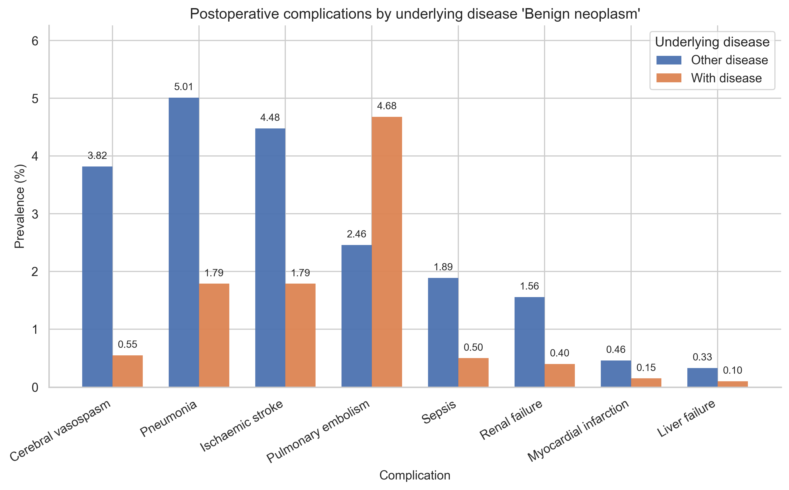


    === cerebral_aneurysm (422) ===

<div>
<style scoped>
    .dataframe tbody tr th:only-of-type {
        vertical-align: middle;
    }
&#10;    .dataframe tbody tr th {
        vertical-align: top;
    }
&#10;    .dataframe thead th {
        text-align: right;
    }
</style>

|  | complication | odds_ratio | ci | p_value | p_value_text | p_value\_\* |
|----|----|----|----|----|----|----|
| 0 | Cerebral vasospasm | 2.24 | \[1.32, 3.65\] | 0.0028 | 0.0028 | \*\* |
| 7 | Ischaemic stroke | 1.92 | \[1.19, 2.99\] | 0.0070 | 0.0070 | \*\* |
| 3 | Pneumonia | 0.48 | \[0.20, 0.97\] | 0.0424 | 0.0424 | \* |
| 5 | Renal failure | 0.20 | \[0.00, 1.17\] | 0.0855 | 0.0855 | ns |
| 2 | Myocardial infarction | 2.34 | \[0.43, 8.44\] | 0.1668 | 0.1668 | ns |
| 4 | Pulmonary embolism | 1.07 | \[0.58, 1.84\] | 0.7771 | 0.7771 | ns |
| 6 | Sepsis | 1.07 | \[0.38, 2.49\] | 0.8238 | 0.8238 | ns |
| 1 | Liver failure | 0.99 | \[0.02, 6.85\] | 1.0000 | 1.0000 | ns |

</div>

<div>
<style scoped>
    .dataframe tbody tr th:only-of-type {
        vertical-align: middle;
    }
&#10;    .dataframe tbody tr th {
        vertical-align: top;
    }
&#10;    .dataframe thead th {
        text-align: right;
    }
</style>

| cerebral_aneurysm     | Other disease | With disease |
|-----------------------|---------------|--------------|
| Ischaemic stroke      | 3.18          | 5.92         |
| Cerebral vasospasm    | 2.28          | 4.98         |
| Pneumonia             | 3.89          | 1.90         |
| Renal failure         | 1.17          | 0.24         |
| Myocardial infarction | 0.30          | 0.71         |
| Pulmonary embolism    | 3.33          | 3.55         |
| Sepsis                | 1.33          | 1.42         |
| Liver failure         | 0.24          | 0.24         |

</div>

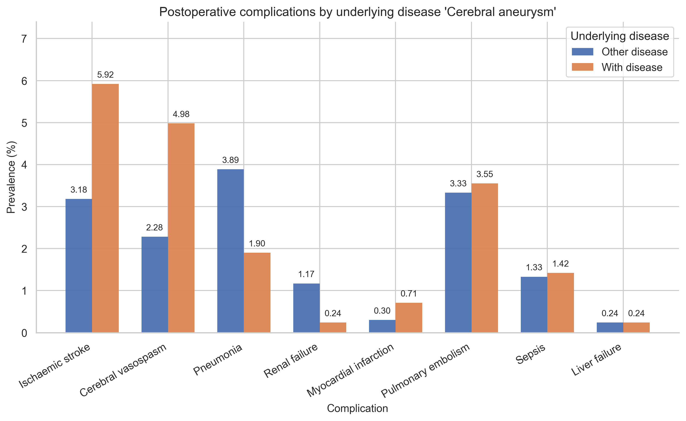


    === epilepsy (204) ===

<div>
<style scoped>
    .dataframe tbody tr th:only-of-type {
        vertical-align: middle;
    }
&#10;    .dataframe tbody tr th {
        vertical-align: top;
    }
&#10;    .dataframe thead th {
        text-align: right;
    }
</style>

|  | complication | odds_ratio | ci | p_value | p_value_text | p_value\_\* |
|----|----|----|----|----|----|----|
| 3 | Pneumonia | 0.12 | \[0.00, 0.70\] | 0.0070 | 0.0070 | \*\* |
| 0 | Cerebral vasospasm | 0.00 | \[0.00, 0.69\] | 0.0098 | 0.0098 | \*\* |
| 4 | Pulmonary embolism | 0.14 | \[0.00, 0.78\] | 0.0149 | 0.0149 | \* |
| 6 | Sepsis | 0.00 | \[0.00, 1.33\] | 0.1144 | 0.1144 | ns |
| 5 | Renal failure | 0.00 | \[0.00, 1.63\] | 0.1720 | 0.1720 | ns |
| 7 | Ischaemic stroke | 0.56 | \[0.15, 1.48\] | 0.3238 | 0.3238 | ns |
| 1 | Liver failure | 0.00 | \[0.00, 8.54\] | 1.0000 | 1.0000 | ns |
| 2 | Myocardial infarction | 0.00 | \[0.00, 5.75\] | 1.0000 | 1.0000 | ns |

</div>

<div>
<style scoped>
    .dataframe tbody tr th:only-of-type {
        vertical-align: middle;
    }
&#10;    .dataframe tbody tr th {
        vertical-align: top;
    }
&#10;    .dataframe thead th {
        text-align: right;
    }
</style>

| epilepsy              | Other disease | With disease |
|-----------------------|---------------|--------------|
| Pneumonia             | 3.86          | 0.49         |
| Pulmonary embolism    | 3.47          | 0.49         |
| Cerebral vasospasm    | 2.62          | 0.00         |
| Ischaemic stroke      | 3.47          | 1.96         |
| Sepsis                | 1.39          | 0.00         |
| Renal failure         | 1.14          | 0.00         |
| Myocardial infarction | 0.35          | 0.00         |
| Liver failure         | 0.25          | 0.00         |

</div>

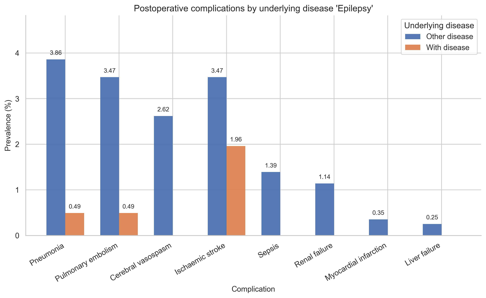


    === intracranial_hemorrhage (471) ===

<div>
<style scoped>
    .dataframe tbody tr th:only-of-type {
        vertical-align: middle;
    }
&#10;    .dataframe tbody tr th {
        vertical-align: top;
    }
&#10;    .dataframe thead th {
        text-align: right;
    }
</style>

|  | complication | odds_ratio | ci | p_value | p_value_text | p_value\_\* |
|----|----|----|----|----|----|----|
| 3 | Pneumonia | 3.17 | \[2.18, 4.55\] | 0.0000 | \<0.0001 | \*\*\*\* |
| 5 | Renal failure | 6.70 | \[3.69, 11.96\] | 0.0000 | \<0.0001 | \*\*\*\* |
| 6 | Sepsis | 3.65 | \[1.98, 6.44\] | 0.0000 | \<0.0001 | \*\*\*\* |
| 7 | Ischaemic stroke | 2.13 | \[1.37, 3.22\] | 0.0007 | 0.0007 | \*\*\* |
| 2 | Myocardial infarction | 5.32 | \[1.61, 15.78\] | 0.0033 | 0.0033 | \*\* |
| 0 | Cerebral vasospasm | 1.63 | \[0.92, 2.74\] | 0.0627 | 0.0627 | ns |
| 4 | Pulmonary embolism | 0.80 | \[0.42, 1.43\] | 0.5893 | 0.5893 | ns |
| 1 | Liver failure | 0.88 | \[0.02, 6.06\] | 1.0000 | 1.0000 | ns |

</div>

<div>
<style scoped>
    .dataframe tbody tr th:only-of-type {
        vertical-align: middle;
    }
&#10;    .dataframe tbody tr th {
        vertical-align: top;
    }
&#10;    .dataframe thead th {
        text-align: right;
    }
</style>

| intracranial_hemorrhage | Other disease | With disease |
|-------------------------|---------------|--------------|
| Pneumonia               | 3.14          | 9.34         |
| Renal failure           | 0.73          | 4.67         |
| Ischaemic stroke        | 3.10          | 6.37         |
| Sepsis                  | 1.08          | 3.82         |
| Cerebral vasospasm      | 2.37          | 3.82         |
| Myocardial infarction   | 0.24          | 1.27         |
| Pulmonary embolism      | 3.41          | 2.76         |
| Liver failure           | 0.24          | 0.21         |

</div>

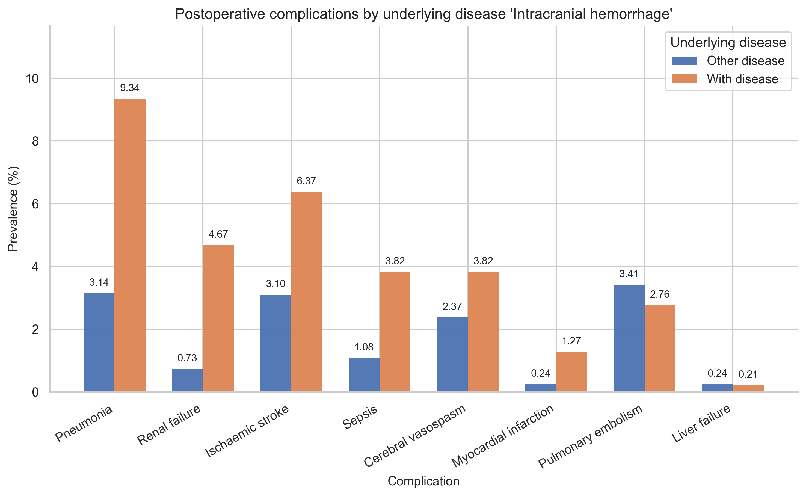


    === malignant_neoplasm (963) ===

<div>
<style scoped>
    .dataframe tbody tr th:only-of-type {
        vertical-align: middle;
    }
&#10;    .dataframe tbody tr th {
        vertical-align: top;
    }
&#10;    .dataframe thead th {
        text-align: right;
    }
</style>

|  | complication | odds_ratio | ci | p_value | p_value_text | p_value\_\* |
|----|----|----|----|----|----|----|
| 7 | Ischaemic stroke | 0.40 | \[0.22, 0.68\] | 0.0002 | 0.0002 | \*\*\* |
| 0 | Cerebral vasospasm | 0.36 | \[0.17, 0.68\] | 0.0005 | 0.0005 | \*\*\* |
| 1 | Liver failure | 0.00 | \[0.00, 1.51\] | 0.1394 | 0.1394 | ns |
| 4 | Pulmonary embolism | 0.73 | \[0.45, 1.13\] | 0.1633 | 0.1633 | ns |
| 2 | Myocardial infarction | 0.26 | \[0.01, 1.69\] | 0.2238 | 0.2238 | ns |
| 6 | Sepsis | 0.65 | \[0.28, 1.33\] | 0.2750 | 0.2750 | ns |
| 5 | Renal failure | 0.61 | \[0.23, 1.37\] | 0.3001 | 0.3001 | ns |
| 3 | Pneumonia | 1.04 | \[0.70, 1.51\] | 0.8498 | 0.8498 | ns |

</div>

<div>
<style scoped>
    .dataframe tbody tr th:only-of-type {
        vertical-align: middle;
    }
&#10;    .dataframe tbody tr th {
        vertical-align: top;
    }
&#10;    .dataframe thead th {
        text-align: right;
    }
</style>

| malignant_neoplasm    | Other disease | With disease |
|-----------------------|---------------|--------------|
| Ischaemic stroke      | 3.85          | 1.56         |
| Cerebral vasospasm    | 2.86          | 1.04         |
| Pulmonary embolism    | 3.52          | 2.60         |
| Sepsis                | 1.43          | 0.93         |
| Renal failure         | 1.18          | 0.73         |
| Liver failure         | 0.30          | 0.00         |
| Myocardial infarction | 0.39          | 0.10         |
| Pneumonia             | 3.70          | 3.84         |

</div>

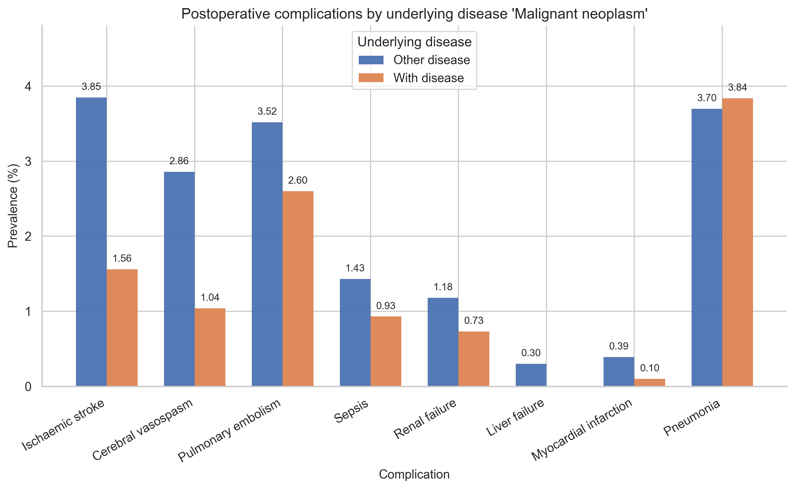


    === neoplasm (101) ===

<div>
<style scoped>
    .dataframe tbody tr th:only-of-type {
        vertical-align: middle;
    }
&#10;    .dataframe tbody tr th {
        vertical-align: top;
    }
&#10;    .dataframe thead th {
        text-align: right;
    }
</style>

|  | complication | odds_ratio | ci | p_value | p_value_text | p_value\_\* |
|----|----|----|----|----|----|----|
| 3 | Pneumonia | 1.65 | \[0.58, 3.80\] | 0.2772 | 0.2772 | ns |
| 2 | Myocardial infarction | 3.06 | \[0.07, 20.10\] | 0.2925 | 0.2925 | ns |
| 5 | Renal failure | 1.85 | \[0.22, 7.22\] | 0.3039 | 0.3039 | ns |
| 6 | Sepsis | 1.51 | \[0.18, 5.82\] | 0.3921 | 0.3921 | ns |
| 0 | Cerebral vasospasm | 1.19 | \[0.24, 3.68\] | 0.7414 | 0.7414 | ns |
| 1 | Liver failure | 0.00 | \[0.00, 17.75\] | 1.0000 | 1.0000 | ns |
| 4 | Pulmonary embolism | 0.88 | \[0.18, 2.70\] | 1.0000 | 1.0000 | ns |
| 7 | Ischaemic stroke | 0.87 | \[0.17, 2.65\] | 1.0000 | 1.0000 | ns |

</div>

<div>
<style scoped>
    .dataframe tbody tr th:only-of-type {
        vertical-align: middle;
    }
&#10;    .dataframe tbody tr th {
        vertical-align: top;
    }
&#10;    .dataframe thead th {
        text-align: right;
    }
</style>

| neoplasm              | Other disease | With disease |
|-----------------------|---------------|--------------|
| Pneumonia             | 3.68          | 5.94         |
| Renal failure         | 1.08          | 1.98         |
| Myocardial infarction | 0.33          | 0.99         |
| Sepsis                | 1.32          | 1.98         |
| Cerebral vasospasm    | 2.50          | 2.97         |
| Ischaemic stroke      | 3.42          | 2.97         |
| Pulmonary embolism    | 3.35          | 2.97         |
| Liver failure         | 0.24          | 0.00         |

</div>

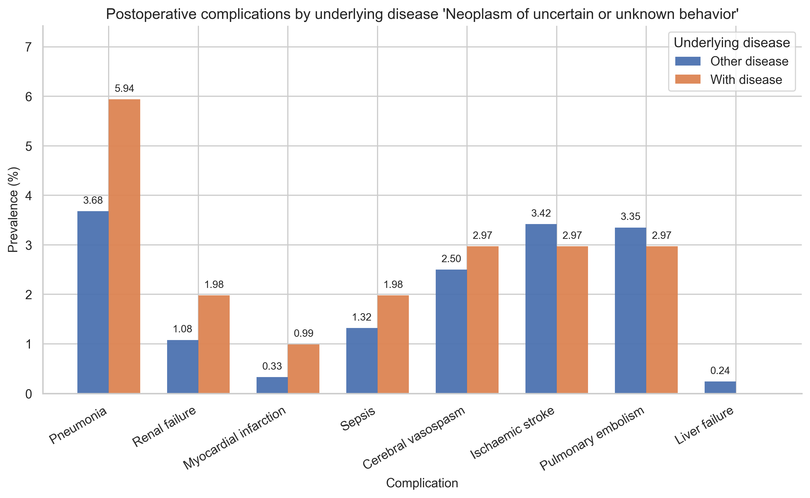


    === SAH (189) ===

<div>
<style scoped>
    .dataframe tbody tr th:only-of-type {
        vertical-align: middle;
    }
&#10;    .dataframe tbody tr th {
        vertical-align: top;
    }
&#10;    .dataframe thead th {
        text-align: right;
    }
</style>

|  | complication | odds_ratio | ci | p_value | p_value_text | p_value\_\* |
|----|----|----|----|----|----|----|
| 0 | Cerebral vasospasm | 76.00 | \[49.67, 117.52\] | 0.0000 | \<0.0001 | \*\*\*\* |
| 1 | Liver failure | 18.69 | \[4.63, 69.13\] | 0.0000 | \<0.0001 | \*\*\*\* |
| 3 | Pneumonia | 4.86 | \[3.02, 7.60\] | 0.0000 | \<0.0001 | \*\*\*\* |
| 6 | Sepsis | 8.66 | \[4.51, 15.81\] | 0.0000 | \<0.0001 | \*\*\*\* |
| 7 | Ischaemic stroke | 13.01 | \[8.75, 19.15\] | 0.0000 | \<0.0001 | \*\*\*\* |
| 5 | Renal failure | 5.20 | \[2.20, 10.96\] | 0.0002 | 0.0002 | \*\*\* |
| 4 | Pulmonary embolism | 1.84 | \[0.88, 3.46\] | 0.0620 | 0.0620 | ns |
| 2 | Myocardial infarction | 3.43 | \[0.38, 14.93\] | 0.1326 | 0.1326 | ns |

</div>

<div>
<style scoped>
    .dataframe tbody tr th:only-of-type {
        vertical-align: middle;
    }
&#10;    .dataframe tbody tr th {
        vertical-align: top;
    }
&#10;    .dataframe thead th {
        text-align: right;
    }
</style>

| SAH                   | Other disease | With disease |
|-----------------------|---------------|--------------|
| Cerebral vasospasm    | 0.95          | 42.33        |
| Ischaemic stroke      | 2.55          | 25.40        |
| Pneumonia             | 3.31          | 14.29        |
| Sepsis                | 1.06          | 8.47         |
| Renal failure         | 0.95          | 4.76         |
| Pulmonary embolism    | 3.25          | 5.82         |
| Liver failure         | 0.14          | 2.65         |
| Myocardial infarction | 0.31          | 1.06         |

</div>

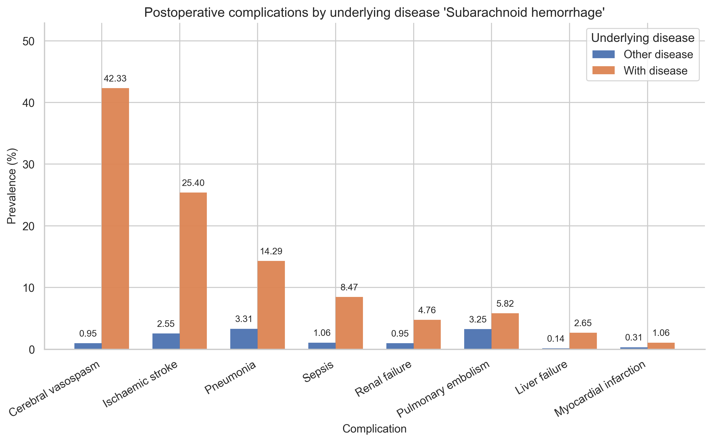


    === TBI (217) ===

<div>
<style scoped>
    .dataframe tbody tr th:only-of-type {
        vertical-align: middle;
    }
&#10;    .dataframe tbody tr th {
        vertical-align: top;
    }
&#10;    .dataframe thead th {
        text-align: right;
    }
</style>

|  | complication | odds_ratio | ci | p_value | p_value_text | p_value\_\* |
|----|----|----|----|----|----|----|
| 3 | Pneumonia | 4.32 | \[2.71, 6.69\] | 0.0000 | \<0.0001 | \*\*\*\* |
| 5 | Renal failure | 3.87 | \[1.56, 8.41\] | 0.0023 | 0.0023 | \*\* |
| 6 | Sepsis | 3.08 | \[1.25, 6.58\] | 0.0077 | 0.0077 | \*\* |
| 1 | Liver failure | 7.46 | \[1.29, 30.17\] | 0.0131 | 0.0131 | \* |
| 2 | Myocardial infarction | 2.97 | \[0.33, 12.89\] | 0.1657 | 0.1657 | ns |
| 7 | Ischaemic stroke | 1.39 | \[0.65, 2.68\] | 0.3341 | 0.3341 | ns |
| 4 | Pulmonary embolism | 0.81 | \[0.29, 1.84\] | 0.8461 | 0.8461 | ns |
| 0 | Cerebral vasospasm | 0.91 | \[0.29, 2.22\] | 1.0000 | 1.0000 | ns |

</div>

<div>
<style scoped>
    .dataframe tbody tr th:only-of-type {
        vertical-align: middle;
    }
&#10;    .dataframe tbody tr th {
        vertical-align: top;
    }
&#10;    .dataframe thead th {
        text-align: right;
    }
</style>

| TBI                   | Other disease | With disease |
|-----------------------|---------------|--------------|
| Pneumonia             | 3.31          | 12.90        |
| Renal failure         | 0.98          | 3.69         |
| Sepsis                | 1.23          | 3.69         |
| Ischaemic stroke      | 3.35          | 4.61         |
| Liver failure         | 0.19          | 1.38         |
| Pulmonary embolism    | 3.37          | 2.76         |
| Myocardial infarction | 0.31          | 0.92         |
| Cerebral vasospasm    | 2.52          | 2.30         |

</div>

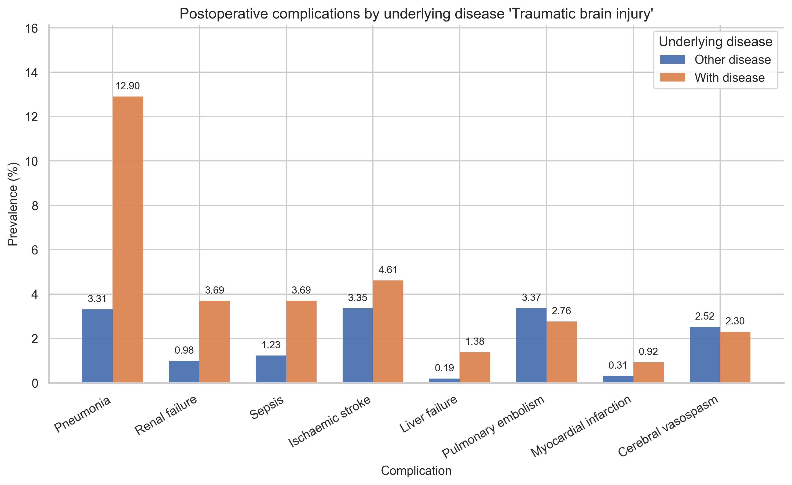


    === trigeminus (193) ===

<div>
<style scoped>
    .dataframe tbody tr th:only-of-type {
        vertical-align: middle;
    }
&#10;    .dataframe tbody tr th {
        vertical-align: top;
    }
&#10;    .dataframe thead th {
        text-align: right;
    }
</style>

|  | complication | odds_ratio | ci | p_value | p_value_text | p_value\_\* |
|----|----|----|----|----|----|----|
| 3 | Pneumonia | 0.00 | \[0.00, 0.48\] | 0.0013 | 0.0013 | \*\* |
| 4 | Pulmonary embolism | 0.00 | \[0.00, 0.54\] | 0.0031 | 0.0031 | \*\* |
| 0 | Cerebral vasospasm | 0.00 | \[0.00, 0.73\] | 0.0154 | 0.0154 | \* |
| 7 | Ischaemic stroke | 0.29 | \[0.03, 1.07\] | 0.0668 | 0.0668 | ns |
| 6 | Sepsis | 0.00 | \[0.00, 1.41\] | 0.1138 | 0.1138 | ns |
| 5 | Renal failure | 0.00 | \[0.00, 1.73\] | 0.2742 | 0.2742 | ns |
| 1 | Liver failure | 0.00 | \[0.00, 9.05\] | 1.0000 | 1.0000 | ns |
| 2 | Myocardial infarction | 0.00 | \[0.00, 6.09\] | 1.0000 | 1.0000 | ns |

</div>

<div>
<style scoped>
    .dataframe tbody tr th:only-of-type {
        vertical-align: middle;
    }
&#10;    .dataframe tbody tr th {
        vertical-align: top;
    }
&#10;    .dataframe thead th {
        text-align: right;
    }
</style>

| trigeminus            | Other disease | With disease |
|-----------------------|---------------|--------------|
| Pneumonia             | 3.87          | 0.00         |
| Pulmonary embolism    | 3.48          | 0.00         |
| Cerebral vasospasm    | 2.61          | 0.00         |
| Ischaemic stroke      | 3.50          | 1.04         |
| Sepsis                | 1.39          | 0.00         |
| Renal failure         | 1.14          | 0.00         |
| Myocardial infarction | 0.35          | 0.00         |
| Liver failure         | 0.25          | 0.00         |

</div>

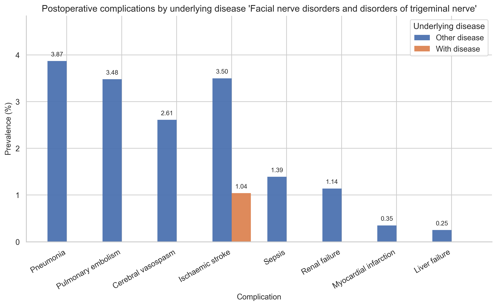


    === other_aneurysm_dissection (27) ===

<div>
<style scoped>
    .dataframe tbody tr th:only-of-type {
        vertical-align: middle;
    }
&#10;    .dataframe tbody tr th {
        vertical-align: top;
    }
&#10;    .dataframe thead th {
        text-align: right;
    }
</style>

|  | complication | odds_ratio | ci | p_value | p_value_text | p_value\_\* |
|----|----|----|----|----|----|----|
| 7 | Ischaemic stroke | 1.09 | \[0.03, 6.72\] | 0.6087 | 0.6087 | ns |
| 0 | Cerebral vasospasm | 0.00 | \[0.00, 5.73\] | 1.0000 | 1.0000 | ns |
| 1 | Liver failure | 0.00 | \[0.00, 70.19\] | 1.0000 | 1.0000 | ns |
| 2 | Myocardial infarction | 0.00 | \[0.00, 47.40\] | 1.0000 | 1.0000 | ns |
| 3 | Pneumonia | 0.99 | \[0.02, 6.12\] | 1.0000 | 1.0000 | ns |
| 4 | Pulmonary embolism | 0.00 | \[0.00, 4.25\] | 1.0000 | 1.0000 | ns |
| 5 | Renal failure | 0.00 | \[0.00, 13.56\] | 1.0000 | 1.0000 | ns |
| 6 | Sepsis | 0.00 | \[0.00, 11.04\] | 1.0000 | 1.0000 | ns |

</div>

<div>
<style scoped>
    .dataframe tbody tr th:only-of-type {
        vertical-align: middle;
    }
&#10;    .dataframe tbody tr th {
        vertical-align: top;
    }
&#10;    .dataframe thead th {
        text-align: right;
    }
</style>

| other_aneurysm_dissection | Other disease | With disease |
|---------------------------|---------------|--------------|
| Pulmonary embolism        | 3.36          | 0.0          |
| Cerebral vasospasm        | 2.52          | 0.0          |
| Sepsis                    | 1.34          | 0.0          |
| Renal failure             | 1.10          | 0.0          |
| Myocardial infarction     | 0.34          | 0.0          |
| Ischaemic stroke          | 3.40          | 3.7          |
| Liver failure             | 0.24          | 0.0          |
| Pneumonia                 | 3.73          | 3.7          |

</div>

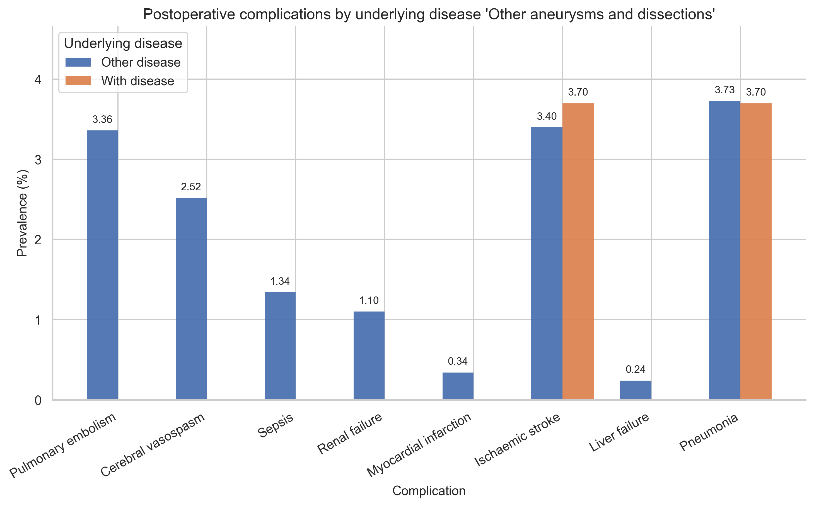


    === other (390) ===

<div>
<style scoped>
    .dataframe tbody tr th:only-of-type {
        vertical-align: middle;
    }
&#10;    .dataframe tbody tr th {
        vertical-align: top;
    }
&#10;    .dataframe thead th {
        text-align: right;
    }
</style>

|  | complication | odds_ratio | ci | p_value | p_value_text | p_value\_\* |
|----|----|----|----|----|----|----|
| 6 | Sepsis | 2.11 | \[0.95, 4.21\] | 0.0368 | 0.0368 | \* |
| 7 | Ischaemic stroke | 1.51 | \[0.87, 2.47\] | 0.1080 | 0.1080 | ns |
| 0 | Cerebral vasospasm | 0.48 | \[0.15, 1.17\] | 0.1277 | 0.1277 | ns |
| 4 | Pulmonary embolism | 0.59 | \[0.25, 1.19\] | 0.1846 | 0.1846 | ns |
| 3 | Pneumonia | 1.20 | \[0.67, 2.00\] | 0.4853 | 0.4853 | ns |
| 2 | Myocardial infarction | 0.00 | \[0.00, 2.88\] | 0.6375 | 0.6375 | ns |
| 1 | Liver failure | 1.08 | \[0.03, 7.46\] | 1.0000 | 1.0000 | ns |
| 5 | Renal failure | 0.93 | \[0.24, 2.55\] | 1.0000 | 1.0000 | ns |

</div>

<div>
<style scoped>
    .dataframe tbody tr th:only-of-type {
        vertical-align: middle;
    }
&#10;    .dataframe tbody tr th {
        vertical-align: top;
    }
&#10;    .dataframe thead th {
        text-align: right;
    }
</style>

| other                 | Other disease | With disease |
|-----------------------|---------------|--------------|
| Ischaemic stroke      | 3.28          | 4.87         |
| Pulmonary embolism    | 3.46          | 2.05         |
| Sepsis                | 1.23          | 2.56         |
| Cerebral vasospasm    | 2.61          | 1.28         |
| Pneumonia             | 3.67          | 4.36         |
| Myocardial infarction | 0.37          | 0.00         |
| Renal failure         | 1.10          | 1.03         |
| Liver failure         | 0.24          | 0.26         |

</div>

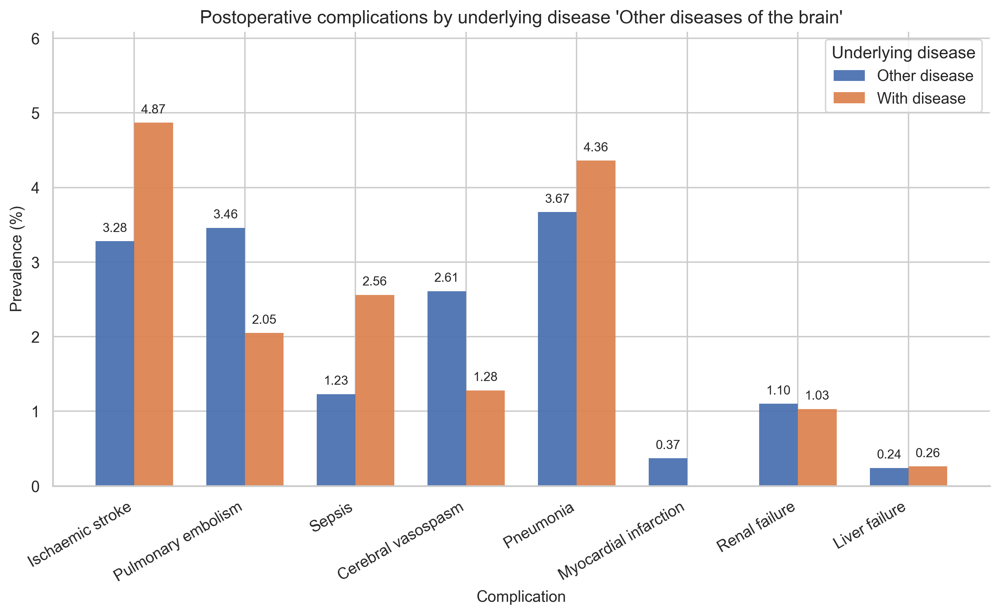

<div>
<style scoped>
    .dataframe tbody tr th:only-of-type {
        vertical-align: middle;
    }
&#10;    .dataframe tbody tr th {
        vertical-align: top;
    }
&#10;    .dataframe thead th {
        text-align: right;
    }
</style>

|  |  | With disease | Other disease | odds_ratio | ci | p_value | p_value_text |
|----|----|----|----|----|----|----|----|
| disease | complication |  |  |  |  |  |  |
| Benign neoplasm | Cerebral vasospasm | 0.55 | 3.82 | 0.14 | \[0.07, 0.26\] | 0.0 | \<0.0001 |
|  | Ischaemic stroke | 1.79 | 4.48 | 0.39 | \[0.26, 0.57\] | 0.0 | \<0.0001 |
|  | Pneumonia | 1.79 | 5.01 | 0.35 | \[0.23, 0.50\] | 0.0 | \<0.0001 |
|  | Pulmonary embolism | 4.68 | 2.46 | 1.95 | \[1.41, 2.69\] | 0.0 | \<0.0001 |
|  | Renal failure | 0.4 | 1.56 | 0.25 | \[0.10, 0.54\] | 0.0001 | \<0.0001 |
|  | Sepsis | 0.5 | 1.89 | 0.26 | \[0.12, 0.51\] | 0.0 | \<0.0001 |
| Cerebral aneurysm | Cerebral vasospasm | 4.98 | 2.28 | 2.24 | \[1.32, 3.65\] | 0.0028 | 0.0028 |
|  | Ischaemic stroke | 5.92 | 3.18 | 1.92 | \[1.19, 2.99\] | 0.007 | 0.0070 |
|  | Pneumonia | 1.9 | 3.89 | 0.48 | \[0.20, 0.97\] | 0.0424 | 0.0424 |
| Epilepsy | Cerebral vasospasm | 0.0 | 2.62 | 0.0 | \[0.00, 0.69\] | 0.0098 | 0.0098 |
|  | Pneumonia | 0.49 | 3.86 | 0.12 | \[0.00, 0.70\] | 0.007 | 0.0070 |
|  | Pulmonary embolism | 0.49 | 3.47 | 0.14 | \[0.00, 0.78\] | 0.0149 | 0.0149 |
| Facial nerve disorders and disorders of trigeminal nerve | Cerebral vasospasm | 0.0 | 2.61 | 0.0 | \[0.00, 0.73\] | 0.0154 | 0.0154 |
|  | Pneumonia | 0.0 | 3.87 | 0.0 | \[0.00, 0.48\] | 0.0013 | 0.0013 |
|  | Pulmonary embolism | 0.0 | 3.48 | 0.0 | \[0.00, 0.54\] | 0.0031 | 0.0031 |
| Intracranial hemorrhage | Ischaemic stroke | 6.37 | 3.1 | 2.13 | \[1.37, 3.22\] | 0.0007 | 0.0007 |
|  | Myocardial infarction | 1.27 | 0.24 | 5.32 | \[1.61, 15.78\] | 0.0033 | 0.0033 |
|  | Pneumonia | 9.34 | 3.14 | 3.17 | \[2.18, 4.55\] | 0.0 | \<0.0001 |
|  | Renal failure | 4.67 | 0.73 | 6.7 | \[3.69, 11.96\] | 0.0 | \<0.0001 |
|  | Sepsis | 3.82 | 1.08 | 3.65 | \[1.98, 6.44\] | 0.0 | \<0.0001 |
| Malignant neoplasm | Cerebral vasospasm | 1.04 | 2.86 | 0.36 | \[0.17, 0.68\] | 0.0005 | 0.0005 |
|  | Ischaemic stroke | 1.56 | 3.85 | 0.4 | \[0.22, 0.68\] | 0.0002 | 0.0002 |
| Other diseases of the brain | Sepsis | 2.56 | 1.23 | 2.11 | \[0.95, 4.21\] | 0.0368 | 0.0368 |
| Subarachnoid hemorrhage | Cerebral vasospasm | 42.33 | 0.95 | 76.0 | \[49.67, 117.52\] | 0.0 | \<0.0001 |
|  | Ischaemic stroke | 25.4 | 2.55 | 13.01 | \[8.75, 19.15\] | 0.0 | \<0.0001 |
|  | Liver failure | 2.65 | 0.14 | 18.69 | \[4.63, 69.13\] | 0.0 | \<0.0001 |
|  | Pneumonia | 14.29 | 3.31 | 4.86 | \[3.02, 7.60\] | 0.0 | \<0.0001 |
|  | Renal failure | 4.76 | 0.95 | 5.2 | \[2.20, 10.96\] | 0.0002 | 0.0002 |
|  | Sepsis | 8.47 | 1.06 | 8.66 | \[4.51, 15.81\] | 0.0 | \<0.0001 |
| Traumatic brain injury | Liver failure | 1.38 | 0.19 | 7.46 | \[1.29, 30.17\] | 0.0131 | 0.0131 |
|  | Pneumonia | 12.9 | 3.31 | 4.32 | \[2.71, 6.69\] | 0.0 | \<0.0001 |
|  | Renal failure | 3.69 | 0.98 | 3.87 | \[1.56, 8.41\] | 0.0023 | 0.0023 |
|  | Sepsis | 3.69 | 1.23 | 3.08 | \[1.25, 6.58\] | 0.0077 | 0.0077 |

</div>
