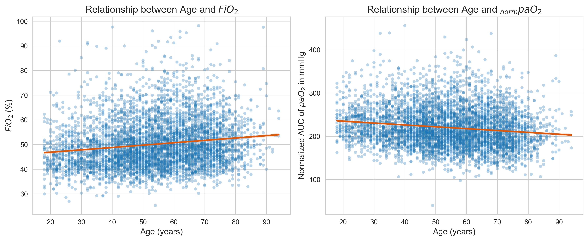

# Continuous $paO_2$ Prediction and Postoperative Complications in
Neurosurgical Patients
Andrea S. Gutmann
2026-01-27

# Preprocessing

``` python
# ======================
# Standard library
# ======================
import pickle
import pprint
from collections import Counter
from pathlib import Path

# ======================
# Third-party libraries
# ======================
import matplotlib
import matplotlib.pyplot as plt
import numpy as np
import pandas as pd
import seaborn as sns
import yaml
from scipy import stats
from statsmodels.discrete.discrete_model import Logit

# ======================
# Local / application
# ======================
from statistical_functions import *

pp = pprint.PrettyPrinter(indent=4)
np.random.seed(42)

matplotlib.rcParams["figure.dpi"] = 300

sns.set_style('whitegrid')

with open("config.yaml", "r") as file:
    config = yaml.safe_load(file)

with open(Path(config.get('pickle').get('analysis')), 'rb') as f:
    analysis_df = pickle.load(f)

with open(Path(config.get('pickle').get('data_for_analysis')), 'rb') as f:
    data = pickle.load(f)

data = data.astype({'max_paO2': float, 'norm_auc_paO2': float, 'norm_auc_pf': float, 'norm_auc_fiO2': float, 'auc_fiO2': float})

complications = config.get("complications_dict").keys()
diagnoses = config.get("diagnoses") + ["other"]
```

# Bias and confounding assessment

<!--
#### Delirium
&#10;
&#10;-->

Spearman correlation of age to normpaO2, mean FiO2, normFiO2, normOMV

``` python
rho, pvalue = stats.spearmanr(analysis_df['norm_auc_paO2'], analysis_df['age'])
print(f"Correlation of normpaO2 and age: Spearman's rho: {rho:.4f} (p-value: {pvalue:.4f})")

rho, pvalue = stats.spearmanr(data.groupby('identifier')["fio2"].mean(), data.groupby('identifier')["age"].mean())
print(f"Correlation of mean FiO2 and age: Spearman's rho: {rho:.4f} (p-value: {pvalue:.4f})")

rho, pvalue = stats.spearmanr(analysis_df['norm_auc_fiO2'], analysis_df['age'])
print(f"Correlation of normFiO2 and age: Spearman's rho: {rho:.4f} (p-value: {pvalue:.4f})")

rho, pvalue = stats.spearmanr(analysis_df['norm_auc_omv'], analysis_df['age'])
print(f"Correlation of normOMV and age: Spearman's rho: {rho:.4f} (p-value: {pvalue:.4f})")
```

    Correlation of normpaO2 and age: Spearman's rho: -0.1596 (p-value: 0.0000)
    Correlation of mean FiO2 and age: Spearman's rho: 0.1713 (p-value: 0.0000)
    Correlation of normFiO2 and age: Spearman's rho: 0.1702 (p-value: 0.0000)
    Correlation of normOMV and age: Spearman's rho: 0.0120 (p-value: 0.3965)

Figure SDC3

``` python
fig, axes = plt.subplots(1, 2, figsize=(12, 5))

# --- Plot 1: Age vs FiO2 ---
sns.regplot(
    x=data.groupby('identifier')["age"].mean(),
    y=data.groupby('identifier')["fio2"].mean()*100,
    ax=axes[0],
    scatter_kws={'alpha': 0.3, 'edgecolor': 'none', 's': 20},
    line_kws={'color': '#e0580aff'}
)
axes[0].set_xlabel("Age (years)", fontsize=12)
axes[0].set_ylabel("$FiO_2$ (%)", fontsize=12)

# --- Plot 2: Age vs norm_auc_paO2 ---
sns.regplot(
    x="age",
    y="norm_auc_paO2",
    data=analysis_df,
    ax=axes[1],
    scatter_kws={'alpha': 0.3, 'edgecolor': 'none', 's': 20},
    line_kws={'color': '#e0580aff'}
)
axes[1].set_xlabel("Age (years)", fontsize=12)
axes[1].set_ylabel("Normalized AUC of $paO_2$ in mmHg", fontsize=12)

axes[0].set_title("Relationship between Age and $FiO_2$", fontsize=14)
axes[1].set_title("Relationship between Age and $_{norm}paO_2$", fontsize=14)

plt.tight_layout()
plt.savefig('plots/age_fio2_pao2.png', dpi=300, bbox_inches="tight")

plt.show()
```



## Pulmonary embolism

LOS

``` python
# los
cont_table = pd.crosstab(
    analysis_df["pulmonary_embolism"], analysis_df["los_prolonged"]
)
print(cont_table)
oddsratio, pvalue = stats.fisher_exact(cont_table)

print(f"Patients with a pulmonary embolism have about {oddsratio:.2f} times the odds (p-value = {pvalue:.4f}) of having a prolonged hospital length of stay compared with patients without a pulmonary embolism.")

# Pulmonary embolism was strongly associated with prolonged length of stay, with patients experiencing PE having 6.5-fold higher odds of prolonged hospitalization compared with those without PE
```

    los_prolonged       False  True 
    pulmonary_embolism              
    False                3535   1317
    True                   49    119
    Patients with a pulmonary embolism have about 6.52 times the odds (p-value = 0.0000) of having a prolonged hospital length of stay compared with patients without a pulmonary embolism.

bmi, age, fio2, omv

``` python
# bmi, age, fio2, omv
p, ph_dunn, effect_sizes = compare_median("bmi", analysis_df, "pulmonary_embolism", True)
p, ph_dunn, effect_sizes = compare_median("age", analysis_df, "pulmonary_embolism", True)
p, ph_dunn, effect_sizes = compare_median("norm_auc_omv", analysis_df, "pulmonary_embolism", True)
# compare_median("auc_omv", analysis_df, "pulmonary_embolism", True)

# map
mean_map_df = pd.DataFrame(
    {
        "mean_map": list(
            data[data["pulmonary_embolism"] == True]
            .groupby("identifier")["mean_art_press"]
            .mean()
            .values
        )
        + list(
            data[data["pulmonary_embolism"] == False]
            .groupby("identifier")["mean_art_press"]
            .mean()
            .values
        ),
        "pulmonary_embolism": sum(analysis_df["pulmonary_embolism"] == True) * [True]
        + sum(analysis_df["pulmonary_embolism"] == False) * [False],
    }
)
p, ph_dunn, effect_sizes = compare_median("mean_map", mean_map_df, "pulmonary_embolism")
```

                           bmi                 
                        median       mean count
    pulmonary_embolism                         
    False               24.575  25.112828  4852
    True                25.830  26.771726   168
    p-value: 0.0

    ... Post hoc test...
         1    2
    1    -  ***
    2  ***    -
           1      2
    1 1.0000 0.0000
    2 0.0000 1.0000

    1, 2: Effect size: Hedges' g: 0.38 (small)
    [(np.int64(0), np.int64(1), np.float64(0.37902422094400434))]

    1, 2: Effect size: Hedges' g: 0.38 (small)
                           age              
                        median    mean count
    pulmonary_embolism                      
    False              54.0000 53.7053  4852
    True               60.5000 59.5000   168
    p-value: 0.0

    ... Post hoc test...
         1    2
    1    -  ***
    2  ***    -
           1      2
    1 1.0000 0.0000
    2 0.0000 1.0000

    1, 2: Effect size: Hedges' g: 0.36 (small)
    [(np.int64(0), np.int64(1), np.float64(0.3644140996826994))]

    1, 2: Effect size: Hedges' g: 0.36 (small)
                       norm_auc_omv             
                             median   mean count
    pulmonary_embolism                          
    False                    2.5984 2.7375  4852
    True                     2.5627 2.8223   168
    p-value: 0.841
    No significance found.

    1, 2: Effect size: Hedges' g: 0.11 (very small)
    [(0, 1, np.float64(0.10809037285689453))]

    1, 2: Effect size: Hedges' g: 0.11 (very small)
                       mean_map              
                         median    mean count
    pulmonary_embolism                       
    False               79.3202 79.6135  4852
    True                79.1546 79.7587   168
    p-value: 0.8233
    No significance found.

    1, 2: Effect size: Hedges' g: 0.02 (very small)
    [(0, 1, np.float64(0.023653035876944083))]

    1, 2: Effect size: Hedges' g: 0.02 (very small)

LogReg PE~normOMV

``` python
pvalue, odds_ratio = logistic_regression(
    analysis_df.loc[:, 'pulmonary_embolism'],
    analysis_df.loc[:, 'norm_auc_omv'],
    odds_ratio=True,
)
if pvalue < 0.05:
    if odds_ratio < 1: # decreased odds
        print(f"Each 10% increase of normOMV decreased the chances of postop {config.get('long_names').get('pulmonary_embolism')} by {(1-odds_ratio)*100:.2f} %.")
    else: # increased odds
        print(f"Each 10% increase of normOMV increased the chances of postop {config.get('long_names').get('pulmonary_embolism')} by {(odds_ratio-1)*100:.2f} %.")
else:
    print(f"No significant influence of normOMV on the chances of postop {config.get('long_names').get('pulmonary_embolism')}.")
```

    WARNING: PSEUDO R-SQUARED IS NEGATIVE, INDICATING A POOR MODEL FIT.
    WARNING: LOG-LIKELIHOOD OF THE NULL MODEL IS NEGATIVE, INDICATING A POOR MODEL FIT.
                               Logit Regression Results                           
    ==============================================================================
    Dep. Variable:     pulmonary_embolism   No. Observations:                 5020
    Model:                          Logit   Df Residuals:                     5019
    Method:                           MLE   Df Model:                            0
    Date:                Tue, 27 Jan 2026   Pseudo R-squ.:                 -0.1042
    Time:                        13:51:33   Log-Likelihood:                -812.59
    converged:                       True   LL-Null:                       -735.89
    Covariance Type:            nonrobust   LLR p-value:                       nan
    ================================================================================
                       coef    std err          z      P>|z|      [0.025      0.975]
    --------------------------------------------------------------------------------
    norm_auc_omv    -3.5686      0.087    -40.979      0.000      -3.739      -3.398
    ================================================================================
    The estimated OR change by 0.7117 [0.7002, 0.7234] for each 10% increase of the independent variable (p-value: 0.0000)
    Each 10% increase of normOMV decreased the chances of postop Pulmonary embolism by 28.83 %.

LogReg PE~Age

``` python
pvalue, odds_ratio = logistic_regression(
    analysis_df.loc[:, 'pulmonary_embolism'],
    analysis_df.loc[:, 'age'],
    log=False,
    odds_ratio=True,
)
if pvalue < 0.05:
    if odds_ratio < 1: # decreased odds
        print(f"Each 10% increase of age decreased the chances of postop {config.get('long_names').get('pulmonary_embolism')} by {(1-odds_ratio)*100:.2f} %.")
    else: # increased odds
        print(f"Each 10% increase of age increased the chances of postop {config.get('long_names').get('pulmonary_embolism')} by {(odds_ratio-1)*100:.2f} %.")
else:
    print(f"No significant influence of age on the chances of postop {config.get('long_names').get('pulmonary_embolism')}.")
```

    WARNING: PSEUDO R-SQUARED IS NEGATIVE, INDICATING A POOR MODEL FIT.
    WARNING: LOG-LIKELIHOOD OF THE NULL MODEL IS NEGATIVE, INDICATING A POOR MODEL FIT.
                               Logit Regression Results                           
    ==============================================================================
    Dep. Variable:     pulmonary_embolism   No. Observations:                 5020
    Model:                          Logit   Df Residuals:                     5019
    Method:                           MLE   Df Model:                            0
    Date:                Tue, 27 Jan 2026   Pseudo R-squ.:                 -0.2126
    Time:                        13:51:33   Log-Likelihood:                -892.31
    converged:                       True   LL-Null:                       -735.89
    Covariance Type:            nonrobust   LLR p-value:                       nan
    ==============================================================================
                     coef    std err          z      P>|z|      [0.025      0.975]
    ------------------------------------------------------------------------------
    age           -0.0626      0.002    -40.681      0.000      -0.066      -0.060
    ==============================================================================
    The estimated OR change by 0.9941 [0.9938, 0.9943] for each 10% increase of the independent variable (p-value: 0.0000)
    Each 10% increase of age decreased the chances of postop Pulmonary embolism by 0.59 %.

LogReg PE~BMI

``` python
pvalue, odds_ratio = logistic_regression(
    analysis_df.loc[:, 'pulmonary_embolism'],
    analysis_df.loc[:, 'bmi'],
    log=False,
    odds_ratio=True,
)
if pvalue < 0.05:
    if odds_ratio < 1: # decreased odds
        print(f"Each 10% increase of BMI decreased the chances of postop {config.get('long_names').get('pulmonary_embolism')} by {(1-odds_ratio)*100:.2f} %.")
    else: # increased odds
        print(f"Each 10% increase of BMI increased the chances of postop {config.get('long_names').get('pulmonary_embolism')} by {(odds_ratio-1)*100:.2f} %.")
else:
    print(f"No significant influence of BMI on the chances of postop {config.get('long_names').get('pulmonary_embolism')}.")
```

    WARNING: PSEUDO R-SQUARED IS NEGATIVE, INDICATING A POOR MODEL FIT.
    WARNING: LOG-LIKELIHOOD OF THE NULL MODEL IS NEGATIVE, INDICATING A POOR MODEL FIT.
                               Logit Regression Results                           
    ==============================================================================
    Dep. Variable:     pulmonary_embolism   No. Observations:                 5020
    Model:                          Logit   Df Residuals:                     5019
    Method:                           MLE   Df Model:                            0
    Date:                Tue, 27 Jan 2026   Pseudo R-squ.:                -0.08250
    Time:                        13:51:33   Log-Likelihood:                -796.60
    converged:                       True   LL-Null:                       -735.89
    Covariance Type:            nonrobust   LLR p-value:                       nan
    ==============================================================================
                     coef    std err          z      P>|z|      [0.025      0.975]
    ------------------------------------------------------------------------------
    bmi           -0.1331      0.003    -42.608      0.000      -0.139      -0.127
    ==============================================================================
    The estimated OR change by 0.9874 [0.9868, 0.9880] for each 10% increase of the independent variable (p-value: 0.0000)
    Each 10% increase of BMI decreased the chances of postop Pulmonary embolism by 1.26 %.

<!-- 
LogReg PE~log((norm)OMV)+log(age)+log(bmi)
&#10;
&#10;-->

## Cerebral Vasospasm

``` python
cont_table = pd.crosstab(analysis_df["los_prolonged"], analysis_df["cerebral_vasospasm"])
print(cont_table)
oddsratio, pvalue = stats.fisher_exact(cont_table)

print(f"Odds ratio: {round(oddsratio,2)}, p-value: {round(pvalue,4)} (Fisher's Exact Test)")

compare_median("bmi", analysis_df, "cerebral_vasospasm", True)
compare_median("age", analysis_df, "cerebral_vasospasm", True)
compare_median("mv_time", analysis_df, "cerebral_vasospasm", True)
compare_median("norm_auc_omv", analysis_df, "cerebral_vasospasm", True)

mean_map_df = pd.DataFrame(
    {
        "mean_map": list(
            data[data["cerebral_vasospasm"] == True]
            .groupby("identifier")["mean_art_press"]
            .mean()
            .values
        )
        + list(
            data[data["cerebral_vasospasm"] == False]
            .groupby("identifier")["mean_art_press"]
            .mean()
            .values
        ),
        "cerebral_vasospasm": sum(analysis_df["cerebral_vasospasm"] == True) * [True]
        + sum(analysis_df["cerebral_vasospasm"] == False) * [False],
    }
)
compare_median("mean_map", mean_map_df, "cerebral_vasospasm")


median_map_df = pd.DataFrame(
    {
        "median_map": list(
            data[data["cerebral_vasospasm"] == True]
            .groupby("identifier")["mean_art_press"]
            .median()
            .values
        )
        + list(
            data[data["cerebral_vasospasm"] == False]
            .groupby("identifier")["mean_art_press"]
            .median()
            .values
        ),
        "cerebral_vasospasm": sum(analysis_df["cerebral_vasospasm"] == True) * [True]
        + sum(analysis_df["cerebral_vasospasm"] == False) * [False],
    }
)
compare_median("median_map", median_map_df, "cerebral_vasospasm")


min_map_df = pd.DataFrame(
    {
        "min_map": list(
            data[data["cerebral_vasospasm"] == True]
            .groupby("identifier")["mean_art_press"]
            .min()
            .values
        )
        + list(
            data[data["cerebral_vasospasm"] == False]
            .groupby("identifier")["mean_art_press"]
            .min()
            .values
        ),
        "cerebral_vasospasm": sum(analysis_df["cerebral_vasospasm"] == True) * [True]
        + sum(analysis_df["cerebral_vasospasm"] == False) * [False],
    }
)
compare_median("min_map", min_map_df, "cerebral_vasospasm")
```

    cerebral_vasospasm  False  True 
    los_prolonged                   
    False                3553     31
    True                 1341     95
    Odds ratio: 8.12, p-value: 0.0 (Fisher's Exact Test)
                           bmi              
                        median    mean count
    cerebral_vasospasm                      
    False              24.6200 25.1824  4894
    True               24.4900 24.6231   126
    p-value: 0.2017
    No significance found.

    1, 2: Effect size: Hedges' g: 0.13 (very small)
    [(0, 1, np.float64(0.12751020283068523))]

    1, 2: Effect size: Hedges' g: 0.13 (very small)
                           age              
                        median    mean count
    cerebral_vasospasm                      
    False              55.0000 53.9420  4894
    True               52.0000 52.2381   126
    p-value: 0.1609
    No significance found.

    1, 2: Effect size: Hedges' g: 0.11 (very small)
    [(0, 1, np.float64(0.10693883637611136))]

    1, 2: Effect size: Hedges' g: 0.11 (very small)
                        mv_time               
                         median     mean count
    cerebral_vasospasm                        
    False              343.1250 350.1202  4894
    True               295.1250 294.7493   126
    p-value: 0.0

    ... Post hoc test...
         1    2
    1    -  ***
    2  ***    -
           1      2
    1 1.0000 0.0000
    2 0.0000 1.0000

    1, 2: Effect size: Hedges' g: 0.46 (small)
    [(np.int64(0), np.int64(1), np.float64(0.4632152038149522))]

    1, 2: Effect size: Hedges' g: 0.46 (small)
                       norm_auc_omv             
                             median   mean count
    cerebral_vasospasm                          
    False                    2.5868 2.7204  4894
    True                     3.2840 3.5145   126
    p-value: 0.0

    ... Post hoc test...
         1    2
    1    -  ***
    2  ***    -
           1      2
    1 1.0000 0.0000
    2 0.0000 1.0000

    1, 2: Effect size: Hedges' g: 1.02 (large)
    [(np.int64(0), np.int64(1), np.float64(1.024421536653052))]

    1, 2: Effect size: Hedges' g: 1.02 (large)
                       mean_map              
                         median    mean count
    cerebral_vasospasm                       
    False               79.2497 79.5655  4894
    True                81.9782 81.6732   126
    p-value: 0.0

    ... Post hoc test...
         1    2
    1    -  ***
    2  ***    -
           1      2
    1 1.0000 0.0000
    2 0.0000 1.0000

    1, 2: Effect size: Hedges' g: 0.34 (small)
    [(np.int64(0), np.int64(1), np.float64(0.3439246660936627))]

    1, 2: Effect size: Hedges' g: 0.34 (small)
                       median_map              
                           median    mean count
    cerebral_vasospasm                         
    False                 78.6997 79.0257  4894
    True                  81.7196 81.2240   126
    p-value: 0.0001

    ... Post hoc test...
         1    2
    1    -  ***
    2  ***    -
           1      2
    1 1.0000 0.0001
    2 0.0001 1.0000

    1, 2: Effect size: Hedges' g: 0.35 (small)
    [(np.int64(0), np.int64(1), np.float64(0.3482182483397299))]

    1, 2: Effect size: Hedges' g: 0.35 (small)
                       min_map              
                        median    mean count
    cerebral_vasospasm                      
    False              62.5286 62.0798  4894
    True               66.0611 65.7599   126
    p-value: 0.0

    ... Post hoc test...
         1    2
    1    -  ***
    2  ***    -
           1      2
    1 1.0000 0.0000
    2 0.0000 1.0000

    1, 2: Effect size: Hedges' g: 0.46 (small)
    [(np.int64(0), np.int64(1), np.float64(0.46100292658053454))]

    1, 2: Effect size: Hedges' g: 0.46 (small)

    (np.float64(6.01740515268331e-07),
            1      2
     1 1.0000 0.0000
     2 0.0000 1.0000,
     [(np.int64(0), np.int64(1), np.float64(0.46100292658053454))])

## Hypoxia ssessment

``` python
grouped = (
    data.groupby("identifier")
    .agg(
        mean_fio2=("fio2", "mean"),
        mean_horowitz=("horowitz", "mean"),
        # mean_paO2=('paO2_combined', 'mean'),
        n_observations=("idx", "count"),
        n_hypoxic_obs=("paO2_combined", lambda s: (s < 120).sum()),
        n_low_pf_obs=("horowitz", lambda s: (s < 300).sum()),
    )
    .reset_index()
)
grouped["perc_hypoxic"] = grouped.apply(
    lambda x: round(100 / x["n_observations"] * x["n_hypoxic_obs"]), axis=1
)
grouped["perc_low_pf"] = grouped.apply(
    lambda x: round(100 / x["n_observations"] * x["n_low_pf_obs"]), axis=1
)


result_df = grouped.merge(
    analysis_df[["identifier", "norm_auc_paO2"] + list(complications) + diagnoses],
    on="identifier",
    how="left",
)
display(result_df.sort_values("n_hypoxic_obs", ascending=False))


print(
    f"Number of patients with normpaO2 < 120 mmHg: {result_df.loc[result_df.norm_auc_paO2 < 120].shape[0]} ({min(result_df.loc[result_df.norm_auc_paO2 < 120].perc_hypoxic.values)} - {max(result_df.loc[result_df.norm_auc_paO2 < 120].perc_hypoxic.values)} % of their total observations)."
)

print(
    f"\tMean FiO2: {round(result_df.loc[result_df.norm_auc_paO2 < 120].mean().mean_fio2,3)} and mean p/F ratio: {round(result_df.loc[result_df.norm_auc_paO2 < 120].mean().mean_horowitz,2)}."
)


print(
    f"Number of patients with mean p/F ratio < 300: {result_df.loc[result_df.mean_horowitz < 300].shape[0]} ({min(result_df.loc[result_df.mean_horowitz < 300].perc_low_pf.values)} - {max(result_df.loc[result_df.mean_horowitz < 300].perc_low_pf.values)} % of their total observations)."
)
print(
    f"\tMean FiO2: {round(result_df.loc[result_df.mean_horowitz < 300].mean().mean_fio2,3)} and mean normpaO2: {round(result_df.loc[result_df.mean_horowitz < 300].mean().norm_auc_paO2,2)}."
)
print(
    f"Number of patients with normpaO2 < 120 and mean p/F ratio < 300: {result_df.loc[(result_df.norm_auc_paO2 < 120) & (result_df.mean_horowitz < 300)].shape[0]}."
)


for c in complications:
    print(f"{c}: {int(result_df.loc[result_df.norm_auc_paO2 < 120].sum()[c])}")

for d in diagnoses:
    print(f"{d}: {int(result_df.loc[result_df.norm_auc_paO2 < 120].sum()[d])}")
```

<div>
<style scoped>
    .dataframe tbody tr th:only-of-type {
        vertical-align: middle;
    }
&#10;    .dataframe tbody tr th {
        vertical-align: top;
    }
&#10;    .dataframe thead th {
        text-align: right;
    }
</style>

|  | identifier | mean_fio2 | mean_horowitz | n_observations | n_hypoxic_obs | n_low_pf_obs | perc_hypoxic | perc_low_pf | norm_auc_paO2 | cerebral_vasospasm | ... | cerebral_aneurysm | epilepsy | intracranial_hemorrhage | malignant_neoplasm | neoplasm | SAH | TBI | trigeminus | other_aneurysm_dissection | other |
|----|----|----|----|----|----|----|----|----|----|----|----|----|----|----|----|----|----|----|----|----|----|
| 1592 | 925430 | 0.3788 | 392.2132 | 123 | 96 | 0 | 78 | 0 | 122.2239 | False | ... | False | False | False | False | False | False | False | False | False | False |
| 3916 | 1627107 | 0.3055 | 341.6246 | 98 | 90 | 11 | 92 | 11 | 106.0663 | False | ... | False | False | False | True | False | False | False | False | False | False |
| 1936 | 1035390 | 0.3749 | 342.6530 | 109 | 89 | 0 | 82 | 0 | 116.8306 | False | ... | False | False | False | True | False | False | False | False | False | False |
| 2890 | 1201291 | 0.3363 | 345.4571 | 127 | 85 | 33 | 67 | 26 | 125.1078 | False | ... | False | False | False | False | False | False | False | False | False | False |
| 4582 | 1942409 | 0.4141 | 369.5566 | 121 | 85 | 15 | 70 | 12 | 138.1427 | False | ... | False | False | False | False | False | False | False | False | False | False |
| ... | ... | ... | ... | ... | ... | ... | ... | ... | ... | ... | ... | ... | ... | ... | ... | ... | ... | ... | ... | ... | ... |
| 1785 | 1022137 | 0.5370 | 533.7998 | 76 | 0 | 0 | 0 | 0 | 250.7713 | False | ... | False | False | True | True | False | False | False | False | False | False |
| 1786 | 1022145 | 0.5814 | 456.9001 | 30 | 0 | 0 | 0 | 0 | 235.2497 | False | ... | False | False | True | False | False | False | False | False | False | False |
| 1787 | 1022294 | 0.5523 | 453.7166 | 45 | 0 | 0 | 0 | 0 | 241.2857 | False | ... | False | False | False | True | False | False | False | False | False | False |
| 1789 | 1022443 | 0.5423 | 503.9203 | 55 | 0 | 10 | 0 | 18 | 280.8618 | False | ... | False | False | False | False | False | False | False | False | False | False |
| 5019 | 7002990 | 0.3663 | 435.1826 | 51 | 0 | 0 | 0 | 0 | 162.7457 | False | ... | False | False | False | False | False | False | False | False | False | False |

<p>5020 rows × 28 columns</p>
</div>

    Number of patients with normpaO2 < 120 mmHg: 18 (57 - 94 % of their total observations).
        Mean FiO2: 0.363 and mean p/F ratio: 355.94.
    Number of patients with mean p/F ratio < 300: 108 (19 - 97 % of their total observations).
        Mean FiO2: 0.543 and mean normpaO2: 196.78.
    Number of patients with normpaO2 < 120 and mean p/F ratio < 300: 2.
    cerebral_vasospasm: 2
    liver_failure: 0
    myocardial_infarction: 1
    pneumonia: 1
    pulmonary_embolism: 1
    renal_failure: 0
    sepsis: 1
    stroke: 1
    benign_neoplasm: 9
    cerebral_aneurysm: 0
    epilepsy: 0
    intracranial_hemorrhage: 2
    malignant_neoplasm: 3
    neoplasm: 0
    SAH: 1
    TBI: 1
    trigeminus: 0
    other_aneurysm_dissection: 0
    other: 3
